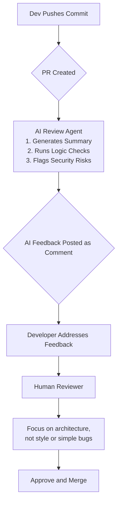

# AI for Developer Experience: Boosting Productivity Beyond Code Generation

The conversation around AI in software development has been dominated by code generation. While tools like GitHub Copilot have fundamentally changed how we write code, this is merely the opening act. By 2026, the real revolution in AI is its deep integration into the *entire* developer experience (DX), aimed at reducing cognitive load, eliminating friction, and making development more creative and joyful.

This isn't about replacing developers; it's about augmenting them. AI is evolving from a pair programmer into a full-fledged team member—one that handles the tedious, repetitive, and distracting tasks that bog down the creative process. It's time to look beyond the `// write me a function that...` prompt and explore the true scope of AI's impact on our daily workflows.

### What You'll Get

*   **Beyond Code:** An exploration of AI's role in documentation, debugging, and code reviews.
*   **Workflow Automation:** How AI is streamlining environment setup and developer onboarding.
*   **Practical Examples:** Concrete examples and diagrams illustrating AI agents in the SDLC.
*   **Future Outlook:** A glimpse into how these tools are creating a more productive and satisfying developer career.

---

## The New Frontier: From Code Generation to Workflow Intelligence

The first wave of AI developer tools focused on the "inner loop"—the write, compile, test cycle. The next wave, which we are now entering, addresses the "outer loop": the ecosystem of tasks surrounding the code itself. This includes understanding legacy systems, collaborating with teammates, and navigating complex deployment pipelines.

> The ultimate goal of AI in DX is to minimize context switching and maximize a developer's time in a state of "flow." By automating the surrounding chores, AI allows us to focus purely on complex problem-solving and architectural design.

## AI-Powered Documentation: From Chore to Superpower

Technical documentation is critical for maintainability and collaboration, yet it's often neglected because it's time-consuming to create and even harder to keep updated. AI is transforming this process from a manual chore into an automated, intelligent workflow.

AI agents can now scan entire codebases, understand the purpose of functions, classes, and API endpoints, and generate high-quality, context-aware documentation.

### Key Capabilities

*   **Automated Docstrings:** Generating detailed comments and docstrings for functions, including parameters, return values, and exceptions.
*   **README Generation:** Creating comprehensive `README.md` files that include setup instructions, API usage, and contribution guidelines based on the project's structure.
*   **API Specification:** Automatically generating or updating OpenAPI (Swagger) specifications by analyzing API route handlers and data models.

Imagine an AI that watches for new, undocumented functions in your commits and automatically generates the necessary documentation within the pull request.

```python
# A developer commits this function with no comments
def calculate_risk_score(user_profile, transaction_history, a_score_factor=0.5):
    if not user_profile or not transaction_history:
        return 0
    
    profile_weight = len(user_profile.get("flags", [])) * 1.5
    history_weight = sum(t["amount"] for t in transaction_history if t["is_suspicious"])
    
    return (profile_weight + history_weight) * a_score_factor

# The AI Documentation Agent adds this docstring in the PR:
"""
Calculates a risk score for a user based on their profile and transaction history.

Args:
    user_profile (dict): The user's profile data, expecting a 'flags' key.
    transaction_history (list): A list of transaction dictionaries.
    a_score_factor (float, optional): A factor to adjust the final score. 
                                      Defaults to 0.5.

Returns:
    float: The calculated risk score. Returns 0 if profile or history is empty.
"""
```

This simple intervention saves time, enforces standards, and ensures the codebase remains accessible and maintainable. As noted by experts at [InfoQ](https://www.infoq.com/articles/ai-developer-experience/), "AI can turn documentation from an afterthought into a real-time, integrated part of development."

| Task | Manual Effort | AI-Assisted Effort |
| :--- | :--- | :--- |
| **Write Function Docstrings** | 5-10 min per function | ~10 sec (review & commit) |
| **Update API Spec** | 30-60 min per endpoint change | Automatic, near-instant |
| **Create Project README** | 1-3 hours | 5-15 min (prompt & refine) |

## The Rise of Intelligent Debugging Assistants

Debugging is often more art than science, requiring deep context and intuition. AI debugging assistants are evolving from simple error lookups to sophisticated diagnostic partners that understand the *context* of your application.

Instead of just parsing a stack trace, these AI assistants can:

*   **Analyze Runtime Context:** Correlate an error with recent code changes, deployment events, and real-time application logs.
*   **Suggest Root Causes:** Move beyond "Null Pointer Exception" to "The `user` object is likely null here because the upstream API call at `auth_service.py:42` failed to return data."
*   **Proactive Anomaly Detection:** Monitor application performance and flag potential memory leaks or inefficient database queries *before* they cause a production incident.

```json
{
  "error": "TypeError: Cannot read properties of undefined (reading 'id')",
  "file": "/app/src/components/UserProfile.jsx:25",
  "ai_analysis": {
    "confidence": "95%",
    "probable_cause": "The 'userData' prop is undefined when the component renders. This is likely caused by the parent component's API call in 'useUserData.js' returning an empty response or still being in a loading state without a proper guard.",
    "suggested_fix": [
      "Add optional chaining: `userData?.id`.",
      "Implement a loading state check in UserProfile.jsx before accessing `userData`.",
      "Verify the API endpoint `/api/user/123` is returning the expected data structure."
    ]
  }
}
```

This level of insight transforms debugging from a frustrating search into a guided investigation, dramatically reducing Mean Time to Resolution (MTTR).

## Automating the Pull Request Lifecycle

Pull requests (PRs) are the heart of team collaboration, but they are also a significant bottleneck. AI is stepping in to serve as an automated, tireless "first reviewer," providing instant feedback and freeing up senior developers for more complex architectural reviews.

An AI agent integrated into your CI/CD pipeline can perform a variety of checks:

*   **Change Summarization:** Automatically generate a concise, human-readable summary of the PR's purpose and changes.
*   **Impact Analysis:** Identify which other parts of the codebase might be affected by the proposed changes.
*   **Intelligent Testing:** Suggest specific tests to run based on the code that was modified.
*   **Security and Logic Checks:** Go beyond simple linting to spot potential security vulnerabilities (e.g., SQL injection) or logical flaws that static analysis might miss.

Here is a simplified view of an AI-enhanced PR workflow:



Tools are already emerging in this space, with [Forbes](https://www.forbes.com/sites/forbestechcouncil/2023/08/25/the-future-of-software-development-how-ai-is-supercharging-the-developer-experience/) highlighting that AI can "drastically cut down review time and improve code quality simultaneously."

## Smart Environments and Accelerated Onboarding

One of the biggest hidden costs in software development is the time it takes for a new engineer to become productive. Setting up a local development environment can take days of frustrating trial and error.

AI-powered tools are set to eliminate this friction entirely. By analyzing a project's repository—including its `Dockerfile`, `docker-compose.yml`, `package.json`, and other configuration files—an AI can:

*   **Generate One-Click Setups:** Create a fully containerized, cloud-based development environment (like Gitpod or Codespaces) with all dependencies, database connections, and environment variables pre-configured.
*   **Act as a Project-Specific Chatbot:** Onboard new developers by answering questions like, "Where is the code for user authentication?" or "How do I run the integration test suite?" This AI would be trained specifically on *your* codebase.

The result is a reduction in "Time to First Commit" from days to minutes, a massive win for team velocity and developer morale.

## Conclusion: The Future is Augmented

The narrative that AI will replace developers is simplistic. The reality emerging in 2026 is far more interesting: AI is becoming an indispensable partner that augments our abilities. It handles the toil, automates the mundane, and provides intelligent insights, freeing us to focus on what humans do best—creative problem-solving, strategic thinking, and building great products.

By expanding its reach beyond code generation into documentation, debugging, reviews, and onboarding, AI is crafting a developer experience that is less about wrestling with tools and more about the pure joy of building. The most productive development teams of the near future will be those that embrace AI not as a replacement, but as a powerful force multiplier for human ingenuity.


## Further Reading

- [https://www.developer-tech.com/news/ai-developer-experience/](https://www.developer-tech.com/news/ai-developer-experience/)
- [https://techcrunch.com/ai-boosting-dev-productivity/](https://techcrunch.com/ai-boosting-dev-productivity/)
- [https://blog.jetbrains.com/ai-dev-experience/](https://blog.jetbrains.com/ai-dev-experience/)
- [https://www.infoq.com/ai-developer-experience/](https://www.infoq.com/ai-developer-experience/)
- [https://www.forbes.com/sites/ai-developer-tools/](https://www.forbes.com/sites/ai-developer-tools/)
