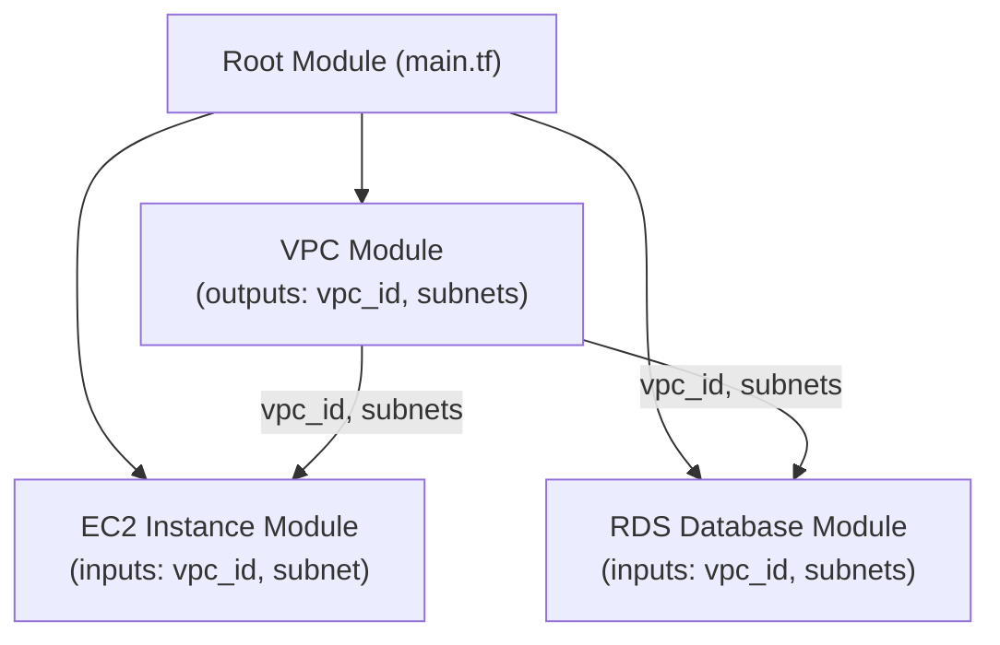

# Advanced OpenTofu: Custom Providers, Modules & State Management Strategies

OpenTofu has established itself as a powerful, community-driven Infrastructure as Code (IaC) tool. While many users are proficient with basic resource provisioning, mastering its advanced capabilities unlocks true operational excellence. This guide moves beyond the fundamentals to explore the techniques that separate the novice from the expert.

We will dive into building custom providers for bespoke services, designing composable module architectures for scalability, and implementing sophisticated state management strategies to ensure stability and collaboration in complex environments.

### What You'll Get

*   **Custom Provider Insights:** Understand the workflow for creating a custom OpenTofu provider in Go to manage proprietary or unsupported APIs.
*   **Module Architecture Mastery:** Learn the module composition pattern for building scalable, maintainable, and reusable infrastructure components.
*   **State Management Deep Dive:** Explore best practices for remote state, locking, drift detection, and the careful use of state manipulation commands.
*   **Practical Code & Diagrams:** Concrete examples, code snippets, and diagrams to illustrate complex concepts clearly.

---

## Building Custom OpenTofu Providers

While the OpenTofu Registry offers a vast collection of providers, you'll inevitably encounter systems without official support, such as internal APIs, legacy hardware, or niche cloud services. Building a custom provider is the definitive solution.

Providers are essentially plugins written in Go that implement the logic for creating, reading, updating, and deleting resources (CRUD). OpenTofu communicates with them via a gRPC-based protocol.

### The Provider Development Workflow

The modern approach uses the [OpenTofu Plugin Framework](https://opentofu.org/docs/extend/plugin-framework/), which abstracts away much of the boilerplate involved in protocol-level communication.

1.  **Setup Environment:** You need a working Go development environment.
2.  **Define Schema:** Define the resource's arguments and computed attributes. This schema dictates what users can configure in their `.tf` files.
3.  **Implement CRUD:** Write the Go functions for `Create`, `Read`, `Update`, and `Delete` operations that interact with your target API.
4.  **Build and Install:** Compile the provider and place it in the appropriate local plugin directory (`~/.opentofu.d/plugins/...` or a project-local directory) for testing.

Here is a simplified skeleton for a custom resource schema managing an internal "API Key" service.

```go
package main

import (
	"context"
	"github.com/hashicorp/terraform-plugin-framework/resource"
	"github.com/hashicorp/terraform-plugin-framework/resource/schema"
	"github.com/hashicorp/terraform-plugin-framework/types"
)

// Ensure the implementation satisfies the expected interfaces.
var _ resource.Resource = &apiKeyResource{}

// apiKeyResource defines the resource implementation.
type apiKeyResource struct {
	client *myApiClient
}

// apiKeyResourceModel maps the resource schema data.
type apiKeyResourceModel struct {
	ID          types.String `tfsdk:"id"`
	Description types.String `tfsdk:"description"`
	Permissions types.List   `tfsdk:"permissions"`
	KeyValue    types.String `tfsdk:"key_value"`
}

func (r *apiKeyResource) Schema(_ context.Context, _ resource.SchemaRequest, resp *resource.SchemaResponse) {
	resp.Schema = schema.Schema{
		Description: "Manages an API key for the internal service.",
		Attributes: map[string]schema.Attribute{
			"id": schema.StringAttribute{
				Computed:    true,
				Description: "The unique identifier for the API key.",
			},
			"description": schema.StringAttribute{
				Required:    true,
				Description: "A description for the API key.",
			},
			"permissions": schema.ListAttribute{
				ElementType: types.StringType,
				Required:    true,
				Description: "List of permissions (e.g., 'read:users', 'write:metrics').",
			},
			"key_value": schema.StringAttribute{
				Computed:    true,
				Sensitive:   true,
				Description: "The actual secret key value.",
			},
		},
	}
}

// ... Implement Create, Read, Update, Delete methods ...
```

### Key Considerations

*   **Idempotency:** Ensure that applying the same configuration multiple times results in the same state. Your `Read` and `Update` functions are critical for this.
*   **Error Handling:** Provide clear, actionable error messages from your provider. If an API call fails, the user should understand why.
*   **Versioning:** Use semantic versioning for your provider. It allows users to pin to a specific version, preventing breaking changes from impacting their infrastructure.

## Designing Robust and Reusable Modules

As infrastructure grows, monolithic configurations become unmanageable. Modules are the building blocks for creating scalable and maintainable IaC. The key is not just *using* modules, but designing them for composition.

### The Module Composition Pattern

This pattern involves creating small, focused modules that do one thing well and then assembling them in a root module or a larger "service" module. For example, instead of one giant "application" module, you create separate modules for networking, database, and compute.

This approach promotes reusability and simplifies testing. You can test the networking module in isolation before integrating it with the others.

Here's how these components might relate:



### Best Practices for Module Design

Adhering to a few simple rules dramatically improves module quality.

| Do ✅ | Don't ❌ |
| :--- | :--- |
| **Expose outputs for all created resources.** | **Assume users will access resources by name.** |
| **Use `variable` validation and type constraints.** | **Rely on comments to explain input requirements.** |
| **Keep modules focused on a single concern.** | **Create "god" modules that do everything.** |
| **Provide a `README.md` with examples.** | **Leave the module's interface undocumented.** |
| **Set sensible defaults for variables where possible.** | **Force users to define every single variable.** |

A well-designed module has a clear, minimal interface. Users should not need to understand its internal complexity to use it effectively.

## Sophisticated State Management Strategies

The OpenTofu state file is the critical link between your configuration and the real-world resources it manages. For any team-based or production-grade project, managing state with care is non-negotiable.

### Remote State and Locking

Storing the `tofu.tfstate` file locally is only suitable for solo projects. For teams, a remote backend is essential.

*   **Collaboration:** Allows multiple team members to access and modify the same infrastructure.
*   **Durability:** Protects the state file from being lost if a local machine fails.
*   **Security:** Remote backends often support encryption at rest.

**State locking** is equally important. It prevents two people from running `tofu apply` at the same time, which can corrupt the state file and lead to resource duplication or data loss.

Here is a standard configuration for using AWS S3 with DynamoDB for locking:

```hcl
terraform {
  backend "s3" {
    bucket         = "my-opentofu-state-bucket-unique"
    key            = "global/s3/terraform.tfstate"
    region         = "us-east-1"
    dynamodb_table = "opentofu-state-locks"
    encrypt        = true
  }
}
```

### Drift Detection and Reconciliation

Drift occurs when the real-world state of your infrastructure no longer matches the state defined in your OpenTofu configuration. This can happen due to manual changes, automated system actions, or service degradation.

> **Info:** Treat infrastructure drift as a high-priority bug. Unmanaged drift undermines the reliability and predictability of your IaC.

*   **Detection:** The primary tool for detecting drift is `tofu plan`. A plan that shows changes to be made when your configuration hasn't changed is a sign of drift.
*   **Automation:** Integrate regular, read-only `tofu plan` runs into your CI/CD pipeline. Send alerts to your team via Slack or PagerDuty if drift is detected.
*   **Reconciliation:** Once detected, you have two choices:
    1.  **Revert:** Run `tofu apply` to force the infrastructure back to its defined state.
    2.  **Adopt:** Update your OpenTofu configuration to match the real-world change.

### Advanced State Manipulation (Use with Caution)

OpenTofu provides powerful commands for directly manipulating the state file. These are "break-glass" tools and should not be part of your daily workflow. Always back up your state file before using them.

*   `tofu state mv <source> <destination>`
    *   **Use Case:** Refactoring your code. For instance, when you move a resource from the root module into a new child module, this command updates its address in the state file without destroying and recreating the resource.

*   `tofu state rm <address>`
    *   **Use Case:** Removing a resource from OpenTofu's management without deleting it. This is useful when a resource was created by mistake and you want to "orphan" it so it can be deleted manually.

*   `tofu import <address> <id>`
    *   **Use Case:** Bringing an existing, manually-created resource under OpenTofu's management. You must first write the configuration block for the resource, then run this command to populate its state.

## Summary and Next Steps

By mastering custom providers, composable modules, and disciplined state management, you can elevate your OpenTofu usage from simple provisioning to a robust, scalable, and collaborative IaC practice. These advanced techniques are foundational for managing complex systems and ensuring your infrastructure remains predictable and secure.

For more information, the official [OpenTofu Documentation](https://opentofu.org/docs/) is an invaluable resource.

What are your biggest challenges or triumphs with advanced OpenTofu features? Share your experiences in the comments below


## Further Reading

- [https://opentofu.org/docs/extend/plugin-protocol/](https://opentofu.org/docs/extend/plugin-protocol/)
- [https://opentofu.org/docs/language/modules/](https://opentofu.org/docs/language/modules/)
- [https://opentofu.org/docs/language/state/](https://opentofu.org/docs/language/state/)
- [https://www.cloudfoundry.org/blog/opentofu-advanced-features/](https://www.cloudfoundry.org/blog/opentofu-advanced-features/)
- [https://github.com/opentofu/docs](https://github.com/opentofu/docs)
