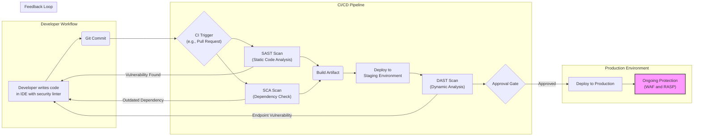

# The Converging Stack: DevOps and Modern Security Tooling Integration

In the fast-paced world of software delivery, the old model of security as a final, monolithic gate before production is obsolete. By 2026, the convergence of DevOps and security—true DevSecOps—is no longer an aspirational goal but a baseline for competitive and resilient engineering teams. The modern stack is a *converging stack*, where security tooling is not bolted on but woven directly into the fabric of the CI/CD pipeline and the daily developer workflow.

This article explores this converged landscape. We'll examine how key security tools are integrated into automated pipelines, fostering a culture of shared responsibility and enabling teams to build more secure software, faster.

### What You'll Get

*   An overview of the mature DevSecOps landscape in 2026.
*   A breakdown of how SAST, DAST, WAF, and RASP tools fit into the modern workflow.
*   A high-level diagram of a fully integrated DevSecOps pipeline.
*   Practical examples of tool integration within a CI/CD configuration.
*   A comparison of different security testing methodologies and their ideal integration points.

---

## The Shift to a Natively Secure Pipeline

The fundamental shift is one of mindset, enabled by technology. Instead of a security team acting as an external auditor, security becomes a shared responsibility, championed by developers and enabled by security experts. This philosophy, often called "shifting left," means integrating security assessments as early as possible in the development lifecycle.

The three pillars supporting this model are:

*   **Automation:** Manual security reviews don't scale. Automation is the only way to provide consistent, rapid feedback without slowing down delivery velocity.
*   **Fast Feedback Loops:** Security findings must be delivered to developers quickly, in their existing tools (like the IDE or Pull Requests), and with clear, actionable context.
*   **Shared Responsibility:** Developers are empowered to find and fix security issues, while security teams focus on setting policy, curating tools, and handling complex threats. This model is detailed in resources like the [OWASP DevSecOps Guideline](https://owasp.org/www-project-devsecops-guideline/).

## The Integrated DevSecOps Pipeline in 2026

By 2026, a mature CI/CD pipeline is inherently a security pipeline. Security checks are just another form of quality testing, running alongside unit and integration tests. A typical flow includes multiple, automated security touchpoints.

Here is a high-level view of what this integrated pipeline looks like:



This flow demonstrates that security is not a single step but a continuous process. Feedback from SAST, SCA, and DAST scans is routed directly back to the developer, often before the code is even merged.

## A Deeper Look at the Tooling

Different tools are designed for different purposes and are most effective at specific stages of the pipeline. According to [Gartner](https://www.gartner.com/en/security/devsecops-trends), a blend of these tools is essential for comprehensive coverage.

### Static Application Security Testing (SAST)

SAST tools analyze an application's source code, byte code, or binary code for security vulnerabilities *without* executing it. Think of it as an automated, security-focused code review.

*   **Where it fits:** Early in the CI pipeline, triggered on every commit or pull request. Many tools now offer IDE plugins for real-time feedback.
*   **Key Benefit:** Finds vulnerabilities like SQL injection, cross-site scripting (XSS), and insecure configurations early, when they are cheapest to fix.
*   **Example Integration (GitHub Actions):**

```yaml
jobs:
  sast_scan:
    name: Run SAST Analysis
    runs-on: ubuntu-latest
    steps:
      - name: Check out code
        uses: actions/checkout@v3

      - name: Run Snyk Code for SAST
        uses: snyk/actions/golang@master
        env:
          SNYK_TOKEN: ${{ secrets.SNYK_TOKEN }}
        with:
          command: code test
```

### Dynamic Application Security Testing (DAST)

DAST tools test a *running* application from the outside-in, simulating attacks to find vulnerabilities. This "black-box" approach requires no access to the source code.

*   **Where it fits:** After an application is deployed to a staging or testing environment.
*   **Key Benefit:** Identifies runtime and environment-related issues that SAST cannot, such as server misconfigurations and authentication flaws.

> **Info Block:** DAST is crucial for validating the security posture of your deployed application and its infrastructure, not just the code itself.

### Runtime Protection (WAF & RASP)

While SAST and DAST are testing tools, Web Application Firewalls (WAF) and Runtime Application Self-Protection (RASP) are protection tools for live applications.

*   **WAF:** Sits at the network edge, inspecting HTTP traffic to and from your application. It blocks common attacks based on predefined or learned rulesets.
*   **RASP:** Integrates directly into the application runtime (e.g., the JVM or .NET CLR). It has deep context into application logic, allowing it to detect and block attacks with higher accuracy and fewer false positives than a WAF.
*   **Where they fit:** In the production environment, providing a critical layer of defense. Data from these tools can provide a valuable feedback loop to developers about the types of attacks their application is facing in the wild.

### Software Composition Analysis (SCA)

Given that open-source libraries constitute the vast majority of modern applications, managing their security is non-negotiable. This is where SCA tools come in.

*   **What it is:** SCA tools scan your dependencies to identify known vulnerabilities (CVEs) and potential license compliance issues.
*   **Where it fits:** During the CI build process, before an artifact is created. Many systems also scan container images in a registry.
*   **Key Benefit:** Protects you from supply chain attacks and vulnerabilities in third-party code you didn't write but are still responsible for.

## Comparison of Tooling Integration Points

This table provides a quick reference for integrating the core DevSecOps security tools.

| Tool Type | Primary Pipeline Stage | Key Benefit | Example Tools |
| :--- | :--- | :--- | :--- |
| **SAST** | Commit / CI | Early detection of code-level flaws | Snyk Code, SonarQube, Checkmarx |
| **SCA** | CI / Registry Scan | Finds vulnerabilities in open-source libs | Dependabot, Snyk Open Source, OWASP DC |
| **DAST** | Post-Deployment (Staging) | Finds runtime & environment issues | OWASP ZAP, Invicti, Burp Suite Enterprise |
| **WAF/RASP**| Production | Real-time defense against live attacks | Cloudflare WAF, AWS WAF, Imperva RASP |

## The Cultural Foundation of Integration

Tools are only as effective as the culture that adopts them. As [IBM notes on DevSecOps](https://www.ibm.com/topics/devsecops), success hinges on breaking down silos.

### Automation is the Engine

Without automation, "shifting left" creates friction. The goal is to make the secure path the easiest path. This means security scans should be transparent, fast, and fully integrated. If a developer has to leave their workflow to run a scan or interpret a report, the process is likely to fail.

### Feedback is the Fuel

The most critical part of the converging stack is the feedback loop. When a vulnerability is found, the system must:
*   Alert the right person or team immediately.
*   Provide clear context: *what* is the flaw, *where* is it, and *how* to fix it.
*   Ideally, block a build or deployment if the vulnerability exceeds a defined severity threshold (`--fail-on=high`).

> "The goal of DevSecOps isn't to make developers into security experts. It's to give them the right information at the right time to make a secure choice."

## Conclusion: A New Baseline for Excellence

The convergence of DevOps and security is a defining feature of modern software engineering. By 2026, integrating SAST, DAST, SCA, and runtime protection directly into the CI/CD pipeline is the standard for high-performing teams. This automated, feedback-driven approach doesn't just find vulnerabilities earlier; it fosters a culture of security ownership and enables organizations to deliver value to customers more quickly *and* more safely.

The question is no longer *if* you should integrate security into your DevOps practice, but how deeply and effectively you can do it.

What's your go-to security tool for CI/CD integration? Share your experience in the comments below


## Further Reading

- [https://www.owasp.org/www-project-devsecops-guidelines/](https://www.owasp.org/www-project-devsecops-guidelines/)
- [https://www.gartner.com/en/security/devsecops-trends](https://www.gartner.com/en/security/devsecops-trends)
- [https://snyk.io/learn/devsecops-tools/](https://snyk.io/learn/devsecops-tools/)
- [https://www.cloudbees.com/blog/devsecops-tools](https://www.cloudbees.com/blog/devsecops-tools)
- [https://www.ibm.com/topics/devsecops](https://www.ibm.com/topics/devsecops)
