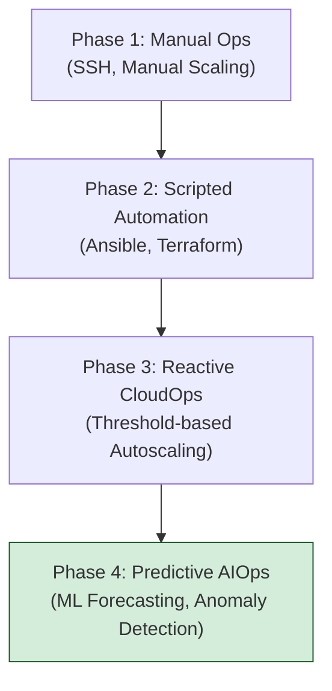
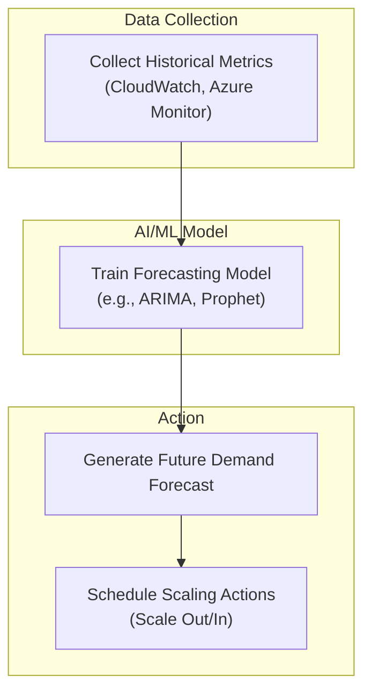
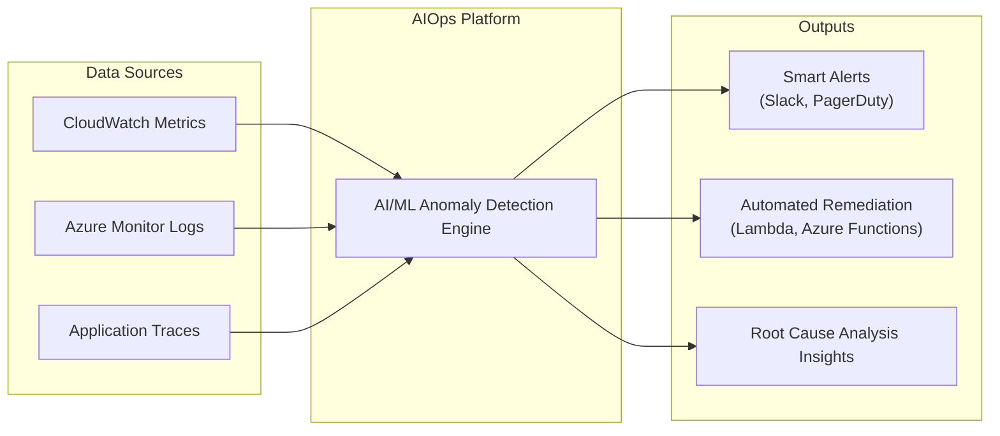

# AI-Driven Cloud Ops: Predictive Scaling & Anomaly Detection on Azure/AWS

Cloud operations are at an inflection point. The old model of reactive monitoring—staring at dashboards and responding to static threshold alerts—is no longer sufficient for managing the complexity and scale of modern cloud infrastructure. By 2026, Artificial Intelligence (AI) will not be a "nice-to-have" but a core component of efficient, resilient, and cost-effective CloudOps.

AI-driven operations, or AIOps, leverage machine learning to shift from a reactive to a proactive and predictive stance. This article dives into the practical application of AI in cloud management on AWS and Azure, focusing on the high-impact areas of predictive scaling, anomaly detection, and cost optimization.

### What You'll Get

*   **Predictive Scaling Deep Dive:** Understand how AI forecasts demand to optimize resource allocation beyond simple CPU metrics.
*   **Intelligent Anomaly Detection:** Learn how ML models identify real issues and reduce alert fatigue.
*   **AI for Cost Management:** Discover strategies to uncover savings and forecast spending with precision.
*   **Practical Examples:** See code snippets, architectural diagrams, and service comparisons for AWS and Azure.

---

## The Shift from Reactive to Predictive Cloud Ops

Traditionally, CloudOps has relied on human operators setting predefined rules. For example, "scale up when CPU utilization exceeds 80% for 5 minutes." This approach has two fundamental flaws:
1.  **It's reactive:** It only acts *after* a problem has started, leading to potential performance degradation.
2.  **It's noisy:** Static thresholds often trigger false alarms, causing alert fatigue and leading to real issues being missed.

AIOps changes the game by analyzing vast amounts of telemetry data (logs, metrics, traces) to learn the normal operational patterns of an application. As [Gartner highlights](https://www.gartner.com/en/articles/ai-driven-it-operations-future), AIOps platforms combine big data and machine learning functionality to support all primary IT operations functions.

This evolution can be visualized as a move from simple automation to intelligent, autonomous systems.



---

## AI-Powered Predictive Scaling: Beyond CPU Thresholds

Standard autoscaling is a cornerstone of the cloud, but its reactive nature is a limitation. Predictive scaling uses historical workload data to forecast future demand and provision resources *before* they are needed.

### The Problem with Reactive Scaling

Imagine an e-commerce site on Black Friday. A reactive scaler only adds capacity *after* the initial wave of users has already hit and slowed the site down. Conversely, it's slow to scale down after the peak, wasting money on idle resources.

### How Predictive Scaling Works

Predictive scaling algorithms analyze historical metrics (like CPU utilization, network traffic, or application request counts) to identify recurring patterns. It then creates a forecast to schedule scaling actions in advance.

Platforms like [AWS](https://aws.amazon.com/autoscaling/) and [Azure](https://azure.microsoft.com/en-us/solutions/ai-for-ops/) are increasingly integrating these capabilities.



### Implementation on AWS and Azure

*   **AWS Auto Scaling** offers a native predictive scaling policy. It analyzes up to 14 days of history for a chosen metric to forecast the next 48 hours. You enable it directly on your Auto Scaling group.

    Here is a snippet of an AWS CLI command to apply a predictive scaling policy. This JSON file defines a policy targeting 50% average CPU utilization and instructs AWS to forecast and scale.

    ```json
    // predictive-scaling-policy.json
    {
      "MetricSpecifications": [
        {
          "TargetValue": 50,
          "PredefinedMetricSpecification": {
            "PredefinedMetricType": "ASGAverageCPUUtilization"
          }
        }
      ],
      "Mode": "ForecastAndScale"
    }
    ```
    ```bash
    # Apply the policy
    aws autoscaling put-scaling-policy --auto-scaling-group-name my-asg \
        --policy-name my-predictive-policy --policy-type PredictiveScaling \
        --predictive-scaling-configuration file://predictive-scaling-policy.json
    ```

*   **Azure** provides predictive capabilities through a combination of services. While not a single-click solution like AWS's, you can build a powerful custom system using [Azure Machine Learning](https://azure.microsoft.com/en-us/products/machine-learning) to train a model and [Azure Functions](https://azure.microsoft.com/en-us/products/functions) to trigger scaling actions on Virtual Machine Scale Sets (VMSS).

> **Pro Tip:** Start with metrics that are strong leading indicators of load for your specific application, such as application request count or queue depth, not just CPU.

---

## Intelligent Anomaly Detection: Finding Needles in the Haystack

Your systems generate millions of data points every minute. How do you spot a critical issue before it causes an outage? Static alerts like `CPU > 95%` are too simple and often miss complex, multi-faceted problems.

### Beyond Static Thresholds

Intelligent anomaly detection uses machine learning to establish a dynamic, multi-dimensional baseline of what "normal" looks like. It can correlate subtle changes across dozens of metrics that a human would never notice. For example, it might detect a slight increase in latency, a minor drop in throughput, and a small rise in error rates simultaneously—a clear signal of an impending problem.

### Platform-Specific Services

Both major cloud providers offer powerful AIOps services for this purpose.



*   **AWS** offers several services in this space:
    *   **Amazon DevOps Guru:** An ML-powered service that automatically detects operational issues and recommends specific actions for remediation. It analyzes metrics and logs to find deviations from normal operating patterns.
    *   **Amazon Lookout for Metrics:** More focused on business and operational metrics. It automatically detects anomalies in your data (e.g., a sudden drop in revenue or a spike in transaction failures), determines their root cause, and allows you to take action.

*   **Azure** integrates AI directly into its monitoring suite:
    *   **Azure Monitor Smart Detection:** Automatically analyzes telemetry from your Application Insights and alerts you to potential performance problems and failure anomalies. It requires zero configuration.
    *   **Azure Anomaly Detector:** A standalone API that you can use to embed anomaly detection into your own applications. It's useful for time-series data from any source, not just Azure services.

---

## Smart Cost Management with AI

Cloud billing is notoriously complex. AI helps cut through the noise by providing intelligent insights into your spending, helping you forecast budgets and eliminate waste.

### AI-Driven Cost Insights

AI models can analyze your detailed billing and usage data to:
*   **Detect Cost Anomalies:** Instantly flag unexpected increases in spending caused by misconfigurations or resource leaks.
*   **Provide Rightsizing Recommendations:** Analyze actual usage patterns (CPU, memory, network) to recommend smaller, cheaper instances for underutilized resources.
*   **Optimize Purchase Plans:** Recommend the optimal mix of Reserved Instances, Savings Plans, or Spot Instances based on your predictable and unpredictable workloads.

### Feature Comparison: AWS vs. Azure

| Feature | AWS Service | Azure Service |
|---|---|---|
| **Cost Anomaly Detection** | [AWS Cost Anomaly Detection](https://aws.amazon.com/aws-cost-management/aws-cost-anomaly-detection/) | [Azure Cost Management Alerts](https://learn.microsoft.com/en-us/azure/cost-management-billing/costs/cost-mgt-alerts-monitor-usage-spending) |
| **Rightsizing** | [AWS Compute Optimizer](https://aws.amazon.com/compute-optimizer/) & Trusted Advisor | [Azure Advisor](https://azure.microsoft.com/en-us/products/advisor) |
| **Forecasting** | AWS Cost Explorer | Azure Cost Management |

> By leveraging AWS Compute Optimizer, one company identified over-provisioned resources and achieved a **25% reduction** in their EC2 costs without impacting performance. These tools move cost management from a monthly financial review to a continuous, data-driven engineering practice.

## The Road to 2026

The integration of AI into cloud operations is accelerating. Today, we have predictive scaling and intelligent alerting. By 2026, we can expect to see more autonomous systems capable of self-healing and self-optimization, where AI not only detects a problem but also automatically executes a remediation plan.

The role of the Cloud or DevOps Engineer is evolving. It's becoming less about manual intervention and more about building, training, and overseeing the AI models that manage the infrastructure. Mastering these AIOps tools is no longer optional—it's essential for building reliable, efficient, and cost-effective systems at scale.

How is AI currently helping you in your cloud operations? Share your experiences and challenges.


## Further Reading

- [https://aws.amazon.com/machine-learning/cloud-operations/](https://aws.amazon.com/machine-learning/cloud-operations/)
- [https://azure.microsoft.com/en-us/solutions/ai-for-ops/](https://azure.microsoft.com/en-us/solutions/ai-for-ops/)
- [https://www.gartner.com/en/articles/ai-driven-it-operations-future](https://www.gartner.com/en/articles/ai-driven-it-operations-future)
- [https://www.splunk.com/en_us/data-insights/aiops.html](https://www.splunk.com/en_us/data-insights/aiops.html)
- [https://cloud.google.com/aiops](https://cloud.google.com/aiops)
