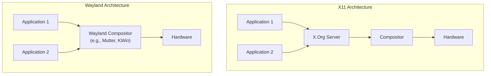

# Linux Desktop in 2026: Wayland, Gaming, and Enterprise Adoption

The year is 2026. For decades, the "Year of the Linux Desktop" has been a running joke—a perpetually just-out-of-reach milestone. Yet, looking at the current landscape, it's clear that while Linux may not have conquered the consumer market, it has achieved a profound and undeniable victory in key domains. This isn't a story of mass-market dominance, but one of targeted excellence.

The Linux desktop of 2026 is defined by three powerful trends: the final, mature transition to the Wayland display protocol, a gaming revolution sparked by the Steam Deck, and its quiet entrenchment as the go-to platform for enterprise developers. This article dissects this new reality, exploring the technologies and cultural shifts that brought us here.

### What You'll Get

*   **Wayland's Dominance:** A breakdown of why Wayland is now the default and what it means for security and performance.
*   **The Gaming Ecosystem:** Insights into how Proton and the Steam Deck made Linux a first-class gaming platform.
*   **Enterprise Adoption:** Analysis of why developers and data scientists overwhelmingly choose Linux workstations.
*   **Future Trajectory:** A glimpse into what the next few years hold for the Linux desktop.

---

## The Wayland Era is Fully Here

By 2026, the long and often-fraught transition from the X.Org Server (X11) to the [Wayland](https://wayland.freedesktop.org/) protocol is effectively complete for the vast majority of users. All major distributions and desktop environments, including GNOME and KDE Plasma, have made it the polished, secure default. The debate is over; Wayland has won.

### Security and Performance as Standard

The fundamental architectural differences between X11 and Wayland are no longer just theoretical advantages; they are daily realities for users. Wayland's design enforces application isolation, meaning one app cannot easily snoop on the inputs or screen content of another. This virtually eliminates entire classes of security vulnerabilities common under X11.

Performance-wise, every frame is perfect. Screen tearing is a forgotten relic of the past. Wayland's modern architecture allows compositors to directly manage the display, resulting in buttery-smooth animations, efficient power usage on laptops, and flawless handling of mixed-DPI and high-refresh-rate monitor setups.

> **Info:** Under X11, the server acted as a middleman between clients and the hardware. Wayland simplifies this, merging the display server and compositor into a single, more efficient process.



### NVIDIA and Remaining Hurdles

One of the biggest historical roadblocks to Wayland adoption was NVIDIA's proprietary driver support. By 2026, this is a solved problem. Through standards like explicit sync, NVIDIA's drivers now offer a robust and performant Wayland experience on par with their open-source counterparts from AMD and Intel.

While the XWayland compatibility layer still exists to run legacy X11 applications, the need for it is shrinking rapidly as the application ecosystem has fully embraced Wayland-native toolkits like GTK4 and Qt6.

## Gaming on Linux: Beyond a Niche Hobby

The launch of the Steam Deck in 2022 was the catalyst that transformed Linux gaming from a hobbyist's pursuit into a mainstream, "it just works" experience. The shockwaves from that device have reshaped the entire ecosystem.

### The Proton Effect: Compatibility by Default

Valve's Proton, a compatibility layer built on Wine and DXVK, has reached an incredible level of maturity. It translates Windows-native DirectX API calls to the open Vulkan API on the fly, allowing thousands of Windows games to run on Linux—often with performance matching or even exceeding Windows.

*   **Vast Compatibility:** A massive portion of the Steam library runs flawlessly out of the box. The community-driven [ProtonDB](https://www.protondb.com/) database provides detailed reports for the rest.
*   **Anti-Cheat Solved:** The once-insurmountable wall of kernel-level anti-cheat services (Easy Anti-Cheat, BattlEye) has been breached. Valve worked with vendors to ensure Proton compatibility, unlocking top multiplayer titles like *Apex Legends* and *Elden Ring* for Linux gamers.
*   **Shader Pre-caching:** Steam's shader pre-caching system eliminates in-game stuttering, a common issue with translation layers, by compiling shaders before the game even launches.

The table below highlights just how far we've come.

| Feature | Circa 2020 | 2026 Status |
| :--- | :--- | :--- |
| **Windows Compatibility** | Hit-or-miss, required heavy tweaking | High; vast majority run via Proton |
| **Anti-Cheat Support** | A major blocker for popular titles | Largely solved for major services |
| **Graphics Drivers** | Mixed, especially for new hardware | Mature and performant (AMD, Intel, NVIDIA) |
| **Default Display Server**| X11, with screen tearing & sync issues | Wayland, offering a smooth experience |

### Native Development and Engine Support

The momentum has also encouraged more native Linux development. Game engines like Godot and Unreal Engine 5 now treat Linux as a first-class citizen, making it trivial for developers to produce native builds. While Proton handles the back catalog, a growing number of new titles arrive with official Linux support from day one.

## The Enterprise Workstation: Linux as the Developer's Choice

While the consumer desktop market share remains in the single digits, Linux has become the undisputed champion on the desks of software developers, DevOps engineers, and data scientists. This dominance is built on a foundation of technical superiority for modern workflows.

### Containerization and Cloud-Native Synergy

Modern software development is built on containers and cloud-native technologies. Linux is the native environment for these tools. Running Docker or Kubernetes on Linux is seamless and incredibly performant because it leverages the kernel's own features directly.

On other operating systems, developers rely on heavy virtualization layers (like WSL2 or Docker Desktop for Mac), which add overhead and complexity. On Linux, it's native.

```bash
# A simple, native command on a Linux workstation
# No virtual machine needed.
docker run -it --rm ubuntu:latest /bin/bash
```

### The Rise of Immutable and Atomic Distros

A key innovation solidifying the enterprise position is the maturation of immutable operating systems like **Fedora Silverblue**, **openSUSE MicroOS**, and **Vanilla OS**. These systems feature a read-only core, with applications installed via containers or Flatpaks.

*   **Unbreakable Stability:** The core OS cannot be accidentally broken by a stray command or conflicting package.
*   **Atomic Updates:** Updates are applied as a single, atomic transaction. If an update fails, the system automatically rolls back to the previous working state.
*   **Clean Separation:** The system, user applications, and project dependencies are cleanly isolated from each other, preventing "dependency hell."

This model is a dream for IT departments managing fleets of developer workstations, providing reliability that traditional package management systems can't match.

```mermaid
graph TD
    subgraph Immutable OS Architecture
        A["Base OS (Read-only)"] --> B{"`rpm-ostree`<br/>(Transactional Updates)"};
        B --> A;
        C["User Applications (Flatpak)"] --> D["User Data"];
        E["Development Tools (Containers)"] --> D;
    end
```

## Looking Ahead: The Road to 2030

The foundation laid by 2026 is solid, pointing toward an even brighter future. Key trends to watch include:

*   **AI Integration:** Expect deeper, native integration of local and cloud-based AI tools directly into desktop environments for coding assistance, workflow automation, and content creation.
*   **ARM's Ascent:** With the growing success of high-performance ARM chips, the Linux desktop is perfectly positioned to become the premier OS for this new class of power-efficient workstations.
*   **Hardware Certification:** More vendors like Dell, Lenovo, and Framework are expanding their lineups of laptops that ship with Linux pre-installed and fully supported, removing the final adoption barrier for many professionals.

## Conclusion

The Linux desktop of 2026 is a testament to focused, community-driven innovation. It has carved out an unshakeable position not by trying to be a Windows clone, but by excelling where it matters most: providing a secure, stable, and powerful platform for builders, creators, and gamers. The maturity of Wayland, the explosion of the gaming ecosystem, and its lock on the developer workstation have transformed it from an enthusiast's hobby into a professional's tool of choice.

What's your daily driver desktop environment in 2026? Share your recent Linux gaming triumphs with us


## Further Reading

- [https://wayland.freedesktop.org/](https://wayland.freedesktop.org/)
- [https://www.protondb.com/](https://www.protondb.com/)
- [https://store.steampowered.com/steamdeck](https://store.steampowered.com/steamdeck)
- [https://www.phoronix.com/review/linux-desktop-2026](https://www.phoronix.com/review/linux-desktop-2026)
- [https://www.linuxfoundation.org/blog/linux-on-the-desktop-2026/](https://www.linuxfoundation.org/blog/linux-on-the-desktop-2026/)
