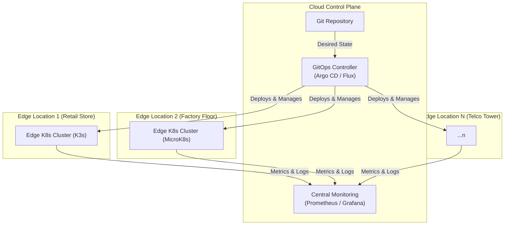

# Kubernetes at the Edge: Deploying and Managing K8s Off-Cloud

The cloud-native world is expanding. While centralized cloud data centers have been the epicenter of innovation, the next frontier is the edge—the vast, distributed landscape of factory floors, retail stores, cell towers, and remote devices. Running applications closer to where data is generated is no longer a niche requirement; it's a critical business need.

Kubernetes, the de facto standard for container orchestration, is naturally extending its reach to these environments. But deploying and managing K8s "off-cloud" presents a unique set of challenges and requires a different toolkit. This article dives into the practicalities of running Kubernetes at the edge.

### What You'll Get

*   **The 'Why':** Understand the key drivers for using Kubernetes in edge computing.
*   **The 'What':** A look at lightweight K8s distributions like K3s and MicroK8s.
*   **The 'How':** Strategies for managing distributed, resource-constrained clusters.
*   **Key Challenges:** A clear-eyed view of networking, security, and scale issues.
*   **Practical Solutions:** An overview of GitOps, data synchronization, and provisioning patterns.

---

## Why Kubernetes at the Edge?

Edge computing is about processing data locally rather than sending it to a centralized cloud. Bringing Kubernetes to this model provides a consistent, declarative platform for deploying and managing applications everywhere.

The primary benefits are clear:

*   **Low Latency:** Processing data on-site (e.g., for industrial robotics or point-of-sale systems) reduces response times from seconds to milliseconds.
*   **Bandwidth Reduction:** Pre-processing, filtering, and aggregating data at the edge significantly cuts down on the volume of data sent to the cloud, saving costs.
*   **Offline Capability:** Edge applications can continue to operate during network outages, a crucial feature for remote or critical infrastructure.
*   **Data Sovereignty:** Keeping sensitive data within a specific geographic location or physical site can be a legal or privacy requirement.

This has unlocked powerful use cases across industries:
*   **Retail:** Powering real-time inventory tracking and AI-driven checkout systems.
*   **Manufacturing:** Running predictive maintenance models directly on factory floor equipment (IIoT).
*   **Telecommunications:** Deploying 5G User Plane Functions (UPFs) and Multi-access Edge Computing (MEC) applications.
*   **IoT:** Managing fleets of connected devices in smart cities or vehicles.

> **Info Block:** The [Cloud Native Computing Foundation (CNCF)](https://www.cncf.io/blog/edge-kubernetes-report/) notes that the top drivers for edge computing are latency reduction and the high cost of network bandwidth. This aligns directly with what Kubernetes at the edge aims to solve.

## Choosing the Right K8s Distribution

A standard Kubernetes distribution can be resource-intensive, often requiring multiple gigabytes of RAM just for the control plane. This is impractical for the Raspberry Pis, industrial PCs, and other resource-constrained devices common at the edge.

Fortunately, several lightweight distributions have emerged to fill this gap. They are fully compliant Kubernetes but packaged for efficiency.

### K3s: The Lightweight Champion

Developed by Rancher (now SUSE), [K3s](https://k3s.io/) is a highly popular, CNCF-certified distribution designed for production workloads in unattended, resource-constrained environments.

*   **Tiny Footprint:** Packaged as a single binary under 100MB.
*   **Low Resource Usage:** Can run a control plane with as little as 512MB of RAM.
*   **Simplified Backend:** Uses SQLite as the default datastore instead of etcd, simplifying single-node setups. (etcd is still an option for HA).
*   **ARM Support:** Excellent support for both ARM64 and ARMv7, making it ideal for devices like the Raspberry Pi.

Getting started is incredibly simple:
```bash
# Installs K3s as a service on a Linux system
curl -sfL https://get.k3s.io | sh -
```

### MicroK8s: The Zero-Ops Contender

[MicroK8s](https://microk8s.io/) is Canonical's answer to lightweight Kubernetes. It's delivered as a single `snap` package, bundling all necessary binaries for a self-contained, isolated K8s experience.

*   **Simple Installation:** A single command gets you a running cluster.
*   **Built-in Add-ons:** Easily enable core services like DNS, storage, service meshes (Istio, Linkerd), and serverless frameworks (Knative) with a single command.
*   **High Availability:** Built-in clustering support for creating multi-node, resilient setups.
*   **Broad Compatibility:** Runs on Linux, Windows, and macOS, making it great for both development and edge production.

Installation is just as straightforward:
```bash
# Install MicroK8s using snap
sudo snap install microk8s --classic
```

### Quick Comparison

| Feature | Standard K8s (kubeadm) | K3s | MicroK8s |
| :--- | :--- | :--- | :--- |
| **Primary Goal** | General Purpose | Edge, IoT, CI | Dev, Edge, IoT |
| **Binary Size** | ~1.5 GB+ (components) | < 100 MB (single binary) | ~250 MB (snap) |
| **RAM (Control Plane)** | 2 GB+ | 512 MB+ | 1 GB+ |
| **Datastore** | etcd | SQLite (default), etcd | dqlite (default), etcd |
| **Installation** | Multi-step configuration | Single script/binary | Single `snap` command |
| **Add-ons** | Manual installation | Basic components included | `microk8s enable` command |

## Core Challenges of Edge Deployments

Managing one Kubernetes cluster is complex. Managing hundreds or thousands across geographically diverse, often unreliable networks is a fundamentally different problem.

### Management and Orchestration at Scale

A centralized management model is essential. Typically, a "management cluster" resides in the cloud or a central data center, while numerous "edge clusters" are deployed remotely. This architecture allows for consistent policy enforcement, application deployment, and observability.

Here is a high-level view of this model:



### Network Constraints

Edge locations often have intermittent, low-bandwidth, or high-latency network connections. Pushing large container images from a central registry can be slow or impossible.

**Solutions:**
*   **Local Image Caching:** Use a container registry proxy at each edge site to cache images locally after the first pull.
*   **Optimized Images:** Build minimal container images using techniques like multi-stage builds and base images like Alpine or Distroless.

### Security in Untrusted Environments

Edge devices are physically accessible, making them vulnerable to theft and tampering. The networks they connect to may also be less secure than a corporate data center.

**Solutions:**
*   **Minimal OS:** Run a minimal, hardened operating system to reduce the attack surface.
*   **Network Policies:** Use Kubernetes NetworkPolicies to strictly control traffic between pods.
*   **Secrets Management:** Avoid storing secrets on the device. Use tools like HashiCorp Vault or cloud provider secret managers with proper authentication mechanisms.

## Strategies for Robust Edge Deployments

Success at the edge depends on automation and resilience. Manual intervention is not scalable.

### Embrace GitOps for Management

GitOps is a paradigm where the desired state of your infrastructure and applications is declared in a Git repository. An agent running in the cluster (like [Argo CD](https://argo-cd.readthedocs.io/en/stable/) or [Flux](https://fluxcd.io/)) continuously reconciles the live state with the declared state in Git.

This is a perfect fit for the edge:
*   **Declarative:** You define *what* you want, not *how* to get there.
*   **Pull-based:** The edge cluster initiates the connection to the control plane, which is more secure and works behind NAT/firewalls.
*   **Auditability:** Every change is a Git commit, providing a complete audit trail.

### Data Synchronization Patterns

Data generated at the edge needs a strategy. Simply streaming everything to the cloud is often infeasible.

*   **Store-and-Forward:** Edge applications store data locally (e.g., in a local database or message queue). When network connectivity is available, a separate process forwards the data to the central location.
*   **Aggregate and Filter:** A common pattern is to run analytics or ML inference at the edge to process raw data. Only the results or anomalies are sent back to the cloud, dramatically reducing bandwidth needs.

### Zero-Touch Provisioning

When deploying a new edge device, the goal should be "zero-touch." An operator should be able to simply power on the device, connect it to the network, and have it automatically configure itself, install Kubernetes, and register with the central management plane. This is often achieved using technologies like PXE booting and cloud-init scripts.

---

## Conclusion

Kubernetes at the edge is not just a trend; it's a powerful evolution of cloud-native principles. By leveraging lightweight distributions like K3s and MicroK8s, adopting GitOps for management, and designing for resilience, organizations can build a single, unified platform that spans from the central cloud to the furthest edge. The challenges of scale, connectivity, and security are significant, but the architectural patterns to solve them are maturing rapidly.

The journey to the edge is just beginning. What are your biggest challenges or successes with Kubernetes in edge environments? Share your experiences


## Further Reading

- [https://k3s.io/docs/](https://k3s.io/docs/)
- [https://microk8s.io/docs/](https://microk8s.io/docs/)
- [https://kubernetes.io/blog/kubernetes-edge-computing/](https://kubernetes.io/blog/kubernetes-edge-computing/)
- [https://www.cncf.io/blog/edge-kubernetes-report/](https://www.cncf.io/blog/edge-kubernetes-report/)
- [https://www.redhat.com/en/topics/edge-computing/what-is-edge-kubernetes](https://www.redhat.com/en/topics/edge-computing/what-is-edge-kubernetes)
