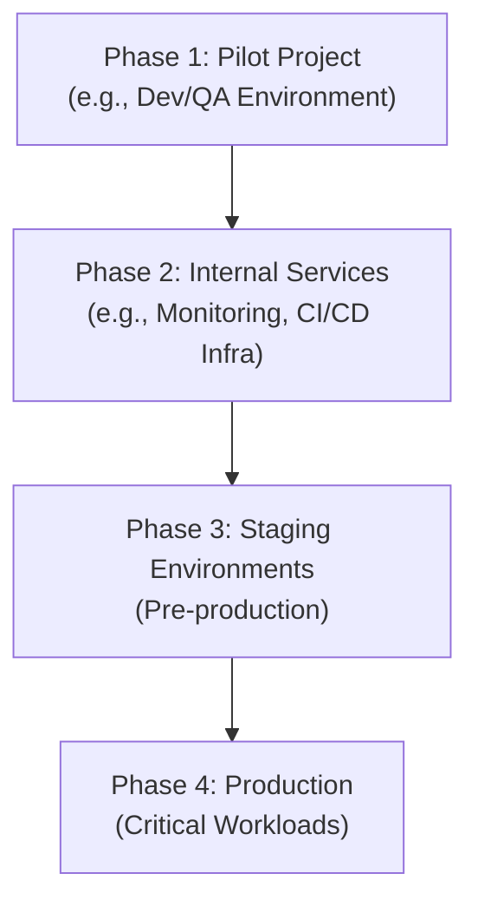
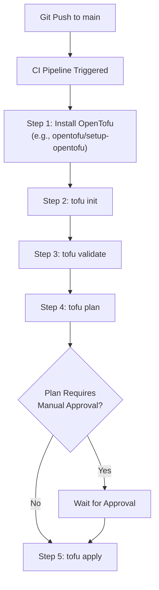

# Smooth Migration to OpenTofu: A Step-by-Step Enterprise Guide

The shift in Terraform's licensing model from MPL 2.0 to the Business Source License (BSL) has prompted many organizations to evaluate alternatives. OpenTofu, a community-driven, open-source fork of Terraform, has emerged as the leading contender. Governed by the Linux Foundation, it promises a stable, predictable, and genuinely open-source future for Infrastructure as Code (IaC).

This guide provides a pragmatic, step-by-step approach for enterprises to plan and execute a smooth migration from Terraform to OpenTofu. We'll focus on risk mitigation, operational continuity, and best practices to ensure your transition is seamless and non-disruptive.

### What You'll Get

*   **A Clear Rationale:** Understand the key drivers for migrating beyond just the license.
*   **Pre-Migration Checklist:** A blueprint for auditing your environment and planning a phased rollout.
*   **Step-by-Step Execution:** Concrete CLI commands and procedures for the core migration task.
*   **CI/CD Integration Guide:** Practical examples for updating your automation pipelines.
*   **Best Practices:** Strategies for state management, testing, and post-migration validation.

## Why Consider OpenTofu?

For most versions, OpenTofu is a **drop-in replacement** for Terraform. The migration is primarily a change in the command-line tool, not a rewrite of your codebase. The key motivations for enterprises are often strategic:

*   **License Stability:** OpenTofu is governed by the Mozilla Public License v2.0 (MPL 2.0), which prevents the kind of sudden licensing changes that triggered this migration in the first place.
*   **Community Governance:** Being part of the Linux Foundation ensures that development is driven by a diverse community of vendors and users, not a single corporate entity.
*   **Drop-in Compatibility:** OpenTofu maintains compatibility with Terraform versions prior to the BSL license change (currently up to v1.6.x, with v1.7.x support available). This means your existing `.tf` files and state files work without modification.

Here's a quick comparison for context:

| Feature | Terraform (v1.6+) | OpenTofu (v1.6+) |
| :--- | :--- | :--- |
| **License** | Business Source License (BSL) 1.1 | Mozilla Public License (MPL) 2.0 |
| **Governance** | HashiCorp | Linux Foundation (Community) |
| **Core CLI** | `terraform` | `tofu` (drop-in replacement) |
| **State File Compatibility** | Yes (with OpenTofu) | Yes (with Terraform < v1.6) |
| **Public Registry** | Terraform Registry | OpenTofu Registry |

> **Info:** The primary focus of this guide is migrating the open-source CLI workflow. If your organization heavily relies on proprietary features of Terraform Cloud (TFC) or Terraform Enterprise (TFE), you'll need a separate evaluation for alternatives like Spacelift, Env0, or self-hosted solutions.

## Pre-Migration Planning: The Blueprint for Success

A successful migration is 90% planning. Before changing a single line of code, your team should perform a thorough assessment.

### 1. Inventory and Audit Your IaC Estate

You can't migrate what you don't know you have. Start by cataloging all your IaC components:

*   **Repositories:** Identify all Git repositories containing Terraform code.
*   **Modules:** List all local, private, and public modules in use. Pay special attention to their sources and versions.
*   **Providers:** Document every provider and its version. Check for any providers that might have compatibility issues (though this is rare).
*   **State Backends:** Confirm the location and access controls for all state files (S3, Azure Blob Storage, GCS, etc.).
*   **CI/CD Pipelines:** Pinpoint every pipeline that invokes the `terraform` CLI.

### 2. Establish a Phased Rollout Strategy

Avoid a "big bang" migration. A phased approach minimizes risk and builds confidence.

1.  **Pilot Project:** Select a low-risk, non-production environment. This could be a developer's sandbox, a QA environment, or an internal tool's infrastructure.
2.  **Internal Services:** Migrate infrastructure for internal-facing applications next. These services often have more forgiving maintenance windows.
3.  **Production Workloads:** Once the process is proven and your team is confident, proceed with migrating production environments, one component at a time.

This flow can be visualized as a progressive journey.



### 3. Communication and Team Alignment

Ensure all stakeholders are on board. This includes DevOps engineers, SREs, developers, and security teams.

*   **Document the Plan:** Create a shared document outlining the migration strategy, timeline, and rollback plan.
*   **Train the Team:** Although the commands are nearly identical, a brief session on the `tofu` CLI and the reasons for the switch is beneficial.
*   **Define a Rollback Plan:** The simplest rollback plan is to revert the CI/CD pipeline changes and use the `terraform` binary again. Since the state file remains compatible, this is a low-risk procedure.

## The Core Migration Process: A Step-by-Step Walkthrough

Once planning is complete, the technical execution is straightforward. We'll use a sample project for demonstration.

### Step 1: Backup Your State File

This is the most critical step. **Never proceed without a backup.** Your state file is the source of truth for your infrastructure.

If you're using a remote backend like AWS S3, ensure versioning is enabled. You can also manually download a copy:

```bash
# Ensure you're in the correct directory with your backend configured
terraform init

# Download the current state to a local file
terraform state pull > terraform.tfstate.backup
```

### Step 2: Install OpenTofu

Remove or isolate your existing Terraform binary and install OpenTofu. Using a version manager like `tofuenv` is highly recommended for managing multiple versions.

```bash
# Example using tofuenv
brew install tofuenv
tofuenv install 1.6.2 # Or the latest stable version
tofuenv use 1.6.2
```
You can find other installation methods in the official [OpenTofu documentation](https://opentofu.org/docs/getting-started/install/).

### Step 3: Run a Test Plan

Navigate to your project directory. The goal here is to prove that OpenTofu recognizes your configuration and state, and plans **no changes**.

```bash
# Initialize with OpenTofu. It will read your .tf files and backend config.
tofu init

# Generate a plan. The output should be clean.
tofu plan

# Expected output
# No changes. Your infrastructure matches the configuration.
```
A "No changes" plan is your green light. It confirms that OpenTofu has correctly parsed your code, providers, and remote state.

### Step 4: Execute and Validate

For your pilot project, apply a small, non-disruptive change. This validates the entire lifecycle, including OpenTofu's ability to write to your state file.

1.  **Make a minor change:** Add a tag to a resource.
2.  **Run `tofu plan` again:** Confirm it shows only the intended change.
3.  **Apply the change:**
    ```bash
    tofu apply
    ```
4.  **Validate:** Check the cloud provider's console to ensure the tag was applied correctly.

## Adapting Your CI/CD Pipelines

This is where the migration is operationalized. The core task is to replace the `terraform` binary with `tofu`.

### Updating Pipeline Scripts

Here is a common `before` and `after` example for a GitHub Actions workflow:

**Before (using `hashicorp/setup-terraform`):**

```yaml
- name: Setup Terraform
  uses: hashicorp/setup-terraform@v2
  with:
    terraform_version: 1.6.0

- name: Terraform Init
  run: terraform init

- name: Terraform Plan
  run: terraform plan -input=false
```

**After (using `opentofu/setup-opentofu`):**

```yaml
- name: Setup OpenTofu
  uses: opentofu/setup-opentofu@v1
  with:
    tofu_version: 1.6.2

- name: OpenTofu Init
  run: tofu init

- name: OpenTofu Plan
  run: tofu plan -input=false
```

The logic remains identical; only the tool's name changes.

### A Typical CI/CD Flow

Your updated pipeline will follow the same trusted GitOps flow, simply using the `tofu` executable.



## Post-Migration: Ensuring Stability

After the migration, focus on validation and optimization.

*   **Monitor State Drift:** Use tools to periodically run `tofu plan` to detect any out-of-band changes to your infrastructure.
*   **Lock a Version:** Use a version manager like `tofuenv` and a `.tool-versions` file in your repository to ensure all developers and CI runners use the exact same OpenTofu version.
*   **Explore the Ecosystem:** Familiarize your team with the [OpenTofu public registry](https://registry.opentofu.org) and community-driven initiatives.

## Conclusion

Migrating from Terraform to OpenTofu is a low-risk, high-reward process for enterprises seeking long-term stability and open-source assurance for their IaC strategy. Because OpenTofu is a drop-in replacement, the technical effort is minimal and focuses on careful planning, rigorous testing, and systematic updates to your CI/CD pipelines.

By following a phased, well-documented approach, you can transition your infrastructure management to an open, community-governed standard without disrupting your operations.

---

**What are your experiences with large-scale IaC migrations? Share your challenges and successes in the comments below!**


## Further Reading

- [https://opentofu.org/docs/guides/migration-guide/](https://opentofu.org/docs/guides/migration-guide/)
- [https://www.infoworld.com/article/opentofu-migration-strategies/](https://www.infoworld.com/article/opentofu-migration-strategies/)
- [https://www.cloudfoundry.org/blog/opentofu-enterprise-migration/](https://www.cloudfoundry.org/blog/opentofu-enterprise-migration/)
- [https://medium.com/hashicorp-terraform-to-opentofu-migration-steps/](https://medium.com/hashicorp-terraform-to-opentofu-migration-steps/)
- [https://github.com/opentofu/docs/migration](https://github.com/opentofu/docs/migration)
