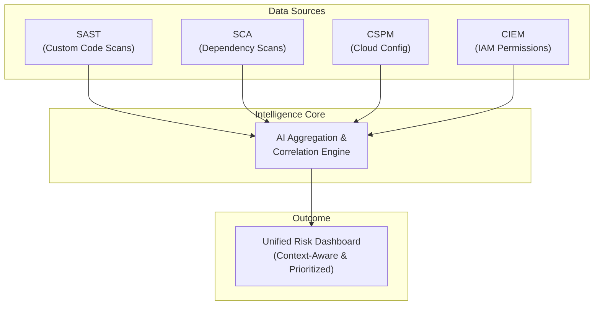
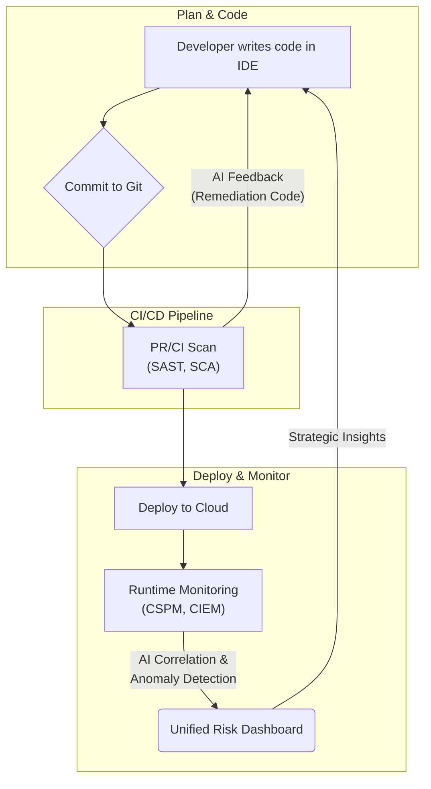

# Proactive Security Posture: AI for Cloud & Code Risk Intelligence

The days of reactive, siloed security are over. In a world of ephemeral infrastructure and rapid deployment cycles, security teams are drowning in a sea of alerts from dozens of disconnected tools. This alert fatigue doesn't just burn out your best people; it creates blind spots where critical risks hide in plain sight. The solution isn't more tools—it's more intelligence.

Artificial Intelligence (AI) is fundamentally changing the game, moving us from a state of constant reaction to a proactive, intelligent security posture. By correlating signals across your entire software development lifecycle—from the first line of code to the live cloud environment—AI provides the context needed to identify and fix the risks that truly matter.

### What You'll Get

*   **Unified Risk Perspective:** Understand how AI breaks down the silos between cloud (CSPM/CIEM) and code (SAST/SCA) security.
*   **Intelligent Prioritization:** Learn how AI moves beyond CVSS scores to assess real-world risk based on context.
*   **Actionable Remediation:** See examples of AI-generated fixes that developers can implement immediately.
*   **DevSecOps Acceleration:** Discover how an integrated, AI-driven approach boosts efficiency and strengthens security.

---

## The Fragmentation Problem: Siloed Security Signals

Modern cloud-native applications are complex systems with multiple layers of risk. To manage this, we deploy a suite of specialized tools, each focused on a narrow piece of the puzzle.

*   **Static Application Security Testing (SAST):** Scans your first-party, proprietary code for security flaws like SQL injection or improper error handling.
*   **Software Composition Analysis (SCA):** Identifies known vulnerabilities (CVEs) within the open-source libraries and dependencies your application uses.
*   **Cloud Security Posture Management (CSPM):** Monitors your cloud environments (AWS, Azure, GCP) for misconfigurations, such as public S3 buckets or unrestricted security groups.
*   **Cloud Infrastructure Entitlement Management (CIEM):** Analyzes permissions and entitlements to identify excessive or unused privileges that could be exploited.

While essential, these tools operate in isolation, creating a deluge of uncontextualized alerts.

| Tool Type | Focus Area | Common Challenge |
| :--- | :--- | :--- |
| **SAST** | Custom Application Code | High false-positive rate; lacks runtime context. |
| **SCA** | Open-Source Dependencies | Alert volume on unused functions; ignores exploitability. |
| **CSPM** | Cloud Infrastructure Config | "Noise" from non-critical dev environments; lacks code context. |
| **CIEM** | IAM Roles & Permissions | Difficult to distinguish necessary vs. excessive permissions. |

> A medium-severity vulnerability in a library is just noise until you realize it's running in a public-facing container with an overly permissive IAM role. This is the context that isolated tools miss.

## AI as the Unifying Intelligence Layer

This is where AI, particularly machine learning (ML) and Large Language Models (LLMs), becomes a force multiplier. Instead of just flagging individual issues, AI platforms act as a central intelligence layer, ingesting signals from all your security tools to build a holistic understanding of risk.

This unified approach allows security systems to connect the dots between a vulnerable piece of code and a misconfigured piece of infrastructure.



### AI-Powered Threat Intelligence

Modern AI security platforms don't just rely on static CVE databases. They continuously process massive datasets of global threat intelligence, including active exploits, threat actor tactics, techniques, and procedures (TTPs), and dark web chatter. This allows them to predict which vulnerabilities are most likely to be targeted and elevate their priority *before* an attack occurs. This is a core principle behind services like [Microsoft's Security Copilot](https://www.microsoft.com/en-us/security/business/ai-threat-detection).

### Sophisticated Anomaly Detection

Traditional security relies on predefined rules. AI, however, learns the unique "normal" for your environment. It establishes a baseline of typical developer behavior, deployment patterns, and infrastructure activity.

When a deviation occurs, it raises an intelligent alert. For example:
*   **Traditional Alert:** "Security group port 22 is open to 0.0.0.0/0." (Often noisy in dev environments).
*   **AI-Powered Alert:** "A developer just exposed SSH on a production database server that has *never* had external SSH access before, and this server hosts sensitive PII data."

This level of contextual awareness is impossible to achieve with static rules alone.

## From Detection to Action: Intelligent Remediation

Identifying a risk is only half the battle. The true power of an AI-driven security posture is its ability to guide and automate remediation, reducing the Mean Time to Remediate (MTTR).

### Context-Aware Prioritization

AI excels at answering the most critical security question: *"What should I fix first?"*

By correlating data points, it can instantly distinguish a critical risk from a low-priority finding.

> **Scenario: A Tale of Two Vulnerabilities**
>
> 1.  **Vulnerability A:** A `Critical` 9.8 CVSS vulnerability (SCA) is found in a library used only for internal unit tests. It's never packaged in the production container.
> 2.  **Vulnerability B:** A `Medium` 6.5 CVSS vulnerability (SCA) is found in an open-source library that processes image uploads. This library is used by a public-facing web application (CSPM) running in a container with excessive permissions to read from an S3 bucket containing customer data (CIEM).
>
> A traditional, non-AI system would flag Vulnerability A as the top priority. The AI-powered system correctly identifies **Vulnerability B** as the *actual* critical risk due to its "attack path" and direct exposure.

### Automated Remediation Suggestions

Modern AI doesn't just tell you what's broken; it provides the code to fix it. By integrating directly into developer workflows, these platforms can suggest concrete fixes via pull requests. This dramatically reduces the friction between security and development teams.

For instance, if a CSPM scan detects an insecure Terraform configuration:

```hcl
# Insecure Infrastructure as Code (IaC)
resource "aws_s3_bucket" "customer_data" {
  bucket = "my-sensitive-data-bucket-123"
  # Missing encryption and public access block
}
```

The AI can automatically generate a pull request comment with the corrected, secure code block.

```hcl
# AI-Generated Remediation Suggestion
# This S3 bucket appears to store sensitive data but lacks server-side encryption
# and a public access block. Please apply the following configuration:

resource "aws_s3_bucket" "customer_data" {
  bucket = "my-sensitive-data-bucket-123"

  server_side_encryption_configuration {
    rule {
      apply_server_side_encryption_by_default {
        sse_algorithm = "AES256"
      }
    }
  }
}

resource "aws_s3_bucket_public_access_block" "customer_data_pab" {
  bucket = aws_s3_bucket.customer_data.id

  block_public_acls       = true
  block_public_policy     = true
  ignore_public_acls      = true
  restrict_public_buckets = true
}
```

## The Impact on DevSecOps Efficiency

Integrating AI-driven risk intelligence directly into the software development lifecycle creates a more efficient and secure ecosystem.



*   **Reduced Alert Fatigue:** By correlating alerts and prioritizing only the exploitable, high-impact risks, AI allows teams to focus their energy where it counts.
*   **Intelligent "Shift Left":** Security feedback is delivered early and with context. Developers receive actionable, code-level suggestions in their existing tools (like GitHub or GitLab), making security a natural part of their workflow.
*   **Faster Remediation Cycles:** With clear prioritization and auto-generated fixes, the time it takes to go from discovery to remediation plummets.
*   **Strategic Security:** Freed from chasing down thousands of low-level alerts, security professionals can focus on higher-value tasks like threat modeling, architectural reviews, and improving overall security posture.

---

The shift to a proactive security posture powered by AI is not a distant future; it's a present-day reality. By unifying risk intelligence across code and cloud, we can finally move faster *and* safer.

Now, I'll turn it over to you: **What combination of cloud misconfiguration and code vulnerability keeps you up at night?**


## Further Reading

- [https://www.gartner.com/en/security/cloud-security-posture-management](https://www.gartner.com/en/security/cloud-security-posture-management)
- [https://snyk.io/learn/ai-security-risks/](https://snyk.io/learn/ai-security-risks/)
- [https://www.microsoft.com/en-us/security/business/ai-threat-detection](https://www.microsoft.com/en-us/security/business/ai-threat-detection)
- [https://aws.amazon.com/security/ai-ml-security/](https://aws.amazon.com/security/ai-ml-security/)
- [https://www.paloaltonetworks.com/cloud-security/cspm](https://www.paloaltonetworks.com/cloud-security/cspm)
