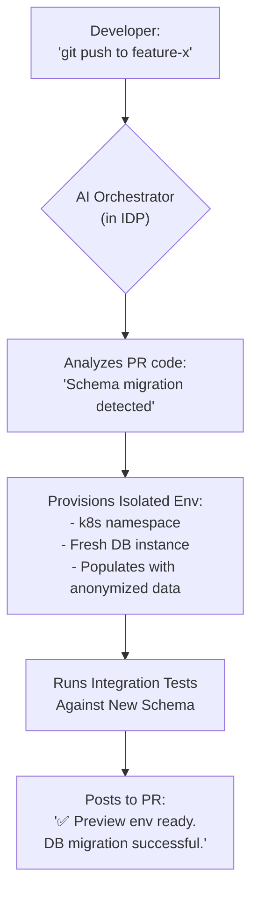

# Platform Engineering 2.0: AI-Powered IDPs & Self-Service Orchestration

Platform engineering has rapidly matured from a niche discipline into a cornerstone of modern software delivery. The goal has always been to reduce developer cognitive load and accelerate the path to production via Internal Developer Platforms (IDPs). But the next evolution is already on the horizon. By 2026, the most effective IDPs won't just be static portals—they will be intelligent, predictive, and conversational, powered by Artificial Intelligence.

This is Platform Engineering 2.0. It's the shift from providing a "paved road" to offering an "intelligent co-pilot" that actively assists developers, optimizes resources, and heals itself.

### What You'll Get

*   **A Vision for 2026:** A clear look at how AI will fundamentally reshape IDPs.
*   **Core AI Capabilities:** Breakdown of intelligent provisioning, self-healing, and dynamic environments.
*   **Practical Examples:** Concrete code snippets and a Mermaid flow diagram illustrating the new reality.
*   **Tangible Business Impact:** How AI-powered platforms directly improve DevEx, efficiency, and innovation.
*   **Challenges to Consider:** A realistic view of the hurdles on the path to an AI-native platform.

## The Evolution: From Paved Roads to Intelligent Co-Pilots

Platform Engineering 1.0, as evangelized by thought leaders like [Martin Fowler](https://martinfowler.com/articles/internal-developer-platform.html), is about creating a reliable, self-service platform that provides developers with the tools and services they need. The IDP acts as the "golden path," offering curated templates, CI/CD pipelines, and infrastructure abstractions. This has been a massive leap forward.

However, this model is largely reactive. A developer still needs to know *what* to ask for—which template to use, what resource size is appropriate, and how to debug a failing pipeline.

Platform Engineering 2.0 injects intelligence into this process. The AI-powered IDP doesn't just fulfill requests; it anticipates needs, provides recommendations, automates complex orchestration, and learns from system behavior. It becomes less of a vending machine and more of a proactive, expert teammate.

## Core Pillars of the AI-Powered IDP

The transformation of IDPs will be driven by several key AI-infused capabilities. These aren't futuristic fantasies; they are the logical extensions of existing AIOps and machine learning technologies being applied directly to the developer workflow.

### Intelligent Resource Provisioning

Today, developers often pick resource sizes from a static list (`small`, `medium`, `large`) or rely on guesswork. This leads to either under-provisioning and performance issues or over-provisioning and wasted cloud spend.

An AI-powered IDP changes the game by analyzing multiple data points to recommend or even automate the *optimal* configuration.

*   **Historical Performance:** It analyzes past CPU/memory usage for similar services.
*   **Code Analysis:** It inspects the application's dependencies and complexity. (e.g., "This service uses a memory-intensive library; I'll recommend a larger memory footprint.")
*   **Cost Policies:** It aligns suggestions with FinOps budgets and company policies.

Imagine a developer defining a new service. Instead of a manual choice, the IDP's manifest might look like this:

```yaml
# service-manifest.yaml
apiVersion: backstage.io/v1alpha1
kind: Component
metadata:
  name: billing-processor
spec:
  type: service
  lifecycle: experimental
  owner: team-alpha
  # AI suggests resources based on service type and code analysis
  resources:
    cpu: "ai.suggest(workload_type='batch-processor')"
    memory: "ai.suggest(criticality='high')"
```

The platform's AI agent resolves these directives into concrete values like `cpu: 250m` and `memory: 512Mi` based on its learned models.

### Dynamic Environment Orchestration

Ephemeral preview environments are a staple of modern DevOps, but their creation is often a scripted, one-size-fits-all process. An intelligent IDP creates *context-aware* environments tailored to the specific change.

A developer pushes a feature branch, and the AI orchestrator takes over. It doesn't just run a script; it understands the *intent* of the change.


This flow, as the [CNCF has explored](https://www.cncf.io/blog/future-of-idp-ai-driven/), transforms the IDP from a simple tool into a core part of the development loop.

### Proactive Self-Healing and AIOps

AIOps is the practice of applying AI to IT operations data. In Platform Engineering 2.0, this capability is baked directly into the platform itself, making it self-healing.

> **Key Shift:** The platform moves from *reacting* to alerts to *predicting* and *preventing* failures.

*   **Anomaly Detection:** The IDP constantly monitors telemetry (logs, metrics, traces). It learns the normal "heartbeat" of the system.
*   **Predictive Scaling:** It notices a gradual increase in request latency and scales up a service *before* the 99th percentile SLO is breached.
*   **Automated Root Cause Analysis:** When an incident does occur, the AI can correlate events across the stack. Instead of an engineer digging through logs, the system presents a hypothesis: "Incident `service-auth-503` is correlated with a recent config change `configmap-xyz` and a spike in DB latency."

### Conversational Interfaces: The Platform as a Teammate

The ultimate user interface is natural language. Instead of navigating complex UIs or memorizing `kubectl` commands, developers can simply *talk* to the platform via Slack, Teams, or a CLI.

This conversational layer, powered by Large Language Models (LLMs), acts as a universal front-end to the platform's APIs.

```bash
# Developer interacting with the platform's bot in Slack

# Requesting a new service
> @PlatformBot create a new Go microservice named 'user-auth' for Team Phoenix.

# Debugging an issue
> @PlatformBot what are the logs for the 'user-auth' service in staging from the last 15 minutes? I'm seeing 500 errors.

# Requesting access
> @PlatformBot I need read-only access to the production database for 'user-auth' to debug a critical issue. Please create a JIRA ticket for approval.
```

## The Tangible Impact: Why This Matters

This evolution isn't just about cool technology. It delivers measurable improvements across the organization.

| Benefit | How AI-Powered IDPs Help | Key Metrics Impacted |
| :--- | :--- | :--- |
| **Enhanced DevEx** | Reduces toil, automates boilerplate, provides instant, context-aware environments. | Developer Velocity, Onboarding Time, Developer Satisfaction. |
| **Operational Efficiency** | Automates incident response, optimizes resource usage, and predicts failures. | Mean Time to Resolution (MTTR), Cloud Spend, Change Failure Rate. |
| **Innovation Velocity** | Frees developers to focus on building features, not wrestling with infrastructure. | Feature Lead Time, Deployment Frequency, Time to Market. |

## The Road to 2026: Challenges and Considerations

Achieving this vision requires careful planning. Organizations must address several key challenges:

*   **Data Quality:** AI models are only as good as the data they are trained on. A solid observability and data collection strategy is a prerequisite.
*   **Building Trust:** Developers and operators need to trust the AI's recommendations. This requires transparency, explainability, and starting with low-risk, high-value use cases.
*   **Security & Guardrails:** The power to orchestrate infrastructure requires robust security. AI actions must be constrained by strict RBAC and policy-as-code (e.g., OPA).
*   **Skills & Expertise:** Platform teams will need skills in MLOps and data engineering to build, train, and maintain these intelligent systems.

## Conclusion: Your Next-Gen Platform Awaits

The future of platform engineering is intelligent. The IDP is evolving from a static service catalog into a dynamic, learning system that actively participates in the software lifecycle. By embracing AI for resource provisioning, environment orchestration, self-healing, and conversational control, organizations can unlock unprecedented levels of developer productivity and operational excellence. The journey starts now by building a solid foundation of automation and observability.

The question for every platform leader is no longer *if* AI will reshape their platform, but *how* they will architect it.

What do you envision as the most impactful feature of an AI-powered IDP?


## Further Reading

- [https://platformengineering.org/blog/ai-and-platform-engineering](https://platformengineering.org/blog/ai-and-platform-engineering)
- [https://www.cncf.io/blog/future-of-idp-ai-driven/](https://www.cncf.io/blog/future-of-idp-ai-driven/)
- [https://martinfowler.com/articles/internal-developer-platform.html](https://martinfowler.com/articles/internal-developer-platform.html)
- [https://www.infoq.com/articles/ai-for-platform-engineers/](https://www.infoq.com/articles/ai-for-platform-engineers/)
- [https://www.forbes.com/sites/ai-platform-engineering-2026/](https://www.forbes.com/sites/ai-platform-engineering-2026/)
