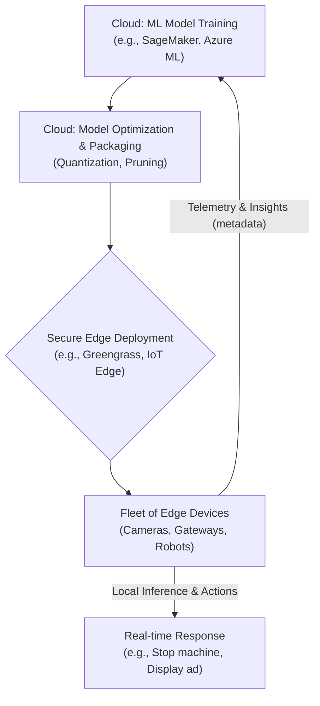

# AI on the Edge: Next-Gen Compute Beyond the Datacenter

For years, the story of Artificial Intelligence has been a story of the cloud. Massive datasets and power-hungry models were trained and executed in centralized datacenters. But that paradigm is shifting. The next wave of innovation isn't just in the cloud; it's happening at the edge—on factory floors, in retail stores, and within our cities. Welcome to the era of Edge AI, where intelligence is moving closer to the source of data.

This isn't about replacing the cloud. It's about extending it. Major cloud providers like AWS and Azure are now aggressively building services that bridge the datacenter and the billions of connected devices at the periphery. This enables a new class of applications that demand real-time responses and data sovereignty.

### What You'll Get

In this article, we'll cut through the hype and give you a practitioner's view of Edge AI. You'll get:

*   **The Core Drivers:** Why Edge AI is becoming critical.
*   **The Cloud-to-Edge Bridge:** How AWS and Azure are enabling this shift.
*   **Real-World Use Cases:** Concrete examples of Edge AI in action today.
*   **A High-Level Workflow:** A Mermaid diagram illustrating the Edge AI lifecycle.
*   **The Road Ahead:** Key challenges and what to expect next.

---

## The "Why": Drivers of the Edge AI Revolution

The move to the edge is driven by fundamental physical and business limitations of a cloud-only approach. When milliseconds matter and data privacy is non-negotiable, processing data at its origin is the only viable solution.

### Low Latency for Real-Time Action

For applications like industrial robotics, autonomous vehicles, or AR/VR, the round-trip time to a distant datacenter is simply too long.

*   **Industrial Safety:** An AI-powered camera on an assembly line must detect a safety hazard and halt machinery *instantly*, not hundreds of milliseconds later.
*   **Interactive Experiences:** A smart mirror in a retail store needs to respond to a customer's gestures without perceptible lag.

> **Edge AI eliminates the network round-trip, reducing latency from seconds or hundreds of milliseconds to mere milliseconds.**

### Data Privacy and Security

Sending raw data, especially sensitive information like video feeds or personal health data, to the cloud introduces risk. Edge AI allows for on-device processing.

*   **Anonymization:** A smart camera can perform object detection locally, sending only anonymous metadata (e.g., "3 people detected") to the cloud, while the raw video is discarded.
*   **Compliance:** Regulations like GDPR and HIPAA create strong incentives to minimize data movement and process personal information locally.

### Bandwidth and Cost Efficiency

Continuously streaming high-fidelity data from thousands of sensors or cameras to the cloud is often economically and technically infeasible.

*   **Predictive Maintenance:** An acoustic sensor on a generator can analyze audio patterns locally. It only needs to send a small alert to the cloud when it detects an anomaly, instead of streaming 24/7 audio.
*   **Reduced Cloud Spend:** By pre-processing and filtering data at the edge, organizations drastically reduce data ingestion, storage, and processing costs in the cloud.

---

## The "How": Cloud Giants Extending to the Edge

Cloud providers aren't being replaced by the edge; they are enabling it. They provide the tools to manage the entire lifecycle: training models in the cloud, optimizing them, deploying them securely to a fleet of devices, and monitoring their performance.

This hybrid model combines the massive computational power of the cloud for training with the low-latency responsiveness of the edge for inference.



### AWS IoT & Edge Services

AWS offers a mature ecosystem for deploying AI to the edge.

*   **AWS IoT Greengrass:** An edge runtime and cloud service that helps you build, deploy, and manage device software. You can deploy Lambda functions, Docker containers, and ML models directly to devices.
*   **Amazon SageMaker Edge Manager:** A dedicated service to optimize, secure, monitor, and maintain ML models on fleets of edge devices. It helps reduce the footprint of trained models to fit on resource-constrained hardware.

### Microsoft Azure IoT & AI Edge

Microsoft Azure provides a powerful and integrated set of tools for developing and managing edge AI solutions.

*   **Azure IoT Edge:** A fully managed service that allows you to deploy cloud workloads—including AI, Azure services, and custom logic—to run directly on IoT devices. It uses containerized modules for easy deployment.
*   **Azure Machine Learning:** Integrates with IoT Edge to manage the end-to-end lifecycle, from training models in the cloud to packaging them into containers for edge deployment.

| Feature | Cloud AI | Edge AI |
| :--- | :--- | :--- |
| **Latency** | High (network-dependent) | Ultra-low (local processing) |
| **Data Privacy** | Data sent to cloud for processing | Data can remain on-device |
| **Bandwidth** | High requirement for raw data | Low requirement (sends metadata) |
| **Connectivity** | Requires constant, stable internet | Can operate offline or intermittently |
| **Model Complexity** | Can run large, complex models | Requires optimized, lightweight models |
| **Hardware** | Virtually unlimited compute | Constrained by device hardware |

---

## The "What": Real-World Edge AI in Action

Edge AI isn't theoretical; it's already creating value across multiple industries.

### Smart Cities

Municipalities are using edge AI to improve efficiency and public safety.

*   **Intelligent Traffic Management:** Edge devices at intersections analyze video feeds in real time to optimize traffic light timing, reducing congestion and emergency vehicle response times.
*   **Public Safety:** On-device analytics can detect anomalies like fallen persons or unauthorized access in restricted areas, triggering immediate alerts without streaming sensitive video 24/7.

### Industrial Automation (IIoT)

In manufacturing, edge AI is the cornerstone of Industry 4.0.

*   **Predictive Maintenance:** Vibration and acoustic sensors on machinery run ML models to predict failures *before* they happen, preventing costly downtime.
*   **Automated Quality Control:** Cameras on a production line use computer vision models to spot microscopic defects in real time, far faster and more accurately than human inspectors.

A simplified code example shows how a lightweight model might be used on a device.

```python
# Example: Using a TFLite model for inference on an edge device
import tflite_runtime.interpreter as tflite
import numpy as np

# Load the optimized TFLite model and allocate memory
interpreter = tflite.Interpreter(model_path="defect_detector.tflite")
interpreter.allocate_tensors()

# Get input and output tensor details
input_details = interpreter.get_input_details()
output_details = interpreter.get_output_details()

def inspect_part(image_data: np.ndarray):
    """Runs inference on a product image to check for defects."""
    # Pre-process image_data to match model input
    interpreter.set_tensor(input_details[0]['index'], image_data)

    # Run inference
    interpreter.invoke()

    # Get results
    output_data = interpreter.get_tensor(output_details[0]['index'])
    defect_probability = np.squeeze(output_data)

    if defect_probability > 0.95:
        return "DEFECT_DETECTED"
    return "OK"
```

### Personalized Retail

Brick-and-mortar stores are using edge AI to compete with e-commerce by creating smarter, more responsive shopping experiences.

*   **Real-Time Shelf Monitoring:** Cameras with on-board processing monitor shelves to detect when products are out of stock, instantly notifying staff to restock.
*   **Frictionless Checkout:** Systems like Amazon Go use a network of cameras and sensors with edge processing to track what customers take, allowing them to walk out without a traditional checkout.

---

## The Road Ahead: Challenges and Opportunities

The path to widespread Edge AI adoption isn't without its challenges.

*   **Model Optimization:** Large AI models trained in the cloud must be drastically shrunk to run on resource-constrained edge devices. Techniques like *quantization* (reducing numerical precision) and *pruning* (removing unnecessary model parameters) are essential.
*   **Hardware Heterogeneity:** The edge is a diverse landscape of CPUs, GPUs, FPGAs, and specialized AI accelerators (NPUs). Managing deployments across this varied hardware is complex.
*   **Security and Fleet Management:** Securing and updating thousands or even millions of devices in the field is a massive operational challenge. A single compromised device could be a gateway into a network.

Gartner predicts that by 2027, over 50% of enterprise-managed data will be created and processed outside the datacenter or cloud. This underscores the urgency and opportunity in mastering the edge.

The future is a hybrid one, where the power of centralized cloud training meets the immediacy of decentralized edge inference. As hardware becomes more powerful and software frameworks mature, the line between the edge and the cloud will continue to blur, unlocking applications we can only begin to imagine.

**What about you? What are the most innovative Edge AI applications you envision by 2026? What challenges do you believe will be the hardest to overcome? Share your thoughts below.**


## Further Reading

- [https://aws.amazon.com/iot/edge-ai-solutions/](https://aws.amazon.com/iot/edge-ai-solutions/)
- [https://azure.microsoft.com/en-us/solutions/ai-edge/](https://azure.microsoft.com/en-us/solutions/ai-edge/)
- [https://www.gartner.com/trends/edge-ai-predictions-2026](https://www.gartner.com/trends/edge-ai-predictions-2026)
- [https://ieee.org/future-of-edge-ai-privacy/](https://ieee.org/future-of-edge-ai-privacy/)
- [https://techcrunch.com/2026/03/edge-ai-enterprise-adoption](https://techcrunch.com/2026/03/edge-ai-enterprise-adoption)
