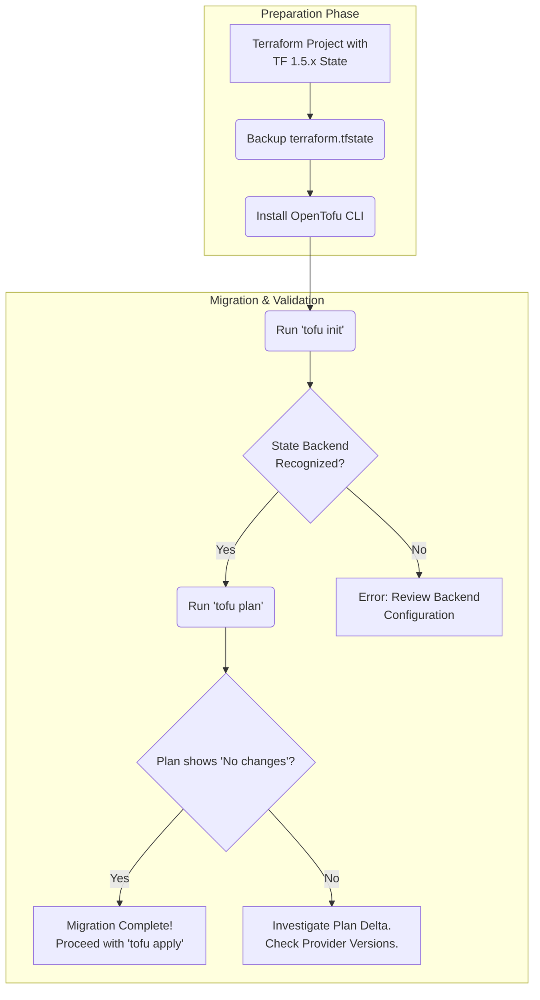

# OpenTofu's Maturity: The Terraform Alternative's Rise in 2026

It's March 2026, and the infrastructure as code (IaC) landscape looks significantly different than it did just a few years ago. The fork that started as a community reaction has evolved into a formidable, production-grade tool. OpenTofu, now governed by the Linux Foundation, has firmly established itself not just as a "drop-in replacement" for Terraform, but as an innovative platform in its own right.

For DevOps professionals, platform engineers, and SREs who have watched its journey, OpenTofu's maturity is a testament to the power of open-source collaboration. It has moved beyond simply maintaining compatibility and now pioneers features that address long-standing community requests.

### What You'll Get

This article explores the state of OpenTofu in 2026. We will cover:
*   **The Evolution:** How OpenTofu transitioned from a reactive fork to a proactive, feature-rich IaC tool.
*   **Key Differentiators:** A deep dive into the unique features that now define OpenTofu.
*   **Migration & Ecosystem:** The current state of migrating from Terraform and the robust ecosystem surrounding OpenTofu.
*   **Head-to-Head:** A direct comparison of the OpenTofu and Terraform platforms as they stand today.

---

## The Journey to Maturity: From Fork to Foundation

OpenTofu's story began in August 2023, following HashiCorp's controversial switch from the Mozilla Public License (MPL) to the Business Source License (BUSL) for Terraform. What started as the "OpenTF" manifesto quickly gained backing from major industry players and was placed under the stewardship of the Linux Foundation, ensuring its governance remained open and community-driven.

The initial goal was simple: provide a stable, MPL-licensed, and backward-compatible alternative. The first GA release, `v1.6.0`, achieved this, delivering on the promise of a seamless transition. However, the real work began afterward. The releases that followed, from `v1.7.0` through the current `v2.x` series, have been defined by three core principles:

*   **Community-Driven Features:** Prioritizing features long requested by the IaC community.
*   **Predictable Releases:** Maintaining a transparent and reliable release cadence.
*   **Open Governance:** Ensuring all decisions, from technical direction to registry management, are made in the open.

This approach has fostered a vibrant ecosystem of contributors, module developers, and third-party tool integrations, solidifying OpenTofu's position as a reliable pillar of modern infrastructure management.

## Key Features Distinguishing OpenTofu in 2026

While maintaining CLI compatibility, OpenTofu has introduced several powerful features that provide significant quality-of-life improvements and security enhancements.

### Client-Side State Encryption

One of the earliest and most celebrated additions, first introduced in `v1.6.0`, is end-to-end encryption for state files. Previously, state file encryption was solely the responsibility of the backend (e.g., S3 bucket encryption). OpenTofu allows you to encrypt the state *before* it leaves the CLI.

> **Info Block:** This feature is a major security win. It ensures that even if your storage backend is misconfigured or compromised, the sensitive data within your state file remains unreadable without the decryption key.

Here's how simple it is to configure in your backend block:

```hcl
terraform {
  backend "s3" {
    bucket         = "my-opentofu-state-bucket"
    key            = "prod/terraform.tfstate"
    region         = "us-east-1"
    encrypt        = true # Standard S3 server-side encryption
    
    # OpenTofu-specific client-side encryption
    client_side_encryption {
      key_id = "arn:aws:kms:us-east-1:123456789012:key/your-kms-key-id"
    }
  }
}
```

### Parameterizable Backends and Providers

A long-standing request from the community was the ability to use variables within backend and provider configurations. OpenTofu delivered this, dramatically simplifying configuration reuse across different environments. You no longer need to rely on wrapper scripts or templating tools to switch backends.

```hcl
# main.tf
terraform {
  required_providers {
    aws = {
      source = "hashicorp/aws"
      version = "~> 5.0"
    }
  }

  backend "s3" {
    # No hardcoded values here!
  }
}

provider "aws" {
  # Provider configuration can also be parameterized
}
```

You can now initialize OpenTofu with backend configuration passed via the command line, making CI/CD pipelines much cleaner.

```bash
tofu init \
  -backend-config="bucket=my-app-state-${var.environment}" \
  -backend-config="key=infra.tfstate" \
  -backend-config="region=us-west-2"
```

### State Management and Observability Hooks

Recognizing that the state file is a critical component, OpenTofu has introduced state observability hooks. These allow you to trigger actions based on state-file read and write events. This has unlocked powerful new workflows:
*   **Audit Trails:** Automatically log every state change to a security information and event management (SIEM) system.
*   **Real-time Metrics:** Push metrics about state file size, resource count, and apply duration to monitoring platforms like Prometheus or Datadog.
*   **Break-Glass Alerts:** Trigger immediate alerts if a critical resource (like a production database) is modified in the state.

This functionality is configured outside of HCL, typically within a CI/CD pipeline's execution environment, keeping your IaC logic clean.

---

## Migration and Ecosystem Integration

For many, the decision to switch hinges on the migration path and the health of the surrounding ecosystem. By 2026, both are mature and straightforward.

### The Migration Path

Migrating from a compatible Terraform version (generally `1.5.x` or `1.6.x`) to OpenTofu remains a simple, low-risk process. The core steps have not changed:
1.  **Install OpenTofu:** Download and install the `tofu` binary.
2.  **Backup State:** Always back up your Terraform state file before making any changes.
3.  **Run `tofu init`:** OpenTofu will recognize the existing `.terraform` directory and state file and configure itself accordingly.
4.  **Run `tofu plan`:** Verify that OpenTofu reads your state and configuration correctly. The plan should show no changes.

The workflow is visualized below:



### The OpenTofu Registry

The public OpenTofu Registry has flourished. It's a fully independent, community-managed repository for providers and modules. Major cloud providers like AWS, Google Cloud, and Azure, along with countless other vendors, now publish their providers directly to the OpenTofu Registry. This eliminates any upstream dependency on HashiCorp's infrastructure for core functionality.

Finding and using modules is as simple as it ever was, with a `source` address pointing to the OpenTofu registry.

## OpenTofu vs. Terraform: The 2026 Landscape

The fundamental divergence between the two tools is now clear, moving beyond licensing to philosophy and features. The choice between them involves distinct trade-offs.

| Feature / Aspect | OpenTofu (as of March 2026) | Terraform (as of March 2026) |
| :--- | :--- | :--- |
| **License** | Mozilla Public License v2.0 (MPL 2.0) | Business Source License v1.1 (BUSL) |
| **Governance** | Community-driven via the Linux Foundation | Corporate-driven by HashiCorp |
| **Core Differentiators** | Client-side state encryption, parameterizable backends, state observability hooks | Focus on integration with HashiCorp Cloud Platform (HCP), private registry, and enterprise features |
| **Registry** | Free and open public registry | Public registry with paid tiers for advanced features (HCP) |
| **Enterprise Support** | Available through various third-party vendors and consultancies | Primarily offered directly by HashiCorp |
| **Feature Velocity** | Rapid, community-led innovation on core workflow and security | Stable, with major new features often tied to the commercial HashiCorp Cloud offerings |

---

## A New Chapter for IaC

In 2026, OpenTofu is no longer just the "open source Terraform." It is a mature, innovative, and community-governed tool that has earned its place in production environments worldwide. Its development path, driven by direct user feedback, has resulted in a tool that is both powerful and pragmatic.

While Terraform continues to be a strong player, especially for enterprises deeply invested in the HashiCorp ecosystem, OpenTofu presents a compelling, open alternative for teams who prioritize community governance, extensibility, and security enhancements. The competition has ultimately been healthy for the entire IaC space.

Now, over to you. **What has been your experience with OpenTofu in production? Have the community-driven features influenced your decision to adopt it?** Share your thoughts and experiences.


## Further Reading

- [https://opentofu.org/docs/2026-roadmap](https://opentofu.org/docs/2026-roadmap)
- [https://www.hashicorp.com/blog/terraform-vs-opentofu](https://www.hashicorp.com/blog/terraform-vs-opentofu)
- [https://github.com/opentofu/opentofu/releases/tag/v1.7.0](https://github.com/opentofu/opentofu/releases/tag/v1.7.0)
- [https://infoq.com/articles/opentofu-enterprise-adoption/](https://infoq.com/articles/opentofu-enterprise-adoption/)
- [https://dev.to/community/opentofu-migration-guide](https://dev.to/community/opentofu-migration-guide)
- [https://cloudnative.net/opentofu-cloud-integration](https://cloudnative.net/opentofu-cloud-integration)
