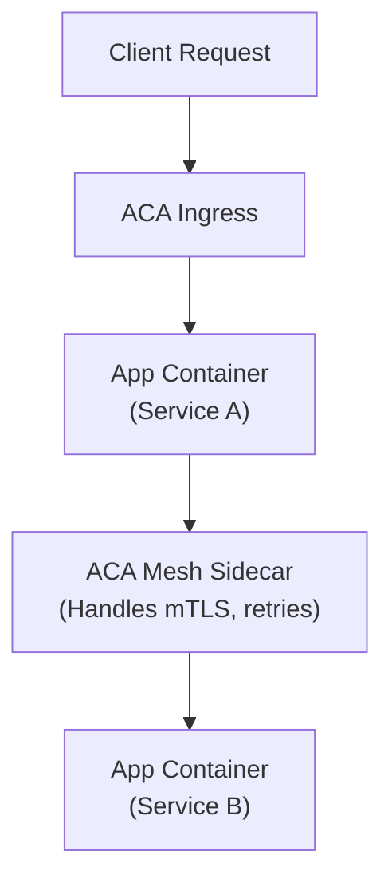
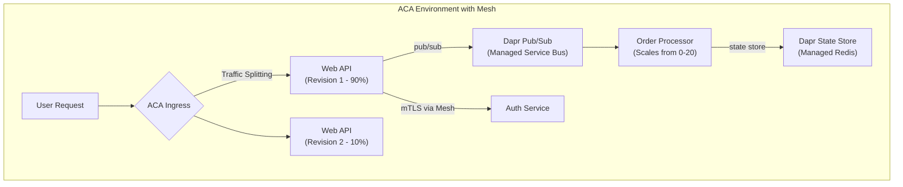

# Azure Container Apps: Simplifying Microservices in 2026

The microservices landscape has always been a battleground of complexity versus scalability. For years, developers have wrestled with orchestrators, service meshes, and observability tooling, often spending more time on plumbing than on business logic. By 2026, Azure Container Apps (ACA) has matured from a promising abstraction into an intelligent, opinionated platform that finally delivers on the promise of simplified microservice development and management.

This article dives into the latest advancements in Azure Container Apps as of April 2026. We'll explore how its new, deeply integrated features are fundamentally changing the way we build and deploy cloud-native applications.

### What You'll Get

*   **Native Service Mesh:** A look at the new, fully managed Azure Container Apps Mesh.
*   **Managed Dapr APIs:** How Dapr has evolved from a sidecar to a first-class managed citizen.
*   **Intelligent Scaling:** An overview of AI-powered predictive scaling and custom business metric triggers.
*   **Developer Experience:** Enhancements in GitOps, local development, and environment management.
*   **A 2026 Architecture:** A complete diagram and breakdown of a modern ACA application.

---

## The Evolution: From Abstraction to Intelligence

Initially, Azure Container Apps won hearts by abstracting away the complexities of Kubernetes. You got pods (revisions), scaling (KEDA), and ingress (Envoy) without ever writing a line of `YAML` for `kube-system`.

By 2026, this abstraction has evolved into an *intelligent platform*. Instead of just hiding the details, ACA now provides managed, natively integrated solutions for the hardest parts of distributed systems: security, state management, and traffic control. The focus has shifted from *hiding complexity* to *providing managed capability*.

> According to the [official 2026 roadmap](https://techcommunity.microsoft.com/blog/container-apps-roadmap-2026), the platform's goal is to "eliminate boilerplate infrastructure decisions, allowing teams to focus 100% on application-level logic."

## Native Service Mesh Integration

The most significant update is the general availability of the **Azure Container Apps Mesh**. Previously, implementing a service mesh required bringing your own (like Linkerd or Istio) and managing its lifecycle. This is no longer the case.

### What is the Azure Container Apps Mesh?

The ACA Mesh is a fully managed, transparent service mesh built on Envoy and integrated directly into the ACA control plane. It requires zero configuration to get started and provides three critical capabilities out of the box.

*   **Zero-Trust Security:** Automatic mutual TLS (mTLS) between all container apps within an environment. No manual certificate management is needed.
*   **Advanced Traffic Control:** Fine-grained traffic splitting for canary and A/B testing, fault injection for chaos engineering, and timeout/retry policies.
*   **Unified Observability:** The mesh automatically emits detailed metrics, logs, and traces, which are seamlessly integrated into Azure Monitor and Application Insights.

Here's a simplified flow of a request with the mesh enabled:



This built-in capability drastically simplifies securing inter-service communication, a major pain point in traditional microservice architectures. For more details, see the [Azure Service Mesh preview documentation](https://microsoft.com/azure-service-mesh-preview).

## Dapr: Now a First-Class Managed Citizen

Dapr has always been a key feature of ACA, but its 2026 integration takes it to a new level. The focus has moved beyond simply enabling the Dapr sidecar to providing a fully managed experience for Dapr's building block APIs.

### Beyond the Sidecar: Managed Dapr APIs

You no longer need to provision and manage the backing infrastructure for common Dapr components. When you define a Dapr component, you can now select a "Managed" tier.

*   **Managed State Store:** Choose a managed, serverless Redis or Cosmos DB instance provisioned and scaled by ACA.
*   **Managed Pub/Sub:** Utilize a managed Azure Service Bus or Event Grid topic without configuring the backing resource yourself.
*   **Managed Secrets:** Tighter integration with Azure Key Vault, where secrets are automatically refreshed in the Dapr sidecar.

This means your component definition becomes radically simpler.

```yaml
# Dapr component file: pubsub.yaml
apiVersion: dapr.io/v1alpha1
kind: Component
metadata:
  name: order-pubsub
spec:
  type: pubsub.azure.servicebus # Still specify the type
  version: v1
  metadata:
    # No connection strings or secrets needed here!
    # The ACA environment provides the connection.
  - name: tier
    value: "managed" # The new magic property
```

This approach is a game-changer for developer velocity and operational security. You can read more about these best practices at the [Cloud Native Foundations portal](https://www.cloudnativefoundations.org/azure-aca-best-practices).

## Intelligent Scaling with AI and Business Metrics

KEDA has provided event-driven scaling from day one, but the triggers have become far more sophisticated.

### Predictive Autoscaling

Leveraging Azure's machine learning capabilities, you can now enable **predictive autoscaling**. By analyzing historical traffic patterns and metric data over a period (e.g., 14 days), ACA can proactively scale out your application *before* a predicted spike in traffic, reducing cold starts and improving responsiveness. This is a simple toggle in the scaling rules.

### Scaling on Your Terms

The integration with Azure Monitor is now deeper. You can create KEDA scalers that react to any custom metric or log query in Azure Monitor. This allows you to scale based on true business metrics, not just technical ones.

Imagine scaling a video processing service based on the number of "jobs pending" reported by your application's custom telemetry.

```bicep
// Example Bicep for a custom Azure Monitor scaler
resource containerApp 'Microsoft.App/containerApps@2026-04-01' = {
  // ... other properties
  properties: {
    template: {
      // ...
      scale: {
        minReplicas: 1
        maxReplicas: 20
        rules: [
          {
            name: 'pending-video-jobs'
            custom: {
              type: 'azure-monitor'
              metadata: {
                tenantId: subscription().tenantId
                resourceURI: 'Microsoft.Insights/components/my-app-insights'
                metricName: 'customMetrics/pendingJobs'
                metricAggregationType: 'Sum'
                metricFilter: "jobType eq 'video-high-priority'"
                targetValue: '10' // Scale up when more than 10 pending jobs
              }
              auth: [
                {
                  secretRef: 'monitor-auth'
                  triggerParameter: 'activeDirectoryClientSecret'
                }
              ]
            }
          }
        ]
      }
    }
  }
}
```

## Putting It All Together: A 2026 Architecture

Let's visualize how these components work together in a typical e-commerce backend. A user request comes in, a new order is published to a topic, and a separate service processes it, scaling on demand.



This architecture is powerful, secure, and scalable, yet the amount of infrastructure code and management overhead required from the development team is minimal.

### Pros and Cons of the 2026 ACA Model

| Pros | Cons |
| :--- | :--- |
| ✅ **Extreme Simplicity:** Abstracted infrastructure lets teams focus on code. | ⚠️ **Opinionated Platform:** Less flexibility than raw Kubernetes. |
| ✅ **Managed Security:** mTLS and secret management are built-in. | ⚠️ **Potential for Vendor Lock-in:** Deep integration with Azure services. |
| ✅ **Cost-Effective:** Scale-to-zero is default for event-driven services. | ⚠️ **Learning Curve:** Developers must understand the ACA model, not just containers. |
| ✅ **Powerful Integrations:** Dapr, KEDA, and the Mesh work together seamlessly. | ⚠️ **Abstraction Leaks:** For deep debugging, understanding the underlying tech can still be necessary. |

## Conclusion

By 2026, Azure Container Apps has delivered a platform that feels like the next logical step in the evolution of PaaS. By providing managed, intelligent solutions for service mesh, Dapr, and scaling, it removes entire categories of problems that have plagued microservice development for over a decade. It strikes a powerful balance between developer-friendly abstraction and cloud-native capability.

The platform isn't a silver bullet, but for teams looking to build robust, scalable microservices without a dedicated platform engineering team, ACA has become the definitive choice on Azure.

Now, I'm curious to hear from you. What are your biggest microservice deployment challenges today, and how could these advancements help you solve them?


## Further Reading

- [https://azure.microsoft.com/en-us/products/container-apps/whats-new-2026](https://azure.microsoft.com/en-us/products/container-apps/whats-new-2026)
- [https://learn.microsoft.com/en-us/azure/container-apps/overview](https://learn.microsoft.com/en-us/azure/container-apps/overview)
- [https://techcommunity.microsoft.com/blog/container-apps-roadmap-2026](https://techcommunity.microsoft.com/blog/container-apps-roadmap-2026)
- [https://www.cloudnativefoundations.org/azure-aca-best-practices](https://www.cloudnativefoundations.org/azure-aca-best-practices)
- [https://devopstoday.com/azure-container-apps-dapr-integration](https://devopstoday.com/azure-container-apps-dapr-integration)
- [https://microsoft.com/azure-service-mesh-preview](https://microsoft.com/azure-service-mesh-preview)
