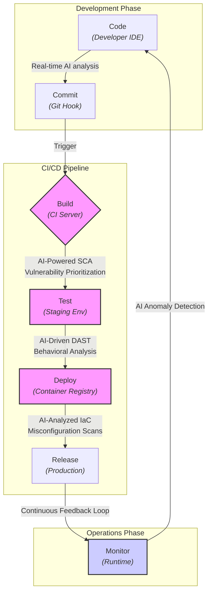

# DevSecOps Shift Left 2.0: AI-Powered Security in the CI/CD Pipeline

The original "Shift Left" movement was a paradigm shift, pushing security testing from a late-stage, pre-production gate to an earlier, integrated part of the development lifecycle. While revolutionary, this first wave often led to tool sprawl, alert fatigue, and friction between development and security teams. Today, we're entering a new phase: **Shift Left 2.0**, where Artificial Intelligence (AI) and Machine Learning (ML) are not just adding more checks, but are fundamentally changing *how* we secure our software from the very first line of code.

This article explores the evolution of DevSecOps, focusing on how AI is creating a more intelligent, proactive, and developer-friendly security posture within the modern CI/CD pipeline.

### What You'll Get

*   An understanding of the evolution from traditional "Shift Left" to AI-powered "Shift Left 2.0".
*   A visual breakdown of where AI tools integrate into the CI/CD pipeline.
*   Specific examples of how AI enhances vulnerability detection, from the IDE to deployment.
*   A look at the key tools and methodologies driving this change.
*   Insight into what the future holds for DevSecOps professionals by 2026.

---

## From Scheduled Scans to Intelligent Automation

The core challenge of the original Shift Left approach was a signal-to-noise problem. Developers were inundated with findings from static analysis (SAST) and software composition analysis (SCA) tools, many of which were low-priority or false positives. This created a bottleneck, defeating the very purpose of agile development.

### The Limits of Traditional 'Shift Left'

*   **Alert Fatigue:** Overwhelming developers with a high volume of low-context security alerts, leading them to be ignored.
*   **High False Positives:** Traditional scanners often lack the context of the application's data flow, flagging unreachable or non-exploitable code paths.
*   **Manual Triage:** Security teams spend significant time manually validating, prioritizing, and assigning findings, slowing down the entire process.
*   **Siloed Knowledge:** Security expertise remains concentrated within the security team, rather than being embedded in the development workflow.

### The Promise of 'Shift Left 2.0'

AI introduces context and intelligence into the process. Instead of just finding *potential* issues, AI-powered tools aim to find *probable threats* and provide actionable, in-context guidance. This transforms security from a reactive checklist to a proactive, predictive discipline. According to a [Gartner report](https://www.gartner.com/en/articles/ai-in-devsecops-2026-report), AI will be integral to over 70% of DevSecOps pipelines by 2026, primarily to enhance threat detection and reduce human error.

> **Key Takeaway:** Shift Left 2.0 is not about scanning *more*; it's about scanning *smarter*. It prioritizes actionable intelligence over raw data volume.

## Supercharging Security at Every Stage

AI's impact is felt across the entire CI/CD pipeline, transforming each stage from a simple execution step into an opportunity for intelligent security validation.

Here is a high-level view of how AI security tools fit into a modern pipeline:



### Pre-Commit: The Intelligent IDE

The earliest point of intervention is on the developer's machine. AI is turning the IDE into a proactive security partner.

*   **Real-time Suggestions:** Tools like GitHub Copilot (with security filters) and Snyk's IDE plugins analyze code as it's written, flagging potential vulnerabilities like SQL injection or insecure deserialization.
*   **Automated Fixes:** Beyond just detection, these tools often suggest secure code replacements, teaching developers best practices in real-time.

Consider this vulnerable Java code snippet:

```java
// Vulnerable: Direct use of user input in a query
String query = "SELECT * FROM users WHERE username = '" + request.getParameter("username") + "'";
Statement statement = connection.createStatement();
ResultSet results = statement.executeQuery(query);
```

An AI-powered IDE plugin would immediately flag this line, explain the risk of SQL injection, and suggest the corrected, parameterized query:

```java
// Secure: Using a PreparedStatement
String query = "SELECT * FROM users WHERE username = ?";
PreparedStatement statement = connection.prepareStatement(query);
statement.setString(1, request.getParameter("username"));
ResultSet results = statement.executeQuery();
```

### Commit & Build: Context-Aware Scanning

During the build phase, AI enhances traditional SAST and SCA tools by adding crucial context.

*   **AI-Powered SAST:** Instead of just matching patterns, these tools build a model of the application's code paths. This allows them to determine if a vulnerability is actually reachable and exploitable, drastically reducing false positives.
*   **Intelligent SCA:** AI-driven SCA goes beyond simply checking a dependency's version against a CVE database. It analyzes how the dependency is used, whether the vulnerable function is called, and identifies transitive dependencies that pose a risk.

| Feature | Traditional SCA | AI-Powered SCA |
| :--- | :--- | :--- |
| **Vulnerability Source** | Relies solely on public databases (NVD). | Cross-references public, private, and ML-inferred data. |
| **Prioritization** | Based on CVSS score alone. | Considers CVSS, exploitability, and code context. |
| **Transitive Dependencies** | Often provides a flat, noisy list. | Maps the full dependency tree and prioritizes direct risks. |
| **Remediation** | Suggests upgrading to the latest version. | Suggests the *minimal secure version* to avoid breaking changes. |

### Test & Deploy: Predictive Threat Modeling

In later stages, AI helps predict and prevent issues before they reach production.

*   **Infrastructure as Code (IaC) Analysis:** AI models trained on best practices from sources like the [Cloud Security Alliance](https://cloudsecurityalliance.org/research/ai-driven-security/) can scan Terraform or CloudFormation scripts to predict potential misconfigurations (e.g., publicly-open S3 buckets, overly permissive IAM roles).
*   **AI-Driven DAST:** Modern DAST tools use AI to learn an application's normal behavior. They can then launch intelligent, targeted tests that mimic real-world attack patterns, uncovering complex business logic flaws that traditional scanners would miss.

## Key AI-Powered Methodologies and Tools

The market for AI-driven security tools is rapidly expanding. Practitioners should focus on tools that provide clear, context-rich, and actionable feedback directly within the developer workflow.

| Tool Category | How AI is Used | Example Tool(s) |
| :--- | :--- | :--- |
| **AI-assisted SAST** | Prioritizes findings, understands data flow, reduces false positives. | Snyk Code, Veracode Static Analysis, CodeQL |
| **AI-powered SCA** | Analyzes reachability of vulnerable code in dependencies. | Snyk Open Source, GitHub Advanced Security |
| **IaC Security** | Predicts cloud misconfigurations from code. | Checkov, Prisma Cloud by Palo Alto Networks |
| **Runtime Protection** | Establishes baseline behavior and detects anomalies. | Datadog Cloud Security, CrowdStrike Falcon |

---

## The DevSecOps Engineer of 2026

The rise of AI will reshape the role of the DevSecOps professional. The focus will shift away from manual tool configuration and alert triage towards more strategic, high-impact work.

By 2026, a DevSecOps engineer's primary responsibilities will include:
*   **AI Model Curation:** Fine-tuning the ML models that power security tools to better understand the organization's specific codebase and risk appetite.
*   **Automated Governance:** Building and managing automated security policies that the AI can enforce throughout the CI/CD pipeline.
*   **Architectural Review:** Focusing on secure design patterns and threat modeling for new systems, leaving routine vulnerability detection to the AI.
*   **Developer Enablement:** Acting as a consultant who helps development teams interpret complex AI-driven findings and integrate security seamlessly.

As the [OWASP DevSecOps Guideline](https://owasp.org/www-project-devsecops-guide-2026/) project anticipates, the future is about creating a "security-as-code" culture where intelligent automation handles the bulk of the tactical work.

## Getting Started with AI in Your Pipeline

Adopting AI-powered security doesn't require a complete overhaul of your pipeline. The journey to Shift Left 2.0 is an iterative one.

1.  **Start with One Stage:** Introduce an AI-powered tool at a single point in your pipeline, such as an intelligent SCA scanner in your build process.
2.  **Measure the Impact:** Track metrics like the reduction in false positives, the mean time to remediation (MTTR) for critical vulnerabilities, and developer feedback.
3.  **Integrate, Don't Obstruct:** Ensure the tool's feedback is delivered directly in the developer's environment (e.g., as a pull request comment) to avoid context switching.
4.  **Expand and Automate:** Once you've proven the value, expand to other stages, like adding a DAST tool in your testing environment or an IDE plugin for developers.

The AI-driven transformation of DevSecOps is here. By embracing these intelligent tools, we can finally deliver on the original promise of Shift Left: building more secure software, faster, and with less friction.

***

Now it's your turn. **What's the biggest security challenge in your current CI/CD setup?** Share your thoughts and experiences.


## Further Reading

- [https://owasp.org/www-project-devsecops-guide-2026/](https://owasp.org/www-project-devsecops-guide-2026/)
- [https://www.gartner.com/en/articles/ai-in-devsecops-2026-report](https://www.gartner.com/en/articles/ai-in-devsecops-2026-report)
- [https://snyk.io/blog/shift-left-security-ai-automation/](https://snyk.io/blog/shift-left-security-ai-automation/)
- [https://cloudsecurityalliance.org/research/ai-driven-security](https://cloudsecurityalliance.org/research/ai-driven-security)
- [https://infoq.com/devsecops-ai-driven-future](https://infoq.com/devsecops-ai-driven-future)
- [https://veracode.com/state-of-software-security-2026](https://veracode.com/state-of-software-security-2026)
