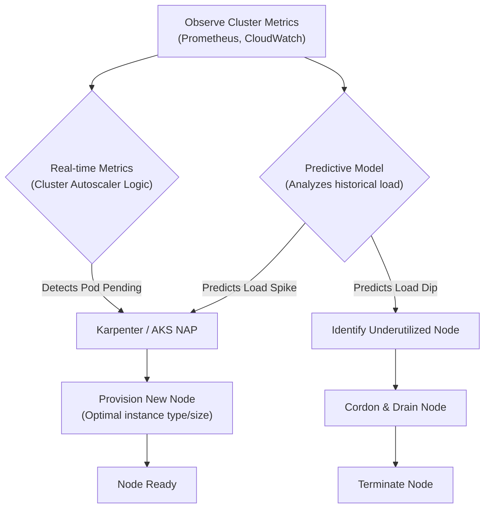
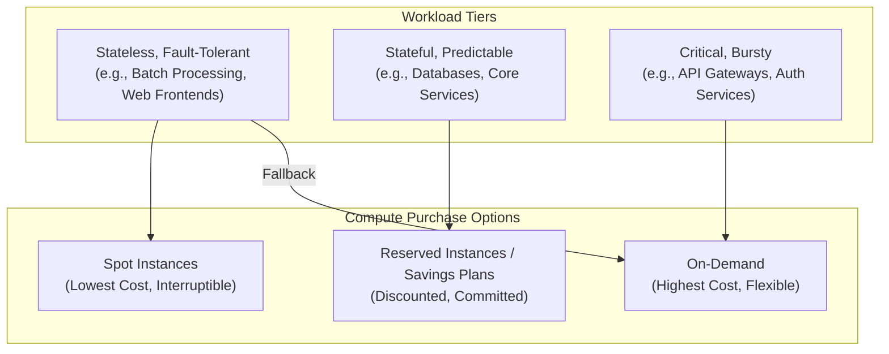

# Kubernetes Cost Optimization: Smart Strategies for AWS & Azure in 2026

Kubernetes is the undisputed orchestrator of modern cloud-native applications. Yet, its power and flexibility often come with a hidden tax: spiraling cloud costs. As workloads grow in complexity and scale, managing this expense becomes a critical engineering challenge. By 2026, the old methods of manual oversight and basic auto-scaling are no longer sufficient. The game has shifted towards proactive, intelligent, and automated cost governance.

This article dives into the advanced strategies you need to master Kubernetes cost optimization on AWS Elastic Kubernetes Service (EKS) and Azure Kubernetes Service (AKS) in 2026. We'll move beyond the basics to explore how FinOps, AI, and sophisticated scaling techniques can transform your cloud bill from a liability into a competitive advantage.

### What You'll Get

*   An overview of the FinOps evolution from reporting to real-time action.
*   Advanced auto-scaling techniques that go beyond simple CPU and memory metrics.
*   Modern strategies for maximizing spot instance value while ensuring stability.
*   A look at how AI/ML is reshaping resource management and right-sizing.
*   Actionable code snippets and configurations for both AWS and Azure.

## The FinOps Imperative: From Reporting to Real-Time Action

In 2026, FinOps is no longer a monthly meeting about a cost report. It's a real-time, automated practice deeply embedded in the engineering lifecycle. The focus has shifted from *showback* (who spent what) to automated *chargeback* and proactive optimization. Open standards like [OpenCost](https://www.opencost.io/) are now foundational, providing a common language for understanding costs across any cloud.

### Implementing Granular Cost Allocation

To control costs, you must first see them clearly. Granular cost allocation by team, application, or even feature is now standard practice. Both AWS and Azure have matured their native tooling to support this, driven by consistent Kubernetes labeling strategies.

A disciplined labeling policy is your first line of defense. Enforce labels like `team`, `application`, and `environment` on all your namespaces and workloads using policy agents like Kyverno or OPA Gatekeeper.

| Feature / Tool | AWS EKS | Azure AKS |
| :--- | :--- | :--- |
| **Native Cost Visibility** | AWS Cost and Usage Report (CUR) with EKS Cost Monitoring | Azure Cost Management + Billing with AKS cost analysis view |
| **Label Integration** | Tags are propagated from Kubernetes labels to AWS resources | Tags are propagated from Kubernetes labels to Azure resources |
| **Granularity** | Namespace, Pod, and Container level via OpenCost/Kubecost | Namespace and Pod level via native integration |
| **Third-Party Ecosystem**| Strong support (Kubecost, CloudZero, Datadog, etc.) | Strong support (Kubecost, CloudZero, Datadog, etc.) |

### Automation in FinOps

The next step is to act on this visibility automatically. FinOps in 2026 relies on automated policies to reclaim waste without human intervention.

*   **Idle Resource Cleanup:** Tools automatically identify and can be configured to terminate resources (like test environment deployments or unattached load balancers) that show zero traffic or utilization over a set period.
*   **Over-provisioned Workload Alerts:** Automated alerts are triggered when a workload's requested resources consistently exceed its actual usage by a significant margin, prompting developers to right-size their manifests.

> **Info:** The goal of modern FinOps isn't just to cut costs, but to improve the *unit economics* of your services. Every feature team should understand the cost-per-transaction or cost-per-user of the code they ship.

## Advanced Auto-scaling: Beyond CPU and Memory

Relying solely on the Horizontal Pod Autoscaler (HPA) with CPU/memory metrics is a 2022 strategy. Today's applications have complex scaling needs that these simple metrics can't capture. The future is predictive and event-driven.

### Leveraging KEDA for Event-Driven Scaling

[Kubernetes Event-driven Autoscaling (KEDA)](https://keda.sh/) is a CNCF incubating project that has become a go-to for sophisticated scaling. It allows you to scale your applications based on metrics from dozens of event sources, like the length of an SQS queue, the number of messages in a Kafka topic, or custom Prometheus queries.

This prevents over-provisioning for peak traffic. Instead of running 10 pods "just in case," you can run one pod and let KEDA scale up to 50 in seconds when a real workload arrives.

Here's an example of a `ScaledObject` that scales a deployment based on the number of messages in an Azure Service Bus queue:

```yaml
apiVersion: keda.sh/v1alpha1
kind: ScaledObject
metadata:
  name: azure-servicebus-queue-scaler
  namespace: default
spec:
  scaleTargetRef:
    name: my-processing-deployment
  triggers:
  - type: azure-servicebus
    metadata:
      # Required
      queueName: my-queue
      # Connection string authentication
      connectionFromEnv: SERVICE_BUS_CONNECTION_STRING
      # Optional
      messageCount: "5" # Target value for scaling
```

### The Rise of Predictive Node Scaling

For the underlying nodes, we're moving beyond reactive cluster autoscaling. Tools like [Karpenter](https://karpenter.sh/) for AWS and the native Node Autoprovisioning (NAP) in AKS have become much smarter. They analyze pending pods and historical cluster usage to make intelligent, proactive decisions.

Instead of waiting for a pod to be unschedulable, these systems can predict an impending need for capacity and provision the *exact right size and type* of node just in time.



## Mastering Spot Instances and Reserved Capacity

Spot instances (AWS) and Spot Virtual Machines (Azure) offer discounts of up to 90% but can be terminated with little notice. By 2026, using them is no longer a high-risk gamble but a core architectural pattern for resilient, cost-effective workloads.

### Architecting for Spot Instance Resilience

Success with spot instances depends on building applications that can tolerate interruptions.

*   **Diversify Instance Types:** Configure your node groups or Karpenter provisioners to request multiple instance families and sizes. This dramatically reduces the chance of all your spot capacity being reclaimed simultaneously.
*   **Use Interruption Handlers:** Both AWS and Azure provide a metadata endpoint that signals an impending shutdown. Deploy a handler (like the [aws-node-termination-handler](https://github.com/aws/aws-node-termination-handler)) that gracefully cordons and drains the node before it's terminated.
*   **Spread Critical Workloads:** Use pod anti-affinity to ensure that replicas of a critical service don't all land on the same node, especially not the same spot node.

```yaml
apiVersion: apps/v1
kind: Deployment
spec:
  replicas: 3
  template:
    spec:
      affinity:
        podAntiAffinity:
          requiredDuringSchedulingIgnoredDuringExecution:
          - labelSelector:
              matchExpressions:
              - key: app
                operator: In
                values:
                - my-critical-app
            topologyKey: "kubernetes.io/hostname"
```

### The Tiered Compute Strategy

The optimal strategy is a blended approach. Don't go all-in on one purchase model. Tier your workloads based on their criticality and predictability.



## The AI Co-pilot for Resource Management

The most significant leap forward by 2026 is the integration of AI/ML into resource management. Manually tuning CPU/memory requests and limits for thousands of microservices is an impossible task. AI-powered tools now act as a co-pilot for platform engineers.

These systems, often integrated directly into cloud provider offerings (imagine an "Amazon EKS Cost Lens" or "Azure AKS Intelligent Advisor"), continuously analyze telemetry from sources like Prometheus, application performance monitoring (APM) tools, and logs.

### AI-Powered Right-Sizing

Unlike the Vertical Pod Autoscaler (VPA), which makes simple recommendations based on recent usage, these AI models are far more sophisticated.

*   **Pattern Recognition:** They identify weekly or seasonal traffic patterns to recommend requests that handle predictable spikes without permanent over-provisioning.
*   **Performance Correlation:** They correlate resource settings with application-level performance metrics (like p99 latency) to find the "sweet spot" of cost and performance.
*   **Automated Pull Requests:** Advanced implementations can even generate pull requests automatically with suggested changes to your Helm charts or Kustomize overlays, allowing for a GitOps-native optimization workflow.

> "In 2026, the SRE's job isn't to guess the right `cpu` and `memory` values. It's to validate the recommendations made by an AI that has analyzed a year's worth of performance data. We've moved from manual tuning to model supervision."

## Key Takeaways for 2026

Optimizing Kubernetes costs is an ongoing, dynamic process. The winning strategy in 2026 is built on automation, intelligence, and a deep understanding of your architecture.

*   **Automate FinOps:** Move from reactive reporting to proactive, policy-driven cost controls.
*   **Scale Intelligently:** Embrace event-driven and predictive scaling; static HPA is not enough.
*   **Embrace Volatility:** Architect your workloads to treat spot instances as a primary, reliable compute tier.
*   **Leverage AI:** Use AI-powered co-pilots to right-size your resource requests continuously and accurately.

The cloud providers give you the tools, but it's the combination of architecture, automation, and a cost-aware culture that will ultimately determine your success.

### Join the Conversation

What are the most effective cost-saving strategies you've implemented in your Kubernetes clusters? Share your tips and experiences in the comments below


## Further Reading

- [https://cncf.io/blog/kubernetes-finops-handbook-2026/](https://cncf.io/blog/kubernetes-finops-handbook-2026/)
- [https://aws.amazon.com/eks/cost-optimization/](https://aws.amazon.com/eks/cost-optimization/)
- [https://learn.microsoft.com/en-us/azure/aks/optimize-costs/](https://learn.microsoft.com/en-us/azure/aks/optimize-costs/)
- [https://kube-cost.io/insights/2026-report](https://kube-cost.io/insights/2026-report)
- [https://datadog.com/blog/kubernetes-cost-management-trends/](https://datadog.com/blog/kubernetes-cost-management-trends/)
- [https://cloudnativefoundation.org/resources/finops-kubernetes](https://cloudnativefoundation.org/resources/finops-kubernetes)
