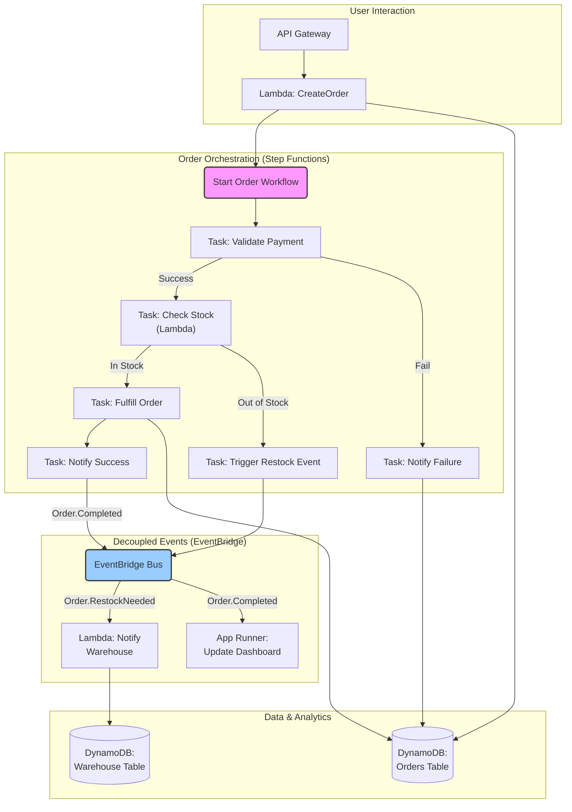

# AWS Serverless Evolution: Beyond Lambda Functions in 2026

When AWS Lambda launched in 2014, it became synonymous with "serverless." For years, the conversation was dominated by functions, triggers, and cold starts. But as we look towards 2026, the serverless landscape has matured into a sophisticated ecosystem where Lambda is just one—albeit crucial—piece of a much larger puzzle.

The modern serverless paradigm is less about individual functions and more about composing powerful, event-driven systems using a suite of managed services. This evolution allows developers to focus on business logic and architecture, not on the underlying compute.

### What You'll Get

In this article, we'll explore the key trends shaping the future of AWS serverless. You'll get:

*   **A look beyond Lambda:** Understand how other services are taking center stage.
*   **Orchestration vs. Choreography:** Insights into how Step Functions and EventBridge define application flow.
*   **Simplified Compute:** A breakdown of AWS App Runner's role in the serverless continuum.
*   **Data Layer Evolution:** How serverless databases are becoming the default choice.
*   **A Future Architecture:** A diagram visualizing a complex, modern serverless application.

---

## The Rise of the Orchestration Engine: AWS Step Functions

In early serverless architectures, chaining Lambda functions together often resulted in a "Lambda pinball" pattern—a complex, hard-to-debug web of function-to-function invocations. AWS Step Functions has evolved to solve this by externalizing workflow logic into manageable state machines.

By 2026, Step Functions is solidifying its position as the central brain for complex business processes.

### Key Advancements

*   **Reduced "Glue" Code:** With over 200 AWS service integrations and 10,000+ API actions directly callable, Step Functions drastically reduces the need for single-purpose Lambda functions that just call another service's API.
*   **Powerful Flow Controls:** The `Map` state, especially in its **Distributed Mode**, can process billions of objects in S3 with massive concurrency, a task that was previously an engineering nightmare to orchestrate.
*   **Intrinsic Functions:** Built-in functions for data manipulation (e.g., JSON merging, string formatting, array manipulation) allow you to transform data within the state machine definition, further reducing Lambda's role to pure business logic.

> **Info Block:** Think of Step Functions not as a "Lambda orchestrator" but as an *application orchestrator*. Its primary role is to define, execute, and visualize the flow of work across multiple services, some of which may not even be functions.

Consider this simple intrinsic function example within a state machine definition. No Lambda is needed to generate a unique ID.

```json
{
  "Comment": "A state machine that uses an intrinsic function",
  "StartAt": "GenerateUUID",
  "States": {
    "GenerateUUID": {
      "Type": "Pass",
      "Parameters": {
        "unique_id.$": "States.UUID()"
      },
      "End": true
    }
  }
}
```

## The Central Nervous System: Amazon EventBridge

If Step Functions is the brain, Amazon EventBridge is the central nervous system. It decouples services, allowing them to communicate asynchronously through events. This event-driven approach is fundamental to building resilient and scalable systems.

EventBridge has grown from a simple event bus to a powerful integration service.

### Why It's More Than a Bus

*   **SaaS Integrations:** EventBridge has native support for events from dozens of SaaS partners (like Zendesk, Datadog, or Shopify), making it easy to build workflows that react to third-party signals.
*   **EventBridge Pipes:** This feature provides a simple, reliable, and cost-effective way to create point-to-point integrations between event producers and consumers. It includes built-in filtering, enrichment (via Lambda or API Gateway), and transformation, removing the need for boilerplate integration code.
*   **Global Endpoints:** With improved failover and routing capabilities, EventBridge is becoming a cornerstone for building multi-region, highly available applications.

By 2026, expect even more intelligent routing capabilities, perhaps leveraging machine learning to direct events based on content patterns without explicit rules.

## Abstracting the Abstract: The Role of AWS App Runner

Not every workload is a short-lived, event-triggered function. Many applications are long-running web services, APIs, or background workers. Historically, this meant reaching for containers on Fargate or EC2. AWS App Runner fills this crucial gap in the serverless spectrum.

App Runner provides a "source-to-URL" experience. You point it to your source code repository or container image, and it handles everything else: building, deploying, load balancing, scaling, and security.

| Feature | AWS Lambda | AWS App Runner |
| :--- | :--- | :--- |
| **Use Case** | Event-driven functions, data processing | Web APIs, microservices |
| **Invocation** | Event-triggered | Persistent, HTTP requests |
| **Scaling** | Scales to zero | Scales to one (or more) |
| **Deployment** | Code package (ZIP, image) | Source code or container image |

It's serverless for containers, abstracting away the operational overhead of managing clusters, task definitions, or even Dockerfiles in some cases.

## Data on Demand: The Serverless Database Revolution

A truly serverless application requires a serverless data layer. The days of provisioning and managing database server capacity are fading.

*   **Amazon DynamoDB:** The original serverless database continues to dominate for key-value and document workloads. With on-demand capacity, you pay only for the reads and writes you perform. Its tight integration with other AWS services makes it a natural fit for event-driven architectures.
*   **Amazon Aurora Serverless v2:** This service brought the power and compatibility of PostgreSQL and MySQL to the serverless model. It scales database capacity in fine-grained increments almost instantly, making it ideal for applications with unpredictable or cyclical workloads.

By 2026, the line between these services will continue to blur, with features from one inspiring the other. Expect more powerful query capabilities in DynamoDB and even faster scaling-to-zero for Aurora, making serverless databases the default choice for all new application development.

## A 2026 Architecture: Integrated and Event-Driven

Let's visualize how these services come together in a modern, complex serverless application. The following diagram shows an e-commerce order processing system. Notice how Lambda is used for specific, isolated business logic, while Step Functions and EventBridge manage the overall flow and communication.



In this architecture:
1.  **API Gateway & Lambda** handle the initial synchronous request.
2.  **Step Functions** orchestrates the core, stateful business process of fulfilling an order.
3.  **EventBridge** handles asynchronous, "fire-and-forget" events like notifying other systems that an order is complete or that stock is low.
4.  **App Runner** hosts a customer-facing dashboard that consumes these events to provide real-time updates.
5.  **DynamoDB** serves as the scalable, serverless data store for the entire system.

---

## The Future is Composed

The evolution of AWS serverless is clear: we are moving from writing functions to composing systems. The future belongs to architects and developers who understand how to combine these powerful, managed services to build resilient, scalable, and cost-effective applications. Lambda remains vital, but it's no longer the only star in the serverless sky. The supporting cast has become just as powerful.

What are the most complex serverless architectures you are building today? Share your patterns and challenges in the comments below


## Further Reading

- [https://aws.amazon.com/serverless/whats-new-2026/](https://aws.amazon.com/serverless/whats-new-2026/)
- [https://www.serverless.com/blog/aws-serverless-predictions-2026](https://www.serverless.com/blog/aws-serverless-predictions-2026)
- [https://docs.aws.amazon.com/lambda/latest/dg/advanced-features.html](https://docs.aws.amazon.com/lambda/latest/dg/advanced-features.html)
- [https://www.readysetcloud.io/blog/aws-serverless-deep-dive/](https://www.readysetcloud.io/blog/aws-serverless-deep-dive/)
- [https://medium.com/aws-serverless/complex-serverless-patterns-2026](https://medium.com/aws-serverless/complex-serverless-patterns-2026)
- [https://cloud.architecture/aws-serverless-event-driven](https://cloud.architecture/aws-serverless-event-driven)
