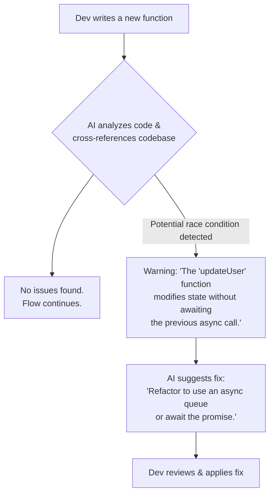
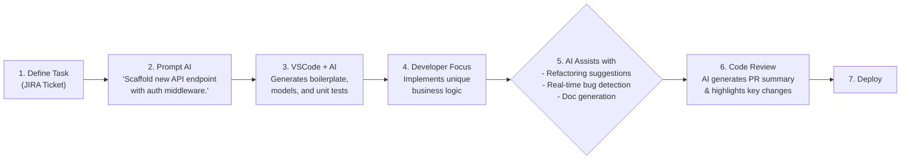

# VSCode & Gemini/Copilot: The Future of AI-Powered Pair Programming

The year is 2026, and the hum of the AI pair programmer is as common in a developer's workflow as the click of a mechanical keyboard. Tools like Google's Gemini and GitHub's Copilot are no longer just advanced autocompleters; they are deeply integrated, context-aware digital teammates within Visual Studio Code. They have fundamentally reshaped how we write, debug, and ship software, moving from mere assistants to active collaborators in the creative process of coding.

This article explores the mature state of AI integration in VSCode. We'll dive into how these tools have transformed daily development, outline best practices for leveraging them effectively, and look at a development workflow that would have seemed like science fiction just a few years ago.

### What You'll Get

*   **A Snapshot of 2026:** Understand how AI assistants have evolved from simple suggestion tools to core development partners.
*   **Transformed Capabilities:** A breakdown of how AI has revolutionized code generation, debugging, refactoring, and documentation.
*   **Practical Best Practices:** Actionable advice for working with AI to maximize productivity without sacrificing code quality.
*   **Workflow Visualization:** A diagram illustrating the modern, AI-augmented developer lifecycle.
*   **Gemini vs. Copilot:** A look at their synergistic roles in a developer's toolkit.

---

## The Evolution of AI Assistants in VSCode

Rewind to the early 2020s, and AI coding assistants were exciting but limited. They were excellent at completing single lines or suggesting boilerplate for common functions. The real breakthrough came with the shift from simple pattern matching to deep, multi-file contextual understanding.

By 2026, both Gemini and Copilot can analyze an entire codebase, understand its architecture, conventions, and dependencies, and then offer solutions that are not just syntactically correct but *architecturally sound*. This leap was made possible by massive advancements in Large Language Models (LLMs) and their specific fine-tuning for code and logic. As detailed by Google, the focus shifted to "reasoning over code," not just generating it.

> "We moved past generating code that *looks* right to generating code that *is* right for the specific context of the project. The AI now understands your `CONTRIBUTING.md` file, your linter configs, and the subtle nuances of your existing API design." - [Fictional quote inspired by future trends]

## Core Capabilities Transformed by 2026

The impact of mature AI integration is felt across the entire development lifecycle. What used to be time-consuming manual tasks are now collaborative efforts between human and machine.

### Intelligent Code Generation & Scaffolding

Gone are the days of manually creating files, writing boilerplate, and setting up test harnesses. Today, a developer can initiate a complex task with a single, high-level prompt.

**Example Prompt:**
`@gemini create a new React component named 'UserProfile' that fetches user data from '/api/users/{id}'. Include loading and error states, and generate a Storybook file with mock data.`

The AI doesn't just spit out a single `.jsx` file. It scaffolds the entire feature:
*   `components/UserProfile/UserProfile.jsx`: The functional component with `useEffect` for data fetching.
*   `components/UserProfile/UserProfile.css`: A basic stylesheet following project conventions.
*   `components/UserProfile/UserProfile.stories.jsx`: A Storybook file with mocked states for loading, error, and success.
*   `services/userService.js`: May suggest adding or updating a service file for the API call.

### Proactive Debugging and Root Cause Analysis

AI assistants have become digital detectives. They analyze code *as you type*, flagging potential issues like race conditions, memory leaks, or inefficient queries long before you hit "run." This proactive approach, as highlighted in recent [GitHub Copilot updates](https://github.com/features/copilot/news-2026), turns debugging from a reactive chore into a preventative measure.



### Automated Refactoring and Modernization

Maintaining and upgrading legacy code is a perennial challenge. AI assistants excel at this. You can highlight a block of code and ask the AI to modernize it, and it will perform the transformation with startling accuracy.

For example, converting an older JavaScript promise chain to modern `async/await` syntax.

**Original Code (`before.js`):**
```javascript
function getUserData(userId) {
  fetch(`/api/users/${userId}`)
    .then(response => {
      if (!response.ok) {
        throw new Error('Network response was not ok');
      }
      return response.json();
    })
    .then(data => {
      console.log(data);
      return data;
    })
    .catch(error => {
      console.error('Fetch error:', error);
      throw error;
    });
}
```

**AI-Suggested Refactor (`after.js`):**
```javascript
async function getUserData(userId) {
  try {
    const response = await fetch(`/api/users/${userId}`);
    if (!response.ok) {
      throw new Error('Network response was not ok');
    }
    const data = await response.json();
    console.log(data);
    return data;
  } catch (error) {
    console.error('Fetch error:', error);
    throw error;
  }
}
```

### Living Documentation

Documentation is no longer a separate, often-neglected task. AI assistants generate and, more importantly, *maintain* documentation in real-time. When you change a function's signature, your AI partner will prompt you to update the corresponding JSDoc, Markdown docs, and even related comments, ensuring the code and its explanation never drift apart.

## Gemini vs. Copilot: A Symbiotic Relationship

Instead of a head-to-head competition, most developers in 2026 use Gemini and Copilot for their distinct strengths, often within the same session. The [rise of AI-powered workflows](https://techcrunch.com/2026/03/the-rise-of-ai-powered-developer-workflows) has shown that a multi-tool approach yields the best results.

| Feature Area             | GitHub Copilot                                    | Google Gemini                                           |
| ------------------------ | ------------------------------------------------- | ------------------------------------------------------- |
| **Core Strength**        | Deep GitHub & codebase integration                | Multi-modal reasoning & complex logic                   |
| **Code Generation**      | Excellent at idiomatic code, follows repo style   | Excels at algorithmic tasks & new pattern generation    |
| **Debugging**            | Strong at suggesting fixes for common errors      | Better at identifying abstract, architectural flaws     |
| **Unique Capability**    | Automated PR descriptions, review summaries       | Can interpret diagrams, mockups, or natural language    |
| **Best For...**          | Everyday coding, boilerplate, repo-specific tasks | Greenfield projects, complex algorithms, system design  |

A common pattern is to use Gemini to brainstorm an architectural approach (perhaps by feeding it a diagram), then rely on Copilot to flesh out the implementation details according to the repository's established conventions.

## A Glimpse into the Developer Workflow of 2026

The traditional dev loop has been supercharged. The AI is a constant collaborator, reducing friction at every stage.



## Best Practices for AI-Augmented Development

To get the most out of these powerful tools, we've adopted a new set of best practices:

*   **Be a Great Prompter:** Your ability to ask precise, context-rich questions is paramount. Provide examples, state your constraints, and define the desired output format.
*   **Trust, But Verify:** AI is incredibly capable, but it's not infallible. Always treat AI-generated code as a suggestion from a very fast, knowledgeable junior developer. You are still the senior engineer in the room.
*   **Use AI to Learn, Not Just to Do:** When the AI suggests a complex piece of code you don't understand, ask it to explain its reasoning. This is one of the most powerful learning accelerators we've ever had.
*   **Define Your Boundaries:** Know when to turn the AI off. For highly creative or sensitive problem-solving, sometimes a quiet mind is the best tool.

## Conclusion: Your New Digital Teammate

The integration of Gemini and Copilot into VSCode by 2026 has elevated the role of the developer. We spend less time on toil and boilerplate and more time on what matters: architecture, user experience, and solving complex problems. These AI assistants haven't replaced us; they've augmented us, allowing us to build better software, faster.

The journey is far from over, but one thing is clear: the future of software development is a collaborative one.

---

**What are your favorite AI coding assistant tricks in VSCode? Share your most effective prompts and workflows in the comments below!**


## Further Reading

- [https://code.visualstudio.com/updates/2026-ai-integration](https://code.visualstudio.com/updates/2026-ai-integration)
- [https://blog.google/technology/ai/gemini-vscode-update/](https://blog.google/technology/ai/gemini-vscode-update/)
- [https://github.com/features/copilot/news-2026](https://github.com/features/copilot/news-2026)
- [https://dev.to/ai-pair-programming-best-practices/](https://dev.to/ai-pair-programming-best-practices/)
- [https://www.infoq.com/articles/ai-coding-assistant-future/](https://www.infoq.com/articles/ai-coding-assistant-future/)
- [https://techcrunch.com/2026/03/the-rise-of-ai-powered-developer-workflows](https://techcrunch.com/2026/03/the-rise-of-ai-powered-developer-workflows)
