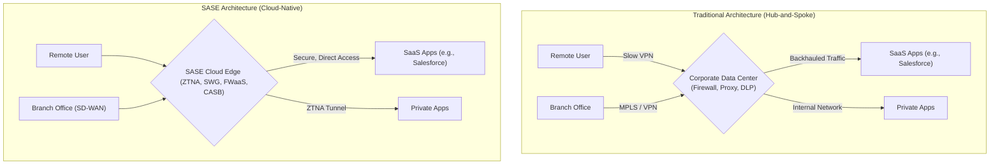

# Cloud Networking's Evolution: The SASE Model and Beyond in 2026

The corporate network perimeter hasn't just been breached; it has dissolved entirely. The era of centralized data centers acting as the secure hub for all traffic is over. Fueled by remote work, multi-cloud adoption, and edge computing, the modern enterprise is a distributed entity. This fundamental shift demands a new architectural approach, and Secure Access Service Edge (SASE) has emerged as the clear frontrunner.

But SASE is not a static destination. It's an evolving framework. As we look towards 2026, SASE is set to mature from a promising strategy into the default architecture for secure enterprise connectivity, driven by deeper integration, automation, and a Zero Trust core.

## What You'll Get

This article breaks down the practical evolution of SASE and what it means for your network architecture by 2026. You'll get:

*   A clear definition of SASE's converged architecture.
*   An analysis of how Zero Trust becomes the non-negotiable foundation.
*   Insights into the changing role of SD-WAN within the SASE model.
*   A look at future trends, including AI-powered operations.
*   An architectural diagram comparing traditional networks to SASE.

## The Core Concept: SASE's Unified Architecture

SASE, a term coined by Gartner, is not a single product but a framework that converges networking and network security functions into a single, cloud-delivered service. Instead of routing traffic back to a corporate data center for inspection (a practice known as "hairpinning"), SASE moves security enforcement to a global network of Points of Presence (PoPs) close to the user.

This model flips traditional networking on its head. Security is no longer a place you route *to*; it's a service that is delivered *from the cloud*, wherever your users and applications are.

### Traditional vs. SASE Architecture

The difference is best visualized. The traditional model is complex and creates performance bottlenecks, while the SASE model is streamlined for the cloud era.



### Key SASE Components

At its heart, SASE combines two major technology stacks.

| Component | Function | Stack |
| --- | --- | --- |
| **SD-WAN** | Software-Defined Wide Area Network for optimized routing. | Networking |
| **ZTNA** | Zero Trust Network Access to replace traditional VPNs. | Security |
| **SWG** | Secure Web Gateway to filter and secure internet traffic. | Security |
| **CASB** | Cloud Access Security Broker to enforce policies on cloud apps. | Security |
| **FWaaS** | Firewall as a Service for network traffic inspection. | Security |

> By 2026, more than 60% of enterprises will have explicit strategies and timelines for SASE adoption, up from less than 10% in 2022. This projection, adapted from Gartner research, underscores the rapid consolidation of the market.

## Key Evolutions to Expect by 2026

SASE in 2026 will be more integrated, intelligent, and identity-aware than the solutions on the market today. Here are the key shifts.

### Zero Trust is No Longer Optional, It's the Foundation

By 2026, SASE will be synonymous with Zero Trust. The "never trust, always verify" principle will be the default operational mode, not an add-on.

*   **Identity as the New Perimeter:** Access decisions will be based primarily on user identity and context (device health, location, time of day), not on network location.
*   **From VPN to ZTNA:** *Zero Trust Network Access (ZTNA)* will have fully replaced legacy remote access VPNs. ZTNA provides secure, application-level access, hiding applications from the public internet and significantly reducing the attack surface.
*   **Continuous Verification:** Access is not a one-time event. SASE platforms will continuously re-evaluate trust based on real-time signals, revoking access instantly if a device becomes non-compliant or user behavior becomes anomalous.

### SD-WAN: From Overlay to Integrated Fabric

The role of SD-WAN is evolving. Initially seen as a separate solution for branch connectivity, by 2026 it will be an inseparable component of the SASE fabric.

*   **Intelligent On-Ramp:** SD-WAN will act as the intelligent on-ramp to the SASE cloud, responsible for steering traffic to the nearest PoP with the lowest latency.
*   **Unified Policy Management:** Network policies (like QoS for a video call) and security policies (like blocking malware) will be configured from the same console, creating a truly unified management experience.

### The Rise of the Single-Pass Architecture

To deliver on the promise of high performance, leading SASE platforms will rely on a single-pass architecture. This means that once traffic enters a SASE PoP, it is decrypted once and subjected to all relevant security inspections—FWaaS, SWG, DLP—in parallel. This eliminates the latency caused by chaining multiple security services together.

A unified SASE policy might look something like this:

```yaml
# Pseudo-code for a unified SASE policy

policy:
  name: "Engineer_Access_To_Production_AWS"
  description: "Allow verified engineers on corporate devices to access production servers."
  
  # WHO is the user?
  source:
    user_group: "DevOps-Engineers"
    mfa_status: "Verified"
    
  # WHAT is their context?
  context:
    device_posture: "Corporate-Compliant"
    geo_location: "North America"
    
  # WHERE are they going?
  destination:
    application_segment: "AWS-Prod-EC2"
    
  # HOW can they connect?
  action:
    - "allow_ssh"
    - "log_session"
    - "inspect_for_threats"
```

### AI-Powered Autonomous Networking and Security

By 2026, AIOps (AI for IT Operations) will be a critical feature. The sheer volume of data flowing through SASE platforms makes manual management untenable.

*   **Predictive Analytics:** AI will predict network congestion and automatically re-route traffic before users are impacted.
*   **Automated Threat Response:** Machine learning algorithms will detect subtle, anomalous behavior indicative of a threat and automatically quarantine a user or device.
*   **Self-Healing Networks:** The platform will identify and resolve common performance and security issues without human intervention.

## The Impact on Modern IT

This evolution has profound implications for how IT teams operate and deliver services.

### Empowering the "Work From Anywhere" Workforce

SASE is the definitive architecture for the hybrid workforce. It provides a consistent security and user experience regardless of location.

*   **No More VPN Headaches:** Users connect seamlessly without the clunky interface and performance penalties of traditional VPNs.
*   **Identical Security Posture:** An employee at home has the exact same security protections as an employee in the office.

### Securing Distributed Applications and Multi-Cloud

As applications move from the data center to IaaS, PaaS, and SaaS environments, SASE provides the necessary secure access layer. It ensures that only authorized users on compliant devices can access specific applications, regardless of where those applications are hosted. This is a core tenet of modern application security, as highlighted by leaders like [Palo Alto Networks](https://paloaltonetworks.com/sase/what-is-sase).

## Conclusion: The Inevitable Shift

By 2026, SASE won't be a radical new idea; it will be the established best practice for enterprise networking and security. The convergence of these two domains into a single, cloud-native service is a direct response to the distributed nature of modern work. The organizations that thrive will be those that move away from outdated, perimeter-based models and embrace a flexible, identity-centric architecture built for the cloud.

The journey to SASE is underway. The question is no longer *if* organizations will adopt it, but *how* quickly they can align their strategies to this new reality.

---

**How has the shift towards SASE or ZTNA changed your network architecture and daily operations? Share your experiences in the comments below.**


## Further Reading

- [https://www.gartner.com/en/articles/sase-market-guide-2026](https://www.gartner.com/en/articles/sase-market-guide-2026)
- [https://cisco.com/go/sase/2026-overview](https://cisco.com/go/sase/2026-overview)
- [https://zscaler.com/resources/sase-model-evolution](https://zscaler.com/resources/sase-model-evolution)
- [https://paloaltonetworks.com/sase/what-is-sase](https://paloaltonetworks.com/sase/what-is-sase)
- [https://sdxcentral.com/sase-trends-2026/](https://sdxcentral.com/sase-trends-2026/)
- [https://www.networkworld.com/sase-zero-trust-integration](https://www.networkworld.com/sase-zero-trust-integration)
