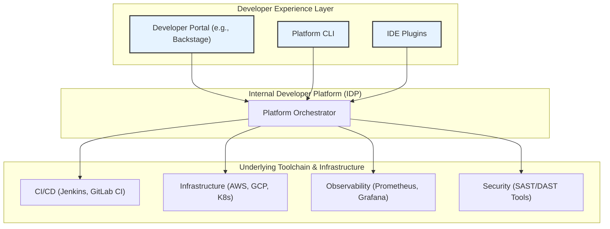

# Platform Engineering: Building Golden Paths for Developer Productivity

Platform Engineering is rapidly emerging as a critical discipline for scaling software delivery. By 2026, it's predicted to be a mainstream practice in large engineering organizations. But what is it, and why is it gaining so much traction?

At its core, Platform Engineering is about designing and building the toolchains and workflows that enable developers to be self-sufficient. A dedicated platform team creates a shared, internal platform that developers use to deliver applications quickly and reliably. This approach reduces cognitive load and allows developers to focus on what they do best: writing code that delivers business value.

### What You'll Get

This article provides a practitioner's guide to Platform Engineering. You will learn:

*   The core principles behind Platform Engineering and how it addresses developer cognitive load.
*   An explanation of "golden paths" and why they are essential for productivity.
*   A breakdown of Internal Developer Platforms (IDPs) and their key components.
*   The tangible business benefits of adopting a platform engineering model.
*   Practical steps for starting your own platform engineering initiative.

---

## The Core Problem: Rising Developer Cognitive Load

In the modern cloud-native world, developers are expected to be experts in a dizzying array of technologies. They must navigate Kubernetes, CI/CD pipelines, infrastructure as code (IaC), monitoring, security scanning, and multiple cloud provider services—all before writing a single line of business logic.

This explosion of complexity leads to significant cognitive load, slowing down development and increasing the risk of errors.

> "When every team has to figure out the 'right' way to deploy, monitor, and secure their applications, the result is massive duplication of effort and inconsistent, brittle solutions."

Platform Engineering directly tackles this problem by providing a stable, abstracted foundation that handles the underlying complexity.

## What is Platform Engineering?

Platform Engineering applies a product mindset to the developer experience. A central platform team builds and maintains an **Internal Developer Platform (IDP)**, which is treated as a product for its customers: the application development teams.

This model is an evolution of DevOps, shifting the focus from per-team automation to creating a centralized, self-service capability for the entire organization.

| Feature | Traditional DevOps/SRE | Platform Engineering |
| :--- | :--- | :--- |
| **Focus** | Project-specific pipelines, infrastructure automation | A central, reusable self-service platform |
| **Model** | Often a "DevOps person" embedded in each team | A central product team serving all dev teams |
| **Goal** | Automate delivery for a *specific service* | Improve productivity for *all developers* |
| **Key Metric** | Deployment frequency, lead time per team | Developer satisfaction, adoption rate of the platform |

### Core Principles

The practice is guided by a few key principles:

*   **Self-Service:** Developers can provision infrastructure, set up CI/CD, and deploy applications on-demand without filing tickets.
*   **Abstraction over Restriction:** The platform hides complexity behind easy-to-use interfaces, not by locking developers into a rigid system.
*   **Golden Paths:** The platform provides well-lit, paved roads for common tasks, making the right way the easy way.
*   **Developer Experience (DevEx) is Paramount:** The platform team constantly seeks feedback from developers to improve usability and reduce friction.

## The Golden Path: Paved Roads to Production

The "golden path" (or "paved road") is a concept popularized by companies like Spotify and Netflix. It represents the recommended, supported, and most efficient way to accomplish a specific task, such as creating a new microservice or deploying to production.

*   **It's an Opinionated Default:** The golden path provides a pre-configured stack with sensible defaults for CI/CD, security, and observability.
*   **It's Not a Mandate:** Developers can choose to deviate from the golden path if they have a specific need, but they take on the responsibility for maintaining their custom setup. The paved road is simply the path of least resistance.
*   **It Codifies Best Practices:** The path is built and maintained by experts, ensuring that every service created using it adheres to organizational standards for security, compliance, and reliability.

By following the golden path, a developer can go from an idea to a production-ready service in minutes, not weeks.

## The Engine: Internal Developer Platforms (IDPs)

The Internal Developer Platform (IDP) is the tangible implementation of a platform engineering strategy. It's the set of tools, APIs, and portals that developers use to interact with the "golden paths." An IDP is not a single off-the-shelf product but rather an integrated layer of technology.

### Key Components of an IDP

An IDP typically consists of several interconnected components, working together to provide a seamless developer experience.



*   **Developer Control Plane:** The user interface for developers. This could be a web portal like [Backstage](https://backstage.io/), a command-line interface (CLI), or plugins for their favorite IDE.
*   **Platform Orchestrator:** The "brains" of the operation. It interprets developer requests and interacts with the underlying tools to perform actions. This layer can be built with tools like [Humanitec](https://humanitec.com/) or custom scripts.
*   **Integration Layer:** Connectors to the company's existing toolchain—CI/CD systems, cloud providers, monitoring tools, and security scanners. The IDP doesn't replace these tools; it orchestrates them.
*   **Resource and Configuration Management:** Manages the desired state of applications and infrastructure, often using IaC tools like Terraform or Crossplane.

### How an IDP Enables Self-Service

Imagine a developer needs to create a new Go microservice with a PostgreSQL database.

1.  **Request:** The developer defines their needs in a simple manifest file or through a web form in the developer portal.

    ```yaml
    # Example: A declarative manifest for a new service
    apiVersion: platform.mycompany.com/v1
    kind: Application
    metadata:
      name: inventory-service-v2
    spec:
      type: go-api-template
      owner: team-logistics
      database:
        type: postgres
        size: small
      environments:
        staging:
          replicas: 1
        production:
          replicas: 3
          region: "us-east-1"
    ```

2.  **Orchestration:** The developer commits this file. The platform orchestrator detects the change and kicks off a workflow.
3.  **Execution:** The orchestrator automatically:
    *   Creates a new Git repository from a template.
    *   Provisions the PostgreSQL database using Terraform.
    *   Configures the CI/CD pipeline in GitLab.
    *   Deploys the skeleton application to the staging Kubernetes cluster.

The developer gets a running service with a pre-configured pipeline and observability dashboard in under five minutes, without any manual intervention from an operations team.

## Benefits and Business Impact

Adopting Platform Engineering delivers compelling benefits across the organization.

*   **For Developers:**
    *   **Reduced Cognitive Load:** Focus on application logic instead of infrastructure plumbing.
    *   **Increased Autonomy:** Full ownership of the development lifecycle without waiting for other teams.
    *   **Faster Onboarding:** New hires can become productive in days, not months.

*   **For the Business:**
    *   **Accelerated Time-to-Market:** Faster, more frequent, and more reliable software releases.
    *   **Improved Reliability & Security:** Best practices are standardized and enforced by the platform.
    *   **Increased Efficiency:** Eliminates redundant work across teams and reduces operational overhead.

## Getting Started: A Phased Approach

Building a comprehensive platform doesn't happen overnight. Success comes from an iterative, product-led approach.

1.  **Identify the Pain:** Start by interviewing development teams. What are their biggest bottlenecks? Is it provisioning test environments? The CI/CD process? Use this data to prioritize your efforts.
2.  **Build a Platform Team:** Assemble a cross-functional team with skills in infrastructure, software development, and product management. This team's mission is to serve developers.
3.  **Define a Thinnest Viable Platform (TVP):** Don't try to build everything at once. Solve one high-value problem first. Create the first "golden path" for the most common application type in your organization.
4.  **Treat the Platform as a Product:** Actively market your platform internally. Provide excellent documentation, gather continuous feedback, and iterate based on developer needs. Measure success through adoption rates and developer satisfaction surveys.

Platform Engineering is more than just a new set of tools; it's a cultural shift that places developer productivity at the center of your engineering strategy. By building golden paths and providing a world-class internal platform, you empower your teams to build better software, faster.


## Further Reading

- [https://platformengineering.org/principles-2026](https://platformengineering.org/principles-2026)
- [https://www.thoughtworks.com/radar/platforms-and-tools](https://www.thoughtworks.com/radar/platforms-and-tools)
- [https://infoq.com/platform-engineering-adoption-guide/](https://infoq.com/platform-engineering-adoption-guide/)
- [https://dev.to/internal-developer-platforms-guide/](https://dev.to/internal-developer-platforms-guide/)
- [https://humanitec.com/blog/what-is-platform-engineering](https://humanitec.com/blog/what-is-platform-engineering)
- [https://cncf.io/blog/platform-engineering-landscape](https://cncf.io/blog/platform-engineering-landscape)
