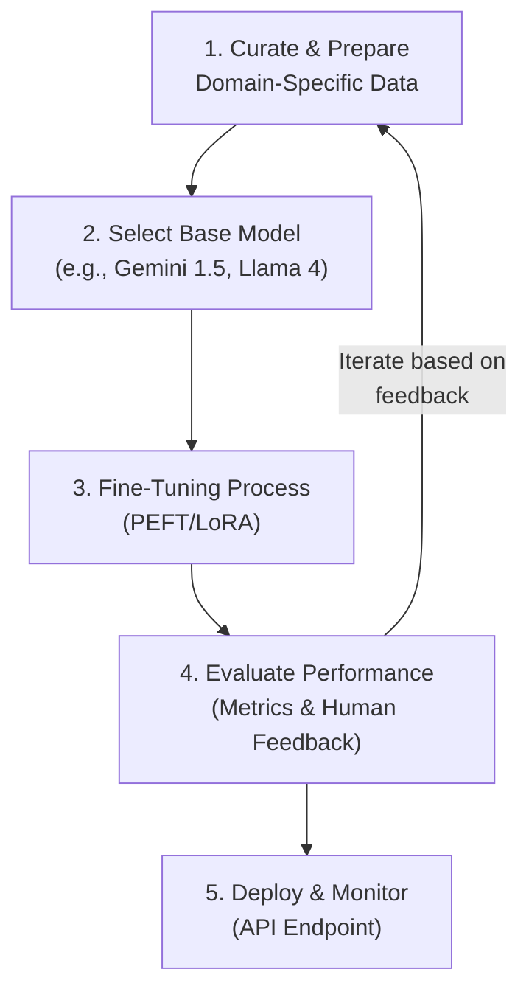

# GenAI Model Fine-Tuning: Customizing Large Language Models for Enterprise

Generative AI models like Gemini, GPT-4, and Claude 3 are incredibly powerful out of the box. However, for an enterprise to unlock true competitive advantage, generic intelligence isn't enough. The future, especially as we look towards 2026, lies in specialization. Fine-tuning is the key process that transforms a generalist Large Language Model (LLM) into a domain-specific expert, deeply aligned with your company's data, voice, and workflows.

This guide provides a practitioner-focused blueprint for fine-tuning, moving beyond the hype to deliver actionable strategies for creating high-performing, custom AI models for your enterprise.

### What You'll Get

*   **A Strategic Framework:** Understand *why* and *when* to fine-tune versus relying on prompt engineering alone.
*   **Actionable Steps:** A clear, four-step workflow from data preparation to model evaluation.
*   **Future-Forward Techniques:** Insight into the parameter-efficient methods that will dominate by 2026.
*   **Code & Diagrams:** A conceptual code example and a workflow diagram to clarify the process.
*   **Real-World Use Cases:** Concrete examples of how fine-tuned models deliver business value.

---

## Why Fine-Tune? The Enterprise Imperative

While prompt engineering can guide a model's output for a single task, it has limitations. It requires cramming context into every request, can be inconsistent, and struggles with deep domain knowledge. Fine-tuning permanently embeds this knowledge and behavior into the model itself.

By 2026, the distinction between companies succeeding with AI and those who are not will be the quality of their custom models.

| Feature | Generic Model (Prompt Engineering) | Fine-Tuned Model |
| :--- | :--- | :--- |
| **Domain Knowledge** | Limited to pre-training data; relies on context provided in the prompt. | Deeply understands internal jargon, processes, and proprietary data. |
| **Tone & Style** | Can mimic a style if prompted, but may drift. | Consistently adopts the specific brand voice and format. |
| **Task Accuracy** | General-purpose; may require complex, "few-shot" examples in every prompt. | Highly optimized for specific tasks (e.g., summarizing legal docs, writing code). |
| **Efficiency** | Requires longer, more complex prompts. | Achieves better results with shorter, simpler prompts, reducing token usage. |
| **Reliability** | More prone to generic responses or "hallucinations" on niche topics. | Higher factual consistency and reliability within its trained domain. |

> **Info Block:** Fine-tuning isn't about teaching a model new general knowledge; it's about teaching it a new *skill* or specializing its existing knowledge for your specific context.

## The Fine-Tuning Workflow: A 2026 Blueprint

A successful fine-tuning project is a systematic process, not a one-off experiment. It requires a clear, iterative workflow that blends data science with MLOps principles.

Here is a high-level overview of the end-to-end process:



### Step 1: High-Quality Data Preparation

This is the most critical step. The quality of your fine-tuned model is a direct reflection of the quality of your training data. Garbage in, gospel out.

*   **Focus on Quality, Not Just Quantity:** By 2026, the need for massive datasets will shrink. A few hundred to a few thousand high-quality, curated examples often outperform tens of thousands of noisy ones.
*   **Structure Your Data:** The most common format is a JSONL file where each line is a JSON object containing an "input" and "output" pair. For instruction-tuning, this might be a "prompt" and "completion."
*   **Data Sourcing:**
    *   **Internal Wikis & Docs:** Confluence, SharePoint, technical documentation.
    *   **Customer Interactions:** Support tickets (anonymized), chat logs, and emails.
    *   **Expert-Generated Examples:** Have your top performers write ideal examples of a task.

### Step 2: Strategic Model Selection

Choosing the right base model is a trade-off between performance, cost, and control.

*   **Proprietary Models (e.g., OpenAI, Google, Anthropic):** These offer state-of-the-art performance via APIs. Fine-tuning is typically managed through their platforms, offering ease of use but less control over the infrastructure. See [Google AI's guides](https://ai.google/discover/generativeai/) for their latest offerings.
*   **Open-Source Models (e.g., Llama, Mistral):** Hosted on platforms like [Hugging Face](https://huggingface.co/models), these models offer maximum control. You can run the fine-tuning process on your own infrastructure (on-prem or cloud), which is ideal for data privacy and deep customization.

### Step 3: The Fine-Tuning Process

Full fine-tuning (retraining all model weights) is computationally expensive and often unnecessary. The industry has standardized on **Parameter-Efficient Fine-Tuning (PEFT)** methods.

PEFT techniques freeze the vast majority of the model's original parameters and only train a small number of new, added parameters. This drastically reduces computational cost and memory requirements.

### Step 4: Rigorous Evaluation

How do you know if your fine-tuned model is actually better? You need a robust evaluation strategy.

*   **Automated Metrics:** For tasks like summarization or translation, metrics like ROUGE and BLEU can provide a baseline score.
*   **Human Evaluation:** For creative or nuanced tasks, there is no substitute for human feedback. Use A/B testing where evaluators compare the output of the base model and the fine-tuned model against a "golden" answer.
*   **Holdout Set:** Always reserve a portion of your curated data as a "test set" that the model has never seen. This is crucial for preventing overfitting and ensuring the model generalizes well.

## Advanced Techniques: PEFT and LoRA

The dominant PEFT method you need to know is **LoRA (Low-Rank Adaptation)**.

Instead of updating the massive weight matrices of the model, LoRA injects smaller, "rank-decomposition" matrices into the transformer architecture. You only train these small matrices, which might represent less than 1% of the total model parameters. This makes fine-tuning accessible without a supercomputer.

Here's a conceptual code snippet using the popular `peft` library from Hugging Face to illustrate how LoRA is applied:

```python
from transformers import AutoModelForCausalLM, AutoTokenizer
from peft import get_peft_model, LoraConfig, TaskType

# 1. Load the base model and tokenizer
model_name = "mistralai/Mistral-7B-v0.1"
model = AutoModelForCausalLM.from_pretrained(model_name)
tokenizer = AutoTokenizer.from_pretrained(model_name)

# 2. Define the LoRA configuration
# This is where you specify which layers to adapt and the rank of the adapter matrices.
peft_config = LoraConfig(
    task_type=TaskType.CAUSAL_LM, 
    inference_mode=False, 
    r=8,  # The rank of the update matrices. A key hyperparameter.
    lora_alpha=32, 
    lora_dropout=0.1,
    target_modules=["q_proj", "v_proj"] # Target specific layers in the model
)

# 3. Wrap the base model with the PEFT configuration
lora_model = get_peft_model(model, peft_config)

# Print the percentage of trainable parameters
lora_model.print_trainable_parameters()
# Output will be something like: "trainable params: 4,718,592 || all params: 7,124,131,840 || trainable%: 0.0662"

# Now, you would proceed to train `lora_model` on your custom dataset.
# The training process only updates the small number of LoRA parameters.
```

This approach makes it feasible to train multiple specialized models for different tasks, as the storage overhead for each "adapter" is minimal.

## Enterprise Use Cases in Action

Fine-tuning delivers tangible ROI by creating AI assistants that are specialists, not generalists.

### ### Internal Knowledge Base Q&A

*   **Problem:** Employees can't find information buried in Confluence, SharePoint, and Google Drive. Generic LLMs hallucinate or lack context on internal projects.
*   **Fine-Tuned Solution:** A model trained on your company's internal documentation.
*   **Benefit:** It provides accurate, cited answers to queries like *"What was our Q3 strategy for Project Phoenix?"* or *"Generate a boilerplate for a new microservice based on our internal coding standards."*

### ### Customer Support Automation

*   **Problem:** Generic chatbots fail on complex, domain-specific customer issues, leading to frustration and escalation.
*   **Fine-Tuned Solution:** A model fine-tuned on historical support tickets, product documentation, and successful resolution transcripts.
*   **Benefit:** The model can handle multi-turn conversations, understand product-specific jargon, and resolve a higher percentage of Tier-1 and Tier-2 issues with the correct brand voice, freeing up human agents for the most complex problems.

### ### High-Quality Content Generation

*   **Problem:** Generating marketing copy, technical reports, or legal summaries that adhere to strict company style guides is time-consuming.
*   **Fine-Tuned Solution:** A model fine-tuned on a corpus of your best-performing blog posts, approved marketing materials, and existing technical documents.
*   **Benefit:** It generates drafts that are already 90% compliant with brand voice, tone, and formatting, drastically accelerating the content creation pipeline.

## The Future is Custom

By 2026, leveraging generic, off-the-shelf LLMs will be table stakes. The real differentiator will be how effectively an enterprise can create a fleet of specialized models that act as true experts in their respective domains. Fine-tuning, powered by efficient techniques like LoRA, is the critical bridge from general AI capability to specific business value.

---

### Share Your Success

Have you started your fine-tuning journey? What challenges have you faced, and what successes have you achieved? Share your experiences in the comments below


## Further Reading

- [https://huggingface.co/blog/fine-tuning-llms-2026](https://huggingface.co/blog/fine-tuning-llms-2026)
- [https://google.ai/blog/gemini-enterprise-fine-tuning-guide/](https://google.ai/blog/gemini-enterprise-fine-tuning-guide/)
- [https://openai.com/blog/custom-gpt-models-for-business/](https://openai.com/blog/custom-gpt-models-for-business/)
- [https://towardsdatascience.com/fine-tuning-llm-best-practices](https://towardsdatascience.com/fine-tuning-llm-best-practices)
- [https://www.ibm.com/blogs/research/2026/03/fine-tuning-foundation-models](https://www.ibm.com/blogs/research/2026/03/fine-tuning-foundation-models)
- [https://techopedia.com/generative-ai-enterprise-adoption](https://techopedia.com/generative-ai-enterprise-adoption)
