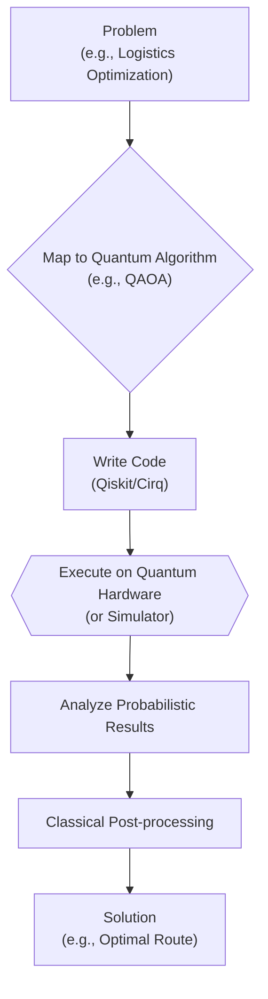

# Quantum Computing's March: What Developers Need to Know in 2026

Quantum computing has long been the stuff of science fiction, a distant promise of computational power beyond our wildest classical dreams. But the distance is shrinking. By 2026, the field has moved decisively from purely academic curiosity to a tangible technology with emerging commercial applications. For developers, this is the signal: the time to start paying attention is now.

This isn't about replacing your laptop with a quantum machine. It's about understanding a new computing paradigm that will work alongside classical systems to solve a specific, complex class of problems. This article provides a pragmatic overview of the quantum landscape in 2026, tailored for software developers and engineers.

### What You'll Get

*   **The 2026 Snapshot:** An update on the state of quantum hardware and the shift away from the purely experimental era.
*   **Core Concepts Explained:** Simple, developer-friendly explanations of qubits, superposition, and entanglement.
*   **Developer Toolkits:** A look at the mature SDKs like Qiskit and Cirq that let you write quantum code today.
*   **Early Use Cases:** Real-world problem domains where quantum is starting to offer an advantage.
*   **Your Next Steps:** Actionable advice for getting started on your quantum journey.

## The Quantum Landscape in 2026

The "Noisy Intermediate-Scale Quantum" (NISQ) era, which dominated the early 2020s, is beginning to mature. While we are still years from a fully fault-tolerant universal quantum computer, the progress is undeniable.

Hardware providers like IBM have surpassed the 1,000+ physical qubit milestone, but more importantly, the *quality* of these qubits has dramatically improved. Coherence times—how long a qubit can maintain its quantum state—have increased, and error rates have fallen. We are now in a phase of *utility-scale* quantum computing, where machines are large and stable enough to explore algorithms that out-perform classical heuristics for niche problems.

> **Info Block:** The primary focus has shifted from simply adding more qubits to improving qubit connectivity and implementing real-time, hardware-level error correction. This is a critical step towards fault tolerance, the holy grail for scalable quantum computation.

## Quantum Concepts for the Classical Developer

You don't need a PhD in quantum physics to get started, but you do need to grasp three fundamental concepts that break from the classical mold.

### Qubits: Beyond the Bit

A classical bit is simple: it's either a 0 or a 1. A qubit, however, can exist in a state of **superposition**, meaning it can be a 0, a 1, or a combination of both simultaneously.

Think of it like a spinning coin. While it's in the air, it's neither heads nor tails—it's a blend of both possibilities. Only when it lands (when we *measure* it) does it collapse into a definite state of heads (1) or tails (0). This ability to hold multiple values at once is a source of quantum's massive parallelism.

### Entanglement: "Spooky Action at a Distance"

Entanglement is a counter-intuitive but powerful property where two or more qubits become linked in a single quantum state. If you measure one entangled qubit, you instantly know the state of the other, no matter how far apart they are.

*   Imagine you have two "entangled" gloves, one left and one right, placed in separate, identical boxes.
*   You ship one box to Tokyo and keep one in New York.
*   The moment you open your box in New York and see a left-handed glove, you know *instantly* that the box in Tokyo contains a right-handed glove.

This linked fate allows for complex correlations and information processing that is impossible in classical systems.

### Quantum Gates: The New Logic

In classical computing, we have logic gates like AND, OR, and NOT. In quantum computing, we use **quantum gates** to manipulate the states of qubits. For example:

*   **Hadamard Gate (H):** Puts a qubit into a state of superposition.
*   **CNOT Gate (CX):** A conditional gate that flips a target qubit *if and only if* a control qubit is in the state `1`. This is a key gate for creating entanglement.

## Getting Your Hands Dirty: Quantum SDKs Today

The best way to learn is by doing. Fortunately, the quantum software ecosystem is robust and accessible. You can write quantum programs in Python and run them on cloud-based simulators or real quantum hardware.

### IBM's Qiskit

Qiskit is one of the most mature open-source SDKs, backed by a large community and extensive documentation. It provides tools for creating, compiling, and executing quantum circuits on IBM's fleet of quantum systems.

Here’s how to create a "Bell state"—a simple two-qubit entangled state:

```python
from qiskit import QuantumCircuit
from qiskit_aer import AerSimulator

# Create a circuit with 2 qubits and 2 classical bits for measurement
qc = QuantumCircuit(2, 2)

# 1. Apply a Hadamard gate to qubit 0 to create superposition
qc.h(0)

# 2. Apply a CNOT gate to entangle qubit 1 with qubit 0
qc.cx(0, 1)

# 3. Measure the qubits and store the result in classical bits
qc.measure([0, 1], [0, 1])

# Execute on a simulator
simulator = AerSimulator()
job = simulator.run(qc, shots=1024)
result = job.result()
counts = result.get_counts(qc)

print("Measurement results:", counts)
# Expected output: {'00': ~512, '11': ~512}
```

### Google's Cirq

Cirq is another powerful Python library, tightly integrated with Google's quantum hardware. It's designed with a focus on solving near-term problems on NISQ-era processors.

Here's the same Bell state example in Cirq:

```python
import cirq

# Define two qubits
q0, q1 = cirq.LineQubit.range(2)

# Create a circuit
circuit = cirq.Circuit(
    # 1. Put the first qubit in superposition
    cirq.H(q0),
    # 2. Entangle the second qubit with the first
    cirq.CNOT(q0, q1),
    # 3. Measure both qubits
    cirq.measure(q0, q1, key='result')
)

# Simulate the circuit
simulator = cirq.Simulator()
results = simulator.run(circuit, repetitions=1024)
print("Measurement results:", results.histogram(key='result'))
# Expected output: A histogram showing high counts for 0 (binary 00) and 3 (binary 11)
```

Other major platforms like **Microsoft Azure Quantum** and **Amazon Braket** offer a hardware-agnostic approach, providing access to quantum processors from multiple vendors through a unified cloud interface.

## Where Quantum is Making an Impact

Quantum computers will not replace your web server. They are specialized machines designed for specific types of problems that are intractable for even the most powerful supercomputers. The general workflow looks something like this:



### Optimization Problems

Many industries face complex optimization challenges, from supply chain logistics (the "Traveling Salesperson Problem") to financial modeling (portfolio optimization). Quantum algorithms like the **Quantum Approximate Optimization Algorithm (QAOA)** and the **Variational Quantum Eigensolver (VQE)** are being actively explored to find better solutions faster.

### Cryptography

This is a double-edged sword.
*   **The Threat:** Shor's algorithm, executable on a future fault-tolerant quantum computer, can break most of the public-key cryptography (like RSA) that secures the internet today.
*   **The Solution:** The race is on to standardize and deploy **Post-Quantum Cryptography (PQC)**, which are new classical algorithms believed to be resistant to attacks from both classical and quantum computers. Organizations are already beginning their transition.

### Simulation and Discovery

Nature is fundamentally quantum. Simulating it accurately is incredibly difficult for classical computers. Quantum computers are perfectly suited for this. Early applications include:
*   **Materials Science:** Designing new materials with desired properties, such as more efficient solar cells or better batteries.
*   **Drug Discovery:** Simulating molecular interactions to accelerate the development of new pharmaceuticals.

## The Road Ahead: A Quick Comparison

It's crucial to understand that quantum and classical computing are complementary.

| Feature | Classical Computing | Quantum Computing |
| :--- | :--- | :--- |
| **Basic Unit** | Bit (0 or 1) | Qubit (0, 1, or a mix) |
| **State** | Deterministic | Probabilistic (Superposition) |
| **Core Principle**| Boolean Logic | Quantum Mechanics |
| **Best For** | Everyday tasks, data processing | Complex simulation, optimization |

The biggest challenges ahead are scaling up to millions of high-quality qubits and developing robust, practical error correction. But for developers, the opportunity is here now.

**How to get started:**
1.  **Brush up on Linear Algebra:** Vectors, matrices, and eigenvalues are the language of quantum mechanics.
2.  **Pick an SDK:** Install Qiskit or Cirq and run the "Hello, World" examples.
3.  **Explore Algorithms:** Read up on the purpose of simple algorithms like Grover's (for search) and Shor's (for factoring).
4.  **Join a Community:** Engage with the Qiskit community on Slack or follow quantum experts and projects on GitHub.

## Conclusion

By 2026, quantum computing has solidified its position as the next frontier in high-performance computing. It's a challenging but exciting field that requires a new way of thinking. The tools are accessible, the community is growing, and the first signs of a real-world quantum advantage are emerging. Now is the perfect time to start learning the principles and experimenting with the code that will shape the next generation of computation.

So, as you stand at the beginning of this paradigm shift, I have a question for you: **What part of quantum computing are you most curious to explore?**


## Further Reading

- [https://www.ibm.com/quantum-computing/news/2026-roadmap](https://www.ibm.com/quantum-computing/news/2026-roadmap)
- [https://qiskit.org/documentation/whats-new-2026](https://qiskit.org/documentation/whats-new-2026)
- [https://research.google/quantum-ai/cirq-update/](https://research.google/quantum-ai/cirq-update/)
- [https://techcrunch.com/2026/04/quantum-commercial-applications](https://techcrunch.com/2026/04/quantum-commercial-applications)
- [https://scientificamerican.com/quantum-computing-breakthroughs](https://scientificamerican.com/quantum-computing-breakthroughs)
- [https://spectrum.ieee.org/quantum-computing-for-developers](https://spectrum.ieee.org/quantum-computing-for-developers)
