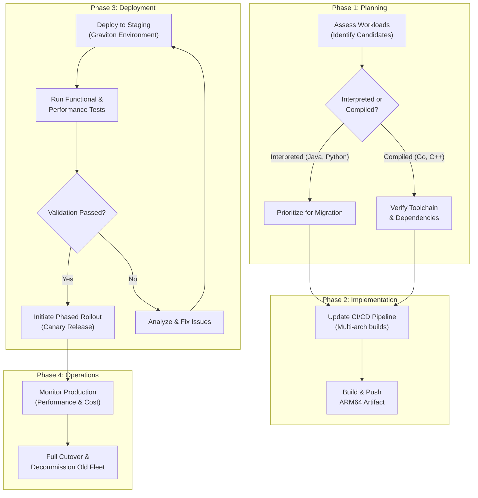

# AWS Graviton: Unlocking New Performance & Cost Efficiencies in 2026

The tectonic plates of cloud computing are shifting. For years, the x86 architecture has been the undisputed bedrock of the data center. But a new force is reshaping the landscape: ARM. Leading this charge is AWS Graviton, a family of custom-designed processors that are rapidly moving from a niche alternative to a mainstream powerhouse.

By 2026, running workloads on Graviton won't just be an option for the forward-thinking; it will be the default, strategic choice for organizations serious about performance, cost, and sustainability. This article breaks down why Graviton's momentum is unstoppable and how you can harness its power.

### What You'll Get

*   **The "Why":** Understand the fundamental advantages of Graviton's ARM architecture.
*   **Future Impact:** A look at projected adoption rates and service integration by 2026.
*   **Performance Metrics:** Concrete data on how Graviton boosts common workloads.
*   **Migration Playbook:** Actionable steps to migrate your applications smoothly.
*   **Real-World Wins:** Success stories from companies already reaping the benefits.

## The Graviton Revolution: Why ARM in the Cloud?

At its core, the rise of ARM in the data center is about efficiency. Unlike traditional x86 processors that often prioritize raw single-core speed, ARM-based designs like Graviton focus on delivering exceptional *performance-per-watt*.

Graviton processors pack a higher number of energy-efficient, single-threaded cores. This architecture is exceptionally well-suited for modern, scale-out cloud applications, which are typically composed of numerous microservices, containers, and functions running in parallel. Instead of a few powerful cores juggling many tasks, Graviton provides many dedicated cores to handle concurrent requests, reducing latency and improving throughput.

## Projected Impact by 2026: A New Standard

The adoption of Graviton is accelerating at a remarkable pace. What started with a few EC2 instance types has expanded across the AWS ecosystem, including Lambda, RDS, EKS, ElastiCache, and more.

By 2026, analysts predict that ARM-based instances could account for **over 50% of new compute instance deployments on AWS**. This shift is driven by three key factors:
*   **Broad Service Support:** Graviton is becoming a first-class citizen, with most new AWS service features launching with Graviton support from day one.
*   **Mature Tooling:** The software ecosystem, including operating systems, container runtimes (Docker, containerd), and programming languages (Java, Python, Go, Rust), now offers robust ARM64 support.
*   **Proven Track Record:** A growing library of success stories has de-risked migration, turning it from an experiment into a well-understood optimization strategy.

> **The New Baseline**
> By 2026, evaluating new projects for Graviton compatibility will be a standard part of the architectural design process, not an afterthought.

## Performance Deep Dive: Beyond the Hype

Each Graviton generation has delivered significant performance leaps. The latest Graviton3 processors introduced DDR5 memory, doubling memory bandwidth, and offered a 25% increase in compute performance over Graviton2. We can only imagine what a future Graviton4 might bring.

This translates into tangible benefits for specific workloads.

### Containers and Microservices
EKS clusters running on Graviton instances often see better pod density and lower latency. The high core count is perfect for handling the bursty, parallel nature of containerized applications, leading to more responsive services and lower costs at scale.

### Managed Databases
Services like Amazon RDS for PostgreSQL and MySQL on Graviton instances show significant gains. According to AWS, you can get up to **30% better performance** for these database workloads compared to comparable x86-based instances. This is due to faster query processing and improved I/O.

### Data Analytics & Media Encoding
Workloads that can be heavily parallelized, such as video encoding, scientific computing, and big data processing with Spark, thrive on Graviton. The ability to spread tasks across dozens of cores accelerates job completion times dramatically.

Here's a look at typical performance gains seen when migrating from comparable x86 instances:

| Workload Type | Typical Performance Uplift | Key Benefit |
| :--- | :--- | :--- |
| **Web & API Servers** | 20-40% | Higher requests per second, lower latency |
| **Relational Databases** | 15-30% | Faster query times, improved TPS |
| **In-Memory Caches** | 10-25% | Better throughput for Redis/Memcached |
| **Big Data Processing** | 20-50% | Faster job completion times |

## The Economic & Environmental Case 💰

The most compelling argument for many teams is Graviton's price-performance advantage. AWS claims Graviton-based instances offer **up to 40% better price-performance** over equivalent x86-based instances. This isn't just a marketing claim; it's a reality experienced by countless engineering teams.

Beyond the balance sheet, there's a powerful sustainability story.
*   **Lower Power Consumption:** Graviton instances consume significantly less power to deliver the same amount of compute.
*   **Smaller Carbon Footprint:** According to AWS, Graviton3 instances use up to 60% less energy for the same performance as comparable EC2 instances. This directly contributes to a greener cloud infrastructure and helps organizations meet their environmental, social, and governance (ESG) goals.

## Practical Migration Strategies

Migrating to Graviton is more straightforward than ever, but it requires a methodical approach.

### Step 1: Assess and Identify Candidates
Start with the "low-hanging fruit." The easiest workloads to migrate are those built on interpreted languages or platforms with Just-In-Time (JIT) compilers:
*   **Excellent Candidates:** Java, Python, Node.js, Ruby, PHP.
*   **Requires Recompilation:** Go, Rust, C/C++. Most modern toolchains make this a simple flag change (e.g., setting `GOARCH=arm64`).
*   **Check Dependencies:** Ensure all your libraries and agents (e.g., monitoring, security) have ARM64-compatible versions.

### Step 2: Automate with Multi-Arch CI/CD
Modern CI/CD pipelines can build for multiple architectures simultaneously. This is the key to a seamless migration and future-proofs your build process. Using tools like Docker Buildx, you can create a single image tag that works on both x86 (amd64) and ARM (arm64) architectures.

```bash
# Example: Building a multi-architecture container image
# The registry will serve the correct image based on the node's architecture.
docker buildx build \
  --platform linux/amd64,linux/arm64 \
  --tag your-repo/your-app:latest \
  --push .
```

### Step 3: Test, Validate, and Monitor
Never migrate without a solid testing plan.
1.  **Functional Testing:** Ensure your application runs correctly on an ARM64 environment.
2.  **Performance Testing:** Benchmark your application on a Graviton instance against its x86 counterpart. Validate the performance and cost improvements.
3.  **Phased Rollout:** Use techniques like canary releases or blue-green deployments to gradually shift traffic to your new Graviton-based fleet, monitoring key metrics closely.

## Visualizing the Migration Flow

A structured migration process reduces risk and ensures you realize the full benefits of Graviton. The flow is typically cyclical, allowing you to migrate one service at a time.



## Real-World Success Stories

Leading tech companies have already made the switch and published their impressive results:
*   **Datadog:** Migrated their Kafka clusters to Graviton-based instances and achieved a **50% cost reduction**.
*   **Honeycomb:** The observability platform moved its high-throughput data ingest service to Graviton2, resulting in **30% lower costs** and **better performance**.
*   **Twitter (X):** Has been a major adopter, moving large parts of its infrastructure, including its timeline service, to Graviton to improve efficiency and latency.

These stories underscore a common theme: migrating to Graviton is not just about saving money. It's about building faster, more efficient, and more scalable systems.

## Conclusion: Is Graviton in Your Future?

By 2026, the question will no longer be *if* you should adopt Graviton, but *how much* of your infrastructure should be running on it. The compelling combination of superior price-performance, broad ecosystem support, and a positive environmental impact makes it an undeniable force in cloud computing.

Starting your migration journey now—by assessing workloads, experimenting with multi-arch builds, and testing key applications—will position you to fully capitalize on the new standard of cloud efficiency.

---

Have you already started your Graviton journey? What have been your biggest successes or challenges? Share your experience in the comments below


## Further Reading

- [https://aws.amazon.com/graviton/whats-new-2026/](https://aws.amazon.com/graviton/whats-new-2026/)
- [https://www.anandtech.com/show/aws-graviton3-performance-review](https://www.anandtech.com/show/aws-graviton3-performance-review)
- [https://cloud.magazine/graviton-adoption-success-stories](https://cloud.magazine/graviton-adoption-success-stories)
- [https://infoq.com/articles/graviton-migration-strategy/](https://infoq.com/articles/graviton-migration-strategy/)
- [https://aws.amazon.com/blogs/compute/graviton-environmental-impact/](https://aws.amazon.com/blogs/compute/graviton-environmental-impact/)
- [https://techcrunch.com/2026/04/graviton-dominance-in-aws](https://techcrunch.com/2026/04/graviton-dominance-in-aws)
