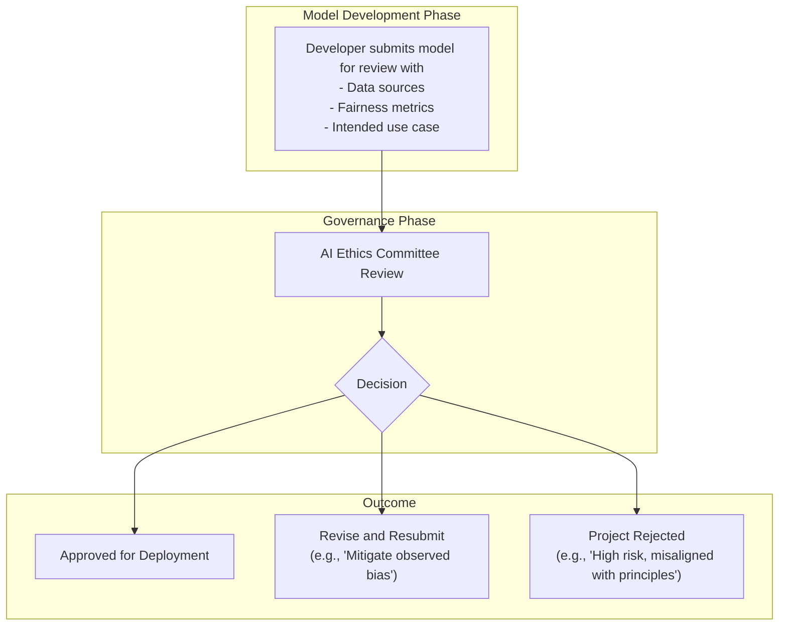

# Ethical AI Governance: Navigating Bias, Transparency & Accountability

By 2026, Artificial Intelligence is no longer a niche technology; it's the operational backbone of countless industries, from finance to healthcare. This deep integration has moved the conversation from "Can we build it?" to "How do we manage it responsibly?" The era of optional ethical guidelines is over. Today, robust AI governance is a fundamental requirement for legal compliance, customer trust, and long-term business viability.

This article dives into the practical frameworks modern organizations are implementing to govern their AI systems. We'll explore the core pillars of this new discipline: managing bias, ensuring transparency through explainable AI (XAI), and establishing clear lines of accountability.

### What You'll Get

*   **Actionable Frameworks:** A breakdown of the three pillars of AI governance: Bias Mitigation, Transparency, and Accountability.
*   **Practical Techniques:** Real-world examples, including code snippets and process diagrams, to implement these frameworks.
*   **Regulatory Insight:** An overview of the global regulatory trends shaping AI development and deployment in 2026.
*   **Key Tools:** An introduction to Explainable AI (XAI) and its role in building trustworthy systems.

---

## The Governance Imperative: From Theory to Practice

For years, AI ethics were discussed in abstract terms. Now, frameworks like the [NIST AI Risk Management Framework](https://www.nist.gov/artificial-intelligence/ai-risk-management-framework) and global standards inspired by [UNESCO's Recommendation on the Ethics of AI](https://unesdoc.unesco.org/ark:/48223/pf0000379434.locale=en) have created a clear mandate. Governance is the bridge between high-level principles and day-to-day engineering reality.

Effective governance isn't about slowing down innovation. It's about building a sustainable, trustworthy foundation for it. Organizations that fail to implement structured governance face significant risks:

*   **Regulatory Penalties:** Heavy fines for non-compliance with regulations like the EU AI Act.
*   **Reputational Damage:** Public backlash from biased or opaque AI-driven decisions.
*   **Systemic Failure:** Unreliable models that erode trust and lead to poor business outcomes.

## Pillar 1: Taming Algorithmic Bias

Bias in AI is not a hypothetical risk; it's a documented reality that can perpetuate and even amplify societal inequities. Proactively identifying and mitigating bias is the first pillar of responsible AI governance.

### Sources of Bias
*   **Data Bias:** The training data does not accurately represent the real-world environment. For example, a facial recognition model trained primarily on images of one demographic will perform poorly on others.
*   **Algorithmic Bias:** The model itself creates or amplifies biases. This can happen through proxy variables or optimization functions that inadvertently favor certain outcomes.
*   **Human Bias:** The developers' own unconscious biases are embedded into the model's design, data selection, or interpretation of results.

### Practical Mitigation Strategies

The first step is often a simple data audit. Checking for representation imbalance is a foundational task.

```python
import pandas as pd

# Load your dataset (example)
data = {'age': [25, 45, 30, 50, 22],
        'gender': ['M', 'F', 'F', 'M', 'F'],
        'approved_loan': [1, 0, 1, 0, 1]}
df = pd.DataFrame(data)

# Check for representation imbalance in a protected attribute
print("Gender distribution:")
print(df['gender'].value_counts(normalize=True))

# Output might show an imbalance, e.g., 60% 'F' and 40% 'M'
# This is a signal to investigate further or rebalance the dataset.
```

Beyond initial checks, a robust strategy includes:
*   **Diverse Data Sourcing:** Actively collect data from underrepresented groups.
*   **Fairness Metrics:** Use tools like Google's [Fairness Indicators](https://www.tensorflow.org/tfx/guide/fairness_indicators) or IBM's AI Fairness 360 to measure model performance across different subgroups.
*   **Regular Audits:** Implement a recurring process to audit models for bias drift after they are deployed.

## Pillar 2: Mandating Transparency with Explainable AI (XAI)

If you can't explain how your model works, you can't trust it. This is the core principle behind Explainable AI (XAI), a set of tools and techniques designed to make "black box" models more transparent and interpretable.

Transparency is crucial for:
*   **Debugging:** Understanding *why* a model made a specific incorrect prediction.
*   **Trust:** Giving stakeholders (users, regulators, executives) confidence in the system.
*   **Compliance:** Meeting regulatory demands for decision transparency.

An XAI workflow translates a model's complex internal logic into a human-understandable explanation.

```mermaid
graph TD
    A["Input Data (e.g., Loan Application)"] --> B{AI Model<br/>(e.g., Gradient Boosting)};
    B --> C["Prediction (e.g., 'Loan Denied')"];
    C --> D{XAI Tool<br/>(e.g., SHAP, LIME)};
    D --> E["Human-Readable Explanation<br/>('Denied because of high debt-to-income ratio')"];
    E --> F["Stakeholder Review (Auditor, Customer, Developer)"];
```

### Common XAI Techniques

| Technique            | Description                                                                                             | Best For                                                        |
| -------------------- | ------------------------------------------------------------------------------------------------------- | --------------------------------------------------------------- |
| **SHAP**             | *SHapley Additive exPlanations*. Assigns an importance value to each feature for a specific prediction.   | Complex, tabular models where feature contribution is critical. |
| **LIME**             | *Local Interpretable Model-agnostic Explanations*. Creates a simpler, local model to explain one prediction. | Explaining individual predictions from any black-box model.     |
| **Integrated Gradients** | A feature attribution method for deep neural networks, often used in computer vision. | Understanding which pixels in an image led to a classification. |

> **Info Block:** XAI is not a silver bullet. An "explanation" can sometimes be misleading or incomplete. The goal is not perfect transparency but *decision-level* clarity that allows for meaningful human oversight.

## Pillar 3: Establishing Clear Accountability

Technology alone cannot solve ethical challenges. Accountability requires a human-centric governance structure where responsibilities are clearly defined and decisions are meticulously documented.

### The Role of an AI Ethics Committee

By 2026, most mature tech organizations have established an internal AI Ethics Committee or Review Board. This is a cross-functional team responsible for setting policy and reviewing high-risk AI projects.

**Key Responsibilities:**
*   Develop and maintain the organization's AI principles.
*   Review AI projects against ethical and regulatory standards before deployment.
*   Provide guidance to development teams on mitigating risks.
*   Act as a point of escalation for ethical concerns.

A typical review process ensures that ethical considerations are embedded throughout the model lifecycle.



### The Importance of Audit Trails

Accountability is impossible without traceability. Every significant AI-driven decision must be logged. This is not just about model inputs and outputs, but also about the context.

```plaintext
// Pseudocode for an enriched audit log entry
log_event({
  timestamp: "2026-10-27T10:00:00Z",
  model_id: "credit_risk_v3.2",
  request_id: "uuid-1234-abcd",
  decision: "approve",
  confidence_score: 0.92,
  explanation_key_factors: ["low_dti", "stable_income_history"],
  human_in_the_loop: "None (auto-approved)",
  responsible_team: "consumer_lending_ai"
});
```
This kind of structured logging is invaluable for incident response, regulatory reporting, and internal audits.

---

## The Way Forward

Ethical AI governance is an ongoing process, not a one-time checklist. It requires a cultural shift that places responsibility, transparency, and fairness at the center of innovation. By building robust frameworks around bias mitigation, explainability, and accountability, organizations can not only comply with a complex regulatory landscape but also build AI systems that are truly worthy of our trust.

What are your top concerns regarding AI ethics in your organization? Share your thoughts and challenges.


## Further Reading

- [https://www.nist.gov/artificial-intelligence/ai-risk-management-framework](https://www.nist.gov/artificial-intelligence/ai-risk-management-framework)
- [https://unesdoc.unesco.org/ark:/48223/pf0000379434.locale=en](https://unesdoc.unesco.org/ark:/48223/pf0000379434.locale=en)
- [https://techcrunch.com/2026/03/ai-ethics-regulation-trends/](https://techcrunch.com/2026/03/ai-ethics-regulation-trends/)
- [https://hbr.org/2026/04/building-an-ethical-ai-framework](https://hbr.org/2026/04/building-an-ethical-ai-framework)
- [https://responsible.ai/resources/explainable-ai-best-practices](https://responsible.ai/resources/explainable-ai-best-practices)
- [https://research.google/ai-principles-and-practices/](https://research.google/ai-principles-and-practices/)
