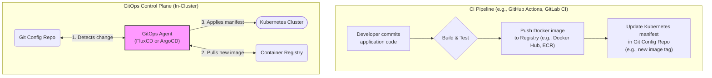

# Kubernetes GitOps: FluxCD & ArgoCD as the Control Plane

By 2026, the chaotic early days of Kubernetes management are a distant memory. The industry has decisively converged on GitOps as the standard operational model. The principle is simple yet powerful: your Git repository is the single source of truth for your cluster's desired state. This declarative approach has tamed the complexity of cloud-native infrastructure, making deployments predictable, auditable, and scalable.

At the heart of this revolution are two CNCF-graduated titans: **FluxCD** and **ArgoCD**. They have evolved beyond simple deployment tools to become the de facto control planes for Kubernetes, continuously reconciling cluster state with the configuration defined in Git. But while they share a common goal, their philosophies and features cater to different needs and team structures. This article explores how they dominate the 2026 landscape and helps you understand which one fits your stack.

### What You'll Get

*   **A 2026 Perspective:** Understand why GitOps is the undisputed standard for Kubernetes operations.
*   **Core Concepts:** A clear architectural diagram of the modern GitOps workflow.
*   **Head-to-Head Comparison:** A detailed breakdown of FluxCD vs. ArgoCD across key features.
*   **Use-Case Deep Dives:** Practical guidance on when to choose one over the other.
*   **Actionable Examples:** Concise CLI commands to illustrate core functionality.

---

## The GitOps Revolution: A 2026 Retrospective

GitOps triumphed because it directly addresses the core challenges of managing dynamic, distributed systems. By enforcing a declarative model through Git, organizations have achieved unprecedented operational maturity.

*   **Unbreakable Audit Trail:** Every change to the system—from a new application deployment to a tweaked network policy—is a Git commit. This provides a clear, immutable log of who changed what, when, and why.
*   **Enhanced Security:** Direct `kubectl` access to clusters is now an anti-pattern. Changes are proposed via pull requests, enabling peer review and automated checks *before* they are applied. The GitOps agent inside the cluster has the minimal permissions needed to enact those changes.
*   **Increased Reliability & Velocity:** Mean Time To Recovery (MTTR) plummets when a rollback is as simple as `git revert`. Developers can ship features faster, confident that the control plane will reliably sync their changes.

This model shifts the focus from imperative commands to declarative state management, making Git the true user interface for Kubernetes.

## The Core Principle: A Shared Architecture

Both FluxCD and ArgoCD operate on the same fundamental principle: an agent running in the cluster continuously monitors a Git repository and a container registry. When it detects a drift between the desired state (in Git) and the actual state (in the cluster), it takes action to converge them.

This process separates the Continuous Integration (CI) pipeline from the Continuous Delivery (CD) mechanism.



> **The CI/CD Separation of Concerns**
> Your **CI pipeline's** job ends when it produces a versioned artifact (a container image) and declares its intent to deploy it by updating a manifest in Git. The **GitOps tool (CD)** takes over from there, ensuring that declaration becomes a reality inside the cluster.

## A Head-to-Head Comparison

While built on the same foundation, FluxCD and ArgoCD offer distinct experiences. The choice often comes down to your organization's philosophy on tooling and user experience.

| Feature | FluxCD | ArgoCD |
| :--- | :--- | :--- |
| **Philosophy** | **Unopinionated Toolkit.** A collection of specialized controllers (source, kustomize, helm, notification) that you compose together. | **All-in-One Platform.** A highly opinionated, feature-rich solution with a focus on a complete user experience out of the box. |
| **User Interface** | **CLI-first and Git-native.** Status is reported back to Git and via notifications (Slack, etc.). A basic optional UI exists. | **UI-centric.** A powerful, multi-featured web UI is a primary selling point for visualizing application state and managing deployments. |
| **Multi-Tenancy** | Managed via Kubernetes RBAC and Namespace restrictions. Each team can manage their own `Kustomization` resources. | **Built-in via `AppProject` CRD.** Provides granular RBAC, restricting what can be deployed, where it can be deployed, and from which Git repos. |
| **Automation** | **First-class image update automation.** The `Image-Automation-Controller` can watch a container registry, update YAML in Git, and commit the change automatically. | **Primarily manifest-driven.** Image updates are typically handled by an external tool in the CI pipeline that commits the new tag to Git. [Argo CD Image Updater](https://argocd-image-updater.readthedocs.io/) is a community add-on. |
| **Extensibility** | Highly composable. Its toolkit nature means you only run the controllers you need, making it very lightweight and flexible. | Rich feature set including sync waves, hooks (PreSync, Sync, PostSync), and advanced diffing logic for complex deployment orchestration. |
| **Official Docs** | [fluxcd.io](https://fluxcd.io/docs/) | [argocd.readthedocs.io](https://argocd.readthedocs.io/en/stable/) |

## Deep Dive: When to Choose FluxCD

Choose FluxCD if your team values a **composable, Kubernetes-native** experience. It's often favored by platform engineers building internal platforms, as its modularity allows them to construct a delivery system that perfectly fits their needs.

### Key Strengths of FluxCD

*   **Lean and Modular:** You only install the components you need. If you don't use Helm, you don't need to run the Helm controller. This keeps the footprint small.
*   **Seamless Image Automation:** The ability to automatically scan a container registry and commit version bumps back to your Git repository is a killer feature. This closes the loop on CI/CD without extra tooling.
*   **Deep Kustomize Integration:** Flux is built around the idea of composing Kubernetes manifests, making it a natural fit for heavy Kustomize users.

A typical bootstrapping process is simple and powerful, immediately connecting your cluster to a Git repository.

```bash
# Example: Bootstrapping a cluster with Flux
flux bootstrap github \
  --owner=$GITHUB_USER \
  --repository=my-cluster-config \
  --branch=main \
  --path=./clusters/my-cluster \
  --personal
```
This single command installs Flux, creates a repository if it doesn't exist, and configures the cluster to manage itself from that repository.

## Deep Dive: When to Choose ArgoCD

ArgoCD shines in environments where a **centralized, user-friendly control plane** is needed for application teams. Its web UI is a significant differentiator, providing developers with clear, immediate feedback on the status of their deployments.

### Key Strengths of ArgoCD

*   **Powerful User Interface:** The UI is not just for visualization. It allows for manual syncing, rollback, and detailed inspection of resource states, making it accessible to team members less comfortable with `kubectl`.
*   **Robust Multi-Tenancy:** The `AppProject` CRD is perfect for large organizations. It lets platform teams enforce security and governance by defining which teams can deploy to which clusters and from which source repositories.
*   **Advanced Sync Management:** Sync Waves and Hooks provide granular control over complex deployments, ensuring resources are created or updated in a specific order—essential for applications with complex dependencies.

Creating an application is straightforward, whether via the UI or the CLI.

```bash
# Example: Creating an application with the ArgoCD CLI
argocd app create guestbook \
  --repo https://github.com/argoproj/argocd-example-apps.git \
  --path guestbook \
  --dest-server https://kubernetes.default.svc \
  --dest-namespace default
```
This command instructs ArgoCD to monitor the `guestbook` path in the specified repository and ensure its manifests are synced to the `default` namespace.

## Conclusion: Two Paths to GitOps Excellence

By 2026, the question is no longer *if* you should use GitOps, but *how*. Both FluxCD and ArgoCD provide robust, production-grade solutions for implementing a GitOps control plane.

*   **FluxCD** is the choice for a lean, composable, and automation-centric approach, favored by platform teams who want to build a bespoke delivery system with Kubernetes-native primitives.
*   **ArgoCD** is the go-to for organizations seeking an all-in-one solution with a best-in-class UI and strong multi-tenancy controls, empowering application teams with visibility and control.

Neither choice is wrong. The best tool is the one that aligns with your team's culture, workflow, and technical philosophy. The GitOps era is fully realized, and these two projects are leading the charge.

Which GitOps tool powers your stack, and why? Share your experience in the comments below


## Further Reading

- [https://fluxcd.io/docs/latest/](https://fluxcd.io/docs/latest/)
- [https://argocd.readthedocs.io/en/stable/](https://argocd.readthedocs.io/en/stable/)
- [https://cncf.io/blog/gitops-report-2026/](https://cncf.io/blog/gitops-report-2026/)
- [https://www.weave.works/blog/gitops-best-practices/](https://www.weave.works/blog/gitops-best-practices/)
- [https://redhat.com/blog/gitops-with-openshift-argocd/](https://redhat.com/blog/gitops-with-openshift-argocd/)
- [https://dev.to/community/fluxcd-vs-argocd-comparison](https://dev.to/community/fluxcd-vs-argocd-comparison)
