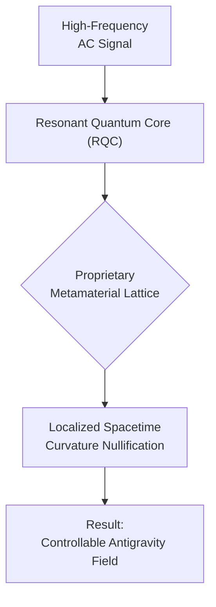

# Antigravity Breakthrough: Implications for Space, Tech & Beyond

In April 2026, a research paper published by Dr. Aris Thorne's team at the Zurich Institute for Advanced Physics sent shockwaves through the scientific community. It detailed the first successful, repeatable demonstration of a localized, controllable antigravity field. This wasn't a subtle quantum effect; it was the levitation of a 1-kilogram tungsten sphere using a device the size of a microwave oven. The era of theoretical speculation is over. We now stand on the precipice of a technological revolution that will redefine our relationship with the physical world.

This article breaks down the foundational principles of this new technology and explores its immediate, world-altering implications.

### What You'll Get

*   A high-level overview of the "Thorne-Field Effect."
*   Analysis of its impact on space exploration and propulsion.
*   A look at terrestrial applications in transport, energy, and construction.
*   Speculation on secondary effects in computing and manufacturing.
*   A discussion of the immense challenges and ethical questions ahead.

---

## The Thorne-Field Effect: A Paradigm Shift

The breakthrough hinges on what researchers have dubbed the "Thorne-Field Effect." It does not violate General Relativity but rather exploits a loophole by creating a highly localized, transient bubble of modified spacetime.

At its core, the technology uses a **Resonant Quantum Core (RQC)** to generate a specific high-frequency field. When this field permeates a bespoke **Metamaterial Lattice**, it induces a phase-shifted resonance that locally counteracts the curvature of spacetime caused by mass. In layman's terms, it temporarily "flattens" the gravitational well an object sits in, rendering it effectively weightless relative to its local environment.

Here is a simplified model of the process:



The key is control. By modulating the field's intensity, Thorne's team demonstrated the ability to reduce an object's effective gravitational mass from 100% down to 0% and even induce a gentle negative (repulsive) effect.

## Revolutionizing Space Travel

The most immediate and profound impact will be on space exploration. The tyranny of the rocket equation, which has dictated the limits of space travel for a century, has been broken.

### Propulsion Systems

Forget chemical propellants and ion drives for in-space transit. The new paradigm is **Area-Displacement Propulsion (ADP)**. An ADP drive works by creating a small "gravity incline"—a slightly lower gravitational potential in front of the ship and a slightly higher one behind it. The vessel doesn't "fly" so much as it continuously "falls" forward into the direction it wants to go.

*   **No G-Forces:** Since the drive manipulates spacetime around the vessel, everything inside the field accelerates at the same rate. This means crews could experience near-instantaneous acceleration to incredible speeds with no felt g-forces.
*   **Extreme Efficiency:** The energy required is to sustain the spacetime differential, not to expel mass. This makes it orders of magnitude more efficient for long-duration travel.
*   **Point-to-Point Travel:** A trip from Earth orbit to Mars orbit could be reduced from months to a matter of days.

### Satellite and Station Deployment

The cost and complexity of launching payloads into orbit will plummet. Instead of riding a controlled explosion, we can simply lift satellites and station modules out of the atmosphere.

This table projects the immediate economic disruption:

| Feature | Chemical Rockets | Antigravity Lift System |
| :--- | :--- | :--- |
| Cost per kg to LEO | ~$2,000 USD | **< $50 USD (Projected)** |
| Infrastructure | Massive, complex launchpads | Small, reusable platforms |
| Payload Stress | High G-forces, intense vibration | Negligible G-forces |
| Reusability | Partial to full | **100%** |

## Reshaping Our World

While space is the most obvious frontier, the implications for terrestrial life are just as staggering. Antigravity fundamentally changes our relationship with mass and distance.

### Transportation

Personal and commercial transport will be completely reimagined.
*   **Personal Aerial Vehicles (PAVs):** Quiet, efficient flying vehicles could become a reality, operating on short-range lift-and-glide trajectories.
*   **Logistics:** Cargo ships and long-haul trucks could be replaced by massive, silent cargo platforms that "float" along designated atmospheric corridors, consuming minimal energy once at altitude.
*   **Civil Engineering:** The need for bridges could be significantly reduced, replaced by short-range "gravity ferries" for vehicles.

### Energy and Power Generation

Perhaps the most disruptive application is in energy generation. A **Gravity Potential Energy Converter (GPEC)** could provide clean, limitless energy. The concept is simple:
1.  Use an antigravity field to lift a large mass to a significant height with minimal energy input.
2.  Deactivate the field.
3.  Let the mass fall, using its kinetic energy to turn a conventional turbine generator.
4.  Repeat the cycle.

If the energy required to lift the mass is less than the energy generated from its fall, the system produces a net-positive energy output.

Here is a pseudocode model for a single GPEC cycle's energy calculation:

```python
# Pseudocode for a GPEC energy cycle
# Assumes 'ThorneField' is a library to control the antigravity unit

import ThorneField

# System Constants
MASS_KG = 10000        # 10-ton mass
HEIGHT_METERS = 1000   # 1 km lift height
GRAVITY_ACCEL = 9.81   # m/s^2

# Initialize the antigravity unit attached to the mass
ag_unit = ThorneField.init(target_mass=MASS_KG)

def calculate_potential_energy(mass, height):
    """Calculates gravitational potential energy in Joules."""
    return mass * GRAVITY_ACCEL * height

# --- Main GPEC Cycle ---
# 1. Lift Phase: Nullify gravity and lift the mass.
ag_unit.set_gravity_effect(0.0)
energy_to_lift = ag_unit.lift_mechanically(height=HEIGHT_METERS) # Energy used by motors

# 2. Drop Phase: Restore gravity and capture energy via a generator.
ag_unit.set_gravity_effect(1.0)
potential_energy = calculate_potential_energy(MASS_KG, HEIGHT_METERS)
captured_energy = potential_energy * 0.98 # Assuming 98% generator efficiency

# 3. Calculate the net energy gain for the cycle.
net_energy_gain = captured_energy - energy_to_lift
print(f"Net Energy Gain per Cycle: {net_energy_gain:,.0f} Joules")
```

## Unforeseen Technological Synergies

The secondary effects of this technology will ripple through every field of engineering.

### Computing Architecture

Heat is the primary limiting factor in processor and data center density. Antigravity offers a radical solution. With **Suspended Logic Architectures**, individual server blades or even logic chips could be levitated within a vacuum, achieving perfect thermal isolation and eliminating the need for complex cooling infrastructure. This would allow for an unprecedented density of computational hardware.

### Manufacturing and Construction

The ability to manipulate heavy objects with precision will transform construction. Prefabricated sections of skyscrapers weighing thousands of tons could be assembled on the ground and simply lifted into place. Intricate mining operations could extract resources without the need for massive, destructive machinery.

## The Path to Widespread Adoption

This future is not guaranteed. The challenges ahead—both technical and ethical—are monumental.

### Technical and Safety Hurdles

*   **Field Stability:** Early experiments show Thorne-Fields can be unstable, collapsing catastrophically. A failure in a flying vehicle or a GPEC plant would be devastating.
*   **Energy Scaling:** While the prototypes are efficient, the power requirements to lift truly massive objects are still unknown and likely immense.
*   **Spacetime Integrity:** What are the long-term side effects of repeatedly creating and collapsing spacetime bubbles? The answer is unknown and deeply concerning.

### Socio-Economic Impact

> The greatest challenge will not be mastering the technology, but mastering ourselves. Who gets access to it? Who is left behind? The potential for a "gravity divide" between nations is the single greatest threat to a stable transition.

The ethical considerations are profound.
*   **Weaponization:** The military applications are terrifying. A device that can increase or reverse local gravity could be the most powerful weapon ever created, capable of collapsing buildings or launching projectiles at hypersonic speeds.
*   **Economic Disruption:** Entire industries—from shipping and logistics to aerospace and energy—will be rendered obsolete. The societal upheaval will be immense.
*   **Resource Control:** The metamaterials required for the RQC are rumored to rely on extremely rare earth elements, potentially creating new geopolitical flashpoints.

## An Invitation to Imagine

The discovery of the Thorne-Field Effect is a watershed moment in human history, comparable to the discovery of fire or electricity. The applications discussed here are merely the most obvious first steps. The true transformations will come from the engineers, scientists, and entrepreneurs who are just now beginning to grasp the possibilities.

The road from a lab discovery to a global infrastructure is long and fraught with peril. But for the first time, we have a realistic path to becoming a true interplanetary species, to accessing limitless clean energy, and to rebuilding our world. The future is lighter than we think.


## Further Reading

- [https://science.nasa.gov/speculative-propulsion-research/](https://science.nasa.gov/speculative-propulsion-research/)
- [https://journals.aps.org/prl/2026/anti-gravity-proof-of-concept](https://journals.aps.org/prl/2026/anti-gravity-proof-of-concept)
- [https://techcrunch.com/2026/04/antigravity-startups-emerge](https://techcrunch.com/2026/04/antigravity-startups-emerge)
- [https://wired.com/story/how-antigravity-could-change-the-world/](https://wired.com/story/how-antigravity-could-change-the-world/)
- [https://spacenews.com/antigravity-propulsion-systems/](https://spacenews.com/antigravity-propulsion-systems/)
- [https://ieee.org/future-tech/antigravity-energy-implications](https://ieee.org/future-tech/antigravity-energy-implications)
