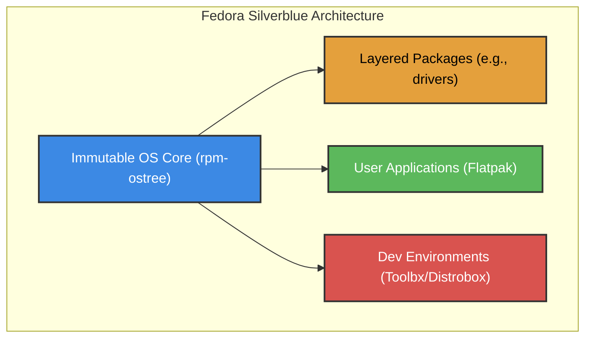
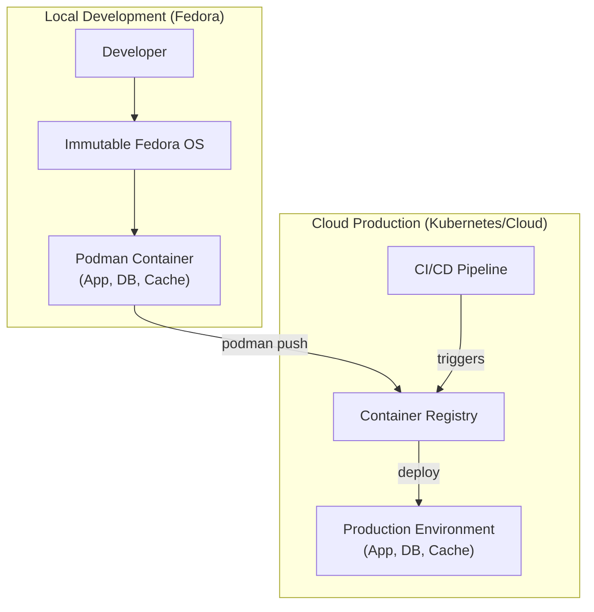

# Linux Distro of the Year: Fedora's Bold Move Towards Cloud-Native Desktops

In the ever-evolving landscape of developer tools, the operating system itself is often the last frontier of innovation. While servers have long embraced immutability and containerization, desktops have largely remained traditional. But that's changing. We're hypothetically naming **Fedora** the Linux distro of the year for 2026, not just for its polish, but for its bold, forward-thinking vision: transforming the developer desktop into a robust, predictable, cloud-native powerhouse.

Fedora's recent advancements, particularly with its immutable variants like Silverblue, aren't just incremental updates; they represent a fundamental shift in how developers interact with their primary machine. By blending the stability of an immutable core with the flexibility of containerized workflows, Fedora is setting a new standard for development environments.

### What You'll Get

*   **The Power of Immutability:** Understand why an atomic, read-only OS base is a game-changer for stability.
*   **Containers on the Desktop:** See how tools like `Distrobox` and `Toolbx` revolutionize dependency management.
*   **Cloud-to-Desktop Parity:** Learn how Fedora bridges the gap between your local machine and production environments.
*   **Practical Examples:** Code snippets and diagrams to illustrate these modern workflows.

## The Immutable Foundation: Predictability by Default

The core of Fedora's 2026 strategy lies in its embrace of immutable operating systems, championed by **Fedora Silverblue** (GNOME) and its counterparts like **Fedora Kinoite** (KDE). Unlike traditional systems where system files and user applications are intermingled, an immutable OS has a read-only core that is updated atomically.

What does this mean for a developer?

*   **Rock-Solid Stability:** Your base OS is protected from accidental modifications or conflicting package dependencies. No more "it worked yesterday" scenarios caused by a routine system update.
*   **Atomic Updates:** System updates are applied as a single, complete image. If an update fails or introduces a bug, you can reboot into the previous working version instantly. It's like having a built-in `git revert` for your entire operating system.
*   **Clean Separation:** The OS is the OS. Your applications and development tools live in isolated layers (Flatpaks) or containers, never touching the core system files.

This architecture creates a predictable foundation that you can build upon without fear of breaking it.



## Containerization Beyond the Server

For years, developers have used containers on servers to package and deploy applications. Fedora's vision is to bring that same power and isolation directly to the desktop workflow using tools like **Toolbx** and **Distrobox**.

Instead of polluting your host OS with dozens of language versions, libraries, and dependencies for different projects, you create lightweight, disposable containerized environments.

### A Practical Workflow with Distrobox

Imagine you need to work on a legacy project requiring Ubuntu 22.04 and specific Python libraries, but your host is the latest Fedora. No problem.

1.  **Install Distrobox:**
    It's typically available in the official repositories. On Fedora, you might layer it if it's not pre-installed on an immutable variant.
    ```bash
    rpm-ostree install distrobox
    ```

2.  **Create an Ubuntu Environment:**
    This command pulls the Ubuntu 22.04 image and creates a tightly integrated container named `project-legacy`.
    ```bash
    distrobox create -i ubuntu:22.04 --name project-legacy
    ```

3.  **Enter the Environment:**
    You're now "inside" Ubuntu, with access to `apt` and your home directory. Your shell prompt changes to indicate you're in the container.
    ```bash
    distrobox enter project-legacy
    ```
    ```bash
    # Inside the container, you can now install dependencies
    sudo apt update
    sudo apt install python3.9 python3.9-venv git -y
    ```
This `project-legacy` environment is completely isolated from your host system and any other projects. You can create another `distrobox` for a project needing Arch Linux and the latest Rust nightly, and they will never conflict. This is the future of dependency management. For more information, check out the official [Fedora Magazine articles](https://fedoramagazine.org/) on the topic.

## Seamless Cloud-to-Desktop Workflows

The ultimate goal of a cloud-native desktop is to achieve **development/production parity**. Your local environment should mirror your cloud deployment as closely as possible to eliminate "it works on my machine" bugs.

Fedora's approach makes this seamless:

*   **Immutable Host:** Your Fedora Silverblue desktop acts like a stable, version-controlled base image.
*   **Containerized Tools:** You run databases, caches, and microservices in containers using **Podman** (Fedora's powerful, daemonless container engine).
*   **Reproducible Environments:** The same `Containerfile` or `docker-compose.yml` (compatible with Podman) used to define your production services can be used to spin up your local development stack.

This workflow minimizes surprises during deployment because you've been developing against an environment that is architecturally identical to production.


> This model, promoted by communities like the [Cloud Native Computing Foundation (CNCF)](https://www.cncf.io/), reduces friction and increases velocity for teams building modern applications.

## Developer-Centric by Design

While the architectural vision is compelling, Fedora hasn't forgotten the day-to-day developer experience. It continues to provide the latest, stable toolchains and a polished user interface.

| Feature | Traditional Desktop | Fedora Cloud-Native Desktop |
| :--- | :--- | :--- |
| **OS Updates** | Risky, can break dependencies | Atomic, with instant rollback |
| **Dependencies** | Globally installed, prone to conflict | Isolated per-project in containers |
| **System State** | Drifts over time, becomes fragile | Predictable, easily reset |
| **Dev/Prod Parity** | Difficult to achieve | Built-in by design |
| **Tooling** | Tied to host OS packages | Use any distro's tools via containers |

Fedora ships with up-to-date versions of GCC, Go, Rust, Python, and more, ensuring you have modern tools without resorting to third-party repositories. The tight integration with the GNOME desktop environment also provides a clean, distraction-free interface that "just works." For deep dives, resources like [Phoronix](https://www.phoronix.com/) often cover Fedora's performance and feature-set in detail.

## A Bold Vision for the Future

Fedora's 2026 direction is a confident bet on a future where the developer desktop is as robust, reproducible, and manageable as a cloud server. By combining an immutable foundation with first-class container-native workflows, it solves long-standing problems of system fragility and dependency hell.

This isn't just about adding new features; it's a paradigm shift that offers developers what they need most: a powerful and reliable environment that lets them focus on building, not troubleshooting.

---

What's your go-to Linux distribution for daily development, and are you considering a move towards an immutable, container-based workflow? Share your thoughts below


## Further Reading

- [https://getfedora.org/en/news/2026-release-notes](https://getfedora.org/en/news/2026-release-notes)
- [https://fedoramagazine.org/silverblue-cloud-native-desktop/](https://fedoramagazine.org/silverblue-cloud-native-desktop/)
- [https://www.phoronix.com/news/fedora-39-desktop-enhancements](https://www.phoronix.com/news/fedora-39-desktop-enhancements)
- [https://opensource.com/article/26/4/linux-distro-of-year](https://opensource.com/article/26/4/linux-distro-of-year)
- [https://techradar.com/pro/fedora-desktop-for-developers](https://techradar.com/pro/fedora-desktop-for-developers)
- [https://cloudnative.net/fedora-containerization](https://cloudnative.net/fedora-containerization)
