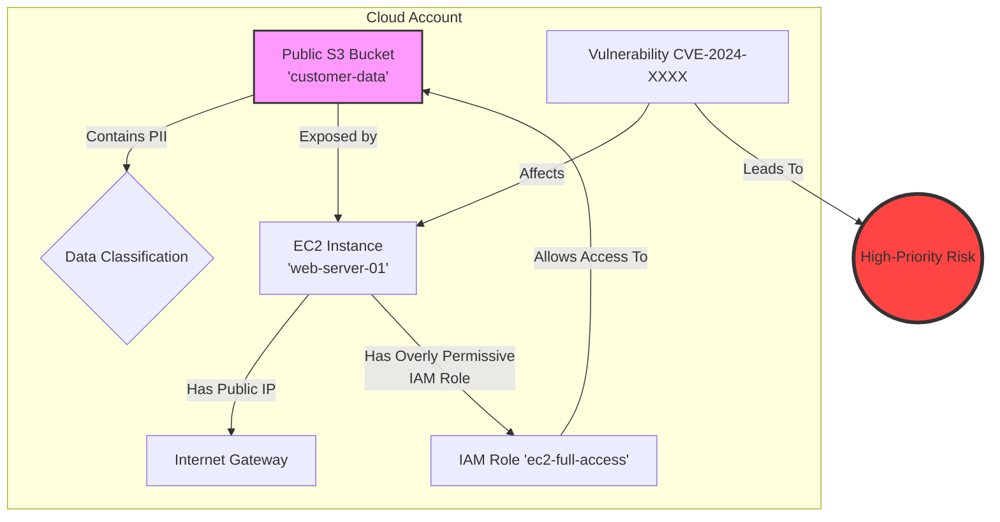
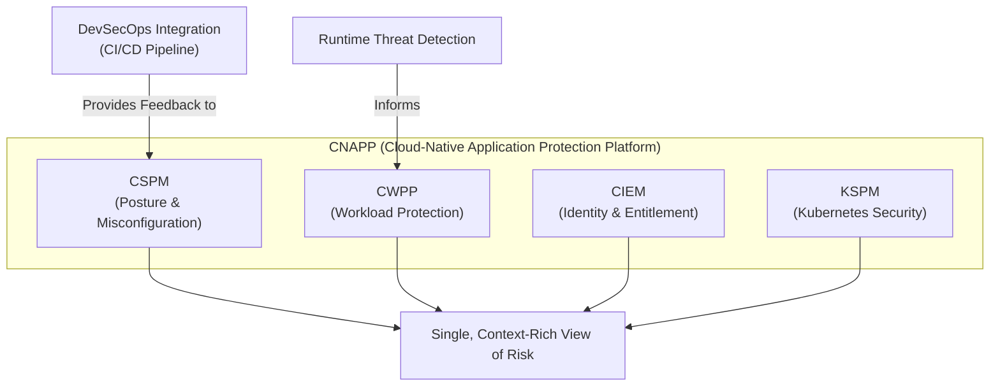

# Cloud Security Posture Management (CSPM): Beyond Compliance in 2026

Cloud Security Posture Management (CSPM) has long been the backbone of cloud compliance, tirelessly scanning for misconfigurations against established benchmarks. But the game is changing. By 2026, the most effective CSPM platforms will have evolved far beyond simple checkbox security. They are becoming intelligent, proactive, and deeply integrated nerve centers for cloud defense.

This isn't just an incremental update; it's a fundamental shift from reactive alerting to predictive risk remediation. As cloud environments grow in complexity across multiple providers, the old way of managing posture with a flood of context-less alerts is no longer sustainable. The future is about intelligence, automation, and a holistic understanding of risk.

### What You'll Get

*   **The Evolution:** Understand the shift from compliance-driven CSPM to proactive, risk-based security.
*   **Future Pillars:** A deep dive into the core technologies shaping CSPM: AI-driven automation, graph-based analysis, and deep DevSecOps integration.
*   **Architectural Context:** See how CSPM fits into the broader Cloud-Native Application Protection Platform (CNAPP) ecosystem.
*   **Actionable Strategy:** Learn practical steps to prepare your cloud security strategy for the near future.

---

## The Shift: From Reactive Compliance to Proactive Risk Management

Traditional CSPM tools are great at one thing: identifying deviations from a baseline. An S3 bucket is public, a security group allows port 22 from anywhere, an encryption key is not enabled. While essential, this approach often leads to two major problems:

1.  **Alert Fatigue:** Security teams are inundated with thousands of low-context alerts, making it impossible to distinguish a minor policy deviation from a critical, exploitable risk.
2.  **Lack of Business Context:** A public S3 bucket containing public marketing assets is a low-risk finding. A public S3 bucket with an overly permissive IAM role, connected to an EC2 instance running a vulnerable application and containing classified PII, is a potential company-ending breach. Traditional CSPM struggles to connect these dots.

> The future of CSPM, as highlighted in market analysis from firms like [Gartner](https://www.gartner.com/en/information-technology/glossary/cloud-security-posture-management-cspm), is defined by its ability to provide this missing context and prioritize threats based on *actual risk*, not just configuration drift.

## Core Pillars of CSPM in 2026

The next generation of CSPM is built on several key technological and philosophical advancements. These pillars work together to create a more intelligent and responsive security framework.

### ### AI-Driven Automation and Remediation

By 2026, AI and machine learning will be non-negotiable features. Instead of just flagging a problem, advanced CSPM will:

*   **Predict potential attack paths:** Analyze configurations to identify chained vulnerabilities that could lead to a breach.
*   **Automate remediation workflows:** Move beyond simple notifications to trigger automated responses via tools like AWS Lambda, Azure Functions, or integrated SOAR platforms.
*   **Generate context-aware fixes:** Instead of a generic "fix this," the system will provide code-level suggestions (e.g., a specific Terraform HCL or IAM policy snippet) to resolve the issue with precision.

### ### Context is King: The Rise of Graph-Based Analysis

The most significant leap forward is the move to graph-based analysis. Cloud environments are not a list of independent resources; they are a complex, interconnected web of assets, identities, data, and permissions. Graph databases excel at mapping and querying these relationships.

This allows a modern CSPM to answer critical questions:
*   *Which publicly exposed compute instances have permissions to access our most sensitive data stores?*
*   *What is the full "blast radius" if this specific developer's credentials are compromised?*
*   *Is this vulnerability on a non-production instance, or does it sit on the critical path to our customer payment database?*

This diagram illustrates how seemingly separate findings connect to form a high-priority risk.



### ### Deep Integration with DevSecOps

The principle of *shifting left* is becoming a reality. Instead of finding misconfigurations in production, the goal is to prevent them from ever being deployed. Future CSPM platforms are deeply embedded in the developer workflow.

This means:
*   **Infrastructure as Code (IaC) Scanning:** Scanning Terraform, CloudFormation, and Bicep templates directly within the CI/CD pipeline.
*   **IDE Plugins:** Providing real-time feedback to developers as they write their infrastructure code.
*   **GitOps Integration:** Ensuring that any change to the desired state in a Git repository is validated against security policies before it's applied.

Here's a simple example of what a pipeline step might look like in a GitHub Actions workflow:

```yaml
# Example snippet for a GitHub Actions workflow
- name: Run CSPM Scan on IaC
  uses: your-cspm-vendor/scanner-action@v2
  with:
    # Path to your infrastructure code
    iac_path: './terraform'
    # Fail the build if critical issues are found
    fail_on_severity: 'critical'
    api_key: ${{ secrets.CSPM_API_KEY }}
```

## CSPM and the Broader Security Ecosystem

CSPM is no longer a standalone tool. It is a critical component of a larger, unified security platform known as a **Cloud-Native Application Protection Platform (CNAPP)**. This convergence is driven by the need for a single source of truth for cloud security.

A CNAPP integrates multiple security functions:
*   **CSPM:** Secures the cloud control plane and configuration.
*   **Cloud Workload Protection Platform (CWPP):** Secures the workloads themselves (VMs, containers, serverless functions) at runtime.
*   **Cloud Infrastructure Entitlement Management (CIEM):** Manages identities, permissions, and entitlements.
*   **Kubernetes Security Posture Management (KSPM):** A specialized form of CSPM for Kubernetes environments.



This integrated approach, championed by organizations like the [Cloud Security Alliance](https://cloudsecurityalliance.org/research/cloud-security-posture-management/), ensures that posture data from CSPM is enriched with runtime context from CWPP and identity insights from CIEM, providing unparalleled visibility.

## Practical Steps to Future-Proof Your CSPM Strategy

To prepare for this evolution, security practitioners should start rethinking their approach today.

| Traditional Approach | Future-Proof Approach |
| :--- | :--- |
| Focus on compliance frameworks (CIS, NIST). | Prioritize alerts based on **quantifiable risk** and attack paths. |
| Review alerts in a security console. | Integrate findings directly into developer workflows (Jira, Slack, PRs). |
| Manual or scripted remediation. | Leverage **automated remediation** for high-confidence, low-impact findings. |
| Siloed tool for cloud configuration. | Adopt a unified **CNAPP platform** that provides holistic visibility. |

When evaluating tools, ask vendors about their roadmap for graph-based analysis, AI-driven prioritization, and CI/CD integration. These are the features that will separate the leaders from the laggards.

## Conclusion: The Strategic Imperative of Modern CSPM

By 2026, CSPM will be unrecognizable from its compliance-centric origins. It will serve as the intelligent, predictive, and automated core of cloud security operations. By correlating posture, workloads, identities, and data, it will finally deliver on the promise of not just finding problems, but preventing breaches before they can happen.

For organizations operating in the cloud, investing in a forward-looking CSPM strategy is not just a technical upgrade—it's a strategic imperative for survival and growth in an increasingly complex threat landscape.

---

**What about you? What is your single biggest challenge with your current CSPM solution? Share your thoughts below!**


## Further Reading

- [https://www.gartner.com/en/articles/cspm-market-guide-2026](https://www.gartner.com/en/articles/cspm-market-guide-2026)
- [https://cloudsecurityalliance.org/research/cspm-evolution/](https://cloudsecurityalliance.org/research/cspm-evolution/)
- [https://paloaltonetworks.com/cloud-security/cspm-trends-2026](https://paloaltonetworks.com/cloud-security/cspm-trends-2026)
- [https://infoq.com/cspm-devsecops-integration/](https://infoq.com/cspm-devsecops-integration/)
- [https://aws.amazon.com/security/cspm-solutions/](https://aws.amazon.com/security/cspm-solutions/)
- [https://learn.microsoft.com/en-us/azure/security-center/concept-cspm](https://learn.microsoft.com/en-us/azure/security-center/concept-cspm)
