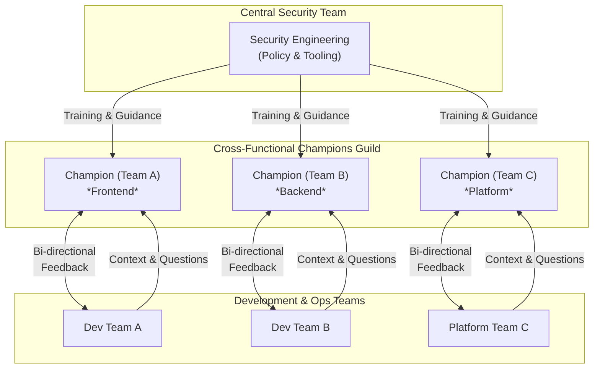

# DevSecOps Culture: Fostering Security Champions Beyond Tooling

In the relentless push to "shift left," many organizations have invested heavily in DevSecOps tooling. CI/CD pipelines are now studded with SAST, DAST, and SCA scanners, promising automated security from commit to cloud. Yet, by 2026, the industry has learned a hard lesson: a pipeline full of security tools does not equal a secure organization. The most resilient companies are those that have looked beyond automation and invested in their most critical asset: their people.

This article argues that the cornerstone of a mature DevSecOps practice is a deeply embedded security culture, cultivated and amplified by a network of Security Champions. We'll explore why tooling fails without this cultural foundation and provide a blueprint for building a champions program that drives genuine, lasting change.

### What You'll Get

*   **The Flaw in a Tool-Centric Approach:** An analysis of why automation alone creates friction and alert fatigue.
*   **The Role of a Security Champion:** A clear definition of this critical role as a cultural catalyst, not a mini-pentester.
*   **A Blueprint for Your Champions Program:** Actionable steps for identifying, training, and empowering champions.
*   **Strategies for Cultural Integration:** Techniques for creating feedback loops and making security a shared, blameless responsibility.

---

## The Tooling Trap: Why Automation Isn't Enough

Automated security tooling is essential. It provides a baseline, catches low-hanging fruit, and scales security checks in a way humans cannot. However, relying on it exclusively leads to predictable failure patterns.

*   **Alert Fatigue:** Developers are inundated with findings from scanners that lack application context. This noise leads to legitimate vulnerabilities being ignored alongside false positives.
*   **Friction Over Flow:** When security tools are implemented as blocking gates without cultural buy-in, they are seen as obstacles. Developers learn to work *around* security, not *with* it.
*   **Reactive, Not Proactive:** Tools are excellent at finding vulnerabilities that have already been written. They do little to prevent developers from writing insecure code in the first place. A security-first mindset is the ultimate "shift left."

The fundamental problem is that tools identify problems, but people solve them. Without a culture of shared responsibility, the security team becomes a perpetual bottleneck, and the development team becomes frustrated.

> **The Goal of DevSecOps:** "The purpose of DevSecOps is not to have developers become security experts, but to enable them to make better security decisions with the information they have." - [InfoQ](https://www.infoq.com/articles/devsecops-cultural-transformation/)

## Enter the Security Champion: The Cultural Catalyst

A Security Champions program formalizes the idea of shared responsibility. It creates a distributed network of security advocates embedded directly within development and operations teams.

### What is a Security Champion?

A Security Champion is a developer, QA engineer, or SRE who has a passion for security and a desire to learn more. They are not security police; they are enablers, translators, and guides.

*   **Bridge, Not a Gate:** They connect their team to the central security team, translating security requirements into a developer's context and vice-versa.
*   **First Responder:** They act as the initial point of contact for security questions and triage findings from automated tools, adding crucial business context.
*   **Advocate for Best Practices:** They champion secure coding standards, participate in threat modeling sessions, and help their peers understand the "why" behind security policies.

The Champion model scales the security team's efforts without needing to hire an army of security engineers.


*A diagram illustrating the flow of information between the central security team, the champions, and their respective development teams.*

## Cultivating Champions: A Practical Blueprint

Building a successful program requires a deliberate, structured approach. It's about empowerment, not delegation.

### Step 1: Identify and Recruit

Start by looking for volunteers. The best champions are driven by intrinsic motivation and curiosity.

*   **Who to look for:** The developer who always asks "what if?" during code reviews, the engineer who reports a minor security bug they found, or the team member who actively follows security news.
*   **Make it official:** Grant them the official title of "Security Champion." This recognition validates their effort and gives them the authority to advocate for security within their team.
*   **Start small:** Begin with a pilot group of 5-10 champions. Learn and adapt the program before scaling it across the organization.

### Step 2: Empower Through Training

Once you have your champions, you must equip them for success. Their training should be practical and continuous.

*   **Foundational Knowledge:** Start with core concepts like the [OWASP Top 10](https://owasp.org/www-project-top-ten/), threat modeling fundamentals (e.g., STRIDE), and secure design principles.
*   **Tooling Expertise:** Train them to be power users of the security tools your organization uses. They should understand how to interpret results, identify false positives, and fine-tune configurations.
*   **Soft Skills:** Communication is key. Provide training on how to influence without authority, present security risks in terms of business impact, and lead blameless discussions.

### Step 3: Integrate and Support

A champions program will wither without ongoing support and a clear structure.

*   **Create a Community:** Establish a dedicated communication channel (e.g., a Slack or Teams channel) for all champions and the security team. This becomes a space for asking questions, sharing wins, and discussing emerging threats.
*   **Provide a Time Budget:** Work with engineering managers to formally allocate a portion of a champion's time (e.g., 10-15%) to their security duties. This prevents burnout and signals that the organization values this work.
*   **Recognize and Reward:** Acknowledge their contributions publicly. While some organizations offer extrinsic rewards, intrinsic motivators are often more powerful.

| Reward Type | Example | Impact |
| --- | --- | --- |
| **Intrinsic** | Public recognition in company all-hands | Builds reputation and reinforces positive behavior. |
| **Intrinsic** | Opportunities for advanced security training/certifications | Fulfills desire for mastery and career growth. |
| **Extrinsic** | Small quarterly bonuses or gift cards | Can be effective but may reduce intrinsic motivation. |
| **Extrinsic** | Exclusive "Security Champions" swag | Fosters a sense of identity and belonging to the group. |

## Weaving Security into the Daily Fabric

Champions are the catalysts, but the ultimate goal is to embed a security mindset across the entire engineering organization. This requires creating virtuous cycles of feedback and learning.

### Effective Feedback Loops

The way security findings are presented is critical. The goal is to make security a natural part of the development workflow, not a separate, painful step.

A common practice is to integrate scanner results directly into the tools developers already use, like Jira or Azure DevOps. However, simply creating tickets is not enough.

```yaml
# Example .gitlab-ci.yml stage for non-blocking security scan

sast_scan:
  stage: test
  image: secure-code-analyzer:latest
  script:
    - /analyzer run .
  artifacts:
    reports:
      sast: gl-sast-report.json
  # CRITICAL: Allow failure initially to avoid blocking developers.
  # This encourages adoption while the culture is being built.
  # The Security Champion helps triage these non-blocking results.
  allow_failure: true
```

### Blameless Security Post-Mortems

When a security incident occurs, the focus must be on learning, not blame. Adopting the principles of a blameless post-mortem, popular in the Site Reliability Engineering (SRE) community, is transformative for security culture.

> "We assume that everyone involved in an incident had good intentions and did the best they could with the information they had at the time. The goal is not to find a person to blame, but to uncover the systemic causes of the issue and build more resilient systems."

This approach creates psychological safety, encouraging engineers to report potential issues early and honestly without fear of reprisal.

---

## Conclusion: Culture is Your Strongest Control

By 2026, the distinction between high-performing and average technology organizations is no longer the sophistication of their toolchains. It's the resilience of their culture. Tools can be bought, but a culture of shared security ownership must be painstakingly built.

Investing in a Security Champions program is one of the most effective ways to build this culture. These champions act as a force multiplier for your security team, embedding security awareness and accountability where it matters most: within the teams building and running your software. Stop just buying tools and start investing in your people. It's the only security strategy that truly scales.


## Further Reading

- [https://owasp.org/www-project-devsecops-culture-guide-2026/](https://owasp.org/www-project-devsecops-culture-guide-2026/)
- [https://snyk.io/blog/security-champions-program-devsecops/](https://snyk.io/blog/security-champions-program-devsecops/)
- [https://www.bsides.org/talks/devsecops-culture-talks-2026](https://www.bsides.org/talks/devsecops-culture-talks-2026)
- [https://cloudsecurityalliance.org/blog/fostering-security-culture/](https://cloudsecurityalliance.org/blog/fostering-security-culture/)
- [https://infoq.com/articles/devsecops-cultural-transformation/](https://infoq.com/articles/devsecops-cultural-transformation/)
- [https://dev.to/community/devsecops-beyond-tools](https://dev.to/community/devsecops-beyond-tools)
