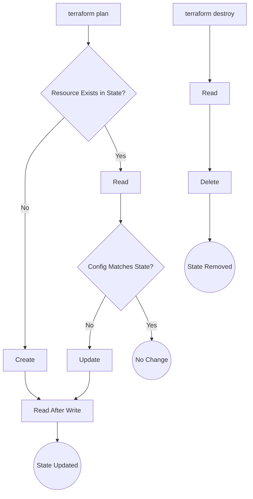

# Terraform Provider Development: Best Practices for Cloud Integrations

In the world of Infrastructure as Code (IaC), Terraform and its open-source fork, OpenTofu, are undisputed leaders. Their power lies in a vast ecosystem of providers that connect declarative configurations to real-world APIs. But what separates a functional provider from a robust, production-grade one? The difference is a commitment to best practices.

As of 2026, building a high-quality provider is more critical than ever. It's the foundation upon which your users will build reliable, scalable, and predictable infrastructure. This guide cuts through the noise to give you the actionable, battle-tested best practices for developing a Terraform provider that stands up to the demands of modern cloud environments.

### What You'll Get

*   **Schema Design Principles:** How to craft a clear and predictable user experience.
*   **Idempotent CRUD:** The core logic for reliable resource management.
*   **Advanced Error Handling:** Strategies for building resilient and fault-tolerant providers.
*   **Modern Testing Strategies:** A layered approach to ensure your provider is bug-free.
*   **Registry Publishing Guide:** Steps to share your work with the community.

## The Foundation: Schema Design and Data Modeling

A provider's schema is its API contract with the user. A well-designed schema is intuitive, predictable, and minimizes user error. It's the most critical part of the development process because changes to it can be breaking and disruptive.

### Key Schema Attributes

When defining a resource's schema, every attribute plays a role. Understanding these roles is fundamental.

| Attribute | Description | Use Case |
| :--- | :--- | :--- |
| **`Required`** | The user *must* provide a value for this attribute in their configuration. | A server's instance type or a database username. |
| **`Optional`** | The user *can* provide a value, but the provider can function without it, often using a default. | A non-critical tag or an optional description field. |
| **`Computed`** | A value generated by the API, not provided by the user. It's read-only. | A resource's unique ID, a generated IP address, or a creation timestamp. |
| **`ForceNew`** | If the user changes this attribute's value, the existing resource will be destroyed and a new one created. | An attribute that cannot be modified after creation, like a VM's disk encryption key or a database engine version. |

### Designing for the Future

Think about the lifecycle of the resource you're managing.

*   **Group related attributes:** Use nested blocks (`TypeSet`, `TypeList`, `TypeMap` with `Elem: &schema.Resource{...}`) to group configuration settings, improving readability.
*   **Use `ForceNew` deliberately:** Apply it to attributes that, if changed, would fundamentally alter the resource's identity or require replacement in the underlying API. Overusing it leads to unnecessary infrastructure churn.
*   **Plan for defaults:** If an API has default values, reflect them in your provider using the `Default` field or by handling nil values during the `Create` operation.

Here’s a simple schema definition using the modern `terraform-plugin-framework`, which is the standard for new provider development.

```go
import (
    "github.com/hashicorp/terraform-plugin-framework/resource/schema"
    "github.com/hashicorp/terraform-plugin-framework/resource/schema/planmodifier"
    "github.com/hashicorp/terraform-plugin-framework/resource/schema/stringplanmodifier"
)

// ...

func (r *myResource) Schema(ctx context.Context, req resource.SchemaRequest, resp *resource.SchemaResponse) {
    resp.Schema = schema.Schema{
        Description: "Manages a custom API resource.",
        Attributes: map[string]schema.Attribute{
            "id": schema.StringAttribute{
                Computed:    true,
                Description: "The unique identifier for the resource.",
                PlanModifiers: []planmodifier.String{
                    stringplanmodifier.UseStateForUnknown(),
                },
            },
            "name": schema.StringAttribute{
                Required:    true,
                Description: "A unique name for the resource.",
                PlanModifiers: []planmodifier.String{
                    stringplanmodifier.RequiresReplace(), // This is the framework equivalent of ForceNew
                },
            },
            "config_json": schema.StringAttribute{
                Optional:    true,
                Description: "Optional JSON configuration string.",
            },
        },
    }
}
```

## The Core Logic: Implementing Idempotent CRUD

Every Terraform resource must implement **CRUD** operations: Create, Read, Update, and Delete. The golden rule for these operations is **idempotency**. An idempotent operation can be performed multiple times with the same input, and the system state will be the same as if it were performed only once. This is crucial for Terraform's convergence model.

### The Resource Lifecycle

A resource managed by Terraform follows a predictable lifecycle. Your provider's functions are the hooks into this cycle.



### Best Practices for CRUD Functions

*   **Create:**
    *   Call the backing API to provision the new resource.
    *   If the API call is asynchronous (returns a "pending" state), poll for completion before finishing.
    *   After successful creation, immediately call your `Read` function to populate the Terraform state with the actual, authoritative data from the API. This is the "read after write" pattern.
    *   Set the resource ID: `d.SetId(newResource.ID)`.

*   **Read:**
    *   Use the resource ID from the state (`d.Id()`) to fetch the current state of the resource from the API.
    *   If the resource is not found (e.g., deleted manually), signal this to Terraform by calling `d.SetId("")` and returning `nil`. Terraform will then plan to re-create it.
    *   Populate all schema attributes with the data returned from the API.

*   **Update:**
    *   Detect changes using `d.HasChange("attribute_name")`.
    *   Construct the API payload with only the changed attributes. Some APIs require a full object, while others accept partial updates (PATCH). Know your API.
    *   Just like `Create`, perform a "read after write" to ensure the state reflects the successfully updated resource.

*   **Delete:**
    *   Call the API to destroy the resource.
    *   Handle "not found" errors gracefully. If the resource is already gone, the goal is achieved. This is key to idempotency.
    *   Do not wait for the resource to be fully gone if the API call is asynchronous unless necessary. Terraform will simply remove it from the state after the `Delete` function returns.

> **What challenges do you face when implementing idempotent CRUD for your specific API?** Share your thoughts, as many APIs present unique challenges like eventual consistency or complex dependencies.

## Building Resilience: Error Handling and State Management

Network failures, API rate limiting, and eventual consistency are facts of life in distributed systems. A robust provider anticipates these issues.

*   **Distinguish Error Types:** Not all errors are equal.
    *   **Transient Errors:** Temporary issues like network timeouts or `503 Service Unavailable` responses. These are perfect candidates for retries.
    *   **Permanent Errors:** Unrecoverable issues like `400 Bad Request` (invalid input) or `404 Not Found` (on an update). Retrying these is pointless and will only delay failure.

*   **Implement Retry Logic:** Use a library like HashiCorp's `helper/retry` to wrap API calls that might fail intermittently. Use it for polling asynchronous operations or recovering from transient network errors.

```go
import "github.com/hashicorp/terraform-plugin-sdk/v2/helper/retry"

// ...

err := retry.RetryContext(ctx, d.Timeout(schema.TimeoutCreate), func() *retry.RetryError {
    resource, err := apiClient.GetResource(id)
    if err != nil {
        // If the error is a transient one, retry it.
        if isTransientError(err) {
            return retry.RetryableError(err)
        }
        // Otherwise, it's a permanent failure.
        return retry.NonRetryableError(err)
    }

    if resource.Status == "PENDING" {
        // Resource is not ready yet, keep polling.
        return retry.RetryableError(fmt.Errorf("resource not ready"))
    }
    
    return nil // Success
})
```

*   **Protect the State:** The Terraform state is the source of truth. Never leave it in an inconsistent state. If a `Create` operation fails halfway through (e.g., the API call succeeds but you fail to set the state), you risk creating an orphaned resource that Terraform doesn't know about. The "read after write" pattern helps prevent this by ensuring the state is only populated after a successful creation and read.

> **A provider's primary responsibility is to accurately reflect the state of external resources.** If the state and reality diverge, users lose trust and automation becomes unreliable.

## Ensuring Quality: Modern Testing Strategies

Untested code is broken code. For Terraform providers, testing is non-negotiable and requires a multi-layered approach.

### ### Unit Tests

These are standard Go tests for your internal logic—helper functions, data transformations, and complex validation logic. They are fast, isolated, and should not make any API calls.

### ### Acceptance Tests

This is the most critical testing layer. Acceptance tests run against a real API endpoint, executing a full `plan -> apply -> destroy` lifecycle.

*   They are written using the `resource.Test` function from the testing framework.
*   They verify that the provider correctly creates, updates, and deletes real infrastructure.
*   Tests are typically placed in a `_test.go` file and tagged with `//go:build acctest`.

Here is a skeleton of an acceptance test:

```go
import (
    "testing"
    "github.com/hashicorp/terraform-plugin-sdk/v2/helper/resource"
)

func TestAccMyResource_Basic(t *testing.T) {
    resource.Test(t, resource.TestCase{
        // PreCheck is used to verify that necessary credentials are set.
        PreCheck: func() { testAccPreCheck(t) }, 
        Providers: testAccProviders,
        Steps: []resource.TestStep{
            {
                // Define the Terraform configuration to apply.
                Config: `
                    resource "myprovider_resource" "test" {
                        name = "acceptance-test-resource"
                    }
                `,
                // Check functions verify the outcome.
                Check: resource.ComposeTestCheckFunc(
                    resource.TestCheckResourceAttr("myprovider_resource.test", "name", "acceptance-test-resource"),
                    // Add a check to verify the resource exists in the API.
                ),
            },
        },
    })
}
```

### ### Sweepers

Long-running acceptance tests can fail, leaving resources behind in your test account and costing money. **Sweepers** are tools (often part of the provider test harness) that run periodically to find and delete orphaned resources tagged for testing. The official AWS, Google Cloud, and Azure providers all use sweepers extensively.

## Going Public: Publishing to the Registry

Once your provider is stable and well-tested, it's time to share it with the world. Both the [Terraform Registry](https://registry.terraform.io/) and the [OpenTofu Registry](https://registry.opentofu.org/) pull from the same upstream source, so publishing to one makes it available to both communities.

1.  **Source Code Repository:** Your provider's source code must be in a public GitHub repository named `terraform-provider-<NAME>`.
2.  **Versioning and Releases:** Use semantic versioning (`vX.Y.Z`) for your releases. Create a new release on GitHub for each version you want to publish.
3.  **GPG Signing:** You must sign your release artifacts with a GPG key. This ensures the integrity and authenticity of your provider builds.
4.  **Publishing:** Log in to the Terraform Registry with your GitHub account and follow the on-screen instructions to publish your provider. The registry will automatically detect new releases you create on GitHub.

For detailed, up-to-date instructions, always refer to the official [HashiCorp provider publishing documentation](https://developer.hashicorp.com/terraform/registry/providers/publishing).

By following these best practices, you're not just writing code; you're building a reliable tool that empowers other engineers. You're contributing to a more stable and predictable infrastructure ecosystem for everyone.


## Further Reading

- [https://developer.hashicorp.com/terraform/plugin/best-practices](https://developer.hashicorp.com/terraform/plugin/best-practices)
- [https://opentofu.org/docs/provider-dev-guide/](https://opentofu.org/docs/provider-dev-guide/)
- [https://github.com/terraform-providers/terraform-provider-aws/issues/2026](https://github.com/terraform-providers/terraform-provider-aws/issues/2026)
- [https://cloud.magazine/building-robust-terraform-providers](https://cloud.magazine/building-robust-terraform-providers)
- [https://medium.com/cloud-native-devops/terraform-provider-testing](https://medium.com/cloud-native-devops/terraform-provider-testing)
- [https://www.infoq.com/articles/terraform-provider-patterns](https://www.infoq.com/articles/terraform-provider-patterns)
