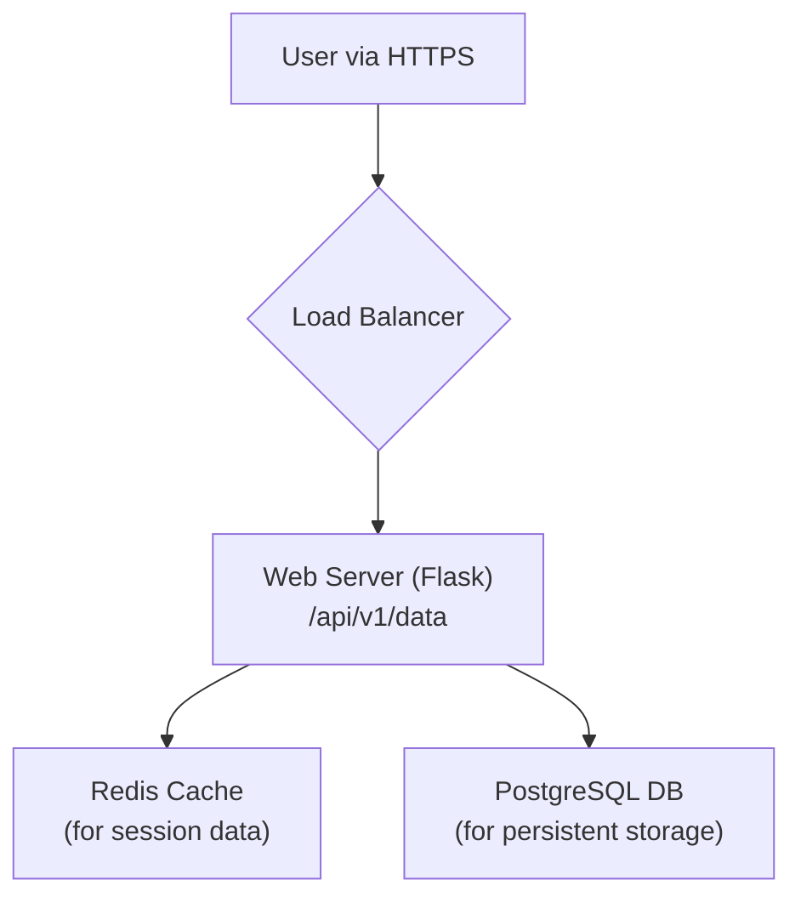
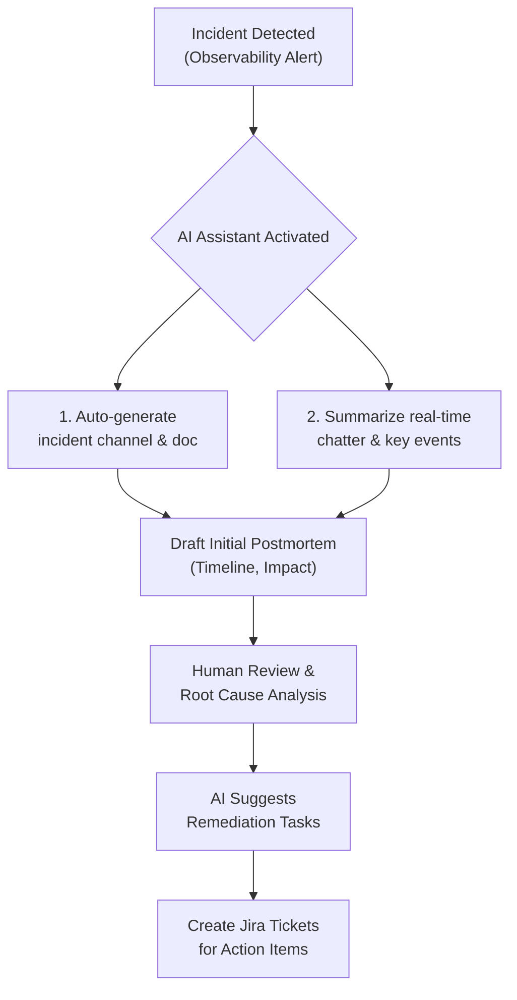

# Gemini & Copilot for Non-Code Tasks: AI Beyond Programming in 2026

For years, AI assistants have been our trusted pair programmers, mastering code completion and refactoring within the IDE. But their scope is rapidly expanding. By 2026, tools like Google's Gemini and GitHub Copilot will be indispensable partners for the *entire* software development lifecycle, automating the non-code tasks that consume a surprising amount of a technical professional's time.

This isn't about replacing developers, but augmenting them. The focus is shifting from simply writing code faster to building, documenting, and managing software more efficiently. We're moving from code completion to comprehensive workflow automation.

### What You'll Get

This article explores the practical, non-code applications of AI assistants that will be commonplace by 2026. You'll get:

*   **Concrete Use Cases:** Real-world examples from documentation to project management.
*   **Example Prompts:** Practical prompts you can adapt for your own workflows.
*   **High-Level Diagrams:** Mermaid diagrams illustrating AI-assisted processes.
*   **A Look Ahead:** Understanding the shift in a tech professional's role.

## The Shift: From Code Completion to Workflow Automation

The first wave of AI assistants lived inside your code editor. The next wave lives everywhere else: your project management tools, your documents, your terminal, and your communication platforms. This evolution is driven by more powerful Large Language Models (LLMs) with massive context windows and multimodal capabilities.

GitHub Copilot is expanding into the [Copilot Workspace](https://github.com/features/copilot), aiming to take a project from an issue description to a full implementation plan. Similarly, [Google's Gemini](https://blog.google/technology/ai/google-gemini-ai/) is deeply integrated into Workspace, able to parse information from Docs, Sheets, and Meet to provide context-aware assistance. The result is an AI that understands not just your code, but the entire context of your work.

## Core Use Cases in 2026

By 2026, leveraging AI for these tasks will be as standard as using Git for version control.

### Technical Documentation & Diagrams

Manual documentation is often the first casualty of tight deadlines. AI assistants will make it a frictionless, integrated part of development.

*   **README Generation:** Create a comprehensive `README.md` from your codebase.
*   **API Documentation:** Generate OpenAPI specs or Markdown docs by analyzing your source code and comments.
*   **Architecture Diagrams:** Create initial diagrams from a description of services.

Here's a sample prompt to generate a README for a new microservice:

```bash
# Prompt for Gemini or Copilot

Analyze the source code in the current directory for a Python microservice using Flask and Redis. Generate a README.md file that includes:
- A brief project description.
- A "Getting Started" section with setup and installation steps (requirements.txt).
- An "API Endpoints" section with a table detailing each endpoint, its HTTP method, and expected payload.
- A "Configuration" section explaining the required environment variables.
```

You can even ask it to generate a diagram visualizing the service's interactions.



### Agile & Project Management

Sprint planning and ticket management are communication-heavy processes ripe for AI assistance. Instead of manually writing everything, you'll provide high-level goals and let the AI handle the boilerplate.

*   **User Story Generation:** Convert brief feature ideas into well-formed user stories with acceptance criteria.
*   **Task Decomposition:** Break down large epic stories into smaller, manageable technical tasks.
*   **Risk Assessment:** Analyze a project plan or feature description to identify potential risks and dependencies.

| AI-Assisted Task       | Traditional Method                                     | AI-Powered Method (2026)                                  |
| ---------------------- | ------------------------------------------------------ | --------------------------------------------------------- |
| **User Story Writing** | PM manually writes stories in Jira.                    | "Create user stories for a checkout page with Apple Pay." |
| **Task Breakdown**     | Lead engineer breaks down an epic during planning.     | "Break down epic #PROJ-123 into sub-tasks for a senior dev." |
| **Meeting Prep**       | Manually reading through tickets before sprint review. | "Summarize the progress and blockers for the current sprint."   |

### Communication & Collaboration

AI assistants will act as an executive assistant, streamlining communication and ensuring everyone stays in sync with less effort.

> **The future of work isn't about talking to an AI, it's about having an AI that has already read the docs, attended the meeting, and can draft the summary for you.**

Imagine a workflow where Gemini, integrated into Google Meet, provides a real-time transcript of a design review. After the meeting, you can prompt it:

`"From the meeting transcript, summarize the key decisions made about the new authentication flow. List the action items, assign them to the correct owners based on the conversation, and draft a follow-up email to the attendees."`

This eliminates ambiguity and the manual work of taking and distributing notes.

### Incident Management & Postmortems

During a high-stress incident, cognitive load is high. An AI can act as a scribe and data analyst, allowing engineers to focus on resolution. By 2026, incident response will be a human-on-the-loop process.

The AI can:
*   Auto-generate an incident document and communication channel.
*   Summarize real-time chatter from Slack or Teams.
*   Pull relevant metrics and logs from observability platforms.
*   Draft the initial postmortem with a timeline and impact summary.

Here is a simplified, AI-assisted incident response flow:



This frees up the incident commander to focus on strategy and coordination, not administrative overhead.

### Marketing & Content Creation

Technical professionals are often tasked with creating content, from blog posts to product announcements. AI assistants can help bridge the gap between technical expertise and compelling copy.

*   **Blog Post Drafts:** Turn a list of technical bullet points into a well-structured article.
*   **Social Media Updates:** Generate concise announcements for new feature releases for platforms like Twitter or LinkedIn.
*   **Release Notes:** Create clear, user-friendly release notes from a list of git commit messages.

A prompt to an AI assistant could be:

```bash
# Prompt for Gemini or Copilot

You are a technical marketer. Write a 300-word blog post announcing the release of our new 'Smart Cache' feature.

Key points to include:
- It reduces API latency by up to 60%.
- It uses a predictive pre-fetching algorithm.
- It's a drop-in replacement for our old caching layer.
- Target audience: Senior developers and system architects.
- Tone: Informative but exciting.
```

## The Human Element: Your Role in an AI-Assisted Future

These advancements don't make technical expertise obsolete. They elevate it. Your role shifts from being a *doer* of repetitive tasks to a *director* of AI-powered tools.

Your most valuable skills will be:
*   **Critical Thinking:** Validating the AI's output and catching subtle errors.
*   **Prompt Engineering:** Clearly and concisely articulating your goals to the AI.
*   **System-Level Understanding:** Knowing which questions to ask and how the different pieces of a project fit together.

## Conclusion

By 2026, the line between coding and non-coding tasks will be blurred by a new class of AI assistants. Tools like Gemini and GitHub Copilot are evolving into true workflow partners, capable of drafting documents, planning sprints, and summarizing incidents. Mastering these tools will be a critical competency for any effective technical professional.

The key is to view them not as replacements, but as powerful force multipliers that free us to focus on the complex, creative, and strategic problems that only humans can solve.

**What about you? What's the most unexpected non-code task you've used an AI assistant for? Share your experiences in the comments below!**


## Further Reading

- [https://blog.google/technology/ai/gemini-workspace-integration-2026](https://blog.google/technology/ai/gemini-workspace-integration-2026)
- [https://github.com/features/copilot/business-use-cases](https://github.com/features/copilot/business-use-cases)
- [https://techcrunch.com/2026/03/ai-beyond-code-for-tech-roles](https://techcrunch.com/2026/03/ai-beyond-code-for-tech-roles)
- [https://www.infoq.com/articles/ai-for-devops-tasks/](https://www.infoq.com/articles/ai-for-devops-tasks/)
- [https://hbr.org/2026/04/ai-assisting-knowledge-workers](https://hbr.org/2026/04/ai-assisting-knowledge-workers)
- [https://medium.com/ai-innovations/genai-for-technical-documentation](https://medium.com/ai-innovations/genai-for-technical-documentation)
