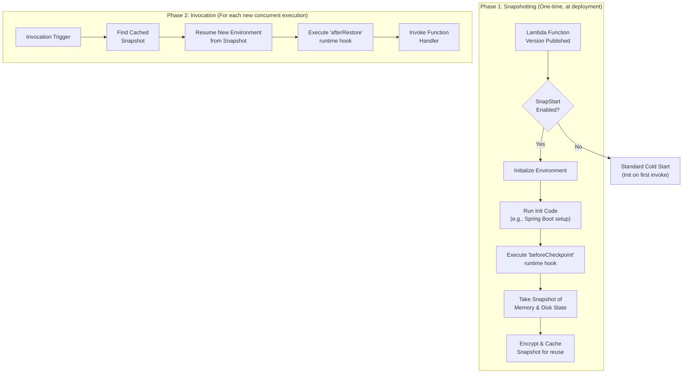
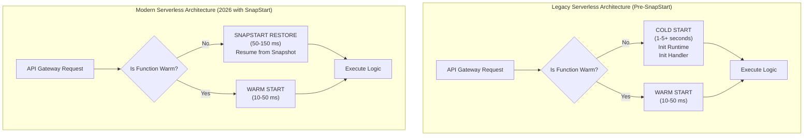

# AWS Lambda SnapStart: Supercharging Serverless Cold Starts in 2026

It's 2026, and the serverless landscape has fundamentally shifted. The once-dreaded "cold start" problem, which plagued developers of latency-sensitive applications for years, is now largely a relic of the past for mainstream runtimes. The catalyst for this change? AWS Lambda SnapStart, which has evolved from a niche Java performance booster into a cornerstone of modern serverless architecture.

Initially launched for the Java runtime, SnapStart's expansion and maturity have unlocked new possibilities for building high-performance, scalable, and cost-effective applications. Today, developers building with runtimes like Java and Node.js can deliver single-digit millisecond startup times, even for complex, framework-heavy functions. This article dives into the state of SnapStart in 2026, its technical underpinnings, and the best practices that have become standard for serverless practitioners.

### What You'll Get

*   **A 2026 Perspective:** Understand how SnapStart has matured and its widespread impact.
*   **Technical Deep Dive:** A refresher on how SnapStart works, including its expansion to Node.js.
*   **Key Enhancements:** Explore the new capabilities that make SnapStart more powerful than ever.
*   **Actionable Best Practices:** Learn the modern rules for developing with SnapStart.
*   **Architectural Impact:** See how SnapStart has reshaped serverless application design.

---

## How SnapStart Works: A 2026 Refresher

At its core, SnapStart's mechanism remains elegantly simple: it replaces the traditional, time-consuming cold start initialization process with a near-instantaneous resume from a cached snapshot. Instead of initializing your function from scratch on the first invocation, AWS does this work ahead of time, right after you publish a new function version.

The process is split into two distinct phases:

1.  **Snapshotting Phase (at deployment):** When you deploy a SnapStart-enabled function, Lambda provisions an execution environment, downloads your code, and runs your function's entire initialization process—loading libraries, initializing static variables, and connecting to resources. Just before your handler is invoked, Lambda takes a firecracker microVM snapshot of the memory and disk state and caches it.
2.  **Invocation Phase (at runtime):** When the first request arrives, instead of starting from zero, Lambda resumes a new execution environment from the encrypted snapshot. This process is orders of magnitude faster, often reducing startup latency by over 90%.

This flow ensures that every new execution environment starts from a primed, ready-to-go state.



## Key Enhancements and Adoption by 2026

Since its initial release, SnapStart has seen significant enhancements that have driven its widespread adoption.

### Multi-Runtime Support

The biggest evolution has been its expansion beyond Java. By 2026, SnapStart is fully supported and widely used for **Node.js** runtimes (v22+). This was a game-changer, as it brought the same cold start elimination benefits to the vast ecosystem of TypeScript and JavaScript serverless developers. The Node.js implementation leverages similar snapshotting primitives, dramatically improving startup for applications using frameworks like NestJS or Express.js within Lambda.

> **Note:** While Java and Node.js are the flagships, the community anticipates support for Python and .NET runtimes, with private betas reportedly underway.

### SnapStart vs. Provisioned Concurrency

Developers now have two powerful tools for managing latency. The choice between them has become a standard architectural decision point.

| Feature | AWS Lambda SnapStart | Provisioned Concurrency (PC) |
| :--- | :--- | :--- |
| **Primary Use Case** | Eliminating cold starts for unpredictable or spiky traffic. | Maintaining a pool of "hot" environments for predictable, high-throughput workloads. |
| **Cost Model** | No additional cost for the feature. Pay standard invocation and duration fees. | Billed for the duration the concurrency is provisioned, even when idle. |
| **Initialization** | Happens once at deployment time (snapshot creation). | Environments are initialized ahead of time and kept warm. |
| **Best For** | Latency-sensitive APIs, internal tools, and apps with "bursty" traffic patterns. | Core business APIs with consistent traffic, services requiring sustained low latency. |
| **State** | Resumes from a cached, initialized state. | A fresh, initialized environment is always ready. |

By 2026, a common pattern is to use SnapStart as the default for most functions and selectively apply Provisioned Concurrency for the small subset of critical functions that require guaranteed hot environments at all times.

---

## Best Practices for SnapStart in 2026

As developers gained experience, a clear set of best practices emerged to maximize SnapStart's benefits while avoiding potential pitfalls.

### 1. Ensure Uniqueness and Idempotency

Because SnapStart restores memory state, any data generated during initialization will be identical across all resumed environments. This is critical for:

*   **Randomness:** Data that must be unique per invocation (e.g., random numbers for tracing, temporary file names) should be generated *within the handler method*, not during the init phase.
*   **Network Connections:** Connections to databases or other services established during initialization will be captured in the snapshot. These connections will likely be stale or invalid when resumed. Best practice is to check connection validity and re-establish them if necessary using the `afterRestore` hook.

### 2. Leverage Runtime Hooks for State Management

Runtime hooks are essential for managing state that should not be part of the snapshot. The Coordinated Restore at Checkpoint (CRaC) API, which underpins SnapStart, provides two key hooks.

*   `beforeCheckpoint`: Called just before the snapshot is taken. Use this to close network connections, clean up temporary files, or nullify transient data.
*   `afterRestore`: Called right after an environment is resumed from a snapshot. Use this to re-establish network connections or refresh configurations.

Here is a modern Java example using the `org.crac` library:

```java
import org.crac.Context;
import org.crac.Core;
import org.crac.Resource;

public class MyFunctionHandler implements RequestHandler<Map<String, String>, String>, Resource {
    
    private DatabaseConnection dbConnection;

    public MyFunctionHandler() {
        // Register this class to receive hook notifications
        Core.getGlobalContext().register(this);
        // Initial connection might be established here, but needs management
        this.dbConnection = new DatabaseConnection(); 
    }

    @Override
    public void beforeCheckpoint(Context<? extends Resource> context) throws Exception {
        System.out.println("Before checkpoint: closing DB connection...");
        if (this.dbConnection != null) {
            this.dbConnection.close();
        }
    }

    @Override
    public void afterRestore(Context<? extends Resource> context) throws Exception {
        System.out.println("After restore: re-establishing DB connection...");
        this.dbConnection = new DatabaseConnection(); // Re-initialize connection
    }

    @Override
    public String handleRequest(Map<String, String> input, Context context) {
        // Handler logic uses the managed dbConnection
        return "Success";
    }
}
```

### 3. Monitor Key SnapStart Metrics

Effective monitoring is crucial. In Amazon CloudWatch, developers now heavily rely on two metrics to ensure SnapStart is performing as expected:

*   `RestoreDuration`: The time taken to load the snapshot and run the `afterRestore` hook. This should be consistently low (typically under 100ms). Spikes here can indicate an issue in your restore logic.
*   `SnapStartInitializeVMErrors`: Tracks failures during the one-time snapshotting phase.

---

## The Architectural Impact on Serverless Design

The normalization of sub-100ms startup times has profoundly influenced serverless architecture.

*   **Viability of Heavier Frameworks:** Enterprise frameworks like **Spring Boot (Java)** and **NestJS (Node.js)** are now first-class citizens in the serverless world. Their powerful dependency injection and application management features can be used without incurring a multi-second cold start penalty, simplifying development and migration from traditional monolithic applications.
*   **Fine-Grained Microservices:** Teams are more confident in creating smaller, more focused functions. The performance overhead of a cold start is no longer a significant factor, allowing architects to design systems that are more modular, scalable, and easier to maintain.
*   **Improved User Experience:** For user-facing APIs, SnapStart directly translates to a snappier, more reliable experience, eliminating the frustrating "first request lag" that used to be an accepted trade-off of serverless.

This diagram illustrates the shift in perception and performance.



## Conclusion

By 2026, AWS Lambda SnapStart has delivered on its promise to make serverless cold starts a manageable, if not entirely solved, problem for major runtimes. Its maturity and expansion have solidified Lambda's position as a premier platform for a vast range of workloads, from simple event processing to complex, latency-sensitive APIs. By following established best practices, developers can now build applications that are not only scalable and cost-effective but also consistently high-performing.

How has SnapStart transformed *your* serverless performance and architecture? Share your experiences.


## Further Reading

- [https://aws.amazon.com/blogs/aws/aws-lambda-snapstart-update-2026/](https://aws.amazon.com/blogs/aws/aws-lambda-snapstart-update-2026/)
- [https://docs.aws.amazon.com/lambda/latest/dg/snapstart.html](https://docs.aws.amazon.com/lambda/latest/dg/snapstart.html)
- [https://www.serverless.com/blog/snapstart-deep-dive-2026/](https://www.serverless.com/blog/snapstart-deep-dive-2026/)
- [https://readysetcloud.io/aws-lambda-performance-tips/](https://readysetcloud.io/aws-lambda-performance-tips/)
- [https://medium.com/aws-developers/snapstart-success-stories/](https://medium.com/aws-developers/snapstart-success-stories/)
- [https://cloud.magazine/lambda-cold-starts-solved](https://cloud.magazine/lambda-cold-starts-solved)
