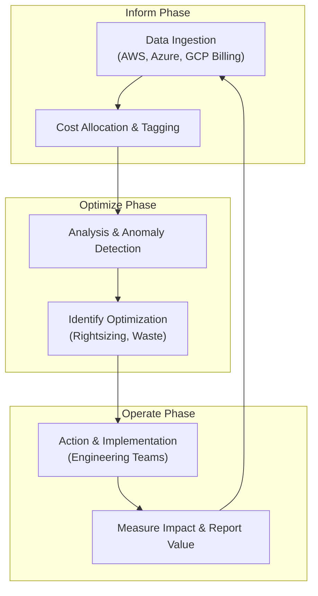

# Cloud FinOps: Achieving Financial Accountability in Multi-Cloud

The year is 2026. Multi-cloud is no longer an emerging trend; it's the default infrastructure reality for most enterprises. While this hybrid approach delivers resilience and prevents vendor lock-in, it also creates a massive challenge: financial chaos. Managing costs across AWS, Azure, and Google Cloud Platform (GCP) without a dedicated strategy is like trying to navigate a storm without a compass. This is where Cloud FinOps, the operational framework for managing cloud costs, has evolved from a niche practice into a critical business discipline.

FinOps is the cultural shift that brings financial accountability to the variable spend model of the cloud. It's about empowering engineering teams to make cost-aware decisions without stifling innovation, ensuring every dollar spent on cloud resources drives maximum business value. This article explores the mature state of multi-cloud FinOps in 2026, covering the best practices, tools, and cultural changes necessary for success.

### What You'll Get

*   **Core Principles:** An understanding of the three pillars of multi-cloud FinOps: Inform, Optimize, and Operate.
*   **Practical Strategies:** Actionable techniques for cost visibility, optimization, and governance across AWS, Azure, and GCP.
*   **Tooling Landscape:** A breakdown of native, third-party, and open-source tools essential for the modern FinOps practitioner.
*   **Collaborative Frameworks:** Insights into fostering a culture of cost accountability between engineering, finance, and leadership.

---

## The Evolution of FinOps in a Multi-Cloud World

In the early 2020s, FinOps often centered on basic cost-cutting in a single cloud. By 2026, the practice has matured significantly. The focus has shifted from *reducing spend* to *optimizing value*. The question is no longer "How can we spend less?" but rather, "Are we getting the best possible return on our cloud investment?"

This evolution is driven by several factors:
*   **Pervasive Multi-Cloud:** Organizations now strategically place workloads on the best-fit cloud, increasing the complexity of billing data.
*   **Dynamic Workloads:** The rise of containerization (Kubernetes), serverless functions, and AI/ML workloads creates highly variable and often unpredictable spending patterns.
*   **Business Integration:** FinOps is now deeply integrated with business Key Performance Indicators (KPIs). Teams measure success not just in savings but in metrics like *cost per transaction* or *cost per active user*.

## The Three Pillars of Multi-Cloud FinOps

The FinOps Foundation framework provides a proven lifecycle for managing cloud costs. In a multi-cloud environment, each phase requires a unified approach.

### Inform: Gaining Universal Visibility

You can't control what you can't see. The first step in any FinOps practice is to achieve clear, real-time visibility into cloud spending across all providers. Fragmented billing data from AWS, Azure, and GCP makes this the primary challenge.

**Key Actions:**
*   **Establish a Unified Tagging Strategy:** A consistent tagging and labeling policy is the bedrock of cost allocation. Without it, attributing costs to the correct team, project, or product is impossible.
*   **Implement Showback and Chargeback:** Showback provides teams with visibility into their consumption. Chargeback goes a step further by formally allocating these costs to the respective business unit's budget.
*   **Centralize Cost Data:** Use a central platform to ingest, normalize, and visualize cost data from all cloud providers. This creates a single source of truth for all stakeholders.

| Cloud Provider | Tagging/Labeling Resource | Key Limit (per resource) | Enforcement Method |
| :--- | :--- | :--- | :--- |
| **AWS** | Tags (Key-Value Pairs) | 50 | Tag Policies, Service Control Policies (SCPs) |
| **Azure** | Tags (Key-Value Pairs) | 50 | Azure Policy |
| **GCP** | Labels (Key-Value Pairs) | 64 | Organization Policies |

> **Pro Tip:** Enforce a minimum set of tags on all new resources via policy, such as `owner`, `cost-center`, `project-name`, and `environment`.

### Optimize: Driving Efficiency at Scale

With clear visibility established, the next phase is to identify and eliminate waste. Optimization is not a one-time event but a continuous process of matching supply to demand efficiently.

**Common Optimization Levers:**
*   **Rightsizing Resources:** Continuously analyze utilization metrics (CPU, memory, IOPS) to downsize over-provisioned virtual machines, databases, and storage volumes. Automation is key here.
*   **Leverage Committed Use Discounts (CUDs):** For stable, predictable workloads, use AWS Savings Plans/Reserved Instances, Azure Reservations, and GCP Committed Use Discounts. In a multi-cloud world, managing a portfolio of these commitments requires careful planning to maximize discounts without overcommitting.
*   **Eliminate Waste:** Automate the detection and termination of idle resources. This includes unattached EBS volumes, idle load balancers, and old snapshots.
*   **Schedule Non-Production Environments:** Power down development, staging, and QA environments during off-hours (nights and weekends) to achieve significant savings.

Here is a simple pseudo-script concept for identifying unattached AWS EBS volumes:

```bash
# Pseudocode to find and flag orphan EBS volumes

# 1. Get a list of all EBS volume IDs in a specific region
all_volumes=$(aws ec2 describe-volumes --query "Volumes[].VolumeId" --output text)

# 2. Iterate through each volume ID
for volume_id in $all_volumes; do
  
  # 3. Check the state and attachments for the volume
  state=$(aws ec2 describe-volumes --volume-ids $volume_id --query "Volumes[].State" --output text)
  attachments=$(aws ec2 describe-volumes --volume-ids $volume_id --query "Volumes[].Attachments" --output text)
  
  # 4. If the volume is 'available' (not attached) and has no attachments, flag it
  if [[ "$state" == "available" && -z "$attachments" ]]; then
    echo "Orphan Volume Found: $volume_id"
    # In a real script, you might tag this volume for deletion or send an alert.
  fi
  
done
```

### Operate: Fostering a Culture of Accountability

The final phase is about embedding FinOps practices into the fabric of the organization. This involves continuous improvement, automation, and fostering collaboration. This is where the cultural shift truly happens.

The goal is to create a continuous feedback loop where engineering, finance, and business teams work together towards shared goals.



**Building a FinOps Culture:**
*   **Establish a FinOps Guild:** Create a cross-functional team with members from engineering, finance, and product management to champion best practices and drive initiatives.
*   **Set Shared KPIs:** Align teams around business-centric metrics. Instead of just "reduce cloud spend by 10%," aim for goals like "reduce cost-per-user by 5%."
*   **Automate Governance:** Implement automated policies that alert or prevent the creation of non-compliant or excessively expensive resources.

## Tooling for the Multi-Cloud FinOps Practitioner

By 2026, the tooling landscape has matured to support complex multi-cloud environments. Practitioners typically use a combination of tools:

1.  **Native Cloud Tools:**
    *   **Examples:** AWS Cost Explorer, Azure Cost Management + Advisor, Google Cloud Billing.
    *   **Pros:** Deeply integrated with the platform, no extra cost.
    *   **Cons:** Provide a siloed view, making cross-cloud comparison difficult.

2.  **Third-Party FinOps Platforms:**
    *   **Examples:** VMware CloudHealth, Flexera, Apptio Cloudability.
    *   **Pros:** Aggregate data from all clouds into a single dashboard, provide advanced analytics, and offer robust automation features.
    *   **Cons:** Can be expensive, require setup and integration effort.

3.  **Open-Source Solutions:**
    *   **Examples:** [OpenCost](https://www.opencost.io/)
    *   **Pros:** Excellent for specific use cases like Kubernetes cost monitoring, highly customizable, no licensing fees.
    *   **Cons:** Require engineering resources to implement and maintain.

## The FinOps and Engineering Partnership

The most successful FinOps practices are those where engineers are empowered, not policed. The goal is to "shift left" cost awareness, integrating it directly into the development lifecycle.

> "FinOps is not about saving money; it's about making money. It empowers engineers to see the cost impact of their code as a first-class metric, right alongside performance and reliability."

**Empowering Engineers:**
*   **Cost Visibility in Workflows:** Provide engineers with dashboards that show the cost of their specific applications and services.
*   **CI/CD Cost Gates:** Integrate cost estimation tools into CI/CD pipelines to flag potentially expensive infrastructure changes before they are deployed to production.
*   **Budget Alerts:** Set up automated alerts that notify teams via Slack or Teams when their project spend is forecasted to exceed its budget.

## Conclusion

In 2026, Cloud FinOps is the non-negotiable discipline for any organization serious about succeeding in a multi-cloud world. It's a journey of continuous improvement built on the pillars of **Inform**, **Optimize**, and **Operate**. By combining a strong collaborative culture with the right tools and automated governance, organizations can transform their cloud spend from a liability into a strategic advantage, ensuring every dollar invested delivers tangible business value.

What does the FinOps journey look like in your organization? Share your challenges and successes in the comments below.


## Further Reading

- [https://www.finops.org/framework/whats-new-2026/](https://www.finops.org/framework/whats-new-2026/)
- [https://aws.amazon.com/finops/best-practices/](https://aws.amazon.com/finops/best-practices/)
- [https://learn.microsoft.com/en-us/azure/cloud-adoption-framework/manage/cost-management/finops](https://learn.microsoft.com/en-us/azure/cloud-adoption-framework/manage/cost-management/finops)
- [https://www.gartner.com/en/articles/finops-trends-2026](https://www.gartner.com/en/articles/finops-trends-2026)
- [https://cloud.magazine/multi-cloud-finops-strategies](https://cloud.magazine/multi-cloud-finops-strategies)
- [https://techcrunch.com/2026/04/the-rise-of-finops-platforms](https://techcrunch.com/2026/04/the-rise-of-finops-platforms)
