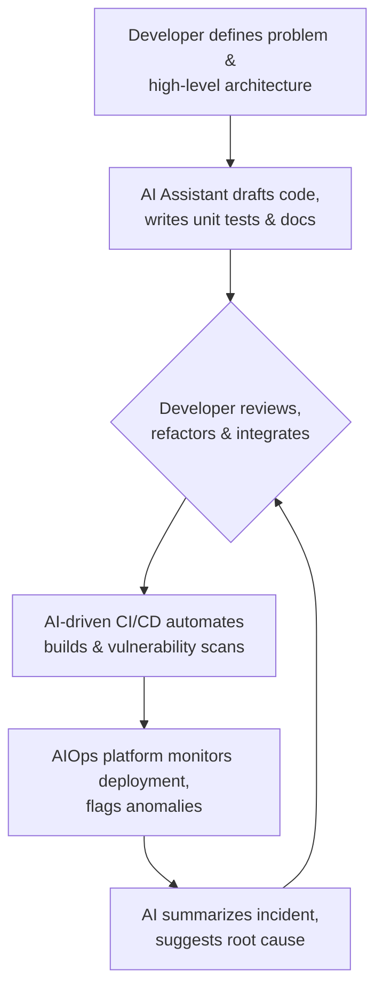

# AI's Impact on Tech Roles: Adapting to the Augmented Workforce of 2026

The conversation around AI in technology has shifted. It's no longer a futuristic concept but a daily collaborator integrated into our IDEs, CI/CD pipelines, and project management tools. Generative AI assistants like GitHub Copilot, Google's Gemini, and Anthropic's Claude are not just changing *how* we work; they are fundamentally reshaping the definition of technical roles. By 2026, the most successful professionals will be those who master the art of AI collaboration, transforming their roles into something more strategic, creative, and impactful.

This article breaks down the tangible impact of AI on key tech roles and provides a roadmap for navigating this new, augmented landscape.

### What You'll Get

*   A role-by-role analysis of how AI is augmenting developers, DevOps, QA, and PMs.
*   A look at the emerging skills, like prompt engineering and AI ethics, that are now in demand.
*   A visual diagram of the new AI-augmented development lifecycle.
*   Actionable advice to future-proof your career in an AI-driven industry.

## The Shift from Tool to Teammate

For years, we've used tools for automation and efficiency. AI represents a paradigm shift. It's less of a tool and more of a junior partner—one that can draft code, analyze data, and predict outcomes, allowing human experts to focus on higher-level tasks. A study by GitHub found that developers using Copilot are up to 55% faster, demonstrating a clear move towards an augmented workforce.

This new workflow is a collaborative loop between human expertise and AI efficiency. The human provides the strategic direction, critical thinking, and domain knowledge, while the AI handles the repetitive, pattern-based tasks.



This model places the human professional firmly in the role of architect and reviewer, leveraging AI to accelerate the entire development lifecycle.

## How AI is Reshaping Key Tech Roles

The impact of AI isn't uniform. It manifests differently across disciplines, elevating each role by automating its most tedious aspects.

### Software Developers: The AI-Assisted Coder

The modern developer is increasingly becoming a code orchestrator. AI assistants are proficient at handling the boilerplate, leaving developers to focus on the complex logic that creates real value.

*   **Code Generation:** AI can generate entire functions, classes, and configuration files from a simple natural language prompt (a comment). This dramatically speeds up initial development.
*   **Debugging and Refactoring:** Tools like Gemini and Copilot Chat can analyze code blocks, explain what they do, identify bugs, and suggest more efficient refactoring patterns.
*   **Automated Unit Tests:** Writing tests is critical but time-consuming. AI can generate comprehensive test cases based on a function's logic, ensuring better code coverage with less manual effort.

**Example: AI-Generated Python Function**
A developer might write a simple comment, and the AI handles the rest.

```python
# python function to fetch data from a URL and handle potential exceptions
import requests

def fetch_url_data(url):
    """
    Fetches data from a given URL and returns the content as text.
    Handles connection errors and non-200 status codes gracefully.
    """
    try:
        response = requests.get(url, timeout=10)
        # Raise an exception for bad status codes (4xx or 5xx)
        response.raise_for_status()
        return response.text
    except requests.exceptions.RequestException as e:
        print(f"An error occurred: {e}")
        return None

```

The developer's role shifts from writing every line to validating, integrating, and designing the overall system architecture.

### DevOps and SREs: Automating the Entire Pipeline

For DevOps and Site Reliability Engineers (SREs), AI is the ultimate enabler of proactive, predictive operations. AIOps platforms are moving from buzzwords to standard practice.

*   **Predictive Scaling:** AI analyzes historical traffic patterns to predict resource needs, automatically scaling infrastructure up or down to optimize costs and performance.
*   **Intelligent Anomaly Detection:** Instead of relying on static thresholds, AI models learn the "normal" behavior of a system and can flag subtle, complex anomalies that would evade traditional monitoring.
*   **Automated Root Cause Analysis:** When an incident occurs, AI can instantly analyze logs, metrics, and traces from multiple sources to pinpoint the likely root cause, drastically reducing Mean Time to Resolution (MTTR).

> The goal of DevOps is to increase the flow of value. AI supercharges this by automating the cognitive load associated with managing complex, distributed systems.

### Quality Assurance Engineers: From Manual Clicks to AI-Driven Insights

AI is transforming QA from a largely manual, repetitive process into a strategic, data-driven discipline.

*   **Automated Test Case Generation:** AI tools can analyze an application's UI and user flows to automatically generate comprehensive end-to-end test scripts for frameworks like Selenium or Cypress.
*   **Visual Regression Testing:** AI can detect pixel-level visual bugs that human testers might miss, ensuring UI consistency across browsers and devices.
*   **Self-Healing Tests:** When a UI element changes (e.g., an ID or class name), AI-powered tools can intelligently update the corresponding test script, reducing the maintenance burden.

The QA professional of 2026 spends less time writing and fixing brittle tests and more time defining quality strategies, analyzing AI-driven test results, and focusing on complex exploratory testing.

### Project and Product Managers: Data-Driven Decision Making

For PMs, AI acts as a powerful analyst, automating the synthesis of vast amounts of information to enable smarter, faster decisions.

*   **Automated User Feedback Analysis:** AI can process thousands of customer reviews, support tickets, and survey responses to identify key themes, sentiment, and feature requests.
*   **Risk Prediction:** By analyzing commit histories, sprint velocity, and team communication, AI can flag potential project risks and timeline delays before they become critical.
*   **Drafting Project Artifacts:** AI assistants can create first drafts of user stories, project charters, and status reports based on high-level inputs, freeing up PMs for strategic planning.

## The New Skillset for 2026

Thriving in this new environment requires an evolution of skills. Technical proficiency remains crucial, but it must be paired with the ability to effectively steer and interpret AI.

| Traditional Skill | Augmented Skill for 2026 |
| :--- | :--- |
| Manual Coding | AI-Supervised Code Generation & Review |
| Static Scripting | Dynamic, AI-Driven Automation & IaC |
| Manual Test Execution | Test Strategy & AI Model Oversight |
| Requirement Gathering | **Prompt Engineering** & Data Synthesis |
| Basic Security Scans | AI-Powered Threat Modeling |
| Following a Project Plan | Data-Driven Risk Prediction & Mitigation |

Beyond these augmented skills, entirely new roles are emerging:

*   **Prompt Engineering:** The art and science of crafting precise, context-rich instructions to get the most accurate and useful output from generative AI models. This is quickly becoming a core competency for all tech roles.
*   **AI Ethics and Governance:** As AI becomes more autonomous, professionals are needed to ensure systems are built and operated in a fair, transparent, and ethical manner, mitigating bias and ensuring compliance.
*   **MLOps:** This discipline combines machine learning, DevOps, and data engineering to automate and manage the lifecycle of machine learning models in production.

## Your Action Plan: Stay Ahead of the Curve

Adaptation is not optional. Here are concrete steps to position yourself for success in the augmented workforce:

1.  **Integrate AI into Your Daily Workflow:** Don't wait. Start using tools like GitHub Copilot, Tabnine, or the AI features in your IDE today. Treat it as a pair programmer. The goal is fluency.
2.  **Master Prompt Engineering:** Learn how to "talk" to AI. Practice providing context, defining constraints, and iterating on prompts to refine output. This is the new command line.
3.  **Focus on High-Level Strategy:** Automate the "how" so you can focus on the "what" and "why." Deepen your expertise in system design, architectural patterns, and strategic problem-solving. These are areas where human oversight remains irreplaceable.
4.  **Develop Human-Centric Skills:** Critical thinking, creativity, and collaboration are your greatest assets. AI can generate options, but a human must make the final, context-aware decision.

## Conclusion: The Augmented Future is Collaborative

The rise of AI in tech is not about replacement; it's about augmentation. The most valuable professionals of 2026 will not be those who can out-code an AI, but those who can most effectively partner with it to solve bigger, more complex problems faster than ever before. This new era demands a blend of deep technical expertise and a mastery of human-AI collaboration.

How has AI already changed your day-to-day work? Share your experiences and thoughts.


## Further Reading

- [https://www.weforum.org/reports/future-of-jobs-2026-ai-impact/](https://www.weforum.org/reports/future-of-jobs-2026-ai-impact/)
- [https://hbr.org/2026/04/how-ai-is-reshaping-tech-careers](https://hbr.org/2026/04/how-ai-is-reshaping-tech-careers)
- [https://techcrunch.com/2026/04/ai-job-market-trends](https://techcrunch.com/2026/04/ai-job-market-trends)
- [https://linkedin.com/business/talent/ai-skills-in-demand-2026](https://linkedin.com/business/talent/ai-skills-in-demand-2026)
- [https://forrester.com/report/ai-augmented-workforce-2026](https://forrester.com/report/ai-augmented-workforce-2026)
- [https://ieee.org/future-tech/ai-in-software-development](https://ieee.org/future-tech/ai-in-software-development)
