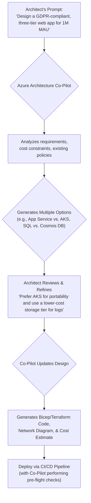

# Azure AI Co-Pilot for Cloud Architects: Designing 2026's Infrastructure

The year is 2026, and the role of the Cloud Architect has fundamentally evolved. The days of painstakingly selecting VM SKUs, manually configuring network rules, and cross-referencing dense compliance documents are fading. Today, we design infrastructure through a collaborative dialogue with an intelligent partner: the Azure Architecture Co-Pilot. This integrated AI isn't just a tool; it's a force multiplier that handles the tedious and complex, freeing us to focus on what truly matters—business outcomes and innovation.

This article explores how Azure's integrated AI Co-Pilot services are reshaping cloud architecture. We'll move beyond the hype and dive into the practical applications that are accelerating design, bolstering security, and optimizing costs for modern enterprises.

### What You'll Get

*   An overview of the Azure Architecture Co-Pilot's core capabilities.
*   How AI automates resource provisioning and proactive cost modeling.
*   Concrete examples of AI-generated security and compliance blueprints.
*   A workflow diagram and code sample illustrating the process.
*   A hypothetical case study demonstrating the Co-Pilot's real-world impact.

---

## The Architect's New Partner: Azure AI Co-Pilot

Gone are the days of siloed tools like Azure Advisor or standalone calculators. The Azure Architecture Co-Pilot of 2026 is a context-aware, generative AI woven directly into the fabric of the Azure Portal, IDE extensions, and design canvases. It leverages a massive corpus of data, including Microsoft's own operational best practices, global threat intelligence, and real-time cost telemetry.

The fundamental shift is from *reactive* advice to *proactive partnership*. Instead of fixing a misconfiguration, the Co-Pilot prevents it from being designed in the first place.

**Key characteristics of the Co-Pilot:**

*   **Conversational Interface:** Architects initiate designs with natural language prompts.
*   **Context-Aware:** It understands your subscription's history, existing resources, and organizational policies.
*   **Generative:** It doesn't just suggest; it *creates* architecture diagrams, Infrastructure as Code (IaC), and policy definitions.
*   **Augmentative:** It amplifies the architect's skills, handling complex, data-driven tasks while leaving strategic decisions to the human expert.

> **Quote Block:** "The goal isn't to replace the architect. It's to give every architect the analytical power of a thousand senior engineers and the domain knowledge of every compliance officer." - *Hypothetical statement from a Microsoft Cloud AI lead.*

## From Prompt to Provisioning: The Intelligent Workflow

The modern architecture workflow begins with a conversation. The architect defines the *what* and *why*, and the Co-Pilot determines the optimal *how*. This collaborative process drastically reduces the manual effort and cognitive load required to build robust systems.

The end-to-end flow is a powerful loop of generation, refinement, and deployment.



### Intelligent Resource Sizing

Manual resource selection is prone to error and waste. The Co-Pilot eliminates guesswork by using predictive analytics. By analyzing workload requirements (e.g., "e-commerce backend with high burst traffic during holidays"), it suggests specific Azure service SKUs that balance performance and cost. It can even model performance based on historical data from similar workloads across the Azure ecosystem.

### Proactive Cost Modeling

The Co-Pilot integrates real-time pricing data and cost-of-ownership models directly into the design phase. Before a single resource is deployed, an architect can see a detailed cost breakdown and simulate the financial impact of different architectural choices.

| Feature | Traditional Method (2023) | Co-Pilot Method (2026) |
| :--- | :--- | :--- |
| **Cost Estimation** | Manual use of Azure Pricing Calculator. | Automatic, interactive cost model generated from the design prompt. |
| **Optimization** | Reactive advice from Azure Advisor post-deployment. | Proactive suggestions during design, e.g., "Using Graviton-based VMs could save an estimated 15%." |
| **Budget Alerts** | Set manual budget rules. | Co-Pilot flags designs that are likely to exceed project budgets before deployment. |

## Generative Security and Compliance

This is arguably the Co-Pilot's most impactful capability. It transforms security and compliance from a manual checklist exercise into an automated, integrated design principle.

### Security Blueprint Generation

An architect can now specify a security posture as a core requirement.

*   **Prompt:** `Generate a secure architecture for a public-facing API handling financial data, compliant with PCI-DSS 4.0.`

The Co-Pilot doesn't just give advice. It generates a complete security blueprint, including:
*   A network topology with appropriate subnets, NSGs, and Azure Firewall rules.
*   Recommended Identity and Access Management (IAM) roles with least-privilege permissions.
*   Pre-configured Microsoft Defender for Cloud settings.
*   A full set of Azure Policy initiatives that map directly to PCI-DSS controls.

### Automated Compliance Guardrails

Once a compliance framework (like HIPAA or SOC 2) is specified, the Co-Pilot automates its enforcement. It translates regulatory requirements into machine-readable Azure Policy. These policies are then embedded within the CI/CD pipeline, acting as "compliance guardrails." A pull request containing non-compliant IaC, for instance, would be automatically blocked with a clear explanation of the violation.

## Code Example: Infrastructure as Conversation

The Co-Pilot's integration with tools like Visual Studio Code makes generating IaC incredibly efficient. The following Bicep code block demonstrates what it might generate from a simple prompt.

```bicep
// User Prompt:
// "Create a resilient and scalable web app.
// It needs a production and staging deployment slot.
// Ensure logs are stored for 90 days in geo-redundant storage."
// Co-Pilot Generated Bicep:

@description('The location for all resources.')
param location string = resourceGroup().location

@description('The name of the App Service Plan.')
var appServicePlanName = 'plan-webapp-prod-001'

@description('The name of the Web App.')
var webAppName = 'app-webapp-prod-001'

@description('The name of the Log Analytics Workspace.')
var logAnalyticsWorkspaceName = 'logs-prod-workspace'

@description('The name of the storage account for diagnostics.')
var diagnosticsStorageAccountName = 'stdiag${uniqueString(resourceGroup().id)}'

resource appServicePlan 'Microsoft.Web/serverfarms@2022-09-01' = {
  name: appServicePlanName
  location: location
  sku: {
    name: 'P1v3' // SKU selected based on resiliency requirement
    tier: 'PremiumV3'
  }
}

resource diagnosticsStorage 'Microsoft.Storage/storageAccounts@2023-01-01' = {
  name: diagnosticsStorageAccountName
  location: location
  sku: {
    name: 'Standard_GRS' // GRS selected for geo-redundancy
  }
  kind: 'StorageV2'
}

resource webApp 'Microsoft.Web/sites@2022-09-01' = {
  name: webAppName
  location: location
  properties: {
    serverFarmId: appServicePlan.id
    httpsOnly: true
  }
}

resource stagingSlot 'Microsoft.Web/sites/slots@2022-09-01' = {
  parent: webApp
  name: 'staging'
  location: location
  properties: {
    serverFarmId: appServicePlan.id
  }
}

resource appInsights 'Microsoft.Insights/components@2020-02-02' = {
  name: 'appi-${webAppName}'
  location: location
  kind: 'web'
  properties: {
    Application_Type: 'web'
  }
}

resource logAnalytics 'Microsoft.OperationalInsights/workspaces@2022-10-01' = {
  name: logAnalyticsWorkspaceName
  location: location
  properties: {
    retentionInDays: 90 // Retention set as per prompt
    sku: {
      name: 'PerGB2018'
    }
  }
}
```

## Case Study: FinSustain's Accelerated Launch

**The Company:** *FinSustain*, a 2026 fintech startup building an ESG (Environmental, Social, and Governance) investment platform.

**The Challenge:** They needed to build a highly secure, SOC 2 compliant platform and get to market before their competitors. Their small architecture team was stretched thin. The traditional design and audit process was projected to take six months.

**The Co-Pilot Solution:**

1.  **Initial Prompt:** The lead architect prompted the Co-Pilot: `"Design a highly available platform for an ESG trading API, targeting SOC 2 compliance. Prioritize services in Azure regions with the lowest carbon footprint."`
2.  **Generated Architecture:** The Co-Pilot proposed an architecture using Azure Kubernetes Service (AKS) for microservices, Cosmos DB for low-latency data, and placed them in Azure's most sustainable regions. It also generated a complete set of Azure Policies mapped to SOC 2 trust principles.
3.  **Refinement:** The FinSustain team collaborated with the Co-Pilot to refine the networking rules and adjust instance sizes based on their performance testing projections.
4.  **Deployment:** The Co-Pilot generated the Terraform code, which was deployed via Azure DevOps. The embedded compliance policies automatically validated the infrastructure during the CI/CD process.

**The Result:** FinSustain reduced its initial architecture design and validation phase from a projected six months to just six weeks. They passed their SOC 2 audit on the first attempt, as the Co-Pilot provided detailed documentation and evidence linking deployed resources directly to compliance controls.

## The Future is Collaborative

The rise of AI in cloud architecture is not a story of human replacement. It's one of powerful collaboration. The Azure Architecture Co-Pilot handles the vast, data-intensive, and repetitive tasks that were once the bane of architects. This allows us to ascend from being system builders to true business strategists—focusing on resilience, user experience, and creating value. The architect is, and will remain, the pilot in command.

We are just scratching the surface of what's possible. I'm curious to hear your thoughts. How are you leveraging AI in your design process today, and what do you see on the horizon for 2027 and beyond?

**Share your experiences and predictions in the comments below.**


## Further Reading

- [https://docs.microsoft.com/en-us/azure/ai/overview](https://docs.microsoft.com/en-us/azure/ai/overview)
- [https://azure.microsoft.com/en-us/solutions/cloud-architecture](https://azure.microsoft.com/en-us/solutions/cloud-architecture)
- [https://www.gartner.com/en/articles/ai-in-cloud-architecture-future](https://www.gartner.com/en/articles/ai-in-cloud-architecture-future)
- [https://www.forrester.com/report/future-of-cloud-operations-with-ai](https://www.forrester.com/report/future-of-cloud-operations-with-ai)
- [https://cloudblogs.microsoft.com/ai/2026-azure-ai-advancements](https://cloudblogs.microsoft.com/ai/2026-azure-ai-advancements)
