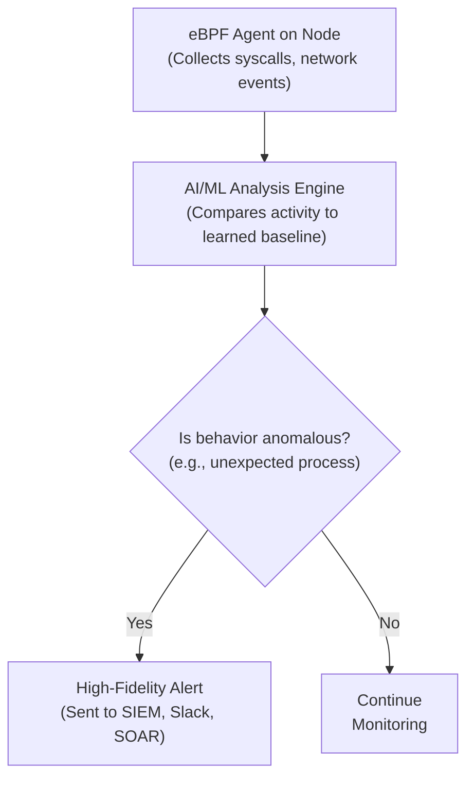
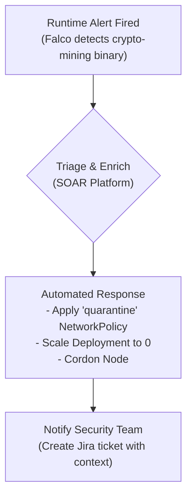

# Securing Kubernetes in Production: Advanced Strategies for 2026

Kubernetes is the undisputed king of container orchestration, but its complexity creates a vast attack surface. As we look toward 2026, the threats are evolving beyond simple misconfigurations. Attackers are leveraging AI, targeting software supply chains, and exploiting the ephemeral nature of cloud-native workloads.

Basic security hygiene—like RBAC, network policies, and vulnerability scanning—is no longer sufficient. To defend modern production environments, you need to adopt a proactive, automated, and deeply integrated security posture. This guide outlines the advanced strategies your team must master.

### What You'll Get

*   **Supply Chain Hardening:** Move beyond scanning to verifiable, policy-enforced software delivery.
*   **AI-Powered Threat Detection:** Learn how AI and eBPF are revolutionizing runtime security.
*   **Zero-Trust Networking:** Implement advanced network controls with service meshes.
*   **Workload Identity:** Securely connect workloads to cloud services without static credentials.
*   **Automated Incident Response:** Shift from manual triage to automated remediation.

## The Evolving Threat Landscape

The security game has changed. Static defenses are failing against dynamic threats. By 2026, we anticipate adversaries will commonly use:

*   **AI-driven attacks:** Automated tools that probe for complex misconfigurations and exploit zero-day vulnerabilities in real-time.
*   **Sophisticated supply chain exploits:** Injecting malicious code into upstream dependencies, CI/CD pipelines, or container registries.
*   **Lateral movement via workload identity:** Abusing service account tokens and cloud IAM permissions to pivot across the cluster and into your cloud environment.

Your security strategy must evolve to counter these threats directly.

## Hardening the Software Supply Chain

Your application's security is only as strong as its weakest dependency. A modern supply chain security strategy treats code, dependencies, and artifacts as verifiable assets.

### Beyond Basic Image Scanning

Vulnerability scanning is a reactive measure. A truly secure supply chain requires proactive verification.

*   **Software Bill of Materials (SBOM):** Generate an SBOM in a standard format like CycloneDX or SPDX during your build process. This provides a complete inventory of every component and dependency in your artifact, enabling rapid impact analysis for new vulnerabilities.
*   **Image Signing:** Cryptographically sign your container images upon a successful build. This provides an immutable guarantee that the image is authentic and has not been tampered with.

[Sigstore](https://www.sigstore.dev/), a CNCF project, provides a new standard for signing and verifying software artifacts. Using its `cosign` tool is straightforward:

```shell
# Install cosign (instructions on their site)

# Sign a container image
cosign sign my-registry/my-app:v1.2.3

# Verify the signature
cosign verify my-registry/my-app:v1.2.3
```

### Enforce Policy with Admission Controllers

Verification is useless without enforcement. Use an admission controller like [Kyverno](https://kyverno.io/) or [OPA Gatekeeper](https://github.com/open-policy-agent/gatekeeper) to ensure only signed and trusted images can run in your cluster.

Here is a sample Kyverno `ClusterPolicy` that blocks any image that isn't signed by your trusted key:

```yaml
apiVersion: kyverno.io/v1
kind: ClusterPolicy
metadata:
  name: check-image-signatures
spec:
  validationFailureAction: Enforce
  background: false
  rules:
    - name: verify-image
      match:
        any:
        - resources:
            kinds:
              - Pod
      verifyImages:
      - imageReferences:
        - "my-registry/my-app:*"
        attestors:
        - count: 1
          entries:
          - keys:
              publicKeys: |
                -----BEGIN PUBLIC KEY-----
                MFkwEwYHKoZIzj0CAQYIKoZIzj0DAQcDQgAE...
                -----END PUBLIC KEY-----
```

This policy instructs the Kubernetes API server to reject any Pod creation if its image doesn't carry a valid signature from the specified public key.

## AI-Powered Runtime Threat Detection

Once a workload is running, you need to detect malicious behavior in real-time. Legacy rule-based systems can't keep up with novel attack patterns. The future is behavioral analysis powered by AI and eBPF.

**eBPF (extended Berkeley Packet Filter)** provides deep, kernel-level visibility into system calls, network activity, and file access without instrumenting your applications. This raw data stream is the perfect fuel for machine learning models.

Tools like [Falco](https://falco.org/) and commercial platforms built upon it can:
1.  Use eBPF to collect event data from every node.
2.  Establish a baseline of "normal" behavior for each workload.
3.  Use ML algorithms to detect deviations from that baseline, such as:
    *   A web server spawning a reverse shell.
    *   A pod unexpectedly connecting to a crypto-mining pool IP address.
    *   A process reading sensitive files outside its normal scope.

This approach finds zero-day threats and insider activity that static rules would miss.



## Advanced Network Policies with Service Mesh

Standard Kubernetes `NetworkPolicy` objects are a good start, but they are limited to L3/L4 rules (IP addresses and ports) and don't encrypt traffic. A service mesh like [Istio](https://istio.io/) or [Linkerd](https://linkerd.io/) brings zero-trust networking *inside* your cluster.

| Feature | Standard Kubernetes NetworkPolicy | Service Mesh Policy (e.g., Istio) |
| :--- | :--- | :--- |
| **Layer** | L3 / L4 (IP, Port) | L7 (HTTP method, gRPC, path) |
| **Encryption** | None (in-cluster traffic is plaintext) | Automatic Mutual TLS (mTLS) |
| **Identity** | Pod Labels / Namespace | Cryptographic Identity (SPIFFE) |
| **Scope** | Kubernetes-native | Multi-cluster, VM-integrated |

With a service mesh, you can enforce policies like:
*   Only the `billing-service` can call the `POST /charge` endpoint on the `payment-service`.
*   All traffic between the `frontend` and `backend` namespaces must be encrypted via mTLS.
*   Deny all traffic to services that don't have a valid, cryptographically verifiable workload identity.

## Zero-Trust Identity for Workloads

Stop managing static secrets and credentials for your applications. In a modern Kubernetes environment, every workload should have a strong, automatically rotated, and narrowly-scoped identity.

The [SPIFFE/SPIRE](https://spiffe.io/) projects provide a standard for workload identity. This identity can then be used to authenticate to other services within the mesh or to external systems like cloud provider APIs.

Cloud providers have embraced this model:
*   **AWS:** IAM Roles for Service Accounts (IRSA)
*   **GCP:** Workload Identity
*   **Azure:** Workload Identity Federation

By annotating a Kubernetes `ServiceAccount`, you can link it directly to a cloud IAM role. The pod can then acquire temporary cloud credentials without ever touching a long-lived secret key.

```yaml
apiVersion: v1
kind: ServiceAccount
metadata:
  name: my-app-sa
  namespace: my-app
  annotations:
    # Example for AWS EKS
    eks.amazonaws.com/role-arn: "arn:aws:iam::111122223333:role/S3AccessRole"
```
A pod using this service account can now securely access the S3 buckets permitted by the `S3AccessRole`, with no secret management required from the developer.

## Automating Incident Response

In a highly dynamic environment, manual incident response is too slow. An alert at 2 AM should trigger an automated workflow, not just a PagerDuty notification. This is the domain of Security Orchestration, Automation, and Response (SOAR).

Integrate your runtime detection tool with a SOAR platform to create automated playbooks.

> **Info:** The goal of automated response is to contain a threat immediately, reducing the median-time-to-remediation (MTTR) from hours to seconds.

A typical automated response flow might look like this:



This workflow contains the potential breach instantly, preserves the environment for forensics, and alerts the human team with all the necessary context to complete the investigation.

## Conclusion: Embrace DevSecOps Culture

The strategies outlined here—supply chain verification, AI-driven detection, zero-trust networking, workload identity, and automated response—are not isolated tools. They are pillars of a mature DevSecOps culture.

Security in 2026 is no longer a separate team's responsibility. It is a continuous, automated process integrated directly into the software development lifecycle. By building these advanced capabilities, you can secure your applications against the next generation of threats and empower your teams to innovate safely at cloud-native speed.

---

### What's Your Biggest Challenge?

What is the most daunting Kubernetes security challenge your team is facing as you plan for the future? Share your thoughts and questions below


## Further Reading

- [https://kubernetes.io/docs/concepts/security/](https://kubernetes.io/docs/concepts/security/)
- [https://www.cncf.io/blog/kubernetes-security-best-practices-2026](https://www.cncf.io/blog/kubernetes-security-best-practices-2026)
- [https://sysdig.com/blog/kubernetes-security-roadmap/](https://sysdig.com/blog/kubernetes-security-roadmap/)
- [https://aws.amazon.com/eks/security/](https://aws.amazon.com/eks/security/)
- [https://cloud.google.com/kubernetes-engine/docs/security-overview](https://cloud.google.com/kubernetes-engine/docs/security-overview)
