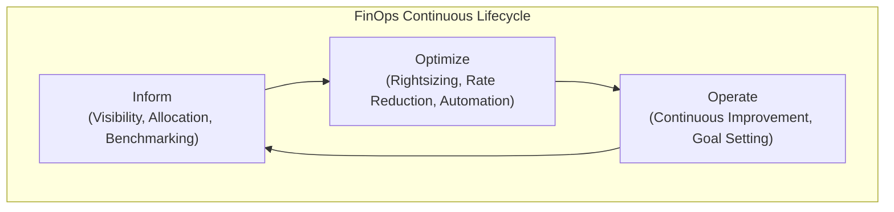

# AWS Cost Optimization Masterclass: Cutting Your Bill in 2026

The days of simply buying Reserved Instances and calling it a day are over. As cloud footprints expand and services become more complex, a reactive approach to AWS cost management is a recipe for budget overruns. By 2026, the leading organizations will treat cloud cost optimization not as an IT task, but as a core business discipline driven by automation, AI, and a culture of financial accountability.

This masterclass goes beyond the basics. We'll explore advanced, forward-looking strategies that blend technology and process to build a cost-efficient, high-performing cloud environment. Let's move from simply cutting costs to maximizing the value of every dollar spent on AWS.

### What You'll Get

*   **Advanced Strategies:** Move beyond Reserved Instances and Savings Plans to sophisticated, modern techniques.
*   **FinOps Culture:** Understand how to integrate financial accountability directly into your engineering lifecycle.
*   **Actionable Code & Diagrams:** Practical examples and visual aids to help you implement these strategies immediately.
*   **AI-Powered Insights:** Learn how to leverage machine learning for rightsizing and anomaly detection.
*   **A Forward-Looking Checklist:** A concrete list of actions to prepare your AWS environment for 2026 and beyond.

## The FinOps Revolution: From Cost Center to Value Center

FinOps is a cultural practice that brings financial accountability to the variable spend model of the cloud. It's about making intelligent, data-backed tradeoffs between speed, cost, and quality. Instead of a central team policing costs, FinOps empowers engineering teams to take ownership of their cloud spend.

The practice operates in a continuous loop, ensuring that optimization is an ongoing process, not a one-time project.



To embed this culture, focus on:
*   **Showback and Chargeback:** Make costs visible to the teams that incur them. Use AWS Cost Categories and cost allocation tags to break down the bill by team, project, or feature.
*   **Unit Economics:** Shift the conversation from "How much did we spend?" to "What is our cost per transaction/customer/request?" This frames cost in the context of business value.
*   **Gamification:** Create dashboards that show top-performing teams in terms of cost efficiency, fostering friendly competition and shared goals.

> "FinOps isn't about saving money, it's about making money. The goal is to get the most value out of every dollar you spend in the cloud." - [The FinOps Foundation](https://www.finops.org/)

## Advanced Compute Cost Control

EC2 and other compute services often represent the largest portion of an AWS bill. While Savings Plans are essential, layering on intelligent, real-time optimization is key for 2026.

### Rightsizing with AI and Machine Learning

Guesswork is no longer acceptable for instance selection. AWS Compute Optimizer uses machine learning to analyze historical utilization metrics from your workloads and recommend optimal instance types. It looks beyond just CPU and memory to consider network, EBS, and other dimensions.

*   **Go Beyond Recommendations:** Use the recommendations as a starting point. Analyze the "why" behind them—is your application memory-bound or I/O-bound?
*   **Automate Acceptance:** For non-critical workloads, you can automate the process of applying rightsizing recommendations using the AWS API and a Lambda function.
*   **Consider Graviton:** Compute Optimizer often recommends ARM-based Graviton instances, which can offer up to 40% better price-performance over comparable x86-based instances for a wide range of workloads.

### Mastering Serverless Cost Models

Serverless is not inherently cheap; it's efficiently priced. Optimizing AWS Lambda and AWS Fargate requires a deep understanding of their billing models.

For **AWS Lambda**, cost is a function of memory allocated, execution duration, and architecture.

| Factor | Impact on Cost | Optimization Tactic |
| :--- | :--- | :--- |
| **Architecture** | High | Switch to ARM (Graviton2) for up to 34% better price-performance. |
| **Memory** | High | Use tools like AWS Lambda Power Tuning to find the perfect memory setting. More memory can mean shorter duration. |
| **Duration** | High | Optimize your code, manage connection pooling, and use provisioned concurrency for latency-sensitive functions. |

For **AWS Fargate**, you pay for the vCPU and memory resources your containerized application requests.
*   **Fargate Spot:** For fault-tolerant workloads like batch processing or CI/CD, use Fargate Spot to save up to 70% over on-demand pricing.
*   **Right-size Tasks:** Don't over-provision your task definitions. Use monitoring tools to understand the actual resource consumption of your containers and adjust accordingly.

## Intelligent Data Storage Strategies

Data is growing exponentially, and so are storage costs. A "set it and forget it" approach to S3 and EBS is a financial liability.

### Automating the Data Lifecycle

Manually moving data between storage tiers is inefficient and error-prone. **S3 Intelligent-Tiering** is the modern default for most data with unknown or changing access patterns.

*   **How it Works:** It automatically moves your data between four access tiers (Frequent Access, Infrequent Access, Archive Instant Access, and Deep Archive Access) based on usage patterns, with no performance impact or retrieval fees.
*   **When to Use It:** Use it as the default storage class for new buckets unless you are certain the data will be accessed very rarely (then consider Glacier Deep Archive directly).

For long-term archival where retrieval times of 12+ hours are acceptable (e.g., compliance, data retention), **S3 Glacier Deep Archive** is the undisputed king of low-cost storage, often costing less than $1 per terabyte per month.

### Taming EBS Volume Costs

The `gp2` volume type was the default for years, but it's time to move on. The `gp3` volume type offers a superior model.

> With `gp2`, performance (IOPS) is tied directly to volume size. To get more performance, you had to provision a larger, more expensive disk. With `gp3`, you can provision IOPS and throughput independently of storage size.

This means you can have a small, highly performant volume without paying for storage you don't need.

**Action:** Convert your `gp2` volumes to `gp3`. It's a simple, online operation with no downtime.

```bash
# Example: Modify a gp2 volume to a 100 GiB gp3 volume
# with 5000 IOPS and 250 MB/s throughput
aws ec2 modify-volume \
    --volume-id vol-0123456789abcdef0 \
    --volume-type gp3 \
    --size 100 \
    --iops 5000 \
    --throughput 250
```
This single command can lead to savings of up to 20% on your EBS bill.

## Governance and Automation at Scale

As you grow, manual optimization becomes impossible. You need guardrails and automated systems to maintain cost control across your organization.

### AI-Powered Anomaly Detection

Unexpected cost spikes can wreck a budget. **AWS Cost Anomaly Detection** is a free, machine learning-powered service that continuously monitors your spending patterns to detect unusual activity.

*   **Setup:** Create monitors for specific AWS services, linked accounts, or cost categories.
*   **Alerting:** Configure alerts via Amazon SNS to notify your FinOps team or Slack channel the moment an anomaly is detected.
*   **Root Cause Analysis:** Use AWS Cost Explorer to investigate the anomaly and understand what service, region, or tag caused the spike.

### Multi-Account Governance with SCPs

In an AWS Organization, Service Control Policies (SCPs) are your ultimate guardrails. They act like a firewall for IAM permissions, allowing you to restrict actions across all accounts in an Organizational Unit (OU).

Use SCPs to enforce cost control policies centrally. For example, you can prevent teams from launching large, expensive GPU or bare-metal instances in development accounts.

**Example SCP:** Deny launching EC2 instance types larger than `xlarge`, except for specific approved types.

```json
{
  "Version": "2012-10-17",
  "Statement": [
    {
      "Sid": "DenyLargeInstanceTypes",
      "Effect": "Deny",
      "Action": "ec2:RunInstances",
      "Resource": "arn:aws:ec2:*:*:instance/*",
      "Condition": {
        "StringNotLike": {
          "ec2:InstanceType": [
            "*.nano",
            "*.micro",
            "*.small",
            "*.medium",
            "*.large",
            "*.xlarge",
            "p3.2xlarge"
          ]
        }
      }
    }
  ]
}
```
This policy denies the launching of any instance type that is not on the approved list (e.g., `2xlarge`, `4xlarge`), while making a specific exception for an approved machine learning instance (`p3.2xlarge`).

## Your 2026 AWS Cost Optimization Checklist

Use this checklist to kickstart your advanced optimization journey.

*   [ ] **Embrace FinOps:** Establish a cross-functional FinOps team with members from finance, engineering, and product.
*   [ ] **Enable AWS Compute Optimizer:** Activate it in all accounts and review its recommendations weekly.
*   [ ] **Audit Lambda Functions:** Identify top-costing functions and test them on Graviton2 architecture.
*   [ ] **Convert EBS Volumes:** Run a script to identify all `gp2` volumes and plan their conversion to `gp3`.
*   [ ] **Activate S3 Intelligent-Tiering:** Configure it as the default storage class for new buckets with mixed or unknown access patterns.
*   [ ] **Set Up Cost Anomaly Detection:** Create monitors for your most critical services and accounts.
*   [ ] **Implement SCP Guardrails:** Start with a simple policy to restrict instance types or regions in development environments.
*   [ ] **Tag Everything:** Enforce a mandatory tagging policy for `Project`, `Team`, and `Owner` to enable accurate showback.

## Conclusion

In 2026, AWS cost optimization is an active, intelligent, and automated discipline. By moving beyond basic commitments and embracing a FinOps culture backed by AI-powered tools and strong governance, you can transform your cloud spend from a liability into a strategic advantage. Start implementing these strategies today to build a resilient, efficient, and cost-effective cloud foundation for the future.

What's your biggest cost-saving win on AWS? Share your stories and tips in the comments below! 👇


## Further Reading

- [https://aws.amazon.com/aws-cost-management/](https://aws.amazon.com/aws-cost-management/)
- [https://finops.org/framework/capabilities/aws-finops/](https://finops.org/framework/capabilities/aws-finops/)
- [https://aws.amazon.com/blogs/mt/cost-optimization-strategies-2026/](https://aws.amazon.com/blogs/mt/cost-optimization-strategies-2026/)
- [https://www.cloudhealthtech.com/aws-cost-optimization-guide](https://www.cloudhealthtech.com/aws-cost-optimization-guide)
- [https://www.gartner.com/en/articles/cloud-cost-optimization-2026](https://www.gartner.com/en/articles/cloud-cost-optimization-2026)
