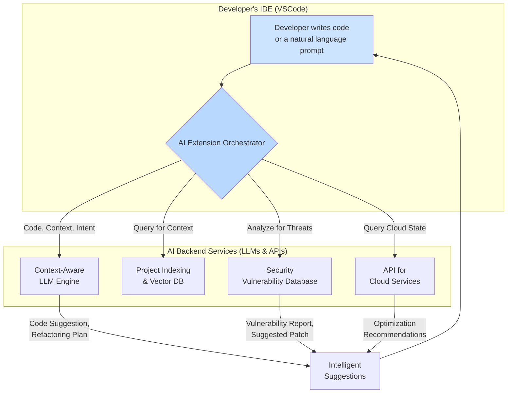

# VSCode's AI Renaissance: Top Extensions for Developers in 2026

The year is 2026, and the hum of an AI assistant is as integral to a developer's workflow as a keyboard. We've moved far beyond the initial novelty of single-line code completion. Today's AI-powered VSCode extensions are true development partners, augmenting every phase of the software lifecycle. They act as debuggers, security analysts, refactoring experts, and technical writers, all within the familiar confines of our favorite editor.

If you're still using AI just for boilerplate, you're missing out on a revolution. This article dives into the most transformative AI extensions that are defining professional development today.

### What You'll Get

*   An overview of how AI has evolved from a simple autocompleter to a full-lifecycle assistant.
*   A detailed look at the top-tier extensions for intelligent debugging, security, and documentation.
*   A comparative guide to help you choose the right AI partner for your workflow.
*   Practical examples of how these tools solve complex, real-world problems.

---

## The Evolution Beyond Code Completion

Remember 2023? AI in the IDE was groundbreaking but limited. We marveled at [GitHub Copilot](https://github.com/features/copilot) and early [Google Gemini](https://deepmind.google/technologies/gemini/) integrations for their ability to predict the next line of code. It was a massive productivity boost, but it was fundamentally reactive.

Fast forward to today, and the paradigm has shifted from *code completion* to *cognitive augmentation*. Modern AI extensions don't just write code; they understand it. They analyze intent, comprehend project-wide context, and proactively offer solutions for complex challenges.

> The goal is no longer to type less; it's to *think better*. Modern AI tools handle the cognitive overhead of repetitive tasks, freeing up developers to focus on architecture, user experience, and innovation.

This shift is powered by highly specialized large language models (LLMs) and deep integration into the IDE's core services, including its debugger, linter, and source control.

## Top AI Extensions Defining 2026

The VSCode Marketplace is bustling with AI, but a few elite extensions have emerged as industry standards. They don't just excel at one thing; they offer a suite of integrated capabilities.

### 1. GitHub Copilot Enterprise

Copilot is no longer just a pair programmer; it's a team lead. The Enterprise version, deeply integrated with GitHub, has become the default for teams building on the platform.

*   **Project-Wide Intelligence:** Copilot now builds a semantic index of your entire repository. When you ask it to refactor a function, it understands the upstream and downstream dependencies, suggesting changes across multiple files and even updating relevant tests.
*   **Intelligent Debugging Assistance:** Gone are the days of peppering your code with `console.log`. When you hit a breakpoint, Copilot analyzes the call stack and variable states. You can ask it natural language questions like, *"Why is this user object null here?"*, and it will trace the variable's lifecycle to pinpoint the root cause.
*   **Automated Refactoring & Modernization:** Copilot can perform complex, multi-file refactoring tasks. For example, you can select a legacy module and prompt it to *"Refactor this module to use the async/await pattern and replace the legacy promise chain."*

```javascript
// A prompt you might give to Copilot Enterprise
// @copilot please refactor this file.
// 1. Convert all `var` to `let` or `const`.
// 2. Change the promise-based `fetchData` function to use async/await.
// 3. Add JSDoc comments to all public functions.

function fetchData(url) {
  var result = fetch(url).then(function(response) {
    if (response.ok) {
      return response.json();
    }
    throw new Error('Network response was not ok.');
  });
  return result;
}
```

### 2. Gemini Advanced for VSCode

Google's Gemini has carved out its niche with a focus on multi-modal understanding and deep integration with cloud ecosystems. It's a powerhouse for developers working with complex data or building on Google Cloud Platform (GCP).

*   **Cross-Language Semantic Translation:** Gemini excels at understanding code logic across different languages. You can highlight a Python script and ask, *"Explain this logic and provide an equivalent implementation in Go."* It doesn't just translate syntax; it preserves the business logic and adapts to language-idiomatic patterns.
*   **Architecture-Aware Suggestions:** By integrating with GCP and other cloud providers, Gemini can analyze your Infrastructure-as-Code (IaC) files (like Terraform or Bicep) and provide cost, security, and performance optimization suggestions that are aware of your existing cloud architecture.
*   **Documentation Generation:** Gemini's ability to process and generate natural language is second to none. It can read your entire codebase and generate comprehensive, human-readable documentation, including API references and even architectural overview diagrams in Mermaid syntax.

Here's how an AI-augmented development flow looks today:



### 3. CodeGuardian AI

While the giants focus on productivity, specialized tools like CodeGuardian have cornered the market on proactive security. It's a non-negotiable extension for any team where security is paramount.

*   **Real-time Threat Modeling:** As you write code, CodeGuardian analyzes your logic and cross-references it with known vulnerability patterns (like OWASP Top 10). It doesn't just flag a potential SQL injection; it explains *why* it's a risk in the context of your application's data flow and suggests a parameterized query as a patch.
*   **Dependency Vulnerability Chains:** It goes beyond a simple `npm audit`. CodeGuardian traces your dependency tree and alerts you to *transitive dependency* vulnerabilities—risks hidden several layers deep in your `node_modules` folder.
*   **Automated Security-Hardened Patching:** When a vulnerability is found, CodeGuardian can generate a pull request with a security-hardened patch, complete with an explanation of the fix and links to the relevant CVE (Common Vulnerabilities and Exposures) entries.

## Choosing Your AI Co-developer

With such powerful options, the right choice depends on your specific needs. There's no single "best" tool, only the best tool *for the job*.

| Extension              | Core Function         | Best For                                           | Key Integrations         |
| ---------------------- | --------------------- | -------------------------------------------------- | ------------------------ |
| **Copilot Enterprise** | Full-Lifecycle Asst.  | Teams deeply embedded in the GitHub ecosystem.     | GitHub, Codespaces, Actions |
| **Gemini Advanced**    | Multi-modal & Cloud   | Developers building on GCP or needing cross-language mastery. | Google Cloud Platform, Firebase |
| **CodeGuardian AI**    | Proactive Security    | Applications where security and compliance are critical. | Snyk, OWASP, GitHub Security |

To make your decision, consider the following:
*   **Your Ecosystem:** If your team lives in GitHub, Copilot Enterprise is a natural fit. If you're all-in on Google Cloud, Gemini offers unparalleled integration.
*   **Your Primary Task:** Are you building new features at lightning speed? Copilot is a great choice. Are you modernizing a legacy multi-language system? Gemini's translation capabilities shine.
*   **Your Non-Negotiables:** If you work in fintech, healthcare, or any other regulated industry, a dedicated security tool like CodeGuardian isn't optional; it's a requirement.

## The Road Ahead

The pace of innovation is staggering. We can expect even deeper integrations in the coming years, with AI assistants capable of understanding high-level business requirements and scaffolding entire applications. The line between writing, testing, securing, and deploying code will continue to blur, all orchestrated from within VSCode.

The AI renaissance is here. It’s time to upgrade your workflow, experiment with these powerful new partners, and focus on what you do best: solving problems.

---

What's your go-to AI extension in 2026? Have you found a hidden gem that boosts your productivity? Share your experiences and favorites in the comments below


## Further Reading

- [https://code.visualstudio.com/docs/editor/extension-gallery](https://code.visualstudio.com/docs/editor/extension-gallery)
- [https://marketplace.visualstudio.com/search?target=VSCode&category=AI](https://marketplace.visualstudio.com/search?target=VSCode&category=AI)
- [https://github.com/microsoft/vscode-copilot](https://github.com/microsoft/vscode-copilot)
- [https://www.googlecloud.com/gemini/vs-code-integration](https://www.googlecloud.com/gemini/vs-code-integration)
- [https://devblogs.microsoft.com/vscode/ai-extensions-2026-roadmap](https://devblogs.microsoft.com/vscode/ai-extensions-2026-roadmap)
