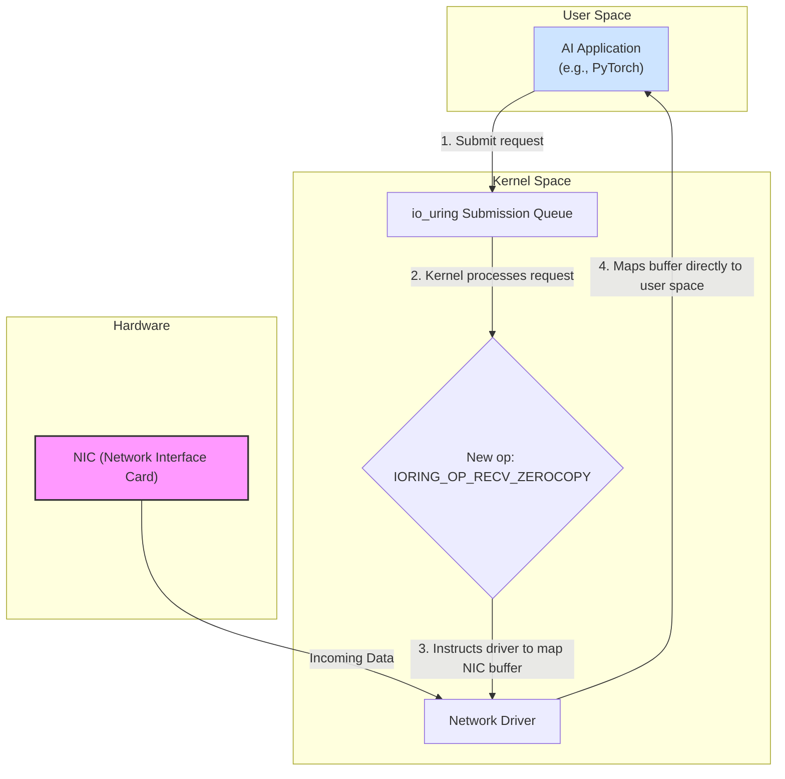

# Linux Kernel 6.10: Unveiling 2026's Performance and Security Features

The Linux kernel is the bedrock of modern computing, and its evolution dictates the future of everything from cloud infrastructure to edge devices. As we look toward mid-2026, the anticipated Linux Kernel 6.10 release is poised to introduce a wave of significant advancements. This version is expected to double down on performance for AI and cloud workloads, introduce next-generation security hardening, and provide foundational support for the hardware of tomorrow.

This article dives into the key features we can expect in Kernel 6.10, based on current development trajectories and industry trends. We'll explore what these changes mean for system administrators, developers, and data scientists who rely on Linux to power their most critical applications.

### What You'll Get

*   **AI & Cloud Performance:** An overview of scheduler, networking, and memory management upgrades.
*   **Security Hardening:** Insights into the expansion of Rust and new memory safety features.
*   **Next-Gen Hardware:** A look at support for new CPU architectures and interconnects like CXL.
*   **Developer Impact:** Analysis of new syscalls and eBPF capabilities.

---

## ## Enhanced Performance for AI and Cloud Native Workloads

The insatiable demand for performance in AI/ML and cloud environments is the primary driver for many kernel innovations. Kernel 6.10 is expected to deliver substantial improvements in efficiency, throughput, and latency.

### ### A Smarter, Workload-Aware Scheduler

The Completely Fair Scheduler (CFS) has served Linux well, but specialized workloads demand more. We anticipate Kernel 6.10 will introduce more advanced workload-aware scheduling capabilities, potentially through extensions to EEVDF (Earliest Eligible Virtual Deadline First).

*   **NUMA-Awareness Overhaul:** Deeper integration with NUMA (Non-Uniform Memory Access) topologies to keep processes and their memory on the same node, drastically reducing latency for large-dataset operations common in AI.
*   **Core Grouping:** Smarter grouping of tasks onto physical core complexes (like AMD's CCDs or Intel's P/E-cores) to maximize cache utilization and minimize cross-core chatter.
*   **Power Efficiency:** Enhanced coordination with CPU frequency governors to deliver performance when needed while saving power during idle periods, a critical factor for data center operational costs.

### ### I/O and Networking: Beyond io_uring

The `io_uring` interface revolutionized asynchronous I/O. Kernel 6.10 will likely build on this foundation to further erase the lines between kernel and user space for high-throughput networking.

> **Info:** Expect `io_uring` to gain more "zero-copy" networking operations, allowing applications to pass network packet data directly to and from hardware without the kernel needing to copy it. This is a game-changer for applications handling 200/400 Gbps network speeds.

Here's a conceptual Mermaid diagram showing how a future `io_uring` operation might streamline data flow for an AI workload.



## ## The March Toward a More Secure Kernel

Security is a perpetual arms race. Kernel 6.10 will continue the trend of proactive hardening, focusing on memory safety and minimizing the potential attack surface.

### ### Rust Integration Matures

The integration of the Rust programming language into the kernel, which began in earnest around the 6.1 cycle, is expected to reach a significant milestone.

*   **More Subsystems Rewritten:** We'll likely see critical, security-sensitive subsystems like parts of the networking stack or specific drivers being written in Rust.
*   **Safer Abstractions:** The kernel community will have developed a mature set of safe abstractions and APIs, making it easier for developers to write memory-safe driver code.
*   **Reduced Vulnerabilities:** The primary benefit remains a reduction in entire classes of bugs, such as buffer overflows and use-after-free vulnerabilities, which have historically plagued C-based kernel code. More on this can be found at the official [Rust for Linux](https://rust-for-linux.com/) project site.

### ### Advanced Memory Safety and Integrity

Beyond Rust, Kernel 6.10 will likely strengthen defenses for the vast C codebase.

| Feature | Description | Benefit |
| :--- | :--- | :--- |
| **Control-Flow Integrity (CFI)** | Further adoption of Clang's fine-grained forward-edge CFI, which prevents attackers from hijacking the program flow by redirecting function calls. | Mitigates Return-Oriented Programming (ROP) and Jump-Oriented Programming (JOP) attacks. |
| **Shadow Stack** | Hardware-enforced protection (leveraging features in new Intel/AMD/ARM CPUs) that maintains a separate, protected stack for function return addresses. | Prevents attackers from overwriting return addresses on the main stack to seize control. |
| **Randomized Kernel Stacks** | Per-system-call kernel stack randomization to make it significantly harder for attackers to predict memory layouts. | Thwarts exploits that rely on fixed memory offsets. |

## ## Embracing Next-Generation Hardware

A new kernel version always means support for new hardware. By 2026, the hardware landscape will feature more diverse and specialized processors.

### ### Unified Support for AI Accelerators

Managing the growing zoo of GPUs, NPUs (Neural Processing Units), and other AI accelerators is a major challenge. Kernel 6.10 is expected to introduce a more unified accelerator subsystem.

*   **Standardized Syscalls:** A potential new set of syscalls for scheduling compute tasks, managing memory, and handling synchronization across different types of accelerators.
*   **Direct Data Paths:** Kernel mechanisms to facilitate direct, peer-to-peer data transfers between different devices (e.g., NIC to GPU, SSD to NPU) without CPU intervention, powered by technologies like PCIe 6.0.

A hypothetical `accel_submit` syscall might look something like this in pseudocode:

```c
// Pseudocode for a unified accelerator submission
struct accel_op {
    int accelerator_fd;       // File descriptor for the target NPU/GPU
    void *user_input_ptr;     // Pointer to input data in user memory
    size_t input_size;
    void *user_output_ptr;    // Pointer for the output
    size_t output_size;
    int    op_type;           // e.g., ACCEL_OP_MATRIX_MULTIPLY
};

// New syscall to submit a batch of operations
// Returns immediately, completion is signaled via an eventfd.
int accel_submit(struct accel_op *ops, unsigned int count, int event_fd, int flags);
```

### ### CPU Architectures and Interconnects

*   **RISC-V Maturity:** Expect server-grade RISC-V profiles to be fully supported, including advanced virtualization and vector processing extensions, making it a viable alternative to x86 and ARM in the data center.
*   **CXL 3.0/4.0:** Full support for Compute Express Link 3.0 and early support for 4.0 will be critical. This allows for disaggregated infrastructure where pools of memory, accelerators, and storage can be shared dynamically across servers, a paradigm shift for cloud architecture. [LWN.net](https://lwn.net/Kernel/Index/) frequently covers the ongoing CXL development.

## ## What This Means For You

*   **For System Administrators:** Kernel 6.10 promises a more secure, stable, and performant platform that can better utilize modern hardware. The improved scheduling and power management features can directly translate to lower operational costs and higher workload density.
*   **For Developers:** New, more powerful interfaces like `io_uring` extensions and potential accelerator syscalls will unlock new levels of performance. The continued expansion of eBPF will allow for even more sophisticated in-kernel programming without modifying kernel source.
*   **For Data Scientists:** A kernel that is deeply aware of AI/ML hardware means that frameworks like TensorFlow and PyTorch can run more efficiently. Faster I/O and direct accelerator access reduce training times and allow for larger models to be handled effectively.

## ## Final Thoughts

Linux Kernel 6.10 is shaping up to be a landmark release, solidifying the kernel's role as the engine for the next era of computing. By focusing on the parallel demands of performance, security, and hardware enablement, it provides the foundation needed for the complex, data-intensive applications of the late 2020s.

The features discussed here are based on projections from ongoing work seen on the [Linux Kernel Mailing List (LKML)](https://lkml.org/) and analysis from sites like [Phoronix](https://www.phoronix.com/). The final feature set will evolve, but the direction is clear: a faster, safer, and more adaptable kernel for all.

What anticipated features in the 6.x kernel series are you most excited about? Share your thoughts below


## Further Reading

- [https://www.kernel.org/category/releases.html](https://www.kernel.org/category/releases.html)
- [https://lwn.net/Kernel/Index/](https://lwn.net/Kernel/Index/)
- [https://phoronix.com/news/Linux-Kernel-6.10-Features-Preview](https://phoronix.com/news/Linux-Kernel-6.10-Features-Preview)
- [https://techradar.com/pro/os/linux-kernel-updates-2026](https://techradar.com/pro/os/linux-kernel-updates-2026)
- [https://www.redhat.com/en/blog/future-linux-kernel-development](https://www.redhat.com/en/blog/future-linux-kernel-development)
