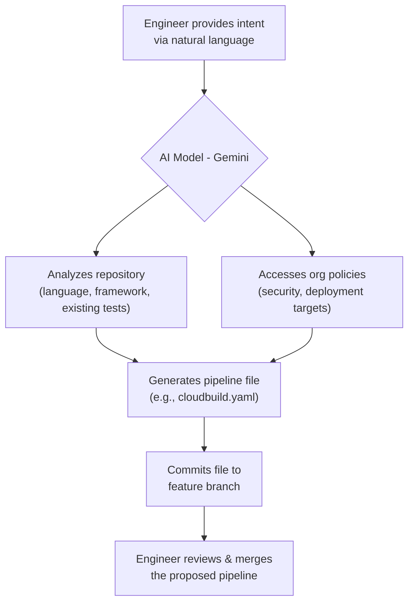

# Gemini & Copilot in DevOps: The AI-Powered Workflow Revolution

Welcome to 2026. The distinction between a DevOps engineer and an AI model is becoming increasingly blurred. Tools like Google's Gemini and GitHub Copilot are no longer just intelligent code completers; they are active, autonomous participants in the entire software development lifecycle. They draft infrastructure, predict outages, and write their own tests. This isn't science fiction—it's the new reality of high-performance engineering teams.

This article explores the profound impact these AI powerhouses are having on DevOps workflows. We'll dissect how they've moved from assistants to collaborators, freeing up human engineers to tackle the next generation of complex, strategic problems.

### What You'll Get

*   **A 2026 Snapshot:** Understand how AI is embedded in modern DevOps.
*   **Practical Use Cases:** See AI in action for code reviews, CI/CD, and incident management.
*   **Code & Diagrams:** Concrete examples of AI-generated IaC, tests, and workflow diagrams.
*   **Ethical Guardrails:** Best practices for integrating AI responsibly.

---

## The New DevOps Landscape: AI as a Core Team Member

By 2026, the paradigm has shifted. We've moved beyond using AI for isolated tasks. Instead, AI models are integrated as persistent, context-aware "team members" that participate across the DevOps loop. They possess a deep understanding of a project's codebase, infrastructure, and operational history.

*   **Persistent Context:** AI models are no longer stateless. They are fine-tuned on an organization's private repositories, infrastructure state, and incident logs, enabling them to provide highly relevant and safe recommendations.
*   **Proactive, Not Reactive:** Instead of waiting for a prompt, AI agents now proactively identify optimization opportunities, security risks, and potential production failures.
*   **Natural Language Interface:** The primary way engineers interact with complex tooling is through natural language. Describing a desired outcome is often all that's needed to generate the underlying code or configuration.

> **Key takeaway:** The most significant change is the move from *prompt-driven assistance* to *proactive, context-aware collaboration*.

## Intelligent CI/CD Pipeline Orchestration

The era of manually crafting complex, brittle `gitlab-ci.yml` or `Jenkinsfile` configurations is over. Today, pipelines are dynamically generated and optimized by AI based on high-level goals. An engineer can specify the *what*, and the AI determines the *how*.

An engineer simply states the intent:

*"Hey Gemini, create a CI/CD pipeline for the 'payments-api' service. It's a Go application. On a pull request, run linting, unit tests, and a security scan. On a merge to the `main` branch, build a Docker image, push it to our Artifact Registry, and deploy to the staging GKE cluster using a canary strategy."*

The AI then generates the complete, syntactically correct pipeline-as-code file, saving hours of boilerplate work and preventing common configuration errors.

This workflow can be visualized as follows:



### Dynamic Pipeline Optimization

AI doesn't just create pipelines; it optimizes them in real-time.
*   **Test Selection:** It analyzes the code changes in a pull request and runs only the most relevant subset of tests, drastically reducing CI cycle time.
*   **Resource Allocation:** It predicts the resource needs for each job and provisions CI runners accordingly, optimizing for both speed and cost.
*   **Failure Analysis:** When a pipeline fails, the AI provides a summary of the likely cause, pointing to the exact commit and code lines responsible.

## Automated Code Review and Quality Gates

AI-powered code reviews go far beyond simple linting. Models like Copilot, now with deep repository context, act as tireless, expert reviewers, catching issues humans might miss.

Imagine a pull request where a junior developer introduces a subtle N+1 query bug in an API endpoint.

**Traditional Review:** A senior developer might catch it, but only after spending significant time manually tracing the code's logic and data access patterns.

**AI-Powered Review (2026):** The AI automatically adds a comment to the PR:

> **🤖 AI Reviewer (Gemini):**
>
> **Performance Suggestion:** The loop on `line 54` inside `process_orders` makes a database call for each `order_id`. This will cause an N+1 query issue under load.
>
> **Recommendation:** Consider fetching all user profiles in a single batch query before the loop to improve efficiency.
>
> **Suggested Code:**
> ```python
> user_ids = [order.user_id for order in orders]
> users = db.get_users_by_ids(user_ids)
> user_map = {user.id: user for user in users}
> for order in orders:
>   user = user_map.get(order.user_id)
>   # ... process with user object
> ```

This level of insight accelerates the feedback loop, educates developers, and hardens code quality before it ever reaches production.

## Predictive Incident Management with AIOps

AIOps has matured from a buzzword into a cornerstone of modern reliability. By continuously analyzing telemetry—logs, metrics, and traces—AI can now accurately predict failures *before* they impact users.

| Traditional Monitoring | AI-Driven AIOps (2026) |
| :--- | :--- |
| Alert on threshold breach (e.g., CPU > 90%) | Identifies anomalous correlations across metrics |
| Humans manually correlate alerts to find root cause | AI suggests probable root cause with evidence |
| Static dashboards and predefined alerts | Dynamic anomaly detection and forecasting |
| Reactive response to incidents | Proactive alerts on *impending* failure |

When an anomaly is detected, the AI doesn't just fire an alert. It automatically:
1.  **Correlates Signals:** Links a spike in API latency to a specific bad deployment and a sudden rise in database logs.
2.  **Suggests Root Cause:** "Alert: P99 latency for `checkout-service` has increased 300%. Correlated with deployment `v1.2.4`. Probable cause: inefficient database query introduced in commit `a4d3e1c`."
3.  **Generates a Runbook:** Creates a step-by-step remediation plan, including the exact commands to initiate a rollback or apply a hotfix.

## Accelerating Development with AI-Generated IaC and Tests

Toil-heavy tasks like writing boilerplate for infrastructure and tests have been largely automated. This allows engineers to focus on architecture and business logic.

### Infrastructure as Code (IaC) Generation

An SRE can now provision complex infrastructure with a simple, high-level prompt.

**Prompt:** "Generate a Terraform configuration for a production-grade, auto-scaling web application on AWS. Use a private VPC with public and private subnets, an ALB, an ECS Fargate cluster for the application, and an RDS Aurora PostgreSQL database."

The AI generates the modular, best-practice HCL code in seconds.

```terraform
# --- Generated by AI ---
# main.tf for production-grade web application

provider "aws" {
  region = "us-east-1"
}

module "vpc" {
  source  = "terraform-aws-modules/vpc/aws"
  version = "5.5.2"

  name = "prod-vpc"
  cidr = "10.0.0.0/16"

  azs             = ["us-east-1a", "us-east-1b"]
  private_subnets = ["10.0.1.0/24", "10.0.2.0/24"]
  public_subnets  = ["10.0.101.0/24", "10.0.102.0/24"]

  enable_nat_gateway = true
  # ... and so on for ALB, ECS, RDS modules
}

# ... rest of generated configuration
```

This not only accelerates setup but also enforces organizational standards for tagging, security groups, and module usage.

### Test Case Creation

Given a new function, AI models can instantly generate a comprehensive suite of unit and integration tests, covering edge cases the developer might have overlooked. This significantly improves test coverage and reduces the manual effort required to maintain a healthy test pyramid.

## The Human Element: Best Practices and Ethical Guardrails

With great power comes great responsibility. Integrating AI this deeply requires new skills and a strong ethical framework.

*   **Humans as Reviewers:** The primary role of the engineer shifts from *creator* to *reviewer and curator*. Always critically evaluate AI-generated code and configurations before deploying them. The AI is a powerful tool, but it is not infallible.
*   **Cultivate Prompt Engineering Skills:** The ability to articulate clear, concise, and context-rich prompts is now a critical engineering skill.
*   **Beware of Bias:** AI models are trained on vast datasets of existing code, which may contain biases or outdated patterns. Actively guide and correct the AI to ensure it adheres to modern best practices and your organization's specific standards.
*   **Data Privacy:** Ensure that the AI models are fine-tuned in a secure environment and that no sensitive or proprietary code is leaked into public training sets.

> **A Note on Responsible AI**
> The goal of AI in DevOps is to *augment* human intelligence, not replace it. These tools should handle the repetitive, the predictable, and the complex data correlation, freeing up human creativity to solve novel business problems, design better systems, and mentor the next generation of engineers.

## Conclusion

By 2026, Gemini and Copilot have fundamentally reshaped the DevOps landscape. They have become indispensable partners, driving unprecedented levels of speed, quality, and reliability. By automating toil, providing deep insights, and acting as a force multiplier, AI allows engineering teams to focus on what truly matters: delivering value. The revolution is here, and it's powered by intelligent, collaborative machines.

Now, over to you. **How has AI already started to change your DevOps role?** Share your thoughts in the comments below.


## Further Reading

- [https://cloud.google.com/gemini/docs/devops-integrations](https://cloud.google.com/gemini/docs/devops-integrations)
- [https://github.com/features/copilot](https://github.com/features/copilot)
- [https://www.redhat.com/en/topics/devops/devops-ai-ml](https://www.redhat.com/en/topics/devops/devops-ai-ml)
- [https://www.infoq.com/articles/ai-driven-devops-2026/](https://www.infoq.com/articles/ai-driven-devops-2026/)
- [https://techcrunch.com/2026/generative-ai-in-software-development](https://techcrunch.com/2026/generative-ai-in-software-development)
