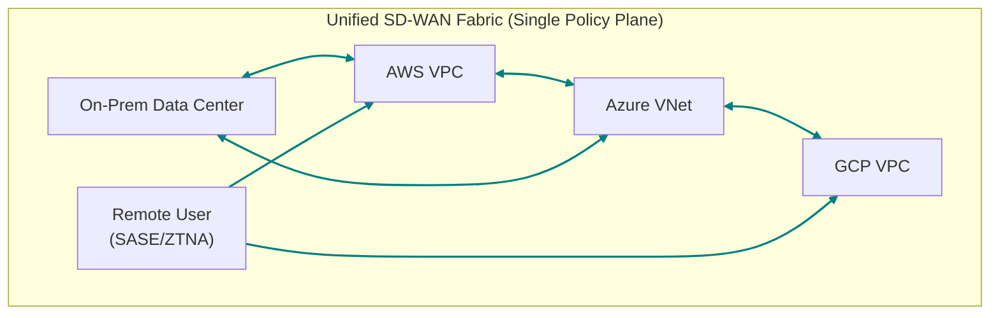

# Cloud Networking 2.0: Architecting for Speed and Security in 2026

The era of simple, centralized cloud networking is over. The "lift-and-shift" model, where on-premise network topologies were awkwardly mapped onto a single cloud provider, is buckling under the pressure of distributed applications, multi-cloud realities, and a perimeter that has evaporated. By 2026, organizations that haven't evolved will face significant performance bottlenecks, security vulnerabilities, and operational chaos.

Welcome to Cloud Networking 2.0. This isn't an incremental update; it's a fundamental paradigm shift. It treats the network not as a collection of virtual routers and firewalls, but as a programmable, intelligent, and secure fabric that spans multiple clouds, data centers, and the edge. This new model is built for the speed and complexity of modern applications.

### What You'll Get

In this article, we'll dissect the architecture of the near future. You will get:

*   A clear definition of the core pillars of Cloud Networking 2.0.
*   An exploration of key technologies like SD-WAN, ZTNA, and AIOps.
*   A high-level diagram illustrating the new multi-cloud connectivity model.
*   Actionable strategies and a roadmap to begin future-proofing your network today.

---

## The Cracks in the Foundation

Before building the future, we must understand why the present is failing. Traditional cloud networking, often an extension of the data center hub-and-spoke model, suffers from critical flaws in a distributed world.

*   **Performance Bottlenecks:** Traffic is often "hair-pinned" through a central virtual appliance or a specific cloud region for security inspection, adding significant latency for inter-service or user-to-app communication.
*   **Security Gaps:** A model focused on a strong perimeter is useless when applications are composed of services running across AWS, Azure, and on-premise Kubernetes clusters. The attack surface is vast and porous.
*   **Operational Complexity:** Managing inconsistent network policies, routing tables, and security groups across different cloud providers using their native tools is a recipe for misconfiguration and burnout.

*Are you spending more time troubleshooting cross-cloud security group rules than deploying new application features? If so, you're already feeling the strain.*

## The Pillars of Cloud Networking 2.0

Cloud Networking 2.0 is built on a foundation of software-defined principles, zero-trust security, and intelligent automation. These pillars work together to create a network that is resilient, secure, and agile.

### SD-WAN: The Multi-Cloud Superhighway

Software-Defined Wide Area Networking (SD-WAN) has evolved. It's no longer just about connecting branch offices more efficiently. In the Cloud 2.0 model, SD-WAN provides the intelligent overlay fabric that connects your entire distributed environment—data centers, multiple public clouds, and edge locations.

This approach abstracts away the complexity of the underlying cloud provider networks. It creates a unified, policy-driven transport layer.

*   **Key Benefits:**
    *   **Automated Path Selection:** Intelligently routes traffic over the best path (e.g., cloud backbone, direct internet) based on application performance needs.
    *   **Centralized Policy:** Define security and routing policies once and enforce them everywhere.
    *   **Reduced Latency:** Enables direct cloud-to-cloud and user-to-cloud connections, eliminating the backhaul bottleneck.

Here's a simplified view of how an SD-WAN fabric unifies multi-cloud environments:



### Zero-Trust Network Access (ZTNA): Assume Breach

The old castle-and-moat security model is dead. [Zero Trust](https://www.paloaltonetworks.com/cyber-security-insights/what-is-zero-trust) is the new standard, operating on a simple but powerful principle: *never trust, always verify*. ZTNA applies this principle to network access.

Instead of granting broad access based on being "on the network" (like a traditional VPN), ZTNA grants access to specific applications on a per-session basis, only after verifying the identity of the user, the health of the device, and other contextual signals.

> **The new perimeter is identity.** Access is determined by *who you are*, not *where you are*.

This approach enables powerful micro-segmentation, preventing lateral movement by attackers. If one service is compromised, the blast radius is contained because it has no inherent trust or access to other services.

### AI-Driven Observability: From Reactive to Predictive

You can't manage what you can't see. With network traffic flowing across multiple providers, traditional monitoring tools fall short. AIOps (AI for IT Operations) is the solution, transforming network observability from a reactive to a predictive discipline.

An AI-driven platform ingests metrics, logs, and flow data from your entire stack to:

*   **Detect Anomalies:** Identify subtle deviations from normal performance baselines that signal an impending issue.
*   **Correlate Events:** Automatically connect a performance dip in an application to a network configuration change made in another cloud.
*   **Predict Future Needs:** Analyze trends to forecast capacity requirements and prevent performance degradation.

This means your team stops firefighting and starts proactively optimizing the network before users are ever impacted.

### Programmable Networking: Infrastructure as Code (IaC)

The final pillar is treating your network as code. Manual configuration through a GUI is slow, error-prone, and doesn't scale. By 2026, best-in-class network operations will be fully driven by [Infrastructure as Code (IaC)](https://aws.amazon.com/what-is/infrastructure-as-code/).

Tools like Terraform and Ansible, combined with provider APIs, allow you to define, version, and deploy your entire network architecture—VPCs, subnets, routing tables, firewall rules, and SD-WAN policies—through automated pipelines.

Here’s a conceptual example of defining a security group in Terraform:

```terraform
# Example: Define a security group for a web server in AWS

resource "aws_security_group" "web_server_sg" {
  name        = "web-server-sg"
  description = "Allow TLS inbound traffic"
  vpc_id      = aws_vpc.main.id

  ingress {
    description = "HTTPS from anywhere"
    from_port   = 443
    to_port     = 443
    protocol    = "tcp"
    cidr_blocks = ["0.0.0.0/0"]
  }

  egress {
    from_port   = 0
    to_port     = 0
    protocol    = "-1"
    cidr_blocks = ["0.0.0.0/0"]
  }

  tags = {
    Name = "WebServerSG"
    Env  = "Production"
  }
}
```
This code is reviewable, testable, and reusable, bringing DevOps agility to network management.

## Architecting Your Network for 2026: A Roadmap

Transitioning to a Cloud Networking 2.0 model is a journey, not a flip of a switch. Here is a practical, phased approach to get started.

| Feature | Traditional Cloud Networking (The Past) | Cloud Networking 2.0 (The Future) |
| :--- | :--- | :--- |
| **Connectivity** | Siloed, provider-native constructs | Unified SD-WAN overlay |
| **Security** | Perimeter-based (IP ACLs, WAFs) | Identity-based (ZTNA, Micro-segmentation) |
| **Operations** | Manual, ticket-driven changes | Automated, GitOps-driven (IaC) |
| **Visibility** | Siloed monitoring tools | Unified, AI-driven observability platform |
| **Resilience** | Single-region, manual failover | Multi-region/multi-cloud, automated failover |

**Your Action Plan:**

1.  **Unify Your Connectivity Fabric:** Start by evaluating a multi-cloud networking solution or SD-WAN fabric to create a unified transit layer. This is the foundational step to abstracting provider complexity.
2.  **Pilot Identity-Aware Segmentation:** Choose one critical application and replace its VPN access with a ZTNA solution. Measure the security and user experience improvements.
3.  **Consolidate Observability:** Invest in a platform that can ingest and analyze network data from all your environments. Break down the data silos between your on-prem, AWS, and [Azure](https://azure.microsoft.com/en-us/solutions/networking) teams.
4.  **Codify Your Brownfield:** You don't have to rebuild everything. Start by using IaC to manage new network deployments and gradually codify existing, critical infrastructure.

## The Future is Composable and Intelligent

Cloud Networking 2.0 is the nervous system of the modern enterprise. It is more than a collection of technologies; it's an architectural philosophy that prioritizes agility, security, and intelligence.

By embracing a programmable fabric, a zero-trust security posture, and AI-driven operations, you can build a network that not only supports your applications but actively accelerates your business. The transition requires a shift in both tools and mindset, but the payoff—a faster, more secure, and more resilient cloud environment—is essential for competing in 2026 and beyond.


## Further Reading

- [https://www.cisco.com/c/en/us/solutions/cloud/cloud-networking.html](https://www.cisco.com/c/en/us/solutions/cloud/cloud-networking.html)
- [https://www.paloaltonetworks.com/cyber-security-insights/what-is-zero-trust](https://www.paloaltonetworks.com/cyber-security-insights/what-is-zero-trust)
- [https://www.gartner.com/en/articles/future-of-network-security-2026](https://www.gartner.com/en/articles/future-of-network-security-2026)
- [https://aws.amazon.com/networking/](https://aws.amazon.com/networking/)
- [https://azure.microsoft.com/en-us/solutions/networking](https://azure.microsoft.com/en-us/solutions/networking)
