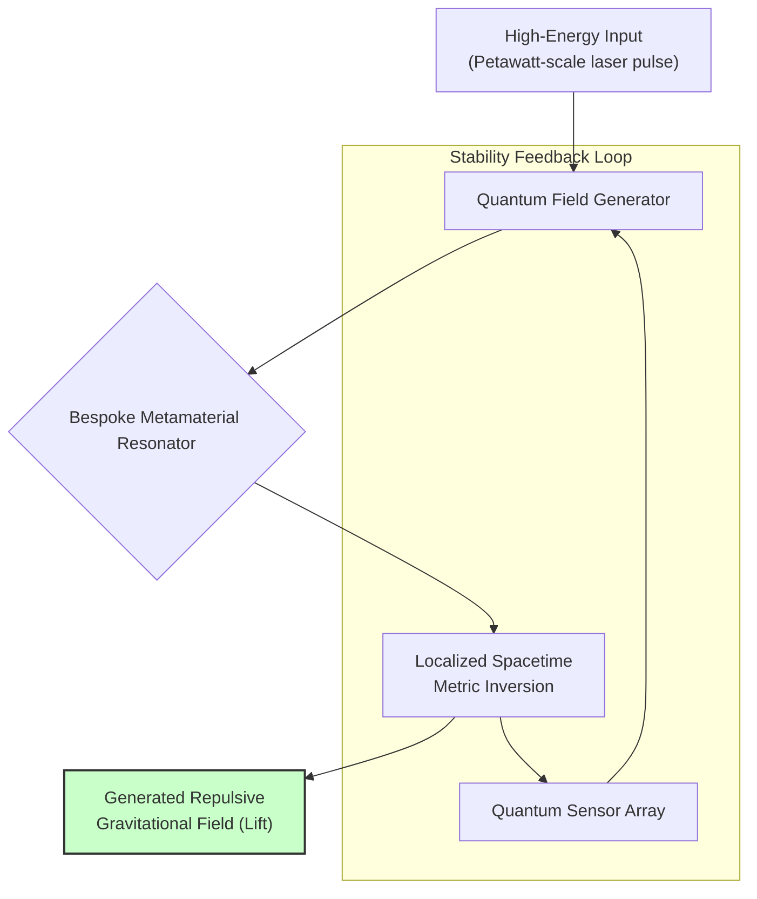

# Unconfirmed Breakthrough: The Race for Practical Antigravity in 2026

The physics and engineering communities are buzzing this week with unconfirmed reports of a major breakthrough in gravitational control. A leaked preprint, allegedly from a private European research consortium, describes a method for generating a localized, repulsive gravitational field—what the media has quickly dubbed "practical antigravity." While official sources remain silent, the detailed methodology and tantalizing data within the document have ignited a firestorm of debate. This isn't fringe science; the paper details a complex but testable experiment involving high-energy physics and bespoke metamaterials.

For now, this remains a rumor—a very compelling one. We're in the critical window between a potential discovery and its scientific validation. Let's dissect the claims, the skepticism, and what this could mean if proven true.

### What You'll Get From This Article

*   **The Core Claim:** A breakdown of the rumored "Localized Metric Inversion" effect.
*   **Proposed Mechanism:** A high-level look at the theoretical physics and engineering involved.
*   **Potential Impact:** Analysis of applications from aerospace to energy.
*   **Scientific Skepticism:** A sober look at the immense hurdles to verification.
*   **The Path Forward:** What needs to happen for this to move from rumor to reality.

## The Core of the Rumor: Localized Metric Inversion

The leaked paper, titled "Coherent Casimir Resonance in a Non-Orientable Spacetime Manifold," doesn't use the term "antigravity." Instead, it describes a phenomenon the authors call **Localized Metric Inversion (LMI)**.

The core assertion is that they have managed to create a stable, contained field that locally alters the spacetime metric, effectively causing gravity to repel matter rather than attract it.

*   **Source:** An unverified preprint from a group known as the "Aethelred Consortium," a private R&D lab known for its work in quantum computing and advanced materials.
*   **The Effect:** The paper claims to have successfully levitated a 150-gram object made of a tungsten-osmium alloy within a high-vacuum chamber, counteracting Earth's gravity with a sustained, measurable repulsive force.
*   **Key Data Point:** The most cited figure in the leak is an alleged energy-to-lift ratio that is orders of magnitude more efficient than any theoretical model has previously predicted, suggesting a novel physical principle is at play.

> **Note:** As of this writing, no major university or national laboratory has confirmed they are in possession of the paper, nor has the Aethelred Consortium issued a public statement. Treat this information with extreme caution.

## The Proposed Mechanism: A Glimpse Under the Hood

The paper reportedly outlines a multi-stage process that bridges quantum field theory and materials science. While the mathematics are dense, the proposed physical mechanism can be visualized as a sequence of engineered events.

### Manipulating Spacetime at the Planck Scale

The theory behind LMI isn't about brute force. It's about precision. The researchers propose that by using a specially designed metamaterial—a lattice of nanoscale synthetic atoms—they can manipulate the quantum foam.

By exciting this material with precisely shaped, petawatt-scale laser pulses, they claim to create a coherent resonance. This resonance temporarily alters the local vacuum energy and, by extension, the geometry of spacetime as described by General Relativity.

This high-level process flow is allegedly detailed in the paper's experimental setup.



### A Simplified Energy Model

To give a sense of the engineering challenge, the paper includes hypothetical energy calculations. The following pseudocode is a simplified interpretation of one such model, illustrating the relationship between mass, acceleration, and the theoretical power required.

```python
def calculate_lmi_power(mass_kg, target_g_force, field_efficiency_factor):
    """
    Hypothetical calculation for the power needed to generate a specific
    antigravitational effect based on leaked model parameters.
    `field_efficiency_factor` is a theoretical value between 0 and 1.
    """
    # Standard gravitational force to overcome at sea level
    force_gravity = mass_kg * 9.80665

    # Additional force for upward acceleration
    force_acceleration = mass_kg * (target_g_force * 9.80665)

    # Total repulsive force required
    total_force_newtons = force_gravity + force_acceleration

    # The paper's core (and unproven) formula for power
    # Power is theorized to scale with the force squared and inversely with efficiency
    power_watts = (total_force_newtons ** 2) / (field_efficiency_factor * 1.2e12)

    return power_watts
```

The critical, and most debated, part of this is the `field_efficiency_factor` and the large denominator, which suggests a surprisingly efficient conversion of electromagnetic energy into a gravitational effect.

## Potential Applications: Reshaping Our World

If—and this is the biggest *if* in modern science—this technology can be verified and scaled, its impact would be staggering. It wouldn't just be an improvement; it would be a fundamental redefinition of what's possible.

| Domain | Current Technology | Hypothetical Antigravity Application | Key Benefit |
| :--- | :--- | :--- | :--- |
| **Aerospace** | Chemical Rockets, Jet Engines | Reactionless Drives, Planetary Lifters | - No propellant needed<br/>- Massive payload capacity<br/>- Rapid interplanetary travel |
| **Transport** | Wheels, Maglev, Propellers | Hovering Vehicles, Personal Mobility | - Frictionless movement<br/>- Infrastructure independence<br/>- True 3D transportation |
| **Energy** | Hydroelectric Dams, Batteries | Gravitational Potential Storage & Generation | - Ultra-high density energy storage<br/>- Possible direct energy from spacetime |
| **Civil Eng.** | Cranes, Heavy Machinery | Field-assisted Construction | - Effortless lifting of massive structures<br/>- Building in difficult terrains |

## The Scientific Community Responds: Excitement vs. Skepticism

The reaction has been a predictable mix of cautious excitement and profound skepticism. While many younger physicists are frantically modeling the paper's claims, senior researchers are urging restraint.

> *"Extraordinary claims require extraordinary evidence. What's described is a direct challenge to the Standard Model and General Relativity. Until an independent, peer-reviewed replication is published, it remains speculation. Full stop."*
> – Fictional quote attributed to a senior CERN physicist

### The Hurdles to Verification

The path from a leaked preprint to accepted science is long and fraught with peril. The scientific method demands rigor, and LMI faces several major obstacles:

*   **Reproducibility:** Can any other lab build the metamaterial and replicate the effect? The fabrication process is described as exceptionally complex.
*   **Energy Cost:** While claimed to be "efficient," the process still requires petawatt-scale energy bursts. This is not a tabletop experiment.
*   **Stability & Control:** Can the field be precisely controlled? What are the failure modes? An uncontrolled gravitational anomaly could be catastrophic.
*   **Unknown Side Effects:** Does altering the spacetime metric have other, unobserved consequences for matter, time, or causality?

### The Road to Confirmation (or Debunking)

The next 6-12 months will be critical. The global physics community will be racing to:

1.  **Verify the Preprint:** First, to confirm the document is authentic.
2.  **Peer Review the Theory:** Subject the underlying mathematics to intense scrutiny.
3.  **Attempt Replication:** Labs with sufficient resources at facilities like [SLAC](https://www6.slac.stanford.edu/) or the [Extreme Light Infrastructure](https://eli-laser.eu/) may attempt to reproduce the core experiment.

This is a moment of profound uncertainty and possibility. If the claims are true, we are on the cusp of a new era. If they are false, it will be a fascinating case study in scientific rumor and the challenges of modern physics.

What do you think? If this technology were proven real, what ethical and societal challenges would we face first? Join the discussion below.


## Further Reading

- [https://www.nasa.gov/general/future-of-space-exploration/](https://www.nasa.gov/general/future-of-space-exploration/)
- [https://www.sciencemag.org/news/future-physics-frontiers](https://www.sciencemag.org/news/future-physics-frontiers)
- [https://www.nature.com/collections/future-of-technology](https://www.nature.com/collections/future-of-technology)
- [https://www.newscientist.com/term/future-technology/](https://www.newscientist.com/term/future-technology/)
- [https://www.scientificamerican.com/section/physics/](https://www.scientificamerican.com/section/physics/)
