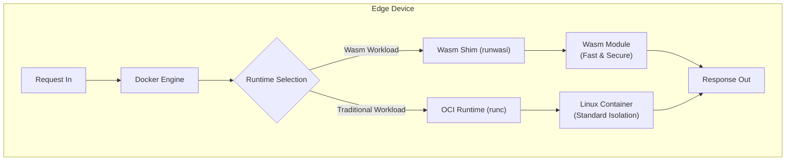
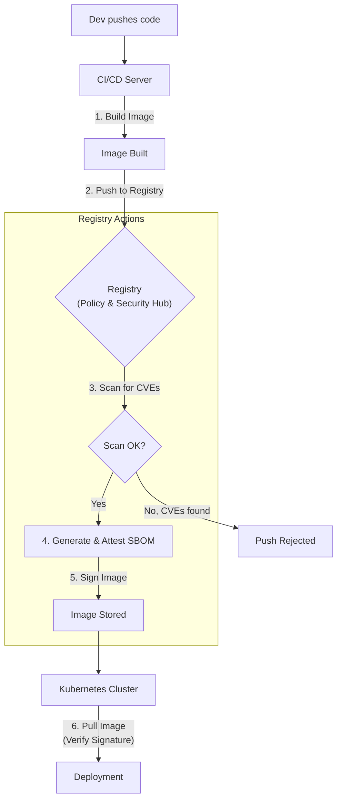

# Docker & Containerization: The Next Wave of Innovation in 2026

Containerization, spearheaded by Docker, is no longer a novel concept; it's the bedrock of modern software development and deployment. But the landscape of 2026 looks vastly different from the early days of `docker run`. The evolution has been rapid, pushing beyond simple application packaging into realms of enhanced security, performance at the edge, and deeply integrated intelligence.

By 2026, the conversation has shifted from "Should we use containers?" to "How can we leverage the full potential of the container ecosystem?" This article explores the key innovations that define the containerization landscape today.

## What You'll Get

This article will break down the four pivotal trends shaping the future of Docker and containerization:

*   **WebAssembly (Wasm):** How it's revolutionizing edge computing with its secure, high-performance runtime.
*   **Confidential Containers:** The next frontier in cloud security, protecting data even while it's in use.
*   **AI-Powered DevEx:** How artificial intelligence is streamlining the developer workflow, from Dockerfile generation to debugging.
*   **Intelligent Registries:** The transformation of container registries into active hubs for DevSecOps.

---

## The Rise of WebAssembly (Wasm) at the Edge

While traditional Docker containers excel at packaging applications with their OS-level dependencies, they can be overkill for resource-constrained edge environments. Enter WebAssembly. By 2026, Wasm is a first-class citizen in the container ecosystem, prized for its speed, security, and portability.

### Why Wasm is a Game-Changer

*   **Near-Native Performance:** Wasm bytecode is compiled ahead-of-time (AOT) or just-in-time (JIT) to run almost as fast as native machine code.
*   **Secure by Default:** Wasm modules run in a sandboxed environment with a capabilities-based security model, granting explicit access to system resources. No more worrying about kernel-level exploits.
*   **Polyglot & Portable:** Compile code from Rust, C++, Go, and more into a single `.wasm` binary that runs anywhere—from a browser to a server to an IoT device.
*   **Featherlight Footprint:** Wasm modules are incredibly small and start in microseconds, making them perfect for serverless functions and edge devices.

### Docker + Wasm Integration

Docker, through projects like the `runwasi` shim, now treats Wasm modules as a container workload. This means you can manage Wasm artifacts using the familiar Docker CLI and API, simplifying deployment and orchestration.

```bash
# Hypothetical command in 2026
# Pull a Wasm module from a registry and run it
docker run --runtime=io.containerd.wasm.v1 my-registry/my-wasm-app:1.0
```

This seamless integration allows developers to choose the right tool for the job—a full container for a complex web service, and a Wasm module for a high-performance edge function—all within the same ecosystem.



## Fortifying the Cloud with Confidential Containers

Security has always been paramount, but protecting data *at rest* and *in transit* is no longer enough. The challenge of the 2020s has been protecting data *in use*. Confidential containers, built on Trusted Execution Environments (TEEs), are the solution.

### What Are Confidential Containers?

Confidential containers are standard OCI containers that run inside a hardware-based TEE, such as [Intel SGX](https://www.intel.com/content/www/us/en/architecture-and-technology/software-guard-extensions.html) or [AMD SEV](https://www.amd.com/en/technologies/sev-snp). This creates an encrypted memory enclave where the code and data are isolated and protected from the host OS, the hypervisor, and even cloud provider administrators.

> **Info Block:** In a zero-trust world, you can't afford to implicitly trust your infrastructure. Confidential computing ensures that even if an entire host is compromised, your application's sensitive data remains encrypted and inaccessible.

This technology is critical for regulated industries like healthcare, finance, and government, enabling them to move their most sensitive workloads to the cloud with verifiable proof of isolation. Projects like [Kata Containers](https://katacontainers.io/) have been instrumental in integrating TEE support into the Kubernetes and container ecosystem.

## AI-Powered Developer Experience (DevEx)

Artificial intelligence has moved from a standalone tool to an integrated co-pilot within the developer's daily workflow. By 2026, Docker Desktop and the Docker CLI are infused with AI capabilities that automate toil and accelerate development.

### From Helper to Co-Pilot

AI's role has expanded beyond simple code completion. It now actively assists in the entire containerization lifecycle:

*   **Dockerfile Generation:** AI tools analyze your source code repository (dependencies, frameworks, build steps) and generate an optimized, multi-stage Dockerfile automatically.
*   **Security & Optimization:** AI assistants scan your container images, not just for known CVEs, but for inefficient layering, bloated dependencies, or insecure configurations, offering intelligent, actionable recommendations.
*   **Natural Language Debugging:** Instead of cryptic error codes, developers can ask questions in plain English. For example: *"Why is my container `my-app-v2` crash-looping?"* The AI analyzes logs, configurations, and metrics to provide a likely cause and solution.

Imagine a CLI experience like this:

```bash
# An imagined AI-powered command
docker ai optimize my-api:latest --target=prod

# AI Output:
# -> Analyzing base image... Switched from 'python:3.11' to 'python:3.11-slim' (_saves 450MB_).
# -> Reordering layers... Moved 'pip install' before 'COPY .' for better caching.
# -> Security scan... Found medium severity CVE in 'requests==2.25.0'. Recommended fix: 'requests>=2.28.1'.
# -> New image suggested: 'my-api:latest-optimized'
# Apply these changes? [y/N]
```

## The Evolving Role of Container Registries

Container registries are no longer passive storage for blobs. They have become active, intelligent, and policy-driven gatekeepers in the DevSecOps pipeline. This shift is essential for securing the modern software supply chain.

### More Than Just Storage

In 2026, a production-grade registry is a central pillar of security and governance.

| Feature | Description |
| :--- | :--- |
| **Inline Vulnerability Scanning** | Images are automatically scanned upon push, and policies can block deployment if critical CVEs are found. |
| **SBOM Attestation** | Registries automatically generate and sign a Software Bill of Materials (SBOM) for every image, providing a verifiable inventory of all components. |
| **Image Signing & Verification** | Integration with tools like [Sigstore](https://www.sigstore.dev/) ensures that only trusted, signed images can be pulled and run in production environments. |
| **Policy as Code Enforcement** | Using frameworks like Open Policy Agent (OPA), registries can enforce complex rules, such as "no images with `latest` tag" or "base image must be from an approved list." |

This evolution is visually represented in the modern DevSecOps flow:



## Looking Forward & Your Turn

The container ecosystem of 2026 is smarter, faster, and more secure than ever before. The integration of Wasm, the fortification through confidential computing, the acceleration via AI, and the governance provided by intelligent registries have fundamentally elevated what's possible with container technology. Docker has evolved from a packaging tool into a comprehensive platform for building, sharing, and running any application, anywhere.

The pace of innovation isn't slowing down. What new container features are you most excited about? Share your thoughts in the comments below


## Further Reading

- [https://www.docker.com/blog/future-of-containers-2026/](https://www.docker.com/blog/future-of-containers-2026/)
- [https://wasmcloud.com/blog/wasm-containers-future/](https://wasmcloud.com/blog/wasm-containers-future/)
- [https://www.cncf.io/blog/container-ecosystem-trends/](https://www.cncf.io/blog/container-ecosystem-trends/)
- [https://docs.docker.com/desktop/](https://docs.docker.com/desktop/)
- [https://www.infoq.com/articles/confidential-containers-security-2026](https://www.infoq.com/articles/confidential-containers-security-2026)
