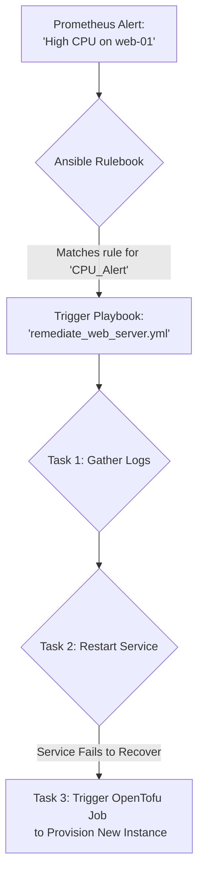
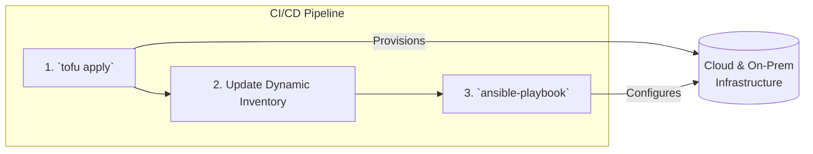

# Ansible for Hybrid Cloud Automation: Bridging On-Prem and Cloud in 2026

In the landscape of 2026, hybrid cloud isn't a trend; it's the default operational model for any serious enterprise. The challenge is no longer *if* you'll manage infrastructure across on-premises data centers, private clouds, and multiple public cloud providers, but *how* you'll do it efficiently and securely. Amidst a sea of specialized tools, Ansible has not only remained relevant but has solidified its position as the essential automation engine for bridging these disparate environments.

Its strength lies in its simplicity, agentless architecture, and its evolution into a sophisticated automation platform. Let's explore how Ansible continues to be the definitive tool for taming hybrid complexity.

### What You'll Get

*   **Why Ansible is still vital** for modern hybrid environments.
*   How to leverage **dynamic inventories** for fluid infrastructure.
*   A look at the **Ansible Automation Platform's 2026 features**.
*   Strategies for integrating Ansible with IaC tools like **OpenTofu**.
*   Practical, cross-environment **playbook examples**.

***

## The Enduring Relevance of Ansible in a Hybrid World

Ansible's core design principles are what give it staying power in an ever-changing IT landscape. While newer tools focus on specific niches, Ansible excels as the universal translator for automation.

*   **Agentless by Design:** There's no need to install and manage client software on your target nodes. This is a massive advantage in hybrid environments where you might be managing legacy bare-metal servers, VMware VMs, and ephemeral cloud instances simultaneously.
*   **Human-Readable Automation:** Playbooks written in YAML are declarative and easy to understand. This lowers the barrier to entry and makes collaboration between Ops, Dev, and Security teams much smoother.
*   **A Massive Ecosystem:** With thousands of modules available in Ansible Content Collections, you have battle-tested automation for nearly any device, service, or API you can imagine—from an on-prem F5 load balancer to an AWS Lambda function or a Microsoft Entra ID group.

Ansible acts as the powerful "glue" that orchestrates tasks across tools and platforms, making it an indispensable part of the modern automation toolchain.

## Mastering Dynamic Inventory Across Clouds

Static `inventory.ini` files are a relic of a bygone era. In a hybrid cloud where resources are constantly created and destroyed, you need an inventory that reflects reality in real-time. This is where dynamic inventories become critical.

A dynamic inventory is a script or plugin that fetches information about your hosts from an external source, like a cloud provider or a CMDB. Ansible can then target hosts based on the real-time data it receives.

For example, the `amazon.aws.aws_ec2` inventory plugin can dynamically pull all your EC2 instances from a specific region and automatically group them by tags, VPC ID, instance type, and more.

### Example: AWS Dynamic Inventory Configuration

To use the AWS plugin, you create a YAML file (e.g., `aws_ec2.yml`) that points to it.

```yaml
# aws_ec2.yml
plugin: amazon.aws.aws_ec2
regions:
  - us-east-1
# Group instances by the value of the 'Env' tag
keyed_groups:
  - key: tags.Env
    prefix: tag_env
```

Now, you can run a playbook and target hosts based on their live status in AWS, without ever manually updating an inventory file.

```bash
# Target all instances tagged with Env=production
ansible-playbook -i aws_ec2.yml --limit tag_env_production deploy_app.yml
```

This same principle applies to Azure (`azure.azcollection.azure_rm`), VMware (`community.vmware.vmware_vm_inventory`), and nearly any other infrastructure source.

***

## The Evolution: Ansible Automation Platform in 2026

The open-source Ansible engine is powerful, but Red Hat's Ansible Automation Platform (AAP) is where enterprise-grade features truly shine. By 2026, AAP has evolved beyond a simple job scheduler into an intelligent, responsive automation hub.

### Event-Driven Automation at Scale

The concept of Event-Driven Ansible (EDA) has fully matured. Using **Ansible Rulebooks**, the platform can listen for events from a variety of sources and automatically trigger remediation or operational tasks.

Imagine a Prometheus alert fires for high CPU usage on a web server. EDA can automatically receive this event, trigger a playbook to gather diagnostics, attempt to restart the service, and if that fails, scale up the application by provisioning a new instance via OpenTofu.



### AI-Infused Playbook Generation

Ansible Lightspeed, with its deep integration of generative AI like IBM's Watson Code Assistant, has become an indispensable co-pilot for automation engineers. It has moved beyond simple task suggestions.

> By 2026, you can provide a high-level, natural language prompt like, "Create a playbook to deploy a multi-tier web application on Azure, ensuring it meets CIS compliance standards," and Lightspeed will generate a robust, well-structured set of roles and playbooks, complete with compliance checks.

It significantly accelerates development and helps enforce best practices by learning from trusted Ansible Content Collections.

### Centralized Compliance and Governance

Managing security and compliance policies across on-prem, AWS, and Azure is a major headache. AAP provides a unified dashboard to define, enforce, and report on compliance across your entire hybrid estate.

| Feature                 | On-Prem (vSphere) | AWS (EC2)         | Azure (VMs)       |
| ----------------------- | ----------------- | ----------------- | ----------------- |
| **Policy Definition**   | Centralized       | Centralized       | Centralized       |
| **Automated Scan**      | Supported         | Supported         | Supported         |
| **Auto-Remediation**    | Supported         | Supported         | Supported         |
| **Unified Reporting**   | Single Dashboard  | Single Dashboard  | Single Dashboard  |

***

## The Perfect Pair: Ansible and Infrastructure as Code (IaC)

A common misconception is that Ansible and IaC tools like OpenTofu (the open-source fork of Terraform) are competitors. In reality, they are complementary and form the foundation of a robust automation strategy.

*   **OpenTofu/Terraform:** Excels at provisioning and managing the lifecycle of infrastructure resources (networks, VMs, databases, k8s clusters). It creates the "what."
*   **Ansible:** Excels at configuring those resources once they exist (installing software, managing users, applying security policies, deploying applications). It handles the "how."

A modern workflow uses these tools in sequence.



This separation of concerns creates a clean, modular, and highly repeatable process for deploying entire application environments from scratch.

## Practical Playbook: A Hybrid Patching Scenario

Here is a simplified playbook that demonstrates how Ansible can handle a common task—OS patching—across a heterogeneous environment. It uses inventory variables to determine which package manager to use.

```yaml
---
- name: Apply OS Patches Across Hybrid Environment
  hosts: all
  become: true
  tasks:
    - name: Update all packages on Red Hat based systems
      ansible.builtin.yum:
        name: '*'
        state: latest
      when: ansible_os_family == "RedHat"

    - name: Update all packages on Debian based systems
      ansible.builtin.apt:
        update_cache: yes
        upgrade: dist
      when: ansible_os_family == "Debian"

    - name: Reboot server if required by patching
      ansible.builtin.reboot:
        msg: "Rebooting server after kernel updates"
      when: reboot_required_file.stat.exists
```

This single playbook can run against your entire inventory—on-prem RHEL servers and cloud-based Ubuntu instances—and will execute the correct tasks for each target.

## Key Takeaways and Best Practices for 2026

To thrive with Ansible in a hybrid world, adopt these modern practices:

*   **Embrace dynamic inventories:** Static files are an operational liability. Your inventory should be as dynamic as your infrastructure.
*   **Modularize with roles and collections:** Avoid monolithic playbooks. Break down your automation into reusable roles and leverage certified content from Ansible Automation Hub.
*   **Integrate, don't replace:** Use Ansible for what it's best at—configuration and orchestration—and integrate it with best-of-breed tools like OpenTofu for provisioning.
*   **Leverage the Automation Platform:** For any serious enterprise use, AAP provides the necessary guardrails, analytics, and advanced capabilities like EDA and AI-assisted development.
*   **Treat playbooks as code:** Store your Ansible content in Git, use CI/CD pipelines for testing and deployment, and implement peer reviews.

## Conclusion

The future of IT is undeniably hybrid, and managing its inherent complexity requires a tool that is both powerful and flexible. In 2026, Ansible continues to prove its worth not just as a configuration management tool, but as a comprehensive automation framework that unifies operations, from legacy systems in the data center to the most modern cloud-native services. By embracing its advanced features and integrating it intelligently with other tools, you can build a truly resilient and efficient hybrid cloud strategy.

What are your biggest challenges in managing hybrid cloud infrastructure, and how are you using automation to solve them? Share your thoughts in the comments below.


## Further Reading

- [https://www.ansible.com/products/automation-platform](https://www.ansible.com/products/automation-platform)
- [https://www.redhat.com/en/topics/automation/ansible-hybrid-cloud](https://www.redhat.com/en/topics/automation/ansible-hybrid-cloud)
- [https://www.middlewareinventory.com/blog/ansible-multi-cloud-automation-2026/](https://www.middlewareinventory.com/blog/ansible-multi-cloud-automation-2026/)
- [https://docs.ansible.com/ansible/latest/user_guide/dynamic_inventory.html](https://docs.ansible.com/ansible/latest/user_guide/dynamic_inventory.html)
- [https://www.oreilly.com/library/view/ansible-for-devops/best-practices-2026](https://www.oreilly.com/library/view/ansible-for-devops/best-practices-2026)
