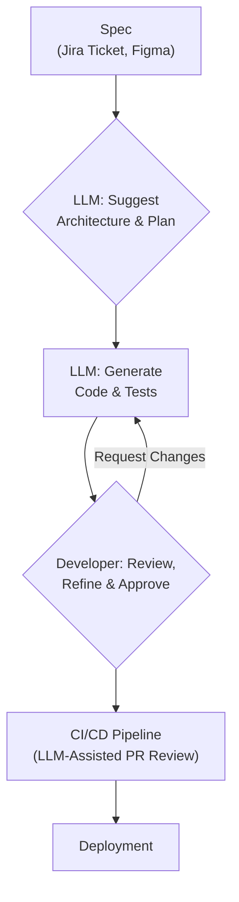

# GPT-5 and Claude 4: Redefining Software Development in 2026

The year is 2026. The faint hum of AI is no longer just a background noise in software development—it's the driving rhythm. Next-generation Large Language Models (LLMs), exemplified by the anticipated GPT-5 and Claude 4, have moved beyond being mere coding assistants. They are now integrated partners in the creative and analytical processes of building software, fundamentally reshaping our workflows, tools, and roles.

This article analyzes the profound impact these advanced models will have on the software development lifecycle. We'll explore the new capabilities, the redesigned toolchains, and the essential skills developers will need to thrive in this new era.

### What You'll Get

*   **Enhanced Capabilities:** An overview of what sets GPT-5 and Claude 4 apart in code generation, debugging, and testing.
*   **Integrated Workflows:** How LLMs will reshape IDEs, CI/CD pipelines, and project management.
*   **The New Developer Skillset:** A look at the shifting responsibilities and required skills for software engineers.
*   **Ethical & Practical Hurdles:** A discussion on code ownership, security, and the "black box" problem.

## The Leap in Capabilities: From Copilot to Co-Architect

The jump from today's AI assistants to the models of 2026 isn't just incremental; it's a qualitative leap in reasoning and autonomy. We're moving from a tool that completes lines of code to a system that understands and contributes to the entire software architecture.

### Multi-Modal Reasoning and Contextual Awareness

Forget pasting snippets into a chat window. By 2026, LLMs will possess a deep, multi-modal understanding of a project.

*   **Visual-to-Code:** They will ingest UI mockups from Figma or a whiteboard photo and generate the corresponding front-end code and component structure.
*   **Full Codebase Context:** With massive context windows (a natural evolution from Claude's early strengths), these models will hold the *entire* repository's logic in-memory, providing suggestions that are consistent with existing patterns and APIs.
*   **Architectural Understanding:** They will parse `README` files, architecture diagrams, and even Jira tickets to grasp the project's goals, constraints, and intended design.

### Autonomous Code Generation and Refactoring

The core function of writing code is becoming increasingly automated. Developers will transition from writing every line to specifying intent and validating the output.

*   **Feature Scaffolding:** Generate entire features, including models, controllers, services, and basic API endpoints, from a single detailed prompt or user story.
*   **Intelligent Refactoring:** These models will proactively identify technical debt, suggest performance optimizations, or refactor a module to a new design pattern (e.g., "Convert this REST controller to a GraphQL resolver").

```javascript
// Hypothetical prompt to a 2026-era IDE
// "AI: Create a new NestJS module for 'invoices'. 
// It needs a CRUD API, a PostgreSQL entity with fields: 
// id, amount, due_date, client_id (FK to User). 
// Ensure all endpoints are protected by a JWT guard. 
// Generate Jest unit tests with 90% coverage."
```

### Proactive Debugging and Predictive Testing

Debugging becomes less about hunting for a needle in a haystack and more about reviewing an AI's diagnosis.

*   **Root Cause Analysis:** Instead of just pointing out an error, the LLM will explain the likely cause, reference the exact commit that introduced the bug, and propose a validated fix.
*   **Predictive Test Generation:** Models will analyze new code and automatically generate a comprehensive suite of unit, integration, and even end-to-end tests that cover edge cases a human might miss.

## The New Integrated Development Workflow

The most significant change will be in our tools. LLMs won't be a plugin; they'll be the intelligent fabric connecting the entire software development lifecycle. The developer's role shifts to that of a conductor, orchestrating AI-driven tools to achieve a goal.

This new workflow can be visualized as a continuous, collaborative loop between the developer and the AI.



### From IDE Plugins to Core IDE Intelligence

The IDE will transform from a smart text editor into a true development environment that actively participates in problem-solving. It will manage tasks, suggest architectural patterns, and orchestrate builds, all powered by a core LLM. Your IDE won't just autocomplete code; it will autocomplete *thought processes*.

### Seamless CI/CD Integration

Continuous Integration and Continuous Deployment pipelines will become smarter and more automated. The LLM will be a mandatory gatekeeper for quality.

*   **Automated PR Reviews:** The AI will be the first reviewer on every pull request, checking for logic flaws, security vulnerabilities, and deviations from coding standards.
*   **Dynamic Release Notes:** It will automatically summarize the changes in a release and draft user-friendly release notes.
*   **Intelligent Rollbacks:** If post-deployment monitoring tools detect an anomaly, the CI/CD system, guided by the LLM, could trigger an automatic rollback and create a ticket detailing the issue.

A hypothetical CI step might look like this in a GitHub Actions workflow:

```yaml
jobs:
  llm-code-review:
    name: "LLM Code and Security Review"
    runs-on: ubuntu-latest
    steps:
      - name: "Run AI Reviewer"
        uses: future-actions/llm-reviewer@v3
        with:
          ruleset: 'project-security-and-style-guide.json'
          github-token: ${{ secrets.GITHUB_TOKEN }}
          review-depth: 'deep' # Analyzes for logic flaws, not just style
```

## The Evolving Role of the Software Engineer

The fear of AI replacing developers is misplaced. Instead, these models are poised to eliminate drudgery, allowing engineers to focus on higher-value tasks. The definition of a "developer" will evolve from a "coder" to a "system designer and problem solver."

> **Human oversight is the ultimate feature.** As models become more powerful, the value of expert human judgment, critical thinking, and ethical validation only increases.

### Shifting from Coder to System Designer

The focus will shift dramatically from micro-level implementation to macro-level system design. An engineer's primary value will be in their ability to translate business needs into well-architected technical specifications that an AI can then help implement.

| Task | Developer Role (2023) | Developer Role (2026) |
| :--- | :--- | :--- |
| **Writing Boilerplate** | Tedious but necessary; manual. | Mostly automated; specified by intent. |
| **Debugging** | Reactive; trace stacks and logs. | Proactive; validate AI-driven diagnostics. |
| **Architectural Design**| Manual; based on experience/docs. | Collaborative; refine AI-suggested patterns. |
| **Documentation** | Manual; often neglected. | Automated; generated and kept in sync by AI. |

### Essential Skills for the 2026 Developer

To stay relevant, developers must cultivate a new set of skills centered on collaborating with AI.

*   **Advanced Prompt Engineering:** The ability to articulate complex requirements to an LLM with precision and clarity.
*   **System Architecture & Design Thinking:** A deep understanding of software design principles is crucial for guiding and validating AI-generated architectures.
*   **AI Ethics and Bias Detection:** Recognizing and mitigating biases in AI-generated code and algorithms.
*   **Security Oversight:** Auditing AI-generated code for novel or subtle security vulnerabilities that automated tools might miss.

## Navigating the Ethical and Practical Hurdles

This future is not without its challenges. The industry must navigate significant ethical and practical questions.

*   **Code Ownership and IP:** Who owns the copyright to code generated by an AI trained on a vast corpus of public and private data? This remains a complex legal gray area.
*   **Security and the "Black Box":** Can we fully trust code when we don't understand every step of its generation? Verifying AI-generated code for sophisticated exploits will become a critical new discipline.
*   **Over-reliance and Skill Atrophy:** Will future developers lose fundamental coding skills by relying too heavily on AI? A balance between automation and foundational knowledge will be essential.

The models of 2026 promise a paradigm shift in software development, offering unprecedented productivity and creativity. Developers who embrace these tools as collaborators, focusing on architecture, validation, and critical thinking, will not only survive but thrive. They will build better, more complex systems faster than ever before.

How are next-gen LLMs already changing your day-to-day coding? Share your thoughts below.


## Further Reading

- [https://openai.com/blog/future-of-ai-models-2026](https://openai.com/blog/future-of-ai-models-2026)
- [https://www.anthropic.com/news/claude-4-preview-features](https://www.anthropic.com/news/claude-4-preview-features)
- [https://venturebeat.com/ai/generative-ai-impact-on-developers-2026/](https://venturebeat.com/ai/generative-ai-impact-on-developers-2026/)
- [https://www.oreilly.com/ai-software-engineering-future/](https://www.oreilly.com/ai-software-engineering-future/)
- [https://techcrunch.com/2026/llms-and-developer-productivity](https://techcrunch.com/2026/llms-and-developer-productivity)
