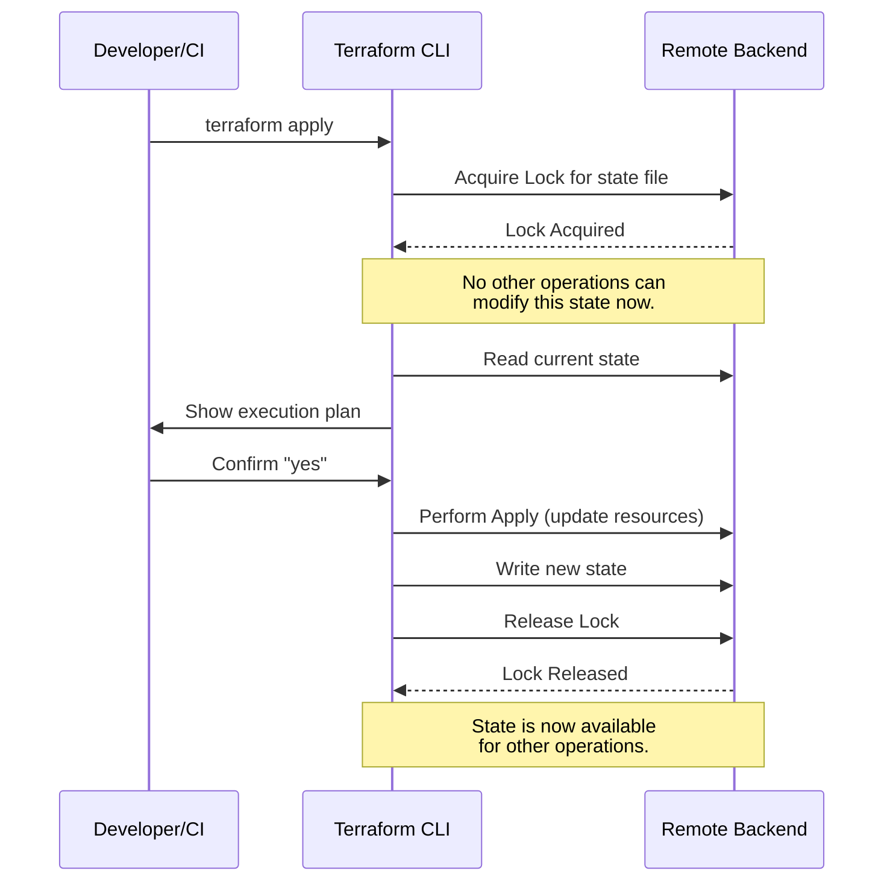

# Terraform State Management: Advanced Best Practices for Enterprise

Terraform's state file is the cornerstone of infrastructure as code. It's the "source of truth" that maps your configuration to real-world resources. While a local `terraform.tfstate` file works for solo projects, it's a recipe for disaster in an enterprise setting. Inconsistent states, race conditions, and security vulnerabilities can bring your operations to a halt.

Effective state management isn't just a good idea—it's a requirement for secure, collaborative, and scalable infrastructure automation. This guide dives deep into advanced best practices that will help you master Terraform state at scale.

### What You'll Get

*   **Backend Selection:** A clear comparison of enterprise-grade remote state backends.
*   **Collaboration & Safety:** Strategies for state locking to prevent conflicts and corruption.
*   **Architectural Patterns:** Guidance on splitting state for performance and modularity.
*   **Security Hardening:** Techniques to manage sensitive data and secure your state files.
*   **Operational Excellence:** Best practices for state migration and disaster recovery.

---

## Choosing the Right Remote Backend

The first and most critical step is moving your state off your local machine. A remote backend stores the state file in a shared, durable location, enabling collaboration and reliability.

### Backend Options Compared

Not all backends are created equal. Your choice depends on your cloud provider, security requirements, and operational overhead tolerance.

| Feature | AWS S3 + DynamoDB | Azure Blob Storage | Google Cloud Storage | HCP Terraform / TFE |
| :--- | :--- | :--- | :--- | :--- |
| **State Locking** | ✅ (Via DynamoDB) | ✅ (Native) | ✅ (Native) | ✅ (Native, with UI) |
| **Encryption at Rest** | ✅ (Server-Side) | ✅ (Server-Side) | ✅ (Server-Side) | ✅ (Managed by HashiCorp) |
| **Versioning** | ✅ (Via S3 Bucket) | ✅ (Via Blob Storage) | ✅ (Via GCS Bucket) | ✅ (Built-in, granular) |
| **Operational Overhead** | Medium (Setup S3/DynamoDB) | Low (Setup Storage Acct) | Low (Setup GCS Bucket) | Very Low (Managed Service) |
| **Access Control** | IAM Policies | Azure RBAC / SAS | IAM Permissions | Team-based RBAC |
| **Best For** | AWS-centric teams | Azure-centric teams | GCP-centric teams | Multi-cloud, large teams |

> **Info Block:** While self-hosting a backend on a cloud provider gives you full control, [HCP Terraform (formerly Terraform Cloud)](https://www.hashicorp.com/products/terraform/cloud) offers a fully managed experience with added benefits like a private module registry, policy as code (Sentinel), and detailed run history.

### Example: Configuring an S3 Backend

Here is a typical configuration for using AWS S3 with DynamoDB for state locking. This should live in a file like `backend.tf`.

```terraform
terraform {
  backend "s3" {
    bucket         = "my-enterprise-tfstate-bucket"
    key            = "global/networking/terraform.tfstate"
    region         = "us-east-1"
    dynamodb_table = "terraform-state-locks"
    encrypt        = true
  }
}
```

*   **`bucket`**: The S3 bucket must be created *before* you run `terraform init`.
*   **`key`**: The path to the state file within the bucket. This allows you to organize state for different projects or environments.
*   **`dynamodb_table`**: The table used for state locking. It must have a primary key named `LockID` of type String.

## State Locking: The Key to Team Collaboration

When multiple engineers run `terraform apply` simultaneously, they can overwrite each other's changes, leading to state corruption or resource duplication. State locking prevents this by ensuring only one operation can run at a time.

### How Locking Works

When a command that modifies state is initiated (like `apply`, `destroy`, or `import`), Terraform attempts to acquire a lock from the backend. If the lock is already taken, the operation waits or fails until the lock is released.

This flow is essential for preventing race conditions in any CI/CD pipeline or collaborative environment.



## Architecting Your State Files

A single, monolithic state file for all your infrastructure is brittle and slow. As your infrastructure grows, so does the "blast radius" of any potential error. The solution is to break your state into smaller, logically-scoped components.

### Monolithic vs. Granular State

*   **Monolithic State:** One large state file for everything (networking, compute, databases).
    *   *Pros:* Simple to start.
    *   *Cons:* Slow `plan`/`apply` cycles, high blast radius, difficult for teams to work in parallel.
*   **Granular State:** Multiple smaller state files, often separated by environment, application, or functional domain (e.g., a state for VPC, another for the EKS cluster, another for the application deployment).
    *   *Pros:* Faster execution, smaller blast radius, enables parallel work streams, promotes reusable components.
    *   *Cons:* Requires a way to share information between states.

### Sharing Outputs with `terraform_remote_state`

To connect granular state files, use the `terraform_remote_state` data source. It allows one configuration to read the output values from another.

For example, imagine your VPC is managed in a separate state file. Your application's configuration can read the VPC ID and subnet IDs directly from it.

**VPC Configuration (`networking/outputs.tf`):**
```terraform
output "vpc_id" {
  description = "The ID of the main VPC"
  value       = aws_vpc.main.id
}

output "private_subnets" {
  description = "List of private subnet IDs"
  value       = aws_subnet.private[*].id
}
```

**Application Configuration (`app/main.tf`):**
```terraform
data "terraform_remote_state" "networking" {
  backend = "s3"
  config = {
    bucket = "my-enterprise-tfstate-bucket"
    key    = "global/networking/terraform.tfstate"
    region = "us-east-1"
  }
}

resource "aws_instance" "app_server" {
  ami           = "ami-0c55b159cbfafe1f0"
  instance_type = "t2.micro"
  subnet_id     = data.terraform_remote_state.networking.outputs.private_subnets[0]
  
  tags = {
    Name = "AppServer"
    VPC  = data.terraform_remote_state.networking.outputs.vpc_id
  }
}
```

## Security and Sensitive Data in State

**This is critical:** Terraform state files often contain sensitive information in plain text. This can include database passwords, API keys, or private keys generated by resources.

### The Problem with Secrets

According to the official [Terraform documentation on sensitive data](https://www.terraform.io/language/state/sensitive-data): "Terraform state can contain sensitive data... access to state files should be carefully controlled." If an attacker gains read access to your S3 bucket containing state files, they could potentially access every secret managed by Terraform.

### Mitigation Strategies

1.  **Strict Access Control:** Use strict, least-privilege IAM policies or Azure RBAC roles on your state backend. Only CI/CD systems and authorized administrators should have read/write access.
2.  **Use a Secrets Manager:** The best practice is to *never* have secrets in your state file in the first place.
    *   Fetch secrets at runtime using a data source for a secrets manager like HashiCorp Vault, AWS Secrets Manager, or Azure Key Vault.
    *   The resource configuration will reference the secret, but the secret's value will not be stored in the state.
3.  **Redact CLI Output:** Use the `sensitive = true` attribute for variables and outputs. This prevents Terraform from showing their values in `plan` or `apply` logs, but **it does not encrypt them in the state file.**
    ```terraform
    variable "db_password" {
      type      = string
      sensitive = true
    }
    ```

## Advanced Operations: State Management Workflows

As your infrastructure evolves, you'll inevitably need to refactor and reorganize your Terraform configurations and their corresponding state files.

### Splitting a Monolithic State

If you start with a monolith, you can carefully migrate resources to a new, smaller state file without destroying them. The primary tool for this is `terraform state mv`.

**High-Level Workflow:**

1.  **Create New Config:** Set up a new directory with the Terraform configuration for the resources you want to move (e.g., a database).
2.  **Configure New Backend:** In the new directory, configure the `backend.tf` to point to a new state file key.
3.  **Run `terraform init`:** Initialize the new configuration.
4.  **Move the Resource:** From the *original* directory, run the `state mv` command. The `-state-out` flag points to the state file of the *new* configuration.
    ```bash
    # This command moves the RDS instance from the old state to the new one
    terraform state mv -state-out=../database/terraform.tfstate \
      'aws_db_instance.primary' 'aws_db_instance.primary'
    ```
5.  **Verify:** Run `terraform plan` in both the old and new directories. The old directory should show the resource will be destroyed (you'll now remove it from the code), and the new one should show no changes.

### Disaster Recovery

Your Terraform state is as critical as your production database. Losing it means Terraform no longer knows what infrastructure it manages.

*   **Enable Versioning:** On your S3 bucket or Azure Blob container, enable object versioning. This allows you to restore a previous version of your state file in case of accidental deletion or corruption.
*   **Automated Backups:** Periodically back up your state files to a separate, secure, and isolated location.
*   **Document Recovery:** Have a written, tested plan for restoring state from a backup. Who has access? What are the exact commands to run?

---

## Conclusion

Mastering Terraform state is a journey from chaos to control. By adopting these enterprise-grade practices, you build a foundation for secure, scalable, and collaborative infrastructure management. Always remember to:

*   **Use a remote backend** with encryption and versioning.
*   **Enforce state locking** to protect against concurrent operations.
*   **Split your state** into logical, granular components.
*   **Keep secrets out of state** by using a dedicated secrets manager.
*   **Have a disaster recovery plan** and test it.

What's your biggest Terraform state management headache? Share your challenges and solutions


## Further Reading

- [https://www.terraform.io/docs/language/state/index.html](https://www.terraform.io/docs/language/state/index.html)
- [https://www.hashicorp.com/products/terraform/cloud](https://www.hashicorp.com/products/terraform/cloud)
- [https://spacelift.io/blog/terraform-state-management-best-practices-2026](https://spacelift.io/blog/terraform-state-management-best-practices-2026)
- [https://www.datocms.com/blog/terraform-state-management-deep-dive](https://www.datocms.com/blog/terraform-state-management-deep-dive)
- [https://www.cncf.io/blog/iac-state-security](https://www.cncf.io/blog/iac-state-security)
