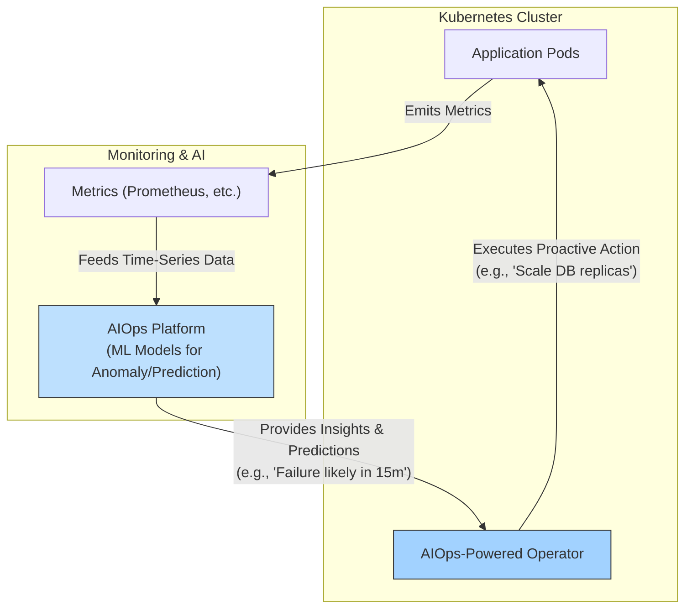

# Kubernetes Operators & AIOps: The Path to Self-Healing Clusters

Kubernetes has mastered container orchestration, but managing its complexity at scale remains a significant human challenge. We spend countless hours monitoring dashboards, writing runbooks, and reacting to alerts. What if our clusters could manage themselves? The convergence of the Kubernetes Operator pattern and AIOps (Artificial Intelligence for IT Operations) is paving the way for this future. By 2026, we can expect to see clusters that don't just automate tasks—they anticipate needs, prevent failures, and heal themselves.

This article explores how AIOps-powered Operators are transforming Kubernetes management from reactive to proactive, creating truly autonomous, self-healing systems.

### What You'll Get

*   **Core Concepts:** A clear breakdown of Kubernetes Operators and AIOps.
*   **The Synergy:** How combining these two technologies creates "smart" operators.
*   **Future Use Cases:** Practical examples of self-healing, intelligent scaling, and automated remediation.
*   **Architectural Insight:** A Mermaid diagram illustrating the AIOps feedback loop.
*   **The Path Forward:** A look at the role of machine learning and the challenges ahead.

---

## The Foundation: Kubernetes Operators

A Kubernetes Operator is more than just automation. It's a design pattern that encodes human operational knowledge into software that runs inside your cluster. An Operator watches over a Custom Resource (CR) and works to bring the cluster's current state into alignment with the desired state defined in that resource.

Think of it as a robotic Site Reliability Engineer (SRE) dedicated to a specific application.

*   **Extends Kubernetes API:** Operators use Custom Resource Definitions (CRDs) to create new, application-specific object types.
*   **Stateful Awareness:** They understand the complex lifecycle of stateful applications (e.g., databases, message queues), managing upgrades, backups, and failovers.
*   **Reconciliation Loop:** The core of an Operator is a continuous control loop that observes, analyzes, and acts to enforce the desired state.

A CRD for an application managed by a standard Operator might look like this:

```yaml
apiVersion: database.example.com/v1alpha1
kind: PostgreSQLCluster
metadata:
  name: production-db
spec:
  replicas: 3
  version: "15.3"
  storage: 100Gi
  backupPolicy:
    schedule: "0 2 * * *" # Daily at 2 AM
```

The Operator's job is to ensure three replicas of PostgreSQL 15.3 are running and that backups are taken daily. This is powerful, but it's still based on static, predefined rules.

## The Brains: AIOps Explained

AIOps is the application of machine learning (ML) and data science to IT operations. Its goal is to analyze vast amounts of data from monitoring, logging, and tracing systems to automate and improve core operational tasks.

> According to [Gartner](https://www.gartner.com/en/information-technology/glossary/aiops-platforms), "AIOps combines big data and machine learning to automate IT operations processes, including event correlation, anomaly detection, and causality determination."

Key functions of an AIOps platform include:

*   **Anomaly Detection:** Learning what "normal" looks like for your system and flagging statistically significant deviations.
*   **Event Correlation:** Reducing alert noise by grouping related events and identifying the root cause.
*   **Predictive Analytics:** Forecasting future issues (e.g., disk space exhaustion, traffic surges) based on historical trends.

## The Convergence: The AIOps-Powered Operator

This is where the magic happens. We infuse the Operator's reconciliation loop with intelligence from an AIOps platform. Instead of acting on static rules, the Operator queries an ML model for insights and predictions to make smarter, context-aware decisions.

This creates a closed-loop, autonomous system.



With this model, our `PostgreSQLCluster` CRD could evolve to define *intent* rather than *configuration*:

```yaml
apiVersion: database.example.com/v1beta1
kind: SmartPostgreSQLCluster
metadata:
  name: production-db
spec:
  # The operator now manages replicas based on goals
  performanceGoal: "p99_latency_ms < 100"
  anomalySensitivity: high
  disasterRecovery:
    strategy: automated-failover
```

The AIOps Operator now uses the `performanceGoal` to decide when to scale, learning the relationship between replica count, traffic patterns, and query latency.

## Use Cases in Action (By 2026)

This synergy unlocks capabilities that are impossible with traditional automation.

### Intelligent Autoscaling

Standard Kubernetes autoscalers like the HPA react to lagging indicators like CPU and memory usage. An AIOps-powered Operator can scale proactively based on leading indicators.

*   **Business Metrics:** Scale a checkout service based on a real-time "items in cart" metric from your application.
*   **Time-Series Forecasting:** Predict a traffic spike for an upcoming marketing campaign and scale resources *before* users arrive.
*   **Cost Optimization:** Scale down aggressively during known quiet periods, learning from historical data to minimize cost without impacting performance.

### Proactive Anomaly Detection & Healing

The Operator becomes a first responder that acts before a human even sees an alert.

1.  **Learn Normalcy:** The AIOps platform analyzes weeks of metric data (latency, error rates, saturation) to build a sophisticated model of "healthy" behavior for a specific service.
2.  **Detect Deviation:** It detects a subtle, multi-variate anomaly—perhaps pod restarts are slightly up, and p99 latency is creeping up in a way that is abnormal for a Tuesday morning.
3.  **Act Proactively:** The Operator, receiving a high-confidence anomaly alert, can take preemptive action. This could be draining traffic from a suspect node, restarting a pod showing memory leak patterns, or failing over a database primary *before* it goes offline.

### Automated Incident Remediation

For problems that do occur, the AIOps Operator can perform intelligent root cause analysis and execute automated runbooks.

| Symptom Detected               | AI-Driven Diagnosis                                    | Automated Operator Action                                        |
| ------------------------------ | ------------------------------------------------------ | ---------------------------------------------------------------- |
| `CrashLoopBackOff` on new deploy | Correlates pod failures with a recent configuration change. | Initiates an automated, targeted rollback of the bad config.     |
| High application error rate    | Identifies a "noisy neighbor" pod consuming excess network I/O. | Applies network policy to throttle the offending pod.          |
| Slow database query times      | Determines a specific query is causing CPU saturation on the DB. | Fails over to a read-replica and flags the query for developer review. |

## The Path to True Autonomy

Achieving this vision requires more than just good code; it demands good data and a shift in mindset.

*   **High-Quality Data:** Machine learning models are only as good as the data they are trained on. Clean, well-labeled observability data (metrics, logs, traces) is a non-negotiable prerequisite.
*   **ML Model Management:** Operators will need to integrate with MLOps pipelines to ensure the models they rely on are continuously retrained and evaluated for accuracy.
*   **Building Trust:** The "black box" nature of some ML models can be a barrier. AIOps platforms must provide explainability, showing *why* a decision was made, to build confidence with engineering teams.

The future of cloud-native operations isn't about eliminating humans but elevating them. By delegating complex, repetitive, and predictive tasks to AIOps-powered Operators, we free up engineers to focus on what they do best: building innovative, high-value features.

The journey towards self-healing clusters has begun. The tools and patterns are here. The question is no longer *if* our clusters will become autonomous, but how quickly we can get there.

What autonomous cluster features do you dream of for 2026? Share your thoughts


## Further Reading

- [https://kubernetes.io/docs/concepts/extend-kubernetes/operator/](https://kubernetes.io/docs/concepts/extend-kubernetes/operator/)
- [https://www.redhat.com/en/topics/cloud-native-development/what-are-kubernetes-operators](https://www.redhat.com/en/topics/cloud-native-development/what-are-kubernetes-operators)
- [https://www.gartner.com/en/articles/aiops-platforms-2026](https://www.gartner.com/en/articles/aiops-platforms-2026)
- [https://www.infoq.com/articles/ai-kubernetes-operators/](https://www.infoq.com/articles/ai-kubernetes-operators/)
- [https://www.cncf.io/blog/aiops-in-cloud-native-environments-2026](https://www.cncf.io/blog/aiops-in-cloud-native-environments-2026)
