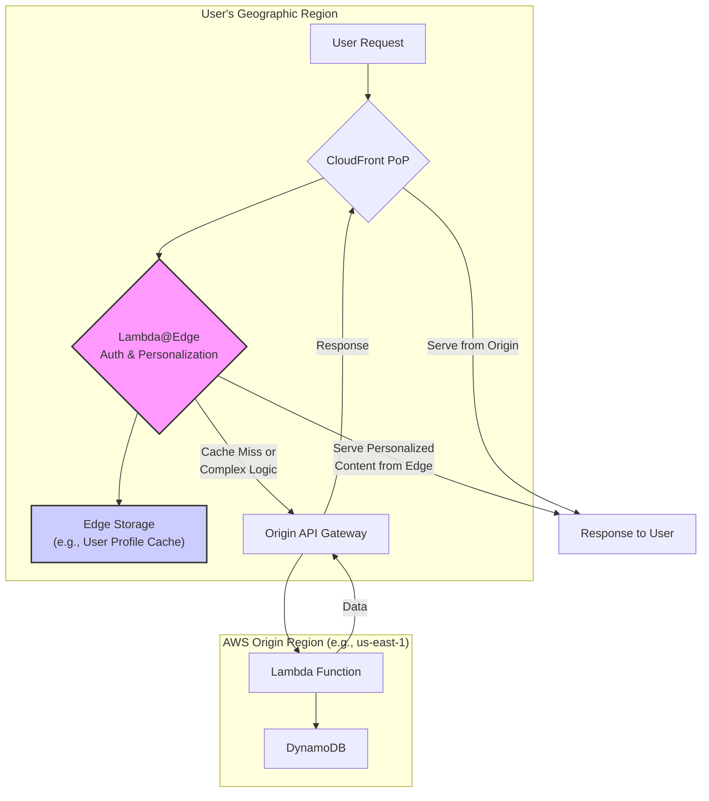
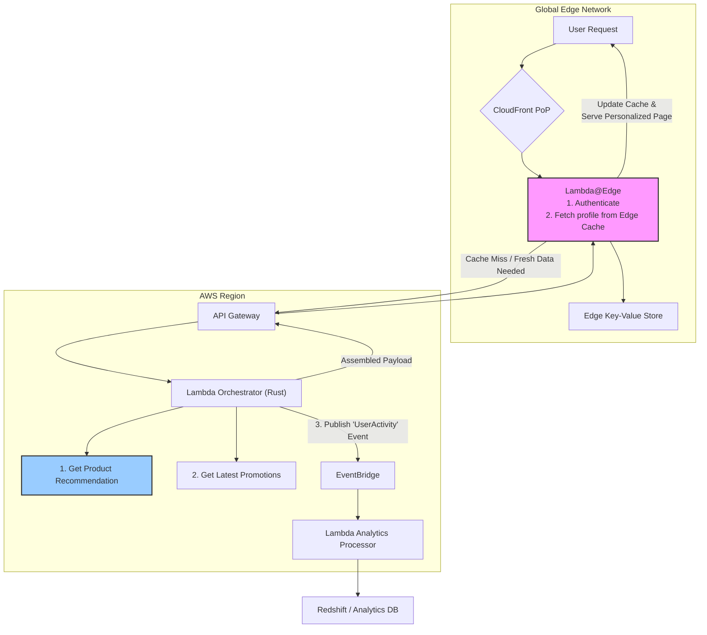

# AWS Lambda & Serverless Refinements: Edge, AI, and Beyond in 2026

Serverless computing, with AWS Lambda at its core, has moved far beyond its initial role as a simple "functions-as-a-service" offering. It's now the backbone of modern, event-driven applications. But the ecosystem is not static. As we look ahead to May 2026, the platform is undergoing significant refinements that push compute closer to users, embed intelligence directly into functions, and erase the last vestiges of performance friction.

This article explores the near-future evolution of AWS Lambda and the serverless paradigm. We'll examine the key advancements that are reshaping how we build scalable, responsive, and intelligent applications.

### What You'll Get

*   **Edge Evolution:** How Lambda@Edge is becoming a platform for stateful, complex application logic.
*   **Native AI/ML:** The shift from invoking AI services to running inference as a native Lambda primitive.
*   **Performance Frontiers:** A look at how cold starts have been solved and what the new optimization challenges are.
*   **Ecosystem Maturity:** The arrival of new runtimes and deeply integrated observability tools.
*   **Future Architecture:** A blueprint for a globally distributed application leveraging these 2026 capabilities.

---

## The Edge is the New Core

By 2026, AWS's edge network is no longer just a CDN. Lambda@Edge, or its direct successor, has evolved from a tool for simple header rewrites into a powerful platform for distributed application logic. The key is the introduction of stateful computations at the edge, moving beyond the stateless nature of early edge functions.

### Key Advancements at the Edge

*   **Edge State:** Tightly integrated, low-latency storage at Points of Presence (PoPs), likely an evolution of services like DynamoDB Global Tables or a purpose-built edge database. This enables sophisticated user personalization, A/B testing, and session management right where the user connects.
*   **Complex Runtimes:** Support for more computationally intensive runtimes and larger function packages at the edge, allowing for tasks like real-time image resizing or dynamic content generation without a round trip to a central region.
*   **Inter-Edge Communication:** A secure, low-latency messaging fabric connecting edge locations, enabling patterns like real-time bidding or multi-player game state synchronization across a geographic area.

This diagram illustrates a common 2026 pattern where the edge handles far more than just routing.



> **Practitioner's Take:** "The goal is to serve the entire request from the edge whenever possible. By 2026, 'possible' includes read/write operations and complex business logic that previously required a trip to `us-east-1`."

## AI/ML Inference as a Native Lambda Primitive

The clunky pattern of a Lambda function acting as a simple proxy to a SageMaker endpoint is becoming a thing of the past. By 2026, AWS has made ML inference a first-class citizen within the Lambda service itself, dramatically reducing latency and cost for AI-powered features.

### Tighter AI/ML Integration

*   **Optimized Runtimes:** AWS now provides official Lambda runtimes highly optimized for specific ML frameworks. Deploying a PyTorch or TensorFlow Lite model is as simple as packaging the model file and selecting the `aws.ml.pytorch/v2` runtime. AWS manages the underlying hardware acceleration (e.g., Inferentia chips) automatically.
*   **Model-as-a-Function:** A new deployment model allows you to upload a trained model (e.g., in ONNX format) directly. Lambda provisions an optimized, single-purpose function to serve inferences, abstracting away all boilerplate code.
*   **Reduced Cold Starts for ML:** These specialized runtimes leverage advanced caching and pre-warming techniques specifically for model artifacts, ensuring that inference latency is consistently low even for infrequently invoked models.

Here’s a hypothetical `template.yaml` snippet for an AWS SAM deployment, showcasing this simplicity:

```yaml
Resources:
  SentimentAnalysisFunction:
    Type: AWS::Serverless::Function
    Properties:
      FunctionName: sentiment-analysis-2026
      Handler: model.infer # Not a real handler, just the model
      Runtime: aws.ml.onnx/v1.0 # Hypothetical optimized runtime
      Architectures: [arm64]
      MemorySize: 2048
      CodeUri: ./models/sentiment-v3.onnx # Deploying the model file directly
      Policies:
        - ...
```

This streamlined process makes it trivial to embed small-to-medium-sized AI models directly into your application logic for tasks like text classification, fraud detection, or image analysis.

## Cold Starts: Solved, but with New Nuances

For the majority of workloads, the "cold start problem" of 2020 is a memory. Technologies like [AWS Lambda SnapStart](https://aws.amazon.com/blogs/aws/new-accelerate-your-lambda-functions-with-lambda-snapstart/) have expanded beyond Java to other runtimes, and underlying platform improvements have slashed initialization times.

However, the performance focus has shifted from *platform* latency to *application* latency. The new bottleneck is inefficient initialization code within the function itself—things like setting up complex dependency injection containers or pre-calculating large datasets.

### The New Performance Landscape (2024 vs. 2026)

| Metric | Circa 2024 | Circa 2026 (Hypothetical) |
| :--- | :--- | :--- |
| **Typical Cold Start (P90)** | 250ms - 1.5s | 25ms - 150ms |
| **Primary Latency Source** | Runtime Initialization | Application Bootstrap Logic |
| **Mitigation Strategy** | Provisioned Concurrency | Code-level Initialization Optimization |
| **Cost Optimization** | Coarse-grained (PC) | Fine-grained, tiered warming |

> **Observability is Key:** Enhanced observability tools are critical. By 2026, AWS Distro for OpenTelemetry is the default, and the Lambda service provides a built-in trace segment for `initialization`, allowing developers to pinpoint exactly which lines of their own code are slowing down a "warm-up."

## An Evolved Runtime and Tooling Ecosystem

The serverless ecosystem has matured, offering more choice for developers and more power for architects.

### Runtimes and Observability

*   **High-Performance Runtimes:** Rust is now an officially supported, first-class runtime for AWS Lambda. Its performance, memory safety, and small binary sizes make it the go-to choice for latency-sensitive and cost-optimized functions.
*   **Deep OpenTelemetry Integration:** Tracing isn't an add-on; it's the default. Every Lambda invocation automatically generates traces with detailed annotations, making it trivial to visualize a request's journey through Lambda, API Gateway, DynamoDB, and EventBridge.
*   **Intelligent Event Routing:** [Amazon EventBridge](https://aws.amazon.com/eventbridge/) has evolved beyond simple pattern matching. It now supports stateful filtering, small transformations, and a "dead-letter archive" that allows for replaying event batches that failed due to downstream issues, improving the resilience of asynchronous architectures.

This flow shows how EventBridge has become a more powerful choreographer in event-driven systems.

```mermaid
graph TD
    A[Lambda Function<br/>"Order Service"] -- "OrderCreated Event" --> B{EventBridge};
    B -- "Rule: HighValueOrder" --> C["Lambda Function<br/>'Fraud Detection'"];
    B -- "Rule: StandardOrder" --> D["Step Functions<br/>'Standard Workflow'"];
    B -- "Archive All Events" --> E[S3 Bucket];
    C -- "SuspiciousOrder Event" --> B;
```

## The 2026 Blueprint: Global Real-Time Personalization

Let's tie these advancements together into a modern architectural pattern. An e-commerce site wants to deliver a personalized homepage to every user, globally, with sub-100ms latency.

Here is the 2026 serverless architecture to achieve this:



### Flow Breakdown

1.  **Edge First:** The user's request is handled by a stateful Lambda@Edge function that checks a local cache for the user's personalization profile.
2.  **Regional Orchestration:** On a cache miss, the edge function calls a regional API Gateway, which triggers a high-performance Rust-based Lambda orchestrator.
3.  **Parallel Compute:** This orchestrator concurrently calls a specialized AI/ML Lambda to get product recommendations and fetches promotion data from a DynamoDB Global Table.
4.  **Asynchronous Events:** It fires an event to EventBridge to notify other systems (like analytics) of the user's activity without blocking the response.
5.  **Rapid Response:** The assembled personalization data is returned to the edge, cached for future requests, and served to the user.

---

The refinements to AWS Lambda and the serverless ecosystem by 2026 are not about radical new concepts, but about maturity. It's an evolution toward a more distributed, intelligent, and hyper-optimized platform that removes friction for developers and delivers unparalleled performance for end-users.

Now, over to you. **How has serverless transformed your application deployments, and what are you most excited to build with these future capabilities?**


## Further Reading

- [https://aws.amazon.com/lambda/](https://aws.amazon.com/lambda/)
- [https://aws.amazon.com/lambda/edge/](https://aws.amazon.com/lambda/edge/)
- [https://www.serverless.com/blog/future-of-serverless-2026/](https://www.serverless.com/blog/future-of-serverless-2026/)
- [https://thenewstack.io/serverless-trends-report-2026/](https://thenewstack.io/serverless-trends-report-2026/)
- [https://www.oreilly.com/library/view/serverless-architectures-on-aws/](https://www.oreilly.com/library/view/serverless-architectures-on-aws/)
