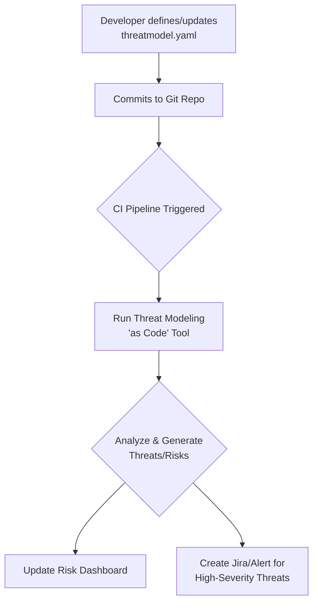
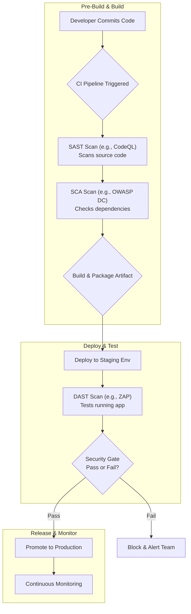

# DevSecOps Shift-Left in Practice: Embedding Security from Inception

In the tech landscape of 2026, DevSecOps is no longer an aspiration; it's the standard. The "shift-left" principle—addressing security at the earliest stages of the development lifecycle—has moved from a theoretical ideal to a practical necessity. Treating security as a gatekeeper at the end of the pipeline is a recipe for slowdowns and vulnerabilities. True velocity and resilience come from embedding security into every stage, from the first design document to the final deployment.

This article cuts through the noise to provide a practical guide for implementing a robust shift-left security strategy. We'll explore the tools, processes, and cultural changes needed to make security a shared responsibility and a natural part of your development workflow.

### What You'll Get

*   Actionable strategies for integrating security throughout your entire SDLC.
*   A breakdown of developer-centric tools that make security frictionless.
*   A blueprint for building a security-first culture that empowers developers.
*   Practical code snippets and diagrams for real-world implementation.

---

## The Cultural Foundation: Fostering a Security-First Mindset

Before any tool or process, there must be a cultural shift. By 2026, high-performing teams understand that security is not just the security team's problem—it's everyone's responsibility.

*   **Shared Responsibility:** The goal is to move from a model of "us vs. them" (Developers vs. Security) to a collaborative partnership. Security experts become consultants and enablers, not gatekeepers.
*   **Security Champions:** Identify and empower developers on each team who are passionate about security. These "Security Champions" act as the local experts, mentor their peers, and serve as a bridge to the central security team. They help translate security requirements into development-friendly language.
*   **Blameless Education:** When a vulnerability is found, the focus should be on learning and system improvement, not on blaming an individual. Conduct blameless post-mortems to understand the root cause and improve processes, tooling, or training to prevent recurrence.

> **Key Insight:** The most effective security tool is a developer who understands and cares about secure coding. Culture is the foundation upon which all other DevSecOps practices are built.

## Threat Modeling as Code: Proactive Design-Phase Security

Traditionally, threat modeling was a manual, often-dreaded process performed infrequently. The modern shift-left approach treats threat models like any other component of your application: as code.

By defining potential threats, system components, and data flows in a structured format (like YAML), you can version control your threat model alongside your application code. This enables automated, continuous analysis.

### How It Works in Practice

1.  **Define:** Developers define the application's architecture, data flows, and assets in a simple, declarative file (e.g., `threatmodel.yaml`).
2.  **Automate:** This file is committed to the repository. The CI/CD pipeline triggers a tool (like [OWASP Threagile](https://owasp.org/www-project-threagile/) or custom scripts) that parses the file.
3.  **Analyze & Report:** The tool automatically generates a list of potential threats based on established rulesets (like STRIDE), identifies risks, and suggests mitigations. The output can be a report, a dashboard update, or even a new ticket in your issue tracker.

Here’s a conceptual flow of this process:



This approach makes threat modeling a living, breathing part of the development process, ensuring security is considered *before* a single line of vulnerable code is written.

## Developer-Centric Tooling: Security at the Fingertips

The key to developer adoption is to make security as seamless as possible. Tools must integrate directly into the developer's existing workflow, providing fast, relevant feedback without causing friction.

### IDE Integration

Linters and spell-checkers are standard; security scanners should be too. Tools that plug directly into IDEs like VS Code or IntelliJ provide real-time feedback on vulnerabilities as code is being written.

*   **Examples:** Snyk Code, SonarLint, GitHub Copilot's vulnerability filtering.
*   **Benefit:** Catches issues like SQL injection, insecure dependencies, or hardcoded secrets *instantly*, turning a potential vulnerability into a simple code correction.

### Pre-Commit Hooks

Pre-commit hooks are lightweight scripts that run on a developer's machine *before* code is committed to version control. They are a powerful, low-overhead way to catch simple but critical security mistakes.

Here is an example using the `pre-commit` framework to block commits containing secrets:

```yaml
# .pre-commit-config.yaml
repos:
-   repo: https://github.com/detect-secrets/detect-secrets
    rev: v1.4.0
    hooks:
    -   id: detect-secrets
        args: ['--baseline', '.secrets.baseline']
        # This hook scans files for common secret formats before a commit.
```

This simple check prevents API keys, passwords, and other credentials from ever reaching your codebase.

## Automating Security in the CI/CD Pipeline 🛡️

The CI/CD pipeline is the central nervous system of DevSecOps. It's the ideal place to automate various security scans, creating a series of quality gates that every change must pass.

### Key Scanning Stages

Different types of scans are suited for different stages of the pipeline.

| Scan Type                               | What It Does                                                                       | When to Run                             |
| --------------------------------------- | ---------------------------------------------------------------------------------- | --------------------------------------- |
| **SAST** (Static Analysis)              | Scans raw source code for potential vulnerabilities without executing it.            | On commit/pull request; very early.     |
| **SCA** (Software Composition Analysis) | Identifies known vulnerabilities in open-source dependencies and libraries.        | On commit/pull request; after SAST.     |
| **DAST** (Dynamic Analysis)             | Tests the *running* application for vulnerabilities by simulating external attacks.  | After deployment to a staging environment. |

This Mermaid diagram illustrates where these scans fit into a typical pipeline:



### Example: SAST in GitHub Actions

Integrating a SAST tool is straightforward. Here's a snippet for a GitHub Actions workflow using GitHub's own CodeQL to scan a codebase on every push.

```yaml
# .github/workflows/codeql-analysis.yml
name: "CodeQL Security Scan"

on:
  push:
    branches: [ main ]
  pull_request:
    branches: [ main ]

jobs:
  analyze:
    name: Analyze
    runs-on: ubuntu-latest
    steps:
    - name: Checkout repository
      uses: actions/checkout@v4

    - name: Initialize CodeQL
      uses: github/codeql-action/init@v3
      with:
        languages: 'javascript' # Specify your project's language

    - name: Autobuild
      uses: github/codeql-action/autobuild@v3

    - name: Perform CodeQL Analysis
      uses: github/codeql-action/analyze@v3
```

This configuration automatically fails a build if high-severity vulnerabilities are discovered, preventing them from being merged.

## Secure Coding Practices: The First Line of Defense

Ultimately, the most secure code is code that was written securely from the start.

*   **Use Secure Defaults:** Leverage the built-in security features of your frameworks (e.g., Django's CSRF protection, .NET's identity management). Don't disable them unless you have a very good reason.
*   **Parameterize Everything:** The root cause of injection attacks (SQL, command, etc.) is the mixing of code and untrusted user data. Always use parameterized queries or prepared statements.
*   **Follow Established Guidelines:** Teams should be intimately familiar with resources like the [OWASP Top 10](https://owasp.org/www-project-top-ten/), which lists the most critical web application security risks.
*   **Continuous Training:** Replace annual, all-day security training with continuous, context-aware learning. Platforms that provide short, interactive modules on specific vulnerabilities are far more effective.

## Conclusion: Security as an Enabler

Shifting security left is not about adding more work for developers. It’s about integrating smart, automated, and collaborative practices that catch issues early, when they are cheapest and easiest to fix. By combining a security-first culture with developer-centric tooling and robust pipeline automation, you transform security from a bottleneck into an enabler of speed, quality, and trust. 🚀

How is your organization shifting security left? Share your most effective strategies and biggest wins in the comments below.


## Further Reading

- [https://www.ibm.com/topics/devsecops](https://www.ibm.com/topics/devsecops)
- [https://www.synopsys.com/glossary/what-is-devsecops.html](https://www.synopsys.com/glossary/what-is-devsecops.html)
- [https://www.gartner.com/en/articles/devsecops-best-practices-2026](https://www.gartner.com/en/articles/devsecops-best-practices-2026)
- [https://owasp.org/www-project-devsecops-guidance/](https://owasp.org/www-project-devsecops-guidance/)
- [https://techbeacon.com/devops/devsecops-trends-2026](https://techbeacon.com/devops/devsecops-trends-2026)
