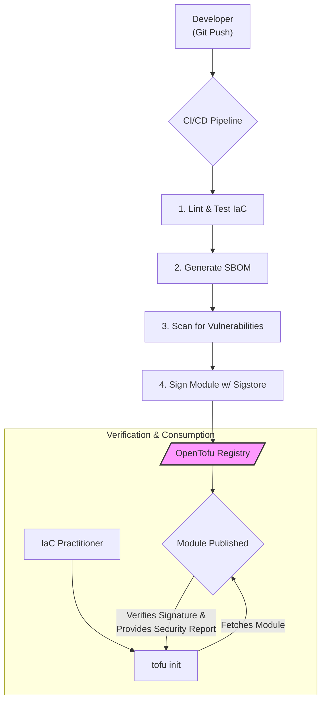

# OpenTofu Module Registry: What the Future Holds for Community IaC

The rise of OpenTofu as a fork of Terraform marked a pivotal moment for the Infrastructure as Code (IaC) community. At the heart of this new ecosystem is a critical component: the OpenTofu Module Registry. While currently serving as a compatible proxy, its true potential lies in its future as a fully independent, community-governed hub for reusable infrastructure components.

This article projects the evolution and impact of the OpenTofu Module Registry by mid-2026. We'll explore its anticipated growth, compare its trajectory with the established HashiCorp Terraform Registry, and analyze its role in shaping a more open, secure, and collaborative future for IaC practitioners.

### What You'll Get

*   **A Clear Vision:** Understand the mission behind the OpenTofu registry as a public utility.
*   **Future-State Analysis:** A projection of key features and capabilities expected by 2026.
*   **Direct Comparison:** A head-to-head look at how the evolved OpenTofu registry will stack up against the HashiCorp Terraform Registry.
*   **Community Impact:** Insight into how open governance will foster trust and innovation in the IaC ecosystem.
*   **Practical Examples:** Code snippets and diagrams to illustrate core concepts.

## The Genesis: A Truly Open Public Utility

The core promise of the OpenTofu Module Registry is to be a *public utility*, not a product tied to a single vendor's commercial interests. Governed by the Linux Foundation, its development roadmap is driven by the community it serves. This fundamentally differs from the HashiCorp Terraform Registry, which, while an excellent tool, is ultimately controlled by a single corporation and its business objectives.

> The goal is to provide a reliable, transparent, and vendor-neutral home for the modules that power modern infrastructure. This fosters a level playing field where the best ideas, not the biggest marketing budgets, win.

This open governance model is the bedrock upon which trust is built, encouraging contributions from individual developers, startups, and large enterprises who are wary of vendor lock-in.

## The Registry in 2024: A Foundation Built on Compatibility

Today, the OpenTofu registry primarily functions as a proxy, allowing users to seamlessly access modules from the public Terraform Registry. This was a crucial first step to ensure a smooth transition for users adopting OpenTofu.

Configuring OpenTofu to use its registry is straightforward. In your CLI configuration (`~/.terraformrc` or `~/.tofurc`), you can specify the default registry:

```hcl
provider_installation {
  network_mirror {
    url = "https://registry.opentofu.org/"
  }
}
```

This simple configuration redirects `tofu` commands to fetch providers and modules through the OpenTofu endpoint, maintaining compatibility while paving the way for native features.

## Peering into 2026: The Evolution of a Community Hub

By 2026, we can expect the OpenTofu Module Registry to have matured from a compatible proxy into a feature-rich, standalone service. Its evolution will likely be built on three core pillars.

### Pillar 1: Open Governance and Community Trust

The registry's decision-making process for features, moderation, and security policies will be transparent and community-led. Unlike a corporate-run registry where changes can be sudden (like the BSL license change that spurred OpenTofu's creation), the OpenTofu registry's direction will be debated and decided in the open, building long-term stability and trust.

*   **Transparent Roadmap:** Publicly visible and influenced by community proposals.
*   **Clear Moderation Policies:** Developed and enforced by a diverse, elected committee.
*   **No Commercial Gating:** Core features will remain free and accessible to all, without being pushed toward a specific commercial SaaS product.

### Pillar 2: Enhanced Security and Verifiability

As supply chain security becomes paramount, the OpenTofu registry is poised to lead with robust, built-in security features. By 2026, expect a sophisticated pipeline for module publication that emphasizes verification and transparency.

*   **Provider & Module Signing:** GPG or Sigstore-based cryptographic signing will become standard, ensuring the module you download is the one the author published.
*   **Integrated Security Scans:** Automated scanning for common misconfigurations (e.g., via Checkov or Trivy) and vulnerabilities on every new module version.
*   **SBOM Generation:** Automatic generation and publication of Software Bill of Materials (SBOMs) for modules, providing clear insight into dependencies.

This is what a verified module publication flow might look like:



### Pillar 3: Richer Features and Multi-Cloud Focus

Beyond security, the registry will innovate on user experience and multi-cloud best practices.

*   **Advanced Search & Filtering:** Filter modules not just by provider, but by compliance standards (e.g., CIS, HIPAA), architectural patterns, or cost-efficiency (FinOps).
*   **Community Badges & Ratings:** A reputation system based on community reviews, GitHub stars, and adoption metrics to help users find high-quality, well-maintained modules.
*   **Improved Authoring Tools:** A streamlined CLI or GitHub Action for publishing, signing, and documenting modules, lowering the barrier to contribution.

## Head-to-Head: OpenTofu vs. Terraform Registry (A 2026 Projection)

By 2026, the two registries will serve similar functions but with distinct philosophical and practical differences. Here’s a speculative comparison:

| Feature / Aspect          | OpenTofu Module Registry (Projected 2026)                               | HashiCorp Terraform Registry (Current & Projected)                         |
| ------------------------- | ----------------------------------------------------------------------- | -------------------------------------------------------------------------- |
| **Governance**            | Community-driven, vendor-neutral (Linux Foundation)                     | Corporate-driven (HashiCorp)                                               |
| **Primary Goal**          | Serve as a public utility for the IaC ecosystem                         | Drive adoption of the Terraform ecosystem, including Terraform Cloud/Enterprise |
| **Module Verification**   | **Deeply integrated:** Mandatory signing, SBOMs, automated security scans. | **Integrated:** Provider signing is available, security is a feature of TFC. |
| **Licensing**             | Modules can use any OSI-approved license; registry code is open source. | Modules use various licenses, but the platform is tied to the BSL ecosystem. |
| **Contribution Model**    | Fully open, with community-defined contribution and review processes.   | Open, but ultimately curated and controlled by HashiCorp.                  |
| **Multi-Cloud Support**   | Actively promotes patterns and modules for multi-cloud and hybrid-cloud. | Supports all providers but naturally highlights HashiCorp's own tools.    |

## The Broader Impact on the IaC Ecosystem

A mature, trusted OpenTofu Module Registry will be more than just a place to find code. It will be a catalyst for standardizing IaC best practices across the industry.

*   **Accelerated Deployments:** Engineers can confidently reuse high-quality, secure, and community-vetted modules, drastically reducing the time it takes to build new infrastructure.
*   **Democratized IaC:** By lowering the barrier to entry for both consuming and publishing modules, the registry empowers smaller teams and individual developers to leverage the same powerful patterns as large enterprises.
*   **Resilience Against Lock-in:** It provides a stable, long-term alternative that ensures the community’s shared knowledge and effort are not subject to the whims of a single company’s strategy.

## Conclusion: Building the Future Together

The OpenTofu Module Registry is on a trajectory to become a cornerstone of the open-source IaC movement. By 2026, it will likely stand as a testament to the power of community collaboration, offering a secure, feature-rich, and truly open alternative for discovering and sharing infrastructure modules. Its success, however, depends entirely on community participation.

The real question is not just what the core team will build, but what we, the practitioners, will contribute. The registry's value will be a direct reflection of the quality and diversity of the modules we create and share.

Now, we turn it over to you: **What features are on your wishlist for a truly community-driven IaC registry?** Share your thoughts and help shape the future.


## Further Reading

- [https://opentofu.org/docs/registry/](https://opentofu.org/docs/registry/)
- [https://www.terraform.io/docs/registry/](https://www.terraform.io/docs/registry/)
- [https://cloudsecurityalliance.org/blog/open-source-iac-security-2026](https://cloudsecurityalliance.org/blog/open-source-iac-security-2026)
- [https://www.cncf.io/blog/community-driven-iac-2026](https://www.cncf.io/blog/community-driven-iac-2026)
- [https://techbeacon.com/devops/opentofu-ecosystem-growth](https://techbeacon.com/devops/opentofu-ecosystem-growth)
