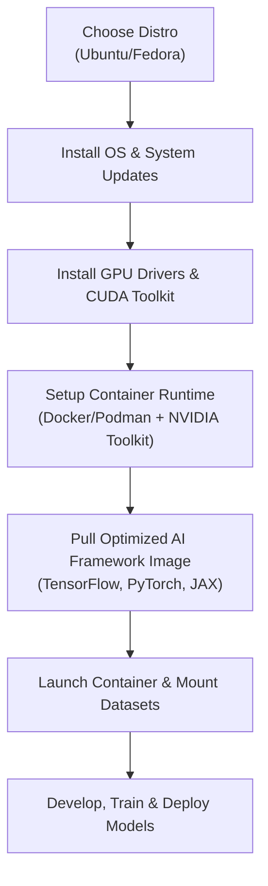

# Linux Distros for AI Workloads: Optimizing for Performance in 2026

The demands of AI and machine learning workloads have pushed hardware to its limits, but the underlying operating system remains a critical, and often overlooked, component of the performance stack. As of May 2026, the Linux ecosystem has matured significantly, offering specialized tools and optimizations that can drastically reduce training times and simplify MLOps pipelines. Choosing the right distribution is no longer just a matter of preference; it's a strategic decision.

This article dives into the top Linux distributions for AI workloads in 2026. We'll analyze their specific strengths, from kernel-level optimizations to streamlined GPU driver management, providing a clear guide for data scientists, researchers, and MLOps engineers looking to build a robust and high-performance environment.

### What You'll Get

*   **Analysis of Core OS Requirements:** A breakdown of the key features an AI-focused OS needs today.
*   **Top Distro Comparison:** A head-to-head look at Ubuntu, Fedora, and specialized alternatives.
*   **Architectural Flowchart:** A high-level diagram of a modern AI development environment setup.
*   **Actionable Setup Guide:** A quick-start guide for setting up a powerful AI environment on Ubuntu 26.04 LTS.
*   **2026 Benchmark Insights:** A summary of current performance trends without the fluff.

***

## Core Requirements for an AI-Ready OS in 2026

The days of wrestling with driver installations and manually compiling libraries are fading. A modern AI-centric Linux distribution must provide a seamless experience built on four pillars.

### 1. Advanced Kernel Optimizations

The Linux kernel is the heart of performance. By 2026, mainline kernels (versions 7.x and beyond) have integrated significant improvements crucial for AI:
*   **I/O Scheduling:** Mature `io_uring` implementations provide massive asynchronous I/O capabilities, drastically speeding up data-loading pipelines from high-speed NVMe storage.
*   **Memory Management:** Improved handling of large memory pages and NUMA (Non-Uniform Memory Access) architectures is essential for training models that consume hundreds of gigabytes of VRAM and system RAM.
*   **Process Scheduling:** Schedulers are better optimized to keep GPU-bound processes fed with data, preventing CPU bottlenecks during intensive training loops.

### 2. Frictionless GPU Driver Management

This is non-negotiable. The ideal OS offers:
*   **Stable, Pre-packaged Drivers:** Easy access to the latest stable NVIDIA, AMD (ROCm), and Intel (oneAPI) drivers through native package managers.
*   **Robust Kernel Module Handling:** Tools like DKMS (Dynamic Kernel Module Support) should work flawlessly to rebuild drivers after kernel updates, preventing system breakage.
*   **Certified Stacks:** Partnerships between distro maintainers and hardware vendors (like Canonical and NVIDIA) ensure a stable, tested, and supported stack.

### 3. Native Containerization and Orchestration

Containers are the standard unit of deployment in MLOps. A good AI distro must have:
*   **First-class Container Runtimes:** Deep integration with Docker, Podman, and other OCI-compliant runtimes.
*   **Effortless GPU Passthrough:** Tools like the NVIDIA Container Toolkit must be simple to install and configure, allowing containers to access GPU hardware with near-bare-metal performance.
*   **Kubernetes-Ready:** The distribution should be a reliable base node for Kubernetes clusters, with up-to-date components and security profiles (e.g., SELinux, AppArmor).

### 4. Curated AI/ML Toolchains

While most practitioners use containers, having access to well-maintained system libraries is crucial for development and debugging. This includes pre-packaged and optimized versions of:
*   TensorFlow, PyTorch, and JAX
*   CUDA and cuDNN libraries
*   Python and its scientific computing ecosystem (NumPy, SciPy, Pandas)

***

## Top Contenders: A Comparative Analysis

While countless distributions exist, three distinct archetypes have emerged as leaders for AI workloads.

### Ubuntu LTS: The Stable Enterprise Workhorse

Ubuntu, particularly its Long-Term Support (LTS) releases like the new **26.04 "Celestial Cicada"**, remains the dominant force. Its popularity is built on stability, predictability, and extensive support.

*   **Strengths:**
    *   **NVIDIA Partnership:** Official repositories contain certified NVIDIA drivers, making installation and maintenance trivial via tools like `ubuntu-drivers`.
    *   **Massive Community:** Unparalleled community support means virtually any issue has already been solved and documented.
    *   **Enterprise Adoption:** It's the de-facto standard in the cloud and enterprise environments, ensuring consistency from development to production.
*   **Best For:** MLOps teams, enterprise data scientists, and anyone who values stability and support above all else.

> **Info Block:** Ubuntu's `ubuntu-ai` metapackage, introduced a few years ago, has become a mature tool for bootstrapping a complete environment with just one command, installing drivers, toolkits, and container runtimes.

### Fedora: The Cutting-Edge Innovator

Fedora, with its **Scientific and AI/ML spins**, caters to users who need the latest software and kernel features. Running a much newer kernel (e.g., 7.1) compared to Ubuntu LTS (e.g., 7.0), Fedora often showcases new performance-enhancing features first.

*   **Strengths:**
    *   **Bleeding-Edge Software:** Provides the latest versions of Python, GCC, and system libraries, which can offer performance benefits.
    *   **Podman & SELinux:** Excellent default integration of Podman for rootless containers, offering a more secure alternative to the Docker daemon.
    *   **Direct Upstream:** Serves as the proving ground for Red Hat Enterprise Linux (RHEL), meaning its innovations are enterprise-grade in spirit.
*   **Best For:** Researchers, developers, and academics who need the absolute latest kernel and library features and are comfortable with a faster release cycle.

### Specialized Distributions: The Expert's Choice

This category includes highly customized systems like Arch Linux or purpose-built distros. They offer maximum control but demand significant expertise.

*   **Strengths:**
    *   **Minimalist by Default:** You install only what you need, resulting in a lean, bloat-free system.
    *   **Absolute Control:** Every package and configuration is chosen by the user, allowing for fine-grained performance tuning.
    *   **Rolling Release (Arch):** You always have the very latest version of every piece of software.
*   **Best For:** Experts and performance enthusiasts who want to build a completely bespoke AI development environment from the ground up. This path requires a high tolerance for manual configuration and maintenance.

***

## Feature Deep Dive & Comparison

| Feature | Ubuntu 26.04 LTS | Fedora 44 | Specialized (e.g., Arch) |
| :--- | :--- | :--- | :--- |
| **Typical Kernel** | Stable, Long-Term (e.g., 7.0) | Latest Stable (e.g., 7.1+) | Bleeding-Edge (Rolling) |
| **GPU Driver Setup** | Easiest (`ubuntu-drivers autoinstall`) | Easy (RPM Fusion repos) | Manual (Requires knowledge) |
| **Default Container Tech** | Docker | Podman | User's Choice |
| **Package Management** | APT | DNF / RPM | Pacman |
| **Release Cycle** | 2 Years (LTS) | 6 Months | Rolling |
| **Primary Focus** | Stability, Enterprise, Ease-of-Use | Innovation, Latest Features | Control, Minimalism |
| **Best For** | Production MLOps, Corporate Teams | R&D, Academia, Early Adopters | Power Users, System Tuners |

***

## Architectural Flow: Setting Up a Modern AI Environment

A typical workflow for bootstrapping a new AI machine is straightforward and heavily reliant on containerization. This isolates dependencies and ensures reproducibility.



***

## Quick Setup Guide: Ubuntu 26.04 LTS

Here is an actionable guide to get a PyTorch environment running on a fresh Ubuntu 26.04 LTS installation with an NVIDIA GPU.

### Step 1: System Update & Driver Installation

First, ensure your system is up-to-date. Then, use the built-in utility to automatically install the best-suited, tested NVIDIA driver.

```bash
# Update package lists and upgrade system
sudo apt update && sudo apt upgrade -y

# Install the recommended proprietary NVIDIA drivers
sudo ubuntu-drivers autoinstall

# Reboot to load the new drivers
sudo reboot
```

### Step 2: Install Docker and NVIDIA Container Toolkit

Next, set up the Docker container runtime and the toolkit that allows Docker to access your GPU.

```bash
# Install Docker
sudo apt install docker.io -y
sudo systemctl enable --now docker

# Add your user to the docker group to run without sudo
sudo usermod -aG docker $USER
# You will need to log out and log back in for this change to take effect

# Install the NVIDIA Container Toolkit
sudo apt install nvidia-container-toolkit -y
sudo systemctl restart docker
```

### Step 3: Test the GPU-enabled Container

Finally, pull a pre-built PyTorch container from NGC (NVIDIA GPU Cloud) or Docker Hub and verify that it can see your GPU.

```bash
# Pull the latest PyTorch container and run a command to test GPU access
docker run --rm --gpus all nvcr.io/nvidia/pytorch:24.04-py3 \
   python -c "import torch; print(f'PyTorch version: {torch.__version__}'); print(f'CUDA available: {torch.cuda.is_available()}'); print(f'Device count: {torch.cuda.device_count()}')"
```

If the output confirms CUDA is available and lists your GPU(s), your environment is ready for serious work.

***

## Benchmarking Insights from 2026

While raw performance can vary based on hardware and specific workloads, recent trends observed by outlets like [Phoronix](https://www.phoronix.com/) and industry blogs highlight a few key points:

*   **Data Ingestion:** Distros with newer kernels, like Fedora, often show a 3-5% performance advantage in I/O-heavy data preprocessing tasks, thanks to continuous improvements in the NVMe and filesystem subsystems.
*   **Training Consistency:** For long, multi-day training runs on complex models, Ubuntu LTS often proves more stable. Its mature driver and library stack, while not the absolute latest, is rigorously tested, leading to fewer unexpected crashes and more predictable performance.
*   **Container Overhead:** The performance difference between Docker and Podman is now negligible for most AI workloads. The choice is primarily about security posture (rootless vs. daemon) and ecosystem integration.

Ultimately, the performance gap between top-tier distributions for pure computation is minimal. The real difference lies in setup time, stability, and ease of maintenance.

***

## Conclusion

In 2026, the best Linux distribution for AI is the one that best fits your workflow and priorities.

*   For **enterprise reliability and a "just-works" experience**, **Ubuntu 26.04 LTS** is the undisputed leader.
*   For **research and development requiring the latest features**, **Fedora** offers a powerful, forward-looking alternative.
*   For **experts seeking ultimate control**, a **customized Arch or specialized distro** provides a lean and tailored environment.

The good news is that with the maturity of containerization, the underlying OS is becoming a stable foundation rather than a complex variable. The focus has shifted from *making it work* to *making it work efficiently and reliably*.

What's your go-to Linux environment for AI development, and what optimizations have you found most impactful? Share your experiences in the comments below


## Further Reading

- [https://ubuntu.com/ai](https://ubuntu.com/ai)
- [https://fedoraproject.org/spins/scientific-ai/](https://fedoraproject.org/spins/scientific-ai/)
- [https://www.nvidia.com/en-us/deep-learning/drivers/](https://www.nvidia.com/en-us/deep-learning/drivers/)
- [https://www.phoronix.com/news/Linux-AI-Benchmarks-2026](https://www.phoronix.com/news/Linux-AI-Benchmarks-2026)
- [https://www.databricks.com/blog/linux-for-data-science-2026](https://www.databricks.com/blog/linux-for-data-science-2026)
