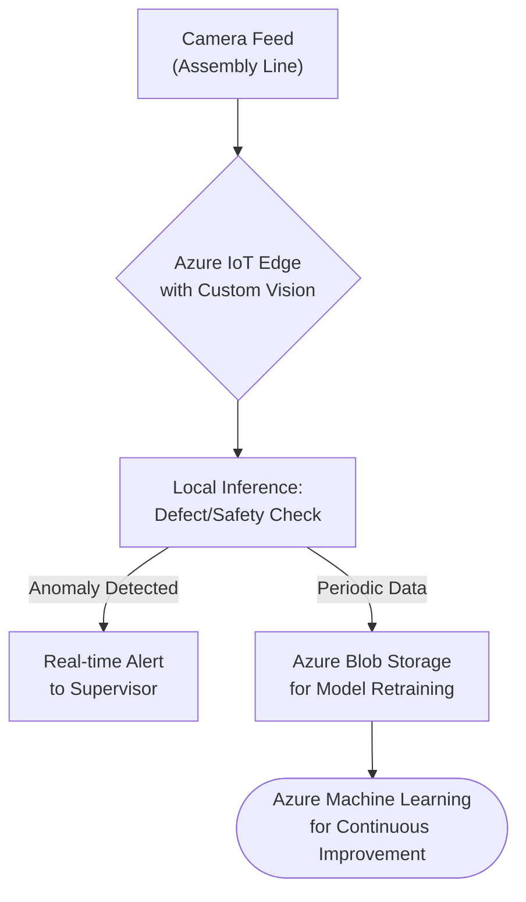
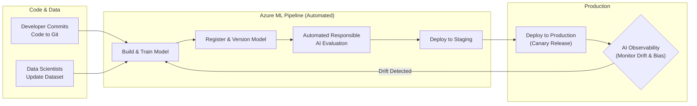

# Azure AI Services: Powering Enterprise Innovation in 2026

The conversation around enterprise AI has fundamentally shifted. By 2026, Artificial Intelligence is no longer a niche for R&D labs; it's a core component of business strategy, woven into the fabric of daily operations. For organizations looking to lead, the question isn't *if* they should adopt AI, but *how deeply* they can integrate it to create a durable competitive advantage. Azure AI Services stand at the forefront of this transformation, offering a mature, scalable, and responsible platform for building the next generation of intelligent applications.

This article projects forward, exploring the advanced use cases and service evolutions we anticipate seeing on the Azure platform by May 2026. We'll move beyond the basics to showcase how enterprises can harness this power to redefine their industries.

### What You'll Get

*   **A Future-Forward Look:** A clear vision of enterprise AI maturity in 2026.
*   **Industry-Specific Use Cases:** Concrete examples for manufacturing, customer service, healthcare, and finance.
*   **Key Service Evolutions:** What to expect from Azure OpenAI, Azure ML, and Cognitive Services.
*   **Actionable Strategy:** High-level guidance for charting your organization's AI journey.

## The New Baseline: AI as a Core Business Function

By 2026, the maturity of AI adoption means it's treated like any other critical business infrastructure—think cloud computing or cybersecurity. The focus has shifted from isolated proofs-of-concept to building scalable, interconnected AI systems that drive measurable outcomes.

A key pillar of this maturity is the operationalization of **Responsible AI**. Governance, fairness, transparency, and accountability are no longer just talking points; they are built into the development lifecycle by default, enforced through robust MLOps practices and Azure's built-in tooling.

> **Key Trend:** According to Gartner, enterprises that operationalize AI transparency and accountability will see a 50% improvement in business outcomes by 2026. This underscores the move from experimental models to trusted, production-grade AI systems.

## Industry Spotlights: Azure AI in Action

Let's explore how specific sectors will leverage Azure's advanced AI capabilities to solve complex challenges and unlock new opportunities.

### Manufacturing: Beyond Defect Detection with Custom Vision

While AI-powered defect detection is standard practice, the smart factory of 2026 uses computer vision for far more sophisticated tasks. Powered by [Azure Custom Vision](https://azure.microsoft.com/en-us/products/cognitive-services/custom-vision-service) at the edge, these systems create a digital feedback loop for the entire production process.

*   **Predictive Maintenance:** Vision models analyze machinery for microscopic wear-and-tear, predicting failures *before* they cause downtime.
*   **Process Optimization:** AI monitors assembly steps in real-time, identifying subtle inefficiencies and suggesting ergonomic or procedural improvements.
*   **Enhanced Worker Safety:** Systems can automatically detect if proper Personal Protective Equipment (PPE) is being worn or if a worker enters a hazardous zone, triggering real-time alerts.



### Customer Service: Hyper-Personalization with NLP

The era of the clunky, script-bound chatbot is over. By 2026, customer service is powered by sophisticated, multimodal AI agents that understand context, sentiment, and history. The goal is proactive, empathetic, and efficient resolution.

This is achieved by combining [Azure Cognitive Service for Language](https://azure.microsoft.com/en-us/products/cognitive-services/language-service) with the generative power of the [Azure OpenAI Service](https://azure.microsoft.com/en-us/products/cognitive-services/openai-service).

*   **Real-time Agent Assist:** During a live voice call, AI transcribes the conversation, analyzes customer sentiment, and pushes relevant knowledge base articles and next-best-action suggestions directly to the human agent's screen.
*   **Proactive Engagement:** AI analyzes a customer's usage patterns and recent support tickets to anticipate future needs, triggering proactive outreach with a personalized solution.
*   **Generative Summaries:** Every interaction is automatically summarized, categorized, and logged, saving agents significant administrative time and providing rich data for service analytics.

### Healthcare: Predictive Analytics for Proactive Care

In healthcare, AI's role is shifting from retrospective analysis to proactive intervention. Using [Azure Machine Learning](https://azure.microsoft.com/en-us/products/machine-learning) and the secure [Azure Health Data Services](https://azure.microsoft.com/en-us/services/health-data-services), providers can identify at-risk patients and model disease progression with unprecedented accuracy.

*   **Risk Stratification:** Models continuously analyze incoming data from EHRs and wearable devices to flag patients at high risk for conditions like sepsis or readmission, allowing for early intervention.
*   **Personalized Treatment Paths:** By analyzing genomic data alongside clinical history, AI models can suggest optimized treatment plans, moving closer to the promise of precision medicine.
*   **Operational Efficiency:** Hospitals use predictive models to forecast patient admission rates and allocate resources—like beds and staff—more effectively.

### Finance: Autonomous Operations with AI

Financial services will leverage AI for a new level of automation that goes far beyond simple RPA. Intelligent Document Processing (IDP) and adaptive fraud detection models become mission-critical.

| Capability | Standard Practice (Today) | Future State (2026) |
| :--- | :--- | :--- |
| **Document Processing** | Template-based OCR for invoices. | AI understands and extracts data from complex, unstructured legal contracts and prospectuses. |
| **Fraud Detection** | Rule-based systems with static ML models. | Self-learning models that identify and adapt to new fraud patterns in real-time. |
| **Compliance** | Manual audits and keyword searches. | AI continuously monitors communications and transactions for regulatory compliance breaches. |

## Key Service Evolutions by 2026

The innovation within these use cases is driven by the rapid evolution of the underlying Azure services.

### Azure OpenAI Service: The Multimodal Leap

By 2026, the leading models available through Azure OpenAI Service will be natively **multimodal**. A single API call will allow you to input a combination of text, images, and data to generate nuanced, context-aware outputs in any of those formats. Fine-tuning will be a low-code/no-code experience, enabling businesses to easily create highly specialized models for their unique domains.

A hypothetical Python SDK call might look like this:

```python
# Fictional SDK for illustration
import azure.ai.multimodal as aim

# Define a multimodal prompt
prompt = aim.Prompt([
    aim.Text("Analyze the attached Q2 earnings report PDF and chart."),
    aim.Document("Q2-earnings.pdf"),
    aim.Image("sales-trend-chart.png"),
    aim.Text("Generate a 3-bullet summary for the executive team.")
])

# Get a response from a deployed multimodal model
response = aoi_client.generate(deployment="gpt-5-multimodal", prompt=prompt)
print(response.text)
```

### Azure Machine Learning: MLOps 2.0 and AI Observability

The focus in Azure ML will be on **AI Observability**—providing deep insights into model performance, data drift, and operational health *after* deployment. MLOps pipelines will become more autonomous.



### Azure Cognitive Services: Seamless Fusion

The distinction between individual Cognitive Services will continue to blur. Instead of calling separate APIs for vision, speech, and language, you'll increasingly use **fused APIs** that perform multiple AI tasks on a single data source. The "Custom Everything" trend will accelerate, making it trivial to create a custom neural voice, a specialized document parser, or a domain-specific speech recognition model.

## Charting Your Course: Strategy for AI Adoption

To capitalize on these advancements, enterprises must act now. Waiting until 2026 is too late.

*   **Establish a Strong Data Foundation:** Unify your data with platforms like Microsoft Fabric. Clean, accessible data is the fuel for all advanced AI.
*   **Prioritize Responsible AI:** Build a governance framework from day one. It builds trust and mitigates risk.
*   **Focus on Business Value:** Identify the top 3-5 business problems where AI can have the most significant impact and start there. Don't chase technology for technology's sake.
*   **Foster a Culture of Experimentation:** Empower cross-functional teams to experiment, learn quickly, and scale successful pilots.

The tools for transformative change are here and rapidly evolving. By strategically investing in the Azure AI ecosystem, your organization can move from simply using AI to being defined by it.

---

**Now it's your turn.** What are the most innovative AI projects you're planning or imagining in your organization? Share your vision in the comments below


## Further Reading

- [https://azure.microsoft.com/en-us/solutions/ai/](https://azure.microsoft.com/en-us/solutions/ai/)
- [https://azure.microsoft.com/en-us/services/cognitive-services/](https://azure.microsoft.com/en-us/services/cognitive-services/)
- [https://techcommunity.microsoft.com/t5/azure-ai-blog/enterprise-ai-strategies-2026](https://techcommunity.microsoft.com/t5/azure-ai-blog/enterprise-ai-strategies-2026)
- [https://www.gartner.com/en/articles/enterprise-ai-adoption-2026](https://www.gartner.com/en/articles/enterprise-ai-adoption-2026)
- [https://cloudblogs.microsoft.com/ai/enterprise-success-stories-2026](https://cloudblogs.microsoft.com/ai/enterprise-success-stories-2026)
